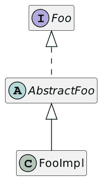

# 从以前的项目中吸取的经验教训

> 原文：<https://itnext.io/lessons-learned-previous-projects-50fb6357737a?source=collection_archive---------4----------------------->


软件开发的一个令人兴奋的部分是，在某个时间点被一致认为是好的实践可能在几年后变得更加模糊。甚至是完全错误的。然而，你通常需要随着时间的推移多次这样做才能实现。以下是我在 Java 项目中的经验。

# 分层包装

当我开始我的 Java 开发生涯时，每个项目都按层组织它们的类——控制器、服务和 Dao(存储库)。典型项目的结构如下所示:

```
ch.frankel
  ├─ controller
  │  ├─ FirstController
  │  └─ SecondController
  ├─ service
  │  ├─ FirstService
  │  └─ SecondService
  └─ dao
     ├─ FirstDao
     └─ SecondDao
```

这种方法有两个主要缺点:

*   从可见性的角度来看，要使用包外的类，您需要将它们标记为`public`。`FirstController`用的是`FirstService`，因此后者必然是`public`。因此，任何其他类都可以使用它，而我希望它只用于与“第一个”相关的类。
*   如果您想要拆分应用程序，您首先需要分析依赖关系，以理解包之间的耦合。

为了解决这些问题，我发现按功能打包更加合适:

```
ch.frankel
  ├─ first
  │  ├─ FirstController
  │  ├─ FirstService
  │  └─ FirstDao
  └─  second
     ├─ SecondController
     ├─ SecondService
     └─ SecondDao
```

这样，控制器就是`public`，代表了特性中的入口点。服务和 Dao 是“实现细节”:它们具有`package`可见性，并且只能从它们的包内部访问。

作为一个额外的好处，如果你需要分割你的代码，你只需要通过包来完成。

# 盲目服从优质工具

很久以前，我发现自己在使用一个名为 Hammurapi 的质量工具。声明一下，它仍然有一个[在线状态](http://www.hammurapi.biz/hammurapi-biz/ef/xmenu/hammurapi-group/products/hammurapi/index.html)，即使感觉它已经很久没有更新了。无论如何，当我在我的代码库上运行引擎时，报告最多的违规是缺少公共方法上的 JavaDocs。鉴于所有的 getters 和 setters 都是公共的，我得到了很多。

通过程序自动添加 JavaDocs 很容易:

```
/**
 Get the <code>foo</code>. @return Current value of <code>foo</code>
*/
public Foo getFoo() {
  return foo;
}/**
 Set the <code>foo</code>. @param foo New value of <code>foo</code>
*/
public void setFoo(Foo foo) {
    this.foo = foo;
}
```

它满足了我喜欢绿色支票的一面。然而，没有任何附加价值。

事实上，大多数优质工具的投资回报率都很低。这并不是因为你使用了制表符而不是空格，你的项目质量急剧下降。代码质量很难定义，衡量起来很复杂，用自动化的方式来做更是如此。

虽然我不是说要避免质量工具，但是要小心他们给你的[度量](https://blog.frankel.ch/metrics)。工程师和经理喜欢度量标准，但它可能会将您的团队/组织带到您不想去的地方，即使是出于最好的意图。

# 安装员

创建一个类后，Java 开发人员总是为它生成访问器，*即*，getters 和 setters。

```
public class Money { private final Currency currency;
    private BigDecimal amount; public Currency getCurrency() {
        return currency;
    } public BigDecimal getAmount() {
        return balance;
    } public void setAmount(BigDecimal amount) {
        this.amount = amount;
    }
}public class Account { private Money balance; public Currency getBalance() {
        return balance;
    } public BigDecimal getBalance() {
        return balance;
    } public void setBalance(BigDecimal balance) {
        this.balance = balance;
    }
}
```

这就像巴甫洛夫反射。更糟糕的是，它是 [JavaBean](https://stackoverflow.com/questions/3295496/what-is-a-javabean-exactly#answer-3295517) 约定的一部分，所以很多工具依赖于它们:ORM 框架、序列化库、*例如* Jackson、映射工具、*例如* MapStruct 等等。

因此，如果你依赖这些工具中的任何一个，你就别无选择。如果没有，那么你大概要想一想，到底要不要走这条路。

下面是上述类的一个替代(和简化)设计:

```
class Account { // Field and getter
    // NO SETTER! public BigDecimal creditFrom(Account account, Money amount) {
        // Check that currencies are compatible
        // Do the credit
    } public BigDecimal debitFrom(Account account, Money amount) {
        // Check that currencies are compatible
        // Do the debit
    }
}
```

请注意，getter 替代方案会使设计更加复杂，但没有多少额外的好处。如果它们不公开私有数据——不可变对象或副本，我愿意保留它们。

# 抽象无处不在

我在 enterprise 中学到的第一课是，“优秀”的开发人员总是围绕以下三个组件来设计他们的实现:



问题是`FooImpl`是唯一的`Foo`实现，当您需要命名类时，这变得很明显。最常见的方案是在抽象类前面加上`Abstract`，在具体类后面加上`Impl`。发现问题的另一种方法是在哪里实现该方法:在抽象类和具体类之间，没有简单的方法来决定最佳位置。

抽象降低了耦合度。然而，应用程序中的耦合比库中的耦合影响要小得多。

# 数据传输对象

我用 DTO 已经很久了。我最早的一篇博文[实际上是关于 dto、bean 映射和自动化映射过程的](https://blog.frankel.ch/automated-beans-conversion/) [Dozer](https://github.com/DozerMapper/dozer) 库。我甚至记得一位建筑师同事建议我为每一层设计一个专用的类:

*   DAO 层的实体
*   同名图层的服务对象
*   查看控制器层的对象

此外，因为 PKs 不应该泄漏到数据库之外，所以我们有一个专用的标识符列来传递。

我听到你说过度工程了吗？嗯，你可能没有完全错。

这让我想到了 dto。如果您的视图与基础表非常不同，那么它们可能是个好主意。然而，在我工作过的大多数应用程序中，情况并非如此。他们完美地模仿了数据库结构。

在这种情况下，我可能会倾向于这篇[上一篇文章](https://blog.frankel.ch/alternatives-dto/)中列出的技术之一。

# 结论

在这篇文章中，我描述了五种我可能不会再使用的技巧，或者至少在应用它们时要非常小心。

你活的时间越长，你可能犯的错误就越多。这个想法是基于你的经验，以避免重复同样的错误。正如拉丁语所说的那样， *errare humanum est，sed perseverare 恶魔。*

*   [质量工具:卑微的仆人还是暴君？](https://blog.frankel.ch/quality-tools-humble-servants-or-tyrans/)
*   [封装:我不认为它的意思是你想的那样](https://blog.frankel.ch/encapsulation-dont-think-means-think-means/)
*   [你是否犯了过度工程的罪？](https://blog.frankel.ch/are-you-guilty-of-overengineering/)
*   [dto 的替代品](https://blog.frankel.ch/alternatives-dto/)

*原载于* [*一个 Java 极客*](https://blog.frankel.ch/lessons-learned-previous-projects/)*2022 年 3 月 13 日*