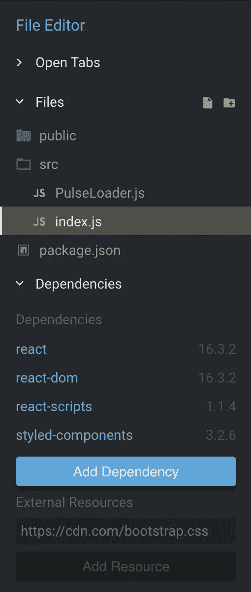
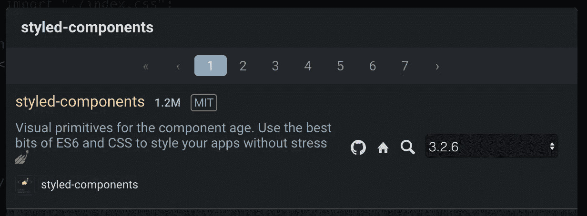

# 让我们构建两个普通的 CSS 加载器 React 组件，并将它们转换成一个 NPM 包(第 1 部分)

> 原文：<https://itnext.io/lets-build-2-vanilla-css-loader-react-components-and-turn-them-into-an-npm-package-part-1-4ef6d9684f58?source=collection_archive---------9----------------------->

这个标题听起来是不是很有趣？？在这篇 2 部分文章的第 1 部分，我将向你展示如何在 React 中使用样式化组件构建两个普通的 CSS“加载”组件。装载机将能够采取各种各样的道具(高度，宽度，颜色等..)以任何方式定制你的心(或者因为我们将使它成为一个开源项目)你的新用户的心的内容。

在第 2 部分中，我们将把我们新制造的装载机变成一个 NPM 包，供所有人享用！开源努力使这个行业变得最伟大，为它做贡献一直是我的目标(不管有多小)。好了，我们开始吧！！

在第 2 部分中，我们实际上将在本地创建一个目录和文件，以便我们可以发布我们的 NPM 包，但是对于第 1 部分，我们将简单地在 [codesandbox.io](https://codesandbox.io/) 中创建初始的 React 组件，以使一切都易于共享(因此，您可以更容易地摆弄代码并改进我所做的事情！！).

前往 [codesandbox.io](https://codesandbox.io/) 并点击“创建沙箱”(右上角),然后点击“反应”。这将为我们提供一个入门的 React 项目。接下来，在左侧菜单中，单击“添加依赖项”(靠近底部)。

接下来，在模态的搜索栏中搜索`styled-components`并选择那个包(应该在顶部)。如果你不熟悉`styled-components`，请点击查看[。简而言之，他们允许我们在。js(x)文件和..良好的..他们太棒了。](https://www.styled-components.com/)

好的，现在在我们的 src 文件夹中添加一个名为`PulseLoader.js`的新文件，并复制粘贴下面的代码。

看到那个了吗？`styled-components`让我们直接在`PulseLoader.js`文件中写 CSS，**牛逼-酱** *果然*。

接下来，在我们的 src 文件夹中创建另一个名为`BounceLoader.js`的文件，复制并粘贴下面的代码。

注意这次我们在我们的`BounceLoader` div 中渲染了一些`span`,在 CSS `styled-components`中我们再次嵌套了 CSS…**牛逼-酱**！

现在在我们的`index.js`文件中复制并粘贴下面的…

现在，您应该看到我们的两个加载器都出现在屏幕右侧，如下所示..

传入了仅装载道具的装载器

我们做到了！！！！现在让我们测试一下我们的道具！复制并粘贴下面的内容(不言而喻，但替换前面的`App`)..

注意我们给两者都添加了一个`height` `width`和`pColor`(原色)以及一个`sColor`(二次色)`PulseLoader` …你现在应该会看到类似下面的东西..

***爆炸了！***

好了，朋友们，这是第一部分！你可以在这里找到我的 codesandbox.io [。向](https://codesandbox.io/s/2prqo9p5wn)[GIFs.com](https://gifs.com/)大喊一声，让制作上述 gif 变得如此简单。

*请在这里* *查看 Part 2* [*。*](/lets-build-2-vanilla-css-loader-react-components-and-turn-them-into-an-npm-package-part-2-9bba32d81c2e)