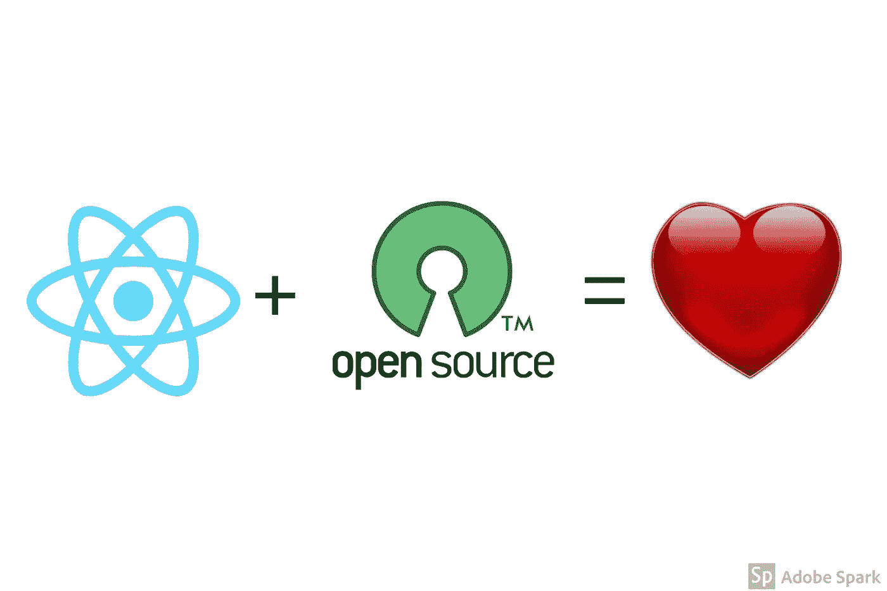
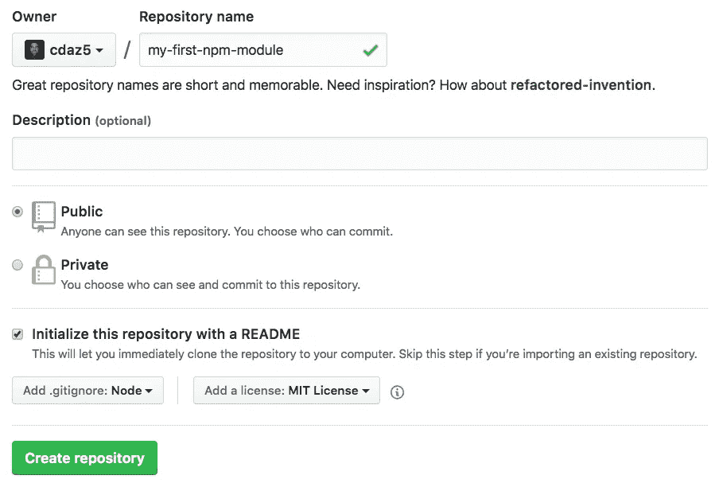
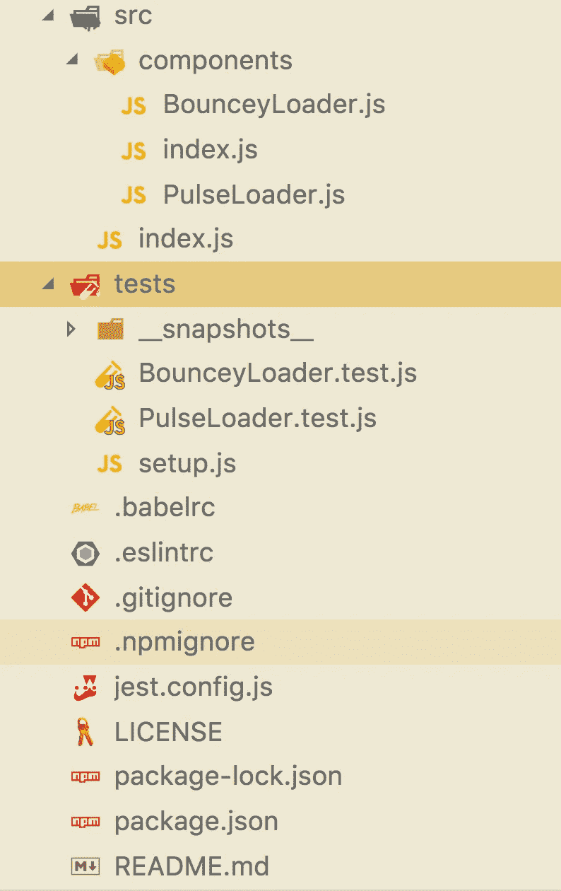
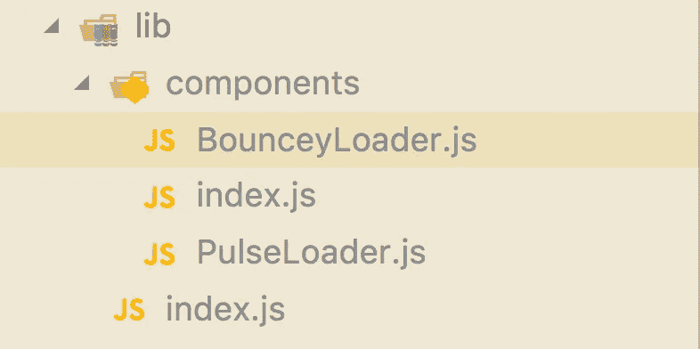

# 让我们构建两个普通的 CSS 加载器 React 组件，并将它们转换成一个 NPM 包(第 2 部分)

> 原文：<https://itnext.io/lets-build-2-vanilla-css-loader-react-components-and-turn-them-into-an-npm-package-part-2-9bba32d81c2e?source=collection_archive---------2----------------------->



***好吧，好吧，好吧！我们又回到了平分秋色的时刻！ ***有趣的事实:*** 麦康纳如此出名的那句话的由来完全是无脚本的(对于那些不知道电影的人来说简直是晕头转向&糊涂了)。Aaaannyywaay，让我们回到代码上。***

******* 如果您还没有一个 NPM 帐户，您需要在[这里](https://www.npmjs.com/)创建一个。

我们先在 Github 上新建一个回购。



确保:

*   选中用自述文件初始化该报表。
*   选择节点作为你的. gitignore。
*   从添加许可证下拉列表中选择 MIT 许可证。

很好，现在去终端，克隆回购，在你最喜欢的代码编辑器中打开文件夹(我用 [VSCode](https://code.visualstudio.com/) 嗯…你也应该用*因为它们很棒*)。

现在，让我们得到我们的文件结构设置，在项目的根中执行以下操作:

```
$ mkdir tests src src/components
$ touch src/index.js src/components/BounceyLoader.js src/components/PulseLoader.js src/components/index.js tests/setup.js tests/BounceyLoader.test.js tests/PulseLoader.test.js .babelrc .eslintrc .npmignore jest.config.js package.json
```

您的文件结构现在应该看起来像这样:



现在，将下面的内容复制粘贴到 package.json 文件中。确保编辑`name,` `description,` `repository,` `author,`和`keywords (optional)`。

```
{
  "name": "example-name",
  "version": "0.1.0",
  "description": "esxample description",
  "main": "lib/index.js",
  "repository": "github repo here",
  "author": "your info here",
  "license": "MIT",
  "keywords": [
    "what the package is related to here"
  ],
  "scripts": {
    "build": "babel src -d lib",
    "lint": "eslint src",
    "precommit": "npm run lint && npm run test",
    "prepublish": "npm run lint && npm run test && babel src -d lib",
    "test": "jest"
  },
  "peerDependencies": {
    "prop-types": "^15.6.0",
    "react": "^16.0.0",
    "react-dom": "^16.0.0",
    "styled-components": "^3.1.6"
  },
  "devDependencies": {
    "babel-cli": "^6.26.0",
    "babel-core": "^6.26.0",
    "babel-eslint": "^8.2.3",
    "babel-preset-env": "^1.6.1",
    "babel-preset-react": "^6.24.1",
    "babel-preset-stage-0": "^6.24.1",
    "babel-register": "^6.26.0",
    "enzyme": "^3.3.0",
    "enzyme-adapter-react-16": "^1.1.1",
    "eslint": "^4.19.1",
    "eslint-config-airbnb": "^16.1.0",
    "eslint-plugin-import": "^2.11.0",
    "eslint-plugin-jsx-a11y": "^6.0.3",
    "eslint-plugin-react": "^7.7.0",
    "jest": "^22.4.3",
    "react": "^16.2.0",
    "react-dom": "^16.2.0",
    "react-test-renderer": "^16.2.0",
    "styled-components": "^3.2.0"
  }
}
```

你们中的大多数人应该熟悉所有这些包，快速概括一下:

eslint: 我们将使用作为我们的 linter，以确保我们的代码是正确的。

**babel:** 将把我们的*花式* JavaScript 编译成浏览器兼容版本和一堆其他东西。

**jest/enzyme:** 我们的测试库，从技术上来说，我们现在不需要酶，但将来可能会需要。

**styled-components:** 加油*真的？你到底有没有看过* [*第一部*](/lets-build-2-vanilla-css-loader-react-components-and-turn-them-into-an-npm-package-part-1-4ef6d9684f58) *？*

太好了，现在在终端运行`npm install`。

为了简洁起见，我不会把每个文件的所有代码都放在这篇文章中，直接到我的 [repo](https://github.com/cdaz5/react-loaders-spinners) 中，复制粘贴`.npmignore, .eslintrc, .babelrc, jest.config.js,index.js(s)`和下面没有提到的任何其他文件。我们将跳过本文中的测试(如果您感兴趣，它们写在 repo 中),直接进入加载器！！

将以下内容复制并粘贴到您的 PulseLoader.js 文件中。你会注意到我们重构了它的一些部分*(下面讨论的* ***粗体*** *部分)*。

```
import styled, { keyframes } from 'styled-components';
**import { string, number, bool } from 'prop-types';**const pulse = keyframes`
  0% {
    transform: scale(0);
    opacity: 1;
  }
  100% {
    transform: scale(1.3);
    opacity: 0;
  }
`;const PulseLoader = styled.div`
 **display: ${props => (props.loading ? 'flex' : 'none')};**
 width: ${props => (props.width ? `${props.width}px` : '100px')};
 height: ${props => (props.height ? `${props.height}px` : '100px')};
 background: transparent;
 border-radius: 50%;
 &:before {
  content: '';
  display: block;
  width: ${props => (props.width ? `${props.width}px` : '100px')};
  height: ${props => (props.height ? `${props.height}px` : '100px')};
  background: ${props => (props.pColor ? props.pColor : '#555')};
  border-radius: 50%;
  animation: ${pulse} 3s linear infinite;
 }
 &:after {
  content: '';
  display: block;
  position: absolute;
  width: ${props => (props.width ? `${props.width}px` : '100px')};
  height: ${props => (props.height ? `${props.height}px` : '100px')};
  background: ${props => (props.sColor ? props.sColor : '#f3f3f3')};
  border-radius: 50%;
  animation: ${pulse} 2.3s linear infinite;
 }
`;**PulseLoader.propTypes = {
  width: number,
  height: number,
  loading: bool.isRequired,
  pColor: string,
  sColor: string
};****PulseLoader.defaultProps = {
  width: 100,
  height: 100,
  pColor: '#555',
  sColor: '#f3f3f3',
  loading: true
};****export default PulseLoader;**
```

我们给`display`属性添加了一个`loading`道具，而不是在渲染中用三元组来容纳它。

我们添加了`prop-types`，并注明需要我们的`loading`道具。

我们添加了`defaultProps`，在这种情况下并不完全必要，因为组件本身就有 ternaries，它代表了一个默认值，但是在大多数情况下，这是你需要/想要添加的。

最后，我们清理了我们的出口。

现在转到 BounceyLoader.js，复制并粘贴下面的内容。

```
import React from 'react';
import styled, { keyframes } from 'styled-components';
**import { string, number, bool } from 'prop-types';**const bounce = keyframes`
  0%, 75%, 100% {
    transform: translateY(0px)
  } 
  25% {
    transform: translateY(-30px)
  }
`;const BounceLoader = styled.div`
 **display: ${props => (props.loading ? 'flex' : 'none')};**
 align-items: center;span {
  margin: ${props => (props.spaceBetween ? `0 ${props.spaceBetween}px` : '0 10px')};
  display: block;
  width: ${props => (props.width ? `${props.width}px` : '20px')};
  height: ${props => (props.height ? `${props.height}px` : '20px')};
  border-radius: 50%;
  background: ${props => (props.pColor ? props.pColor : '#555')};&:nth-child(1) {
   animation: ${bounce} 1s ease-in-out infinite;
  }&:nth-child(2) {
   animation: ${bounce} 1s ease-in-out 0.33s infinite;
  }&:nth-child(3) {
   animation: ${bounce} 1s ease-in-out 0.66s infinite;
  }&:nth-child(4) {
   animation: ${bounce} 1s ease-in-out 0.66s infinite;
  }
 }
`;**const BounceyLoader = props => (
  <BounceLoader {...props}>
    <span />
    <span />
    <span />
  </BounceLoader>
);****BounceyLoader.propTypes = {
  width: number,
  height: number,
  loading: bool.isRequired,
  pColor: string,
  spaceBetween: number
};****BounceyLoader.defaultProps = {
  width: 20,
  height: 20,
  pColor: '#555',
  loading: true,
  spaceBetween: 10
};****export default BounceyLoader;**
```

同样，我们给`display`属性添加了一个`loading`道具，而不是在渲染中用三元组来容纳它。

我们创建了一个功能组件，它接受传递给它的属性，并返回我们的`<BounceLoader>`组件和三个内置的`<span />'s`。如果我们不这样做，我们的 NPM 模块的用户将不得不像这样使用加载器:

```
<BounceLoader
  height={50}
  // etc....
>
  <span />
  <span />
  <span />
</BounceLoader>
```

我们不想让我们的用户自己写出`spans`，那是 **J *anktown，USA*** 的最佳状态。通过重构，他们可以这样使用它:

```
<BounceyLoader
  height={50}
  // etc...
/>
```

***Muuuuuuuuch 清洁工你同意吗？***

最后，像我们的`PulseLoader`一样，我们添加了`prop-types`并指出需要我们的`loading`道具，添加了`defaultProps`并清理了我们的出口。

现在，在您的终端运行中:

```
npm run prepublish
```

这将启动 linter，运行我们的测试，并创建一个生产就绪的构建(第一次运行它时，它应该创建一个名为 lib 的新目录，其中包含我们编译成浏览器兼容版本的所有代码)。



***快到了，陪着我！！***

接下来，你可能会想写一个很好的自述文件，解释你的库的目的以及如何使用它。请随意使用[我拥有的](https://github.com/cdaz5/react-loaders-spinners)作为你的基础。

在您的终端运行中

```
npm login
```

填写您的信息，然后运行..

```
npm publish
```

***唷！！你做到了！！！拍拍自己的背！！***

转到此 URL 查看您的软件包 IRL:

```
https://www.npmjs.com/package/<YOUR PACKAGE NAME>
```

当你要去某个地方(因为你真的是我们都知道的)时，去 [react-loaders-spinners](https://github.com/cdaz5/react-loaders-spinners) (我在这个 2 部分系列中发布的库)并给它一个星号，在 [NPM 这里](https://www.npmjs.com/package/react-loaders-spinners)查看它…让我知道你的想法。自从我写了这篇文章后，我又增加了几个微调器(现在已经增加到 5 个了！).

直到下次..你们是有品位的读者，记住牛奶永远是糟糕的选择..