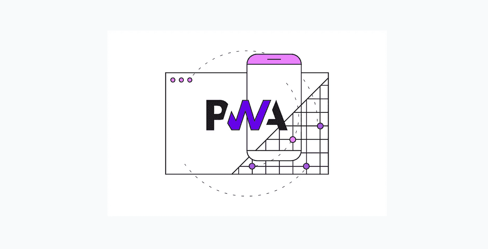
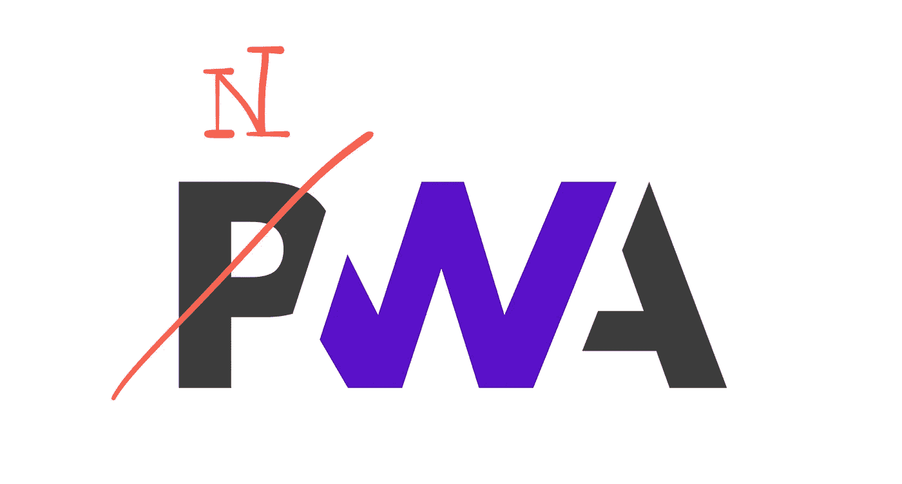

# 让我们建立一个本地的(类似的)网络应用程序(NWA)

> 原文：<https://itnext.io/lets-build-a-native-like-web-app-nwa-22a553fee338?source=collection_archive---------0----------------------->

…我指的是一款工作起来和感觉上完全像本机应用的 web 应用。

# 为什么，原生应用有什么问题？

假设你为一个应用或服务想出了一个很棒的概念，例如，在我的情况下，一个[极简的微日志应用](https://journalisticapp.com)。您自然希望尽可能多的用户可以使用它，不管他们住在哪里，也不管他们选择在办公桌上、手腕上和/或口袋里放什么设备。

对于一个规模还不错的公司来说，这没什么大不了的，只要让你的产品团队提出一个设计，然后雇佣一群 Android、iOS 和 web 开发人员来为每个平台实现一个版本(总共 3 个)。但是对于一个小组织或者一个[独立黑客](https://rameerez.com/what-is-indie-hacking/)来说，这不是一个选项，你没有足够的资源来构建和维护三个应用。

嗯，有跨平台的解决方案。通常的嫌疑人是[反应原生](https://reactnative.dev/)、[离子](https://ionicframework.com/)和[颤动](https://flutter.dev/)。它们都很棒，让您可以访问本机设备 API。React Native 和 Ionic 甚至允许你使用 web 栈(HTML，JS/ [JSX](https://facebook.github.io/jsx/) ，CSS)和框架如 [React](https://reactjs.org/) 或 [Vue](https://vuejs.org/) 来快速构建你的应用。

(感谢丹尼尔·罗，使用 [Nuxt](https://v3.nuxtjs.org/) 也将很快成为 [nuxt/ionic](https://ionic.roe.dev/) 的一个选项)

图片来自 [enappd](https://enappd.com/blog/react-native-vs-ionic-vs-flutter/91/)

不错，但他们都有一个问题:应用程序仍然需要打包(几次)，部署到网络上，并提交到苹果，谷歌和微软各自的商店。

这很烦人，因为你的应用程序的更新会被每个商店的审核过程以及用户决定多年不更新他们的应用程序而延迟。因此，从理论上讲，你的后端/API 必须能够与你的应用程序的每一个版本兼容。Meee…

此外，您被迫实施多种支付解决方案(包括会计！)根据商店策略(本例中为 3，web 为 1)。例如，如果你想接受闪电付款怎么办？

# 渐进式网络应用程序(PWAs)怎么样？

[渐进式网络应用(PWA)](https://web.dev/progressive-web-apps/)非常棒，你甚至可以通过像 [bubblewrap](https://github.com/GoogleChromeLabs/bubblewrap) 或 [PWA Builder](https://www.pwabuilder.com/) 这样的工具，将它们发布到大多数的应用商店，尽管有一些限制。另请参见[可信网络活动(TWAs)](https://developer.chrome.com/docs/android/trusted-web-activity/overview/) 和我之前的帖子[在 PlayStore 上发布渐进式网络应用(PWA)——哪些有效，哪些无效(2021 年)](/publishing-a-progressive-web-app-pwa-on-the-playstore-what-works-and-what-doesnt-in-2021-c4cfea5a7601?source=your_stories_page-------------------------------------)。

图片来自 [web.dev](https://web.dev/progressive-web-apps/)

但是渐进式加载和缓存并不是我们真正想要的“类本机”应用。

一个本地应用程序，一旦下载，离线工作。这也是 PWA 的前提，但是渐进式 Web 应用程序(正如其名称中的“P”所暗示的那样)只会缓存页面并在被访问时更新它们。因此，这款应用并不完全具备离线功能，而是具备在线功能。

这种行为有助于增强 web 服务的体验，有[的统计数据可以证明这一点](https://www.pwastats.com/)，但是对于很多用例来说，比如我的日志应用程序，这是行不通的。

所以让我们稍微调整一下…

# 本地 Web 应用程序(nwa)

我们真正想要的是一个带有高速缓存和即时全脱机支持的 PWA。

## 会是什么样子？

让我们来看一个理想化的概念，它将解决(几乎)我们当前在本地应用以及 pwa 方面面临的所有问题。

你不用咨询应用商店，而是打开你想要获取的应用的主页，例如[www.journalisticapp.com](https://journalisticapp.com)。这里有两个选项，要么使用安装横幅提示您，要么使用安装按钮手动触发安装。理想情况下，这两个选项之间的选择应该留给开发人员。

一旦安装被触发，应用程序将被下载(又名。完全缓存)到用户的设备，因此可立即用于离线使用。

目前没有任何技术障碍阻止我们实现这样一个应用，尽管没有现成的解决方案，我们将不得不修补[工具箱](https://developer.chrome.com/docs/workbox/)和/或[服务人员](https://developer.mozilla.org/en-US/docs/Web/API/Service_Worker_API)脚本。

然而，它将是有限的。

我的意思是，很明显，当依赖于在浏览器中单个线程上执行的 JS 代码库，而不是针对芯片架构优化的原生 Java 或 Swift 代码时，我们将不得不遭受性能打击。但并非所有应用都是性能关键型的。我想那些人不会很快在本地实现。

## 那么少了什么呢？

虽然在通过[Web API](https://developer.mozilla.org/en-US/docs/Web/API)访问越来越多的设备 API 方面取得了进展，但仍然缺少许多关键的 API，例如对导航栏颜色的控制、对设备安全芯片的访问或生物认证。

对于 NWA 来说，拥有不与浏览器共享的专用存储也很重要，该专用存储可以被加密和/或阻止，例如当用户未被认证或锁定应用时。在撰写本文时，浏览器附带的唯一可行的网络存储选项是 [IndexedDB](https://developer.mozilla.org/en-US/docs/Web/API/IndexedDB_API) 。

# 摘要

如果有一个 web 应用程序和本地应用程序没有区别，结合了两个世界的优点，并且可以直接从 web 上下载，那将是非常令人惊奇的。当考虑应用程序和 web3 的去中心化未来时，后者尤其重要。

十有八九，我会继续和记者们一起进入 NWA 的兔子洞，并继续汇报我在构建一个与本土应用没有区别的网络应用的探索中能走多远。

感谢你的阅读，祝你有美好的一天，✌🏽