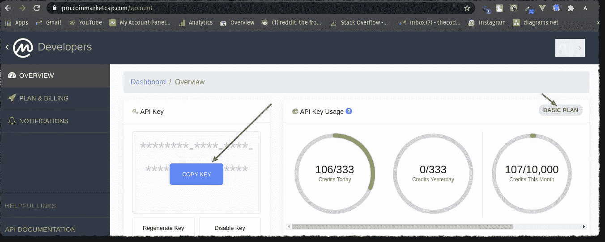
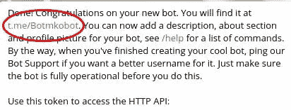
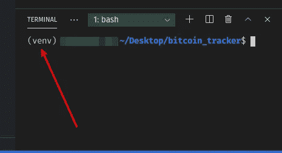
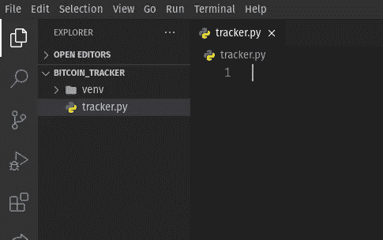

# 让我们使用 Python 构建一个实时比特币价格通知项目

> 原文：<https://itnext.io/lets-build-a-real-time-bitcoin-price-notification-project-using-python-daaa7391f71b?source=collection_archive---------0----------------------->


照片由[德米特里·德米德科](https://unsplash.com/@wildbook?utm_source=unsplash&utm_medium=referral&utm_content=creditCopyText)在 [Unsplash](https://unsplash.com/s/photos/bitcoin?utm_source=unsplash&utm_medium=referral&utm_content=creditCopyText) 拍摄

大家好，我知道我已经有一段时间没发东西了…但事实是我又带着另一个令人兴奋的 python 项目回来了！

这篇文章最初发表在我的博客上，你可以在这里找到——[https://thecodingpie.com/](https://thecodingpie.com/post/lets-build-a-real-time-bitcoin-price-notification-python-project/)

你可以从我的 GitHub repo 获得这个项目的完整代码—[https://github.com/the-coding-pie/bitcoin_price_tracker](https://github.com/the-coding-pie/bitcoin_price_tracker)

如今，加密货币是热门话题，最重要的是“比特币”。但问题是比特币的价格波动很大，你永远不会真正知道它最终会在哪里。很难跟踪不断变化的 BTC 价格，不是吗？

因此，与其不断地在各种网站上查询最新价格，我们为什么不让 Python 来为我们做这项工作呢？！

在这个项目中，我们将构建一个 python 脚本来跟踪最新的比特币价格。它会每 30 分钟给你发一条电报信息(你可以调整)，告诉你最新的 6 个比特币价格(你也可以调整)。您可以设置一个最小的`threshold`值，这样如果 BTC 价格低于该阈值，那么脚本将立即发送一条显示价格的警告消息。

听起来很酷，对吧？

# 要求

要制作这个脚本，您需要以下东西:

*   一个[coinmarketcap.com](https://pro.coinmarketcap.com/)API 密钥。因为我们要利用他们的 API 来获取最新的比特币价格。
*   telegram 应用程序，以及您的帐户的`chat_id`。
*   然后是一个[电报机器人](https://core.telegram.org/bots)和它的`token`钥匙。没有 bot，您将无法发送编程消息。简而言之，**如果你想从我们的 python 脚本向你的电报账户发送价格通知，那么你需要一个电报机器人。**
*   最后是 Python3，以及您选择的文本编辑器。

我知道你们中的大多数人可能没有前三样东西，这就是为什么我把这个教程分成三个部分来简化生活:

1.  获取 Coinmarketcap API 密钥
2.  电报机器人和你的聊天 ID
3.  将所有东西组装在一起

事不宜迟，我们开始吧。

# 1).获取 Coinmarketcap API 密钥

Coinmarketcap.com 不再为匿名用户提供加密货币数据。所以我们需要一个`API key`来使用他们的服务。如果你在他们的网站上没有账户，那么先注册[或登录](https://coinmarketcap.com/api/)。

当您这样做时，您将被带到您的帐户控制面板，看起来像这样:



我的仪表板

如你所见，在使用他们的 API 和他们的**基本计划**时有一个限制。但是一天的请求对我们来说太多了！如果你想使用他们的付费计划，请随意。

记住，我们创建这个帐户是为了获得 Coinmarketcap `API Key`。现在，您可以通过单击那个**复制密钥**按钮来获得它，当您将鼠标悬停在那个 **API 密钥**框上时，该按钮会弹出。

太棒了，现在我们有了自己的货币市场基金`API Key`。把这一页做成书签，因为我们以后会用到它。

# 2).电报机器人和你的聊天 ID

在继续此步骤之前，请确保您的手机/电脑上安装了 Telegram 应用程序，并且您已经创建了一个帐户。

现在谈谈逻辑。我们都知道，要发送一条**消息**，应该有两个实体，**发送方**和**接收方**。这里的**发送者**是我们将要创建的机器人，而**接收者**是**你**或者，确切地说，是你的`chat_id`。

看，这就是为什么你需要自己的电报`bot`和 T5。

事实上，电报机器人太棒了。你可以从他们的官方文件中了解更多关于电报机器人有多棒的信息。

# 但是我如何创建一个机器人呢？

只需与[机器人父亲](https://core.telegram.org/bots#3-how-do-i-create-a-bot)交谈，并遵循几个简单的步骤！


机器人父亲机器人

机器人父亲是统治他们所有人的机器人。你可以用它来创建新的机器人帐户和管理你现有的机器人。

现在让我们制作自己的机器人:

*   首先在电报 app 中搜索 **BotFather** 。你会看到机器人父亲旁边有一个蓝色的验证勾。
*   点击这个机器人，输入消息/命令`**/newbot**`并发送出去。`**/newbot**`命令用于创建新的机器人。每当你向一个机器人输入命令时，你都应该在命令前使用**正斜杠** ( **/** )。
*   现在机器人爸爸会要求你提供一个**名字**和一个**用户名**，请提供。
*   然后，它会向您发送一条祝贺消息，其中包含指向您的机器人的链接和您的机器人的授权令牌。
*   现在让我们**激活你的机器人**。为此，点击**机器人父亲**给你的机器人的**链接:**



我的机器人的链接。你的看起来会像那样，但是有你的机器人的名字

*   点击那个链接，发送一个`**/start**`命令来激活它。

就这样，您已经创建了自己的 bot 并成功激活了它！

您为您的机器人获得的**令牌**是一个类似于`110201543:AAHdqTcvCH1vGWJxfSeofSAs0K5PALDsaw`的字符串。需要这个**令牌**来授权机器人并向[机器人 API](https://core.telegram.org/bots/api) 发送请求。保持你的令牌安全，并安全地存储它，它可以被任何人用来控制你的机器人😱。

厉害！现在你有了你的机器人，重要的是它的**令牌**密钥。留着以后用。

# 获取您的聊天 id

下一步是获得你的电报`chat_id`。你可以通过一个名为' **IDBot** '的现成机器人轻松实现:

*   在电报应用中搜索“ **IDBot** ”。它的图标如下所示:


IDBot 的图标

*   现在点击这个机器人，输入一条和这个`**/getid**`一模一样的消息。这个`**/getid**` 命令会得到你的`chat_id`。

又牛逼了！现在你有了你的`chat_id`，把它保存在某个地方，因为我们以后会需要它。

# 3).将所有东西组装在一起

确保你已经安装了 **Python3.4+** 和 **pip3** 。

# 初始设置

在开始之前，我们需要建立一个文件夹，虚拟环境，和所有的东西。为什么？因为这是一个很好的练习！

*   首先，在你电脑的任何地方创建一个名为 **bitcoin_tracker** 的文件夹。
*   然后**在 visual studio 代码里面打开**(我用的是 vs 代码作为我的文本编辑器)。
*   现在让我们**使用 **venv** 创建**一个新的虚拟环境，然后**激活**它。为此:
*   在你的文本编辑器中，打开**终端>新终端**或者你可以使用**命令行**(如果你在 windows 上)或者 **bash/zsh** 终端(在 Linux/Mac 上)。
*   然后确保你在**比特币追踪器**目录中，或者请 **cd** 进入该目录，并从那里在**终端**中键入以下命令:

```
python3 -m venv venv
```

这个命令将为我们创建一个名为 **venv** 的虚拟环境。

*   要激活它，如果您在**窗口**上，请键入以下内容:

```
venv\Scripts\activate.bat
```

*   如果您使用的是 Linux/Mac 系统，请键入以下内容:

```
source venv/bin/activate
```

现在，您应该会看到类似这样的内容:



这个前缀意味着您已经成功激活了虚拟环境

*   最后，直接在 **bitcoin_tracker** 文件夹中创建一个名为“ **tracker.py** 的新文件。

现在，您应该有一个类似如下的文件结构:



**注意**:如果你仍然对如何建立一个虚拟环境感到困惑，那么请阅读这篇[快速指南](https://thecodingpie.com/post/a-quick-guide-on-how-to-setup-a-python-virtual-environment-windows-linux-mac/)。

我们必须从这个脚本发出一些 HTTP 请求，所以我们需要一个名为 **requests** 的 python 模块，我们来安装它。

在**终端**中键入以下命令，以**安装**请求模块:

```
pip install requests
```

就这样，现在是写实际脚本的时候了！

# 让我们开始吧…

打开 **tracker.py** 文件并键入:

```
import requests
import time# global variables
api_key = 'your_coinmarketcap_api_key'
bot_token = 'your_telegram_bot_token'
chat_id = 'your_telegram_account_chat_id_here'
threshold = 30000
time_interval = 5 * 60 # in seconds
```

*   在这里，在最顶端，我们正在导入所需的模块。我们需要`requests`模块向 Coinmarketcap API 和 telegram 端点发出 HTTP 请求。
*   我们需要`time`模块来延迟我们的代码(使用`sleep()`函数)。
*   然后我们设置一些全局变量:
*   `api_key`= ' put _ your _ coin market cap _ API _ key _ here _ which _ we _ first _ obtain '
*   `bot_token`= ' put _ your _ own _ telegram _ bot _ token '
*   `chat_id` = 'put_your_telegram_chat_id '
*   `threshold` =放比特币价格的最低门槛
*   `time_interval` =秒。这里我用了 5 分钟。这意味着，我的脚本将每 5 分钟发出一个 API 请求，并将价格存储在一个 python 列表中。请记住，你每天只能提出 333 个免费请求。

现在让我们制作两个函数:

*   一个名为`get_btc_price()`的将获取最新的加密货币价格，从中提取比特币价格，然后`return`它。
*   另一个名为`send_message(chat_id, msg)`，接受我们要发送的`chat_id`和`msg`。该功能将利用电报 HTTPS 端点向我们的电报账户发送消息。

键入以下内容:

```
def get_btc_price():
    url = '[https://pro-api.coinmarketcap.com/v1/cryptocurrency/listings/latest'](https://pro-api.coinmarketcap.com/v1/cryptocurrency/listings/latest')
    headers = {
        'Accepts': 'application/json',
        'X-CMC_PRO_API_KEY': api_key
    }

    # make a request to the coinmarketcap api
    response = requests.get(url, headers=headers)
    response_json = response.json()# extract the bitcoin price from the json data
    btc_price = response_json['data'][0]
    return btc_price['quote']['USD']['price']
```

*   参见，`‘https://pro-api.coinmarketcap.com/v1/cryptocurrency/listings/latest'`是获取最新加密货币价格的 API 端点。
*   记住你必须发送你的`api_key`。您可以通过以下两种方式之一提供:

1.  首选方法:通过名为`X-CMC_PRO_API_KEY`的自定义标题。我们使用这种方法是因为这是首选方法。
2.  方便的方法:通过一个名为`CMC_PRO_API_KEY`的查询字符串参数

*   在接下来的几行中，我们发出 GET 请求并将数据转换成`json()`格式。
*   我们目前掌握的数据包含了大量信息。但是我们只需要比特币的价格。这就是我们在最后两行所做的。

API 返回的数据在结构上可能会不时变化。如果上面的代码没有得到比特币价格，那么通过打印变量`response_json`中的值并据此更改最后两行，尝试找到比特币价格在哪里。

现在如果我们调用上面的函数，它会`return`最新的比特币价格！

太棒了，现在让我们构建`send_message()`函数:

```
# fn to send_message through telegram
def send_message(chat_id, msg):
    url = f"[https://api.telegram.org/bot{bot_token}/sendMessage?chat_id={chat_id}&text={msg](https://api.telegram.org/bot{bot_token}/sendMessage?chat_id={chat_id}&text={msg)}"# send the msg
    requests.get(url)
```

*   看，你在上面看到的`url`是我们必须用来从我们的机器人向我们的电报帐户发送电报消息的端点。这里我使用了 [f 字符串](https://realpython.com/python-f-strings/)，这样我就可以把我想发送的`bot_token`、`chat_id`和`msg`连接成一个字符串。
*   然后我们向`url`发出 GET 请求，如果我们这样做了，你将在你的应用程序中收到一条来自你的机器人的消息。

下一个难题是按照我们希望的方式使用上面的函数。因此，让我们创建一个`main()`函数，它将调用上述两个函数:

```
# main fn
def main():
    price_list = []# infinite loop
    while True:
        price = get_btc_price()
        price_list.append(price)# if the price falls below threshold, send an immediate msg
        if price < threshold:
            send_message(chat_id=chat_id, msg=f'BTC Price Drop Alert: {price}')# send last 6 btc price
        if len(price_list) >= 6:
            send_message(chat_id=chat_id, msg=price_list)
            # empty the price_list
            price_list = []# fetch the price for every dash minutes
        time.sleep(time_interval)# fancy way to activate the main() function
if __name__ == '__main__':
    main()
```

*   我们正在运行一个无限循环，它将在 5 分钟`time_interval`运行。
*   对于每个`time_interval`，我们将调用`get_btc_price()`函数并将结果存储在`price_list`变量中。一旦它的长度变成`>= 6`，我们用最后 6 个比特币价格调用`send_message()`函数，然后清空`price_list`。
*   如果 BTC 价格突然跌破`threshold`值，那么我们会立即发送一条消息，告知最新的比特币价格。

就这样，我们完成了我们的 python 脚本！如果你不理解最后 2 句“花里胡哨”的台词，那么对你来说这是一个小练习。谷歌那一行，并找出我在那里试图做什么！

# 让我们运行它…

现在让我们运行我们的脚本。在**终端**中，输入:

```
python tracker.py
```

如果一切正常，那么你每 30 分钟就会收到一条信息！

尝试调整`time_limit`和`threshold`值以获得即时消息。但是要时刻记住免费 API 的限制！您可以在任何服务器上在线部署它，并获得实时通知。

# 完全码

这是完整的代码。如果事情没有按预期的那样运行，用这个来交叉检查你的代码。

```
import requests
import time# global variables
api_key = 'your_coinmarketcap_api_key'
bot_token = 'your_telegram_bot_token'
chat_id = 'your_telegram_account_chat_id_here'
threshold = 30000
time_interval = 5 * 60 # in secondsdef get_btc_price():
    url = '[https://pro-api.coinmarketcap.com/v1/cryptocurrency/listings/latest'](https://pro-api.coinmarketcap.com/v1/cryptocurrency/listings/latest')
    headers = {
        'Accepts': 'application/json',
        'X-CMC_PRO_API_KEY': api_key
    }

    # make a request to the coinmarketcap api
    response = requests.get(url, headers=headers)
    response_json = response.json()# extract the bitcoin price from the json data
    btc_price = response_json['data'][0]
    return btc_price['quote']['USD']['price']# fn to send_message through telegram
def send_message(chat_id, msg):
    url = f"[https://api.telegram.org/bot{bot_token}/sendMessage?chat_id={chat_id}&text={msg](https://api.telegram.org/bot{bot_token}/sendMessage?chat_id={chat_id}&text={msg)}"# send the msg
    requests.get(url)# main fn
def main():
    price_list = []# infinite loop
    while True:
        price = get_btc_price()
        price_list.append(price)# if the price falls below threshold, send an immediate msg
        if price < threshold:
            send_message(chat_id=chat_id, msg=f'BTC Price Drop Alert: {price}')# send last 6 btc price
        if len(price_list) >= 6:
            send_message(chat_id=chat_id, msg=price_list)
            # empty the price_list
            price_list = []# fetch the price for every dash minutes
        time.sleep(time_interval)# fancy way to activate the main() function
if __name__ == '__main__':
    main()
```

# 包扎

我希望你喜欢这个教程。如果你有任何疑问，请在下面评论。谢谢你，🥰.