# 让我们用 Python 和 BeautifulSoup4 构建一个 Web Scraper

> 原文：<https://itnext.io/lets-build-a-web-scraper-with-python-beautifulsoup4-2b550d10438?source=collection_archive---------1----------------------->


亚历克斯·伊比在 [Unsplash](https://unsplash.com/?utm_source=unsplash&utm_medium=referral&utm_content=creditCopyText) 上的照片

这篇文章最初发表在我的博客上——https://thecodingpie.com

想知道如何自动化抓取网站、收集数据并将其导出为 CSV 等有用格式的过程吗？如果你在做数据科学/机器学习，那么你可能已经经历过几次这种情况。

这就是我写这篇教程的原因，在这篇教程中，你将通过构建一个 Python 脚本来学习所有关于 Web 抓取的知识，该脚本将抓取一个电影网站并获取有用的信息，最后，它将把收集到的数据导出到一个 CSV(逗号分隔值)文件中。

而且好的是再也不用手动做网页抓取了！

听起来很有趣？那我们就直入主题吧。

你可以从我的 Github repo — [Web Scraper](https://github.com/the-coding-pie/web_scraper) 下载完成的代码

# 什么是网络抓取

网络抓取是从互联网上的任何网站收集有用/需要的信息的过程。像任何其他过程一样，有两种方法可以做到:一种是从网站手动复制粘贴所需的数据。另一种方式，传说的方式，是聪明地自动化它！

我希望你想成为第二类人。但是这样做有一些挑战…

第一个挑战是，并不是所有的网站所有者都喜欢抓取他们网站的过程。**因此，如果你打算在网站上进行网络抓取，那么请确保他们允许你这样做**。

第二个挑战是，并非所有的网站都是一样的。我的意思是你为一个网站写的剧本不能用于其他网站。因为两个网站的结构完全不同。也许几天后你甚至不能在同一个网站上使用相同的脚本，因为网站开发者一直在改变他们网站的布局，以应对网页抓取工具。

# 网页抓取替代方案

如果有这么多挑战，有没有替代方案？是的，有一个替代方案叫做 **API** 。**应用编程接口**是从任何网站获取数据的唯一**合法**和**稳定**的方式。

大多数网站都提供了一个 API，通过它你可以得到你想要的更好的格式的数据，比如 JSON 或者 XML。但是有一个问题，你可能要付钱。当然，可能会有**免费**的计划，但从长远来看，为了使用他们**珍贵的**数据，你必须向他们付费。

这就是网络抓取概念派上用场的地方！

# 我们将要建造的东西

我们将通过构建一个真实的项目来学习使用 Python 和 BeautifulSoup4 进行 Web 抓取的所有知识。

我不想教你如何刮一个千变万化的动态网站而让你头疼。所以，我建立了一个静态电影网站，名为 [**TopMovies**](https://the-coding-pie.github.io/top_movies/) ，其中包含了一份 IMDb 电影**前 25 名的列表**。这是我们要刮的网站。因此，在继续之前，请先检查一下— [热门电影](https://the-coding-pie.github.io/top_movies/)。

请看[热门电影](https://the-coding-pie.github.io/top_movies/)网站上有一份**25 部 IMDb 电影**的名单。每部电影都包含以下细节:

*   `title`
*   `genre`
*   `rating`
*   `length` —电影运行时间
*   `year`
*   `budget`
*   `gross`
*   `img`

我们将从热门电影网站上搜集这些细节。然后，在获得所有这些详细信息后，我们将把它导出为 CSV 等有用的格式，以便您以后可以将其导入到您的数据科学项目中，并可以毫无顾虑地进行一些预测！

简而言之，我们要刮下面这个网站:

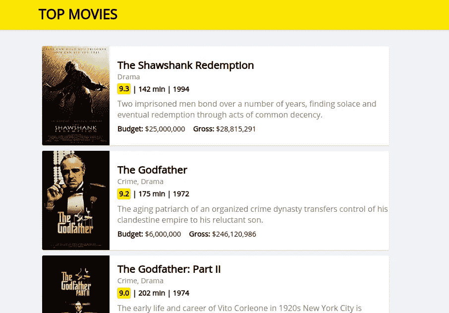

我们将抓取这个网站并…

将抓取的数据导出为 CSV 文件，如下所示:

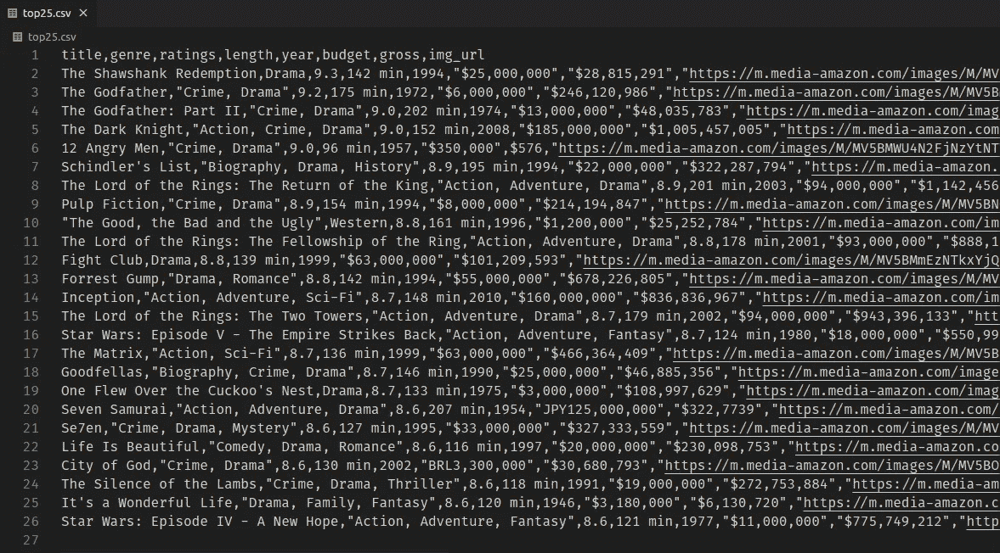

…生成这样的 CSV 文件

然后，如果你愿意，你可以在 Jupyter 笔记本里把它作为一个熊猫数据框来阅读，你可以很容易地做所有的分析和预测！：

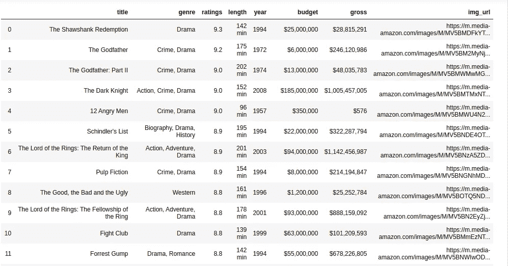

生成的 CSV 文件在 jupyter 笔记本中读取为熊猫数据帧。

如果你不是数据科学/机器学习的人，那就不要管这最后一张图片，只是忘了它！

通过做这个简单的项目，你将学会建立任何一种能够抓取任何你想删除的网站的网络抓取工具的技巧。您还将学习如何使用 Python 生成 CSV 文件。

# 我们要怎么做呢？

非常简单明了:

*   首先，我们将使用`requests`库获取我们想要的网页。
*   然后，我们将在合适的解析器(如`lxml`)的帮助下，将该页面转换成一个`BeautifulSoup`对象。这将使刮削过程容易得多。
*   然后我们将从 soup 对象中获取所有需要的数据。
*   最后，我们将在`csv`模块的帮助下，将所有抓取的数据导出到一个名为`top25.csv`的文件中。

就是这样！

# 先决条件

*   你应该擅长 python3。
*   你应该对 HTML 和 CSS 有一点点的了解。
*   你的电脑上应该安装了 **python3.4** 或更高版本。你可以阅读这篇文章来学习如何在任何操作系统上安装 python 3—[https://realpython.com/installing-python/](https://realpython.com/installing-python/)
*   你应该已经安装了 **venv** 。
*   最后，你需要一个现代的代码编辑器，比如 visual studio code**。您可以根据您的操作系统从这里下载 visual studio 代码—[https://code.visualstudio.com/download](https://code.visualstudio.com/download)。**

有了这些东西，现在让我们开始吧。

# 初始设置

*   首先，在你的电脑上创建一个名为`web_scraper`的文件夹。
*   然后在 visual studio 代码中打开它。
*   现在让我们**使用 **venv** 创建**一个新的虚拟环境，然后**激活**它。为此:
*   在文本编辑器中，打开**终端>新建终端**。
*   然后键入:

```
python3 -m venv venv
```

这个命令将为我们创建一个名为 **venv** 的虚拟环境。

*   要激活它，如果您在**窗口**上，请键入以下内容:

```
venv\Scripts\activate.bat
```

*   如果您使用的是 Linux/Mac 系统，请键入以下内容:

```
source venv/bin/activate
```

现在，您应该会看到类似这样的内容:

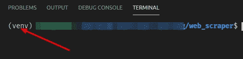

这个前缀意味着您已经成功激活了虚拟环境

*   最后，直接在`web_scraper`文件夹中创建一个名为`scraper.py`的新文件:

现在，您应该有一个类似如下的文件结构:

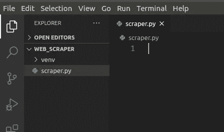

**注意**:如果你还对如何设置虚拟环境感到困惑，那么就来看看这篇[快速指南](https://thecodingpie.com/post/a-quick-guide-on-how-to-setup-a-python-virtual-environment-windows-linux-mac/)。

好了，你已经完成了初始设置，现在是时候开始有趣的事情了！

# 获取网页

让我问你一个问题。为了手动抓取一个网站，我的意思是从一个网站复制粘贴数据，你首先会做什么？

首先，你需要打开网络浏览器并输入网址，对吗？因为为了从网页中获取数据，**你必须先加载它**。这正是我们在这里要做的。

**首先，我们需要从网站**加载网页。但是我们根本不打算使用网络浏览器。相反，我们将使用一个名为`**requests**`的 Python 模块。

因此，在**终端**中键入以下命令，然后**安装**模块`**requests**`:

```
pip install requests
```

然后，在`scraper.py`文件中键入:

```
import requests# fetch the web page
page = requests.get('https://the-coding-pie.github.io/top_movies/')
```

*   这段代码将`**get**`中的`**Response**`对象从`[https://the-coding-pie.github.io/top_movies/](https://the-coding-pie.github.io/top_movies/.)`URL 中整体取出[。但是我们想要网页本身或者网页本身，对吗？](https://the-coding-pie.github.io/top_movies/.)

为了获得 web 页面`**content**`，您必须像这样从`**page**`变量中访问`**content**`:

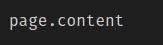

这将获得页面的内容，即。整个 HTML 内容。

如果你`print(page.content)`:

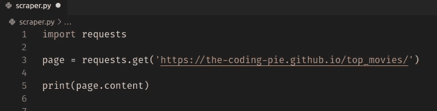

然后你会看到网页的 **HTML** 是这样的:

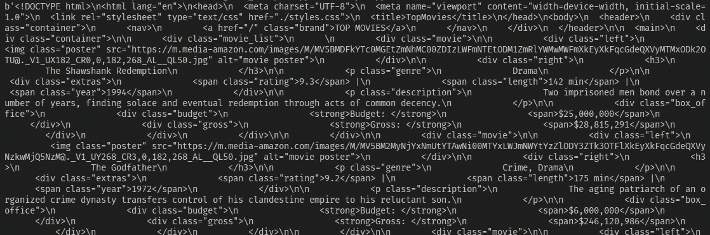

但是这里有一个问题。如果你看一下`type(page.content)`:

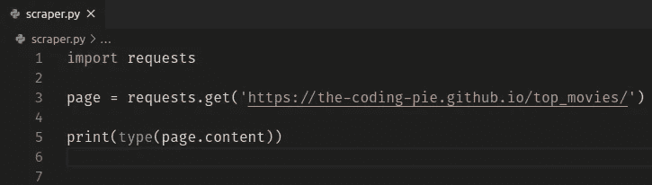

然后你可以看到它的类型是`bytes`:

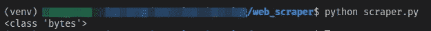

我们无法解析那些字节类型！字节类型是没有用的，除非你把它们转换成其他有用的格式/类型。

我们现在应该做什么？

# 美丽的救援队！

[美汤](https://www.crummy.com/software/BeautifulSoup/bs4/doc/)是一个 Python 库，用于像上面那样从 HTML 和 XML 格式中提取数据。

`**BeautfulSoup**`借助`**parser**` 将复杂的 HTML 文档转换成复杂的 Python 对象树。

**注:**关于 BeautifulSoup 是如何工作的，本教程我不想深入探讨。如果你很好奇想知道，那么请使用这个链接——[官方美汤文档](https://www.crummy.com/software/BeautifulSoup/bs4/doc/)。

**简而言之，在** `**BeautfulSoup**` **和一个** `**parser**` **的帮助下，我们可以像上面(bytes type)一样，通过将解析后的 HTML/XML 内容中的一切都视为 Python 对象，轻松地对其进行导航、搜索、抓取和修改！**

所以，让我们安装`BeautifulSoup4`和一个类似`lxml`的解析器。在终端窗口中键入以下命令:

```
pip install beautifulsoup4pip install lxml
```

*   `lxml`是 BeautifulSoup 社区推荐的解析器。还有一个类似`html5lib`的备选。但是我们将坚持使用`lxml`解析器。

现在在最顶端的`scraper.py`文件中键入以下代码:

```
from bs4 import BeautifulSoup
```

*   这里我们从`BeautifulSoup`库导入`bs4`。

然后在此行的下方— `page = requests.get(‘https://the-coding-pie.github.io/top_movies/')`，键入以下内容:

```
# turn page into a BeautifulSoup object
soup = BeautifulSoup(page.content, 'lxml')
```

*   这里，我们将类型为`bytes`的`page.content`转换成一个`BeautifulSoup`对象。

# 让我们刮掉这一页

现在我们已经有了整个网页(以一种有用的格式)。剩下的两个工作之一就是刮。让我们开始吧。我们需要从网页中抓取以下内容:

*   `titles` —所有电影名称
*   `genres` —所有流派
*   `ratings` —所有电影评分
*   `lengths` —所有电影运行时间
*   `years` —电影上映的所有年份
*   `budgets` —所有预算
*   `grosses` —所有总信息
*   `img_urls` —所有图像的 src URLs。

所以我们一个一个来。

首先，让我们刮掉所有的`titles`:

我们正在寻找的`title`在一个名为`<h3>`的 HTML 元素中。等等，我怎么知道的？

很简单:

*   在浏览器中打开你想要搜索的网址。

在我们的情况下，打开这个[热门电影](https://the-coding-pie.github.io/top_movies/)网站。然后:

*   **借助浏览器上的**开发工具**检查**数据。就我而言，我使用的是 Chrome，所以
*   **右击**想要刮除的元素，
*   并点击**检查**


右键单击元素，然后单击检查

*   现在会弹出一个新框，如下所示:

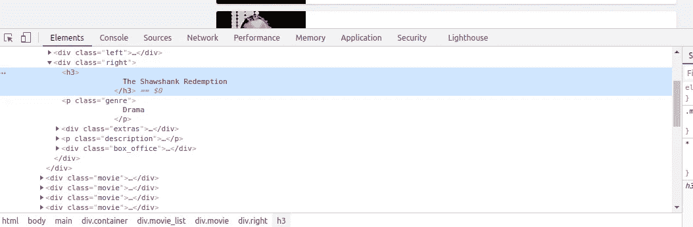

这是 Chrome 开发者工具

*   看，我告诉过你我们正在寻找的`title`在一个叫做`<h3>`的 HTML 元素中:

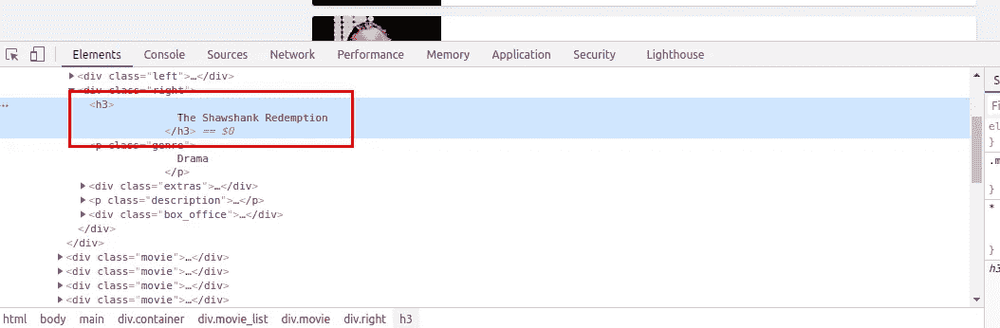

标题数据位于

### 元素内

现在我们知道我们的数据在哪里，让我们刮它。在您键入的最后一行下面键入以下内容:

```
""" first, scraping using find_all() method """
# scrape all the titles
titles = [] 
for h3 in soup.find_all('h3'):
  titles.append(h3.string.strip())
```

下面是对上述代码的逐行解释:

*   我们将在一个名为`titles`的数组中存储我们所有的游戏，这就是我们在第一行中所做的，我们正在创建这个`titles`数组。
*   然后我们在之前创建的`soup`对象中使用`find_all()`方法，找到我们需要的所有`h3`元素。这个`find_all()`方法返回一个可迭代列表。所以我们遍历所有找到的`h3`元素…
*   在最后一行，在`for loop`中，我们取`h3.string`值。为什么是`string`值？因为整体上每个`h3`都会这样`<h3> Title inside </h3>`。但是我们只需要最里面的`string`在里面，对吗？所以我们用`h3.string`。在获取之后，我们`.strip()`移除所有尾随的空白。然后我们把它放到数组中。

喔，里面发生了很多事。所以请花点时间了解一下。这正是我们要从这里开始重复的步骤，以收集所有其他数据。

我们最初使用 HTML `bytes`类型数据创建的`soup`对象为我们提供了如此多的内置方法来轻松导航和抓取 HTML 树。`find_all()`只是其中之一。我们将继续探索其中的一些。

我们将抓取的数据存储在 Python 列表中的原因是，将这些列表转换成 CSV 文件会容易得多，这就是我们这么做的原因。

现在我们已经收集了所有我们需要的东西。现在让我们继续刮所有的`genres`。键入以下代码:

```
# genres
genres = []
for genre in soup.find_all('p', class_='genre'):
  genres.append(genre.string.strip())
```

*   非常相似，但是这次我们用`class_=’genre’`找到了所有的`<p>`元素。`class`是 python 中的保留关键字，所以我们不能使用它，这就是为什么我们在`class`后面加了下划线(`_`)。

剩下的就不言自明了。

现在让我们刮掉所有的`ratings`，但是使用一个不同的方法叫做`select()`:

```
""" scraping using css_selector eg: select('span.class_name') """
# ratings, selecting all span with class="rating"
ratings = []
for rating in soup.select('span.rating'):
  ratings.append(rating.string.strip())
```

*   `select()`方法用于使用 CSS 选择器之类的语法查找所有元素。在这里，我们选择了所有等级为 `span.rating`的`span`。然后我们将它们存储在一个名为`ratings`的 Python 列表中。

现在该做一个小练习了。使用`select()`方法，你必须清除所有的`lengths`(电影运行时间)，和`years`(电影上映的年份)。我可以给你两个提示:

*   每个电影`length`都在一个`span`里面，带有`length` ( `span.length`)。
*   并且每个`year`都在一个带有`year` ( `span.year`)类的`span`内。

代码将与上面的代码非常相似。你只需要改变相应的部分。

如果你做到了，那么恭喜你！确保用下面的解决方案交叉检查你的代码。如果您无法做到这一点，那么没有关系，只需输入以下解决方案。

解决方案是:

```
# lengths, selecting all span with class="length"
lengths = []
for length in soup.select('span.length'):
  lengths.append(length.string.strip())# years, selecting all span with class="year"
years = []
for year in soup.select('span.year'):
  years.append(year.string.strip())
```

*   我认为这里不需要解释。

剩下要刮的是`budgets`、`grosses`和`img_urls`。这里我们将使用古老的好方法:

```
""" scraping by navigating through elements eg: div.span.string """
# budget
budgets = []
for budget in soup.find_all('div', class_='budget'):
  # from <div class="budget"></div>, get the span.string
  budgets.append(budget.span.string.strip())# gross
grosses = []
for gross in soup.find_all('div', class_='gross'):
  grosses.append(gross.span.string.strip()) """ parsing all the "src" attribute's value of  tag """
img_urls = []
for img in soup.find_all('img', class_='poster'):
  img_urls.append(img.get('src').strip())
```

*   这里需要注意的一点是，在最后几行中，我们试图获取 img 的`src`属性。因为 img 的网址就在那里。要访问元素的任何一个`attributes`，我们可以在找到特定元素后使用`.get()`方法。`Beautiful Soup`在将 bytes 类型转换为`BeautifulSoup`类型时，将所有元素的`attributes`存储为一个 Python 字典。这就是为什么我们使用`.get()`方法来访问字典中的值。

就这样，我们成功地搜集到了所有需要的数据。

现在让我们将这些数据导出到一个 CSV 文件中。

# 创建 CSV 文件

为了使用 Python 生成 CSV 文件，我们需要一个名为`csv`的模块。是内置模块，不用安装。你只需要在`scraper.py`文件的最顶端导入它。

所以在最上面输入这个:

```
import csv
```

现在，在文件的最底部，键入以下代码:

```
""" writing data to CSV """# open top25.csv file in "write" mode
with open('top25.csv', 'w') as file:
  # create a "writer" object
  writer = csv.writer(file, delimiter=',') # use "writer" obj to write 
  # you should give a "list"
  writer.writerow(["title", "genre", "ratings", "length", "year", "budget", "gross", "img_url"]) for i in range(25):
    writer.writerow([
      titles[i], 
      genres[i], 
      ratings[i], 
      lengths[i], 
      years[i], 
      budgets[i], 
      grosses[i], 
      img_urls[i]
    ])
```

*   首先，我们以`‘w’`模式打开文件。`‘w’`为写模式。如果没有给定文件名的文件存在，它将创建一个。如果这样的文件存在，那么它将覆盖该文件。这里我们打开/创建一个名为`top25.csv`的新文件。
*   然后我们通过给`file`和逗号`‘,’`作为`delimiter`字符来创建一个`csv.writer()`对象。
*   然后使用那个`writer`对象，我们`write.row()`。我们写的第一行是用于**标题**，你可以把它们想象成表格标题。
*   最后，我们循环 25 次，在每次迭代中，我们**写一行**，这将是一个**单个电影**。每一行都是关于一部电影。

就这样，让我们试着运行我们的脚本。我希望您的终端(在您的代码编辑器中)已经打开，并且您的`venv`是活动的。现在输入这个:

```
python scraper.py
```

如果一切顺利，那么您应该在同一个目录中创建了一个名为`top25.csv`的新文件，它将包含如下数据:


top25.csv

如果您有任何错误，那么请确保您到目前为止在`scraper.py`文件中键入的代码与下面的最终代码完全一样…

# 最终代码

```
import requests
from bs4 import BeautifulSoup
import csv# fetch the web page
page = requests.get('https://the-coding-pie.github.io/top_movies/')# turn page into a BeautifulSoup object
soup = BeautifulSoup(page.content, 'lxml') """ first, scraping using find_all() method """
# scrape all the titles
titles = [] 
for h3 in soup.find_all('h3'):
  titles.append(h3.string.strip())# genres
genres = []
for genre in soup.find_all('p', class_='genre'):
  genres.append(genre.string.strip()) """ scraping using css_selector eg: select('span.class_name') """
# ratings, selecting all span with class="rating"
ratings = []
for rating in soup.select('span.rating'):
  ratings.append(rating.string.strip())# lengths, selecting all span with class="length"
lengths = []
for length in soup.select('span.length'):
  lengths.append(length.string.strip())# years, selecting all span with class="year"
years = []
for year in soup.select('span.year'):
  years.append(year.string.strip()) """ scraping by navigating through elements eg: div.span.string """
# budget
budgets = []
for budget in soup.find_all('div', class_='budget'):
  # from <div class="budget"></div>, get the span.string
  budgets.append(budget.span.string.strip())# gross
grosses = []
for gross in soup.find_all('div', class_='gross'):
  grosses.append(gross.span.string.strip()) """ parsing all the "src" attribute's value of  tag """
img_urls = []
for img in soup.find_all('img', class_='poster'):
  img_urls.append(img.get('src').strip()) """ writing data to CSV """# open top25.csv file in "write" mode
with open('top25.csv', 'w') as file:
  # create a "writer" object
  writer = csv.writer(file, delimiter=',') # use "writer" obj to write 
  # you should give a "list"
  writer.writerow(["title", "genre", "ratings", "length", "year", "budget", "gross", "img_url"]) for i in range(25):
    writer.writerow([
      titles[i], 
      genres[i], 
      ratings[i], 
      lengths[i], 
      years[i], 
      budgets[i], 
      grosses[i], 
      img_urls[i]
    ])
```

# 包扎

我希望你喜欢这个教程。有些地方，我有意跳过了解释部分。因为这些代码简单明了。所以我让你自己去解码。

真正的学习发生在你自己尝试的时候。仅仅跟随教程不会让你成为更好的程序员。你得用你自己的大脑。

如果你仍然有任何错误，首先尝试通过谷歌搜索自己解码。

如果你没有找到任何解决方案，那就在下面评论一下吧。因为你应该知道如何自己找到并解决一个 bug，这是每个程序员都应该具备的技能！

仅此而已，谢谢；)​