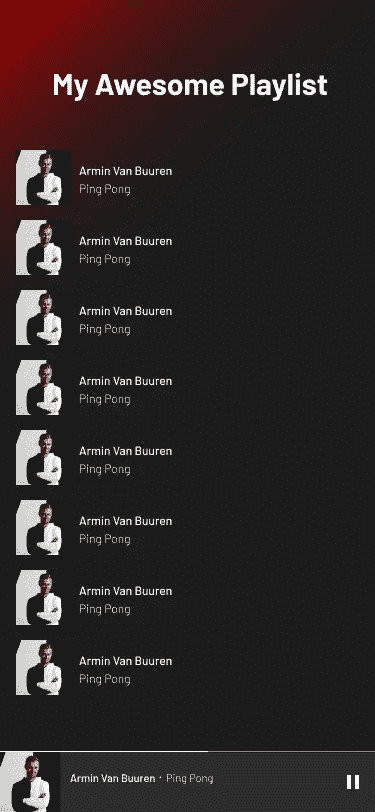
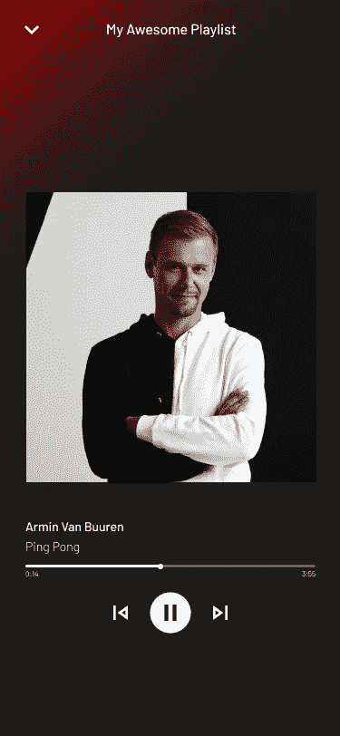
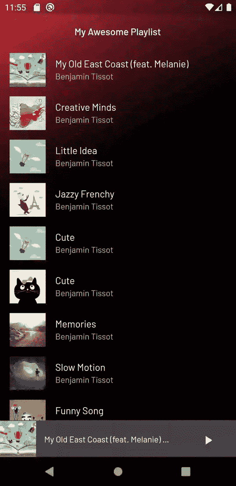

# 让我们用 Flutter 和 Riverpod 创建一个迷你 Spotify

> 原文：<https://itnext.io/lets-create-a-mini-spotify-with-flutter-and-riverpod-24aa53ed8b66?source=collection_archive---------2----------------------->

照片由 [@namroud](https://unsplash.com/@namroud) 拍摄。不溅

又见面了👋，
如果你一直关注我的媒体，你就会知道我是 Flutter 的超级粉丝。在这么短的时间内，我们能用它做的事情真是太神奇了。我最近一直在玩一个新的包 [riverpod](https://pub.dev/packages/riverpod) (此处插入链接)，它是由 [Remi Rousselet](https://medium.com/u/c0530952c459?source=post_page-----24aa53ed8b66--------------------------------) (提供者、 [flutter_hooks](https://pub.dev/packages/flutter_hooks) 和许多其他优秀包的创建者)创建的。所以我想为什么不写一篇文章来展示带有 Flutter 的 [riverpod](https://pub.dev/packages/riverpod) 的用例。所以在今天的文章中，我们将使用 Flutter 和 [riverpod](https://pub.dev/packages/riverpod) 创建一个迷你 Spotify。我们开始吧！

# 第一步-设计:

利用图玛，我为今天的文章制作了一个模型..

主屏幕的模型

播放器屏幕的实体模型

第一个将是主屏幕，在我们的播放列表中的歌曲列表和一个迷你播放器在屏幕底部显示当前播放的歌曲。一旦我们按下它，我们就会进入一个名为 PlayerScreen 的新屏幕。在这个例子中，我们可以看到关于当前正在播放的歌曲的所有信息，以及控件(比如播放/暂停、向后跳、下一个跳……)。

我们将首先开始设计具有冷渐变效果的背景。就我而言，我选择了红色，但你可以选择任何你喜欢的颜色。

渐变背景

颤动中的代码:

带有渐变背景的主页

我们要创建的第二个元素是播放列表中的歌曲列表。这将是一个简单的任务，因为 Flutter 已经有了一个名为 ListTile 的小部件。

播放列表中歌曲列表的 AudioTrackTile

接下来，我们将创建一个迷你播放器，它将出现在我们应用程序的底部，显示当前播放歌曲的基本信息和基本控制。结果应该是这样的:

迷你播放器部件

要在颤振中做到这一点:

迷你播放器部件

一些解释:迷你播放器的布局有点像代码中看到的行和列的组合。为了获得与 Spotify 的迷你播放器中相同的滑块，我们需要创建一个自定义的轨道形状，这可以通过扩展类 RoundedRectSliderTrackShape 来完成，我们还必须使用白色作为活动轨道的颜色，白色作为不活动轨道的 30%不透明度。

转到我们的应用程序的播放器屏幕，我们想要获得的结果显示在上面的模型中。为了实现这一点，在 Flutter 中，我们将使用这段代码将屏幕分成三个部分。第一部分是当前播放歌曲的图像，第二部分是艺术家姓名和歌曲名称，第三部分是音频播放器控件。对于播放器控件，我们将创建它的小部件，这样我们就不会有很多嵌套的列和行。

我们完成了设计。剩下要做的下一步是使用 riverpod 挂接所有内容。

# 第二步—状态管理:

Flutter 的状态管理可能相当麻烦，尤其是对新开发人员而言。你有 BLoC，Mobx，Provider(结合 ChangeNotifier 或者其他解决方案)，还有很多其他的，每个人都有它的优缺点。其中应用比较广泛的是 Provider，这是 Remi 改进 InheritedWidget 的解决方案。尽管 Provider 很好，但它也有其局限性(尤其是它基于 InheritedWidget 这一事实)。因此，为了在不破坏现有解决方案的情况下进行改进，Remi 重新设计了 Provider，并创建了一个名为 Riverpod 的新库。

你可以在这里了解更多: [riverpod 官方文档](http://www.riverpod.dev)

事不宜迟，让我们在应用程序中实现它。

我们要做的第一件事是在我们的应用程序的 pubspec.yaml 中添加 riverpod 的依赖关系。riverpod 是一个独立的 dart 包，这意味着它可以在 Flutter 之外使用，但由于我们现在将它与 Flutter 一起使用，所以我们将使用 flutter_riverpod。我们将需要一个音频播放器，因此对于包 asset_audio_player。

提供者和 flutter_provider 依赖关系

一旦我们完成了所有这些，我们将创建一个 AudioTrackModel 模型。这个对象将包含我们将在应用程序中使用的音轨的基本信息。

我们需要创建的第二件事是我们将在应用程序中使用的提供者。第一个提供者将是我们播放列表的提供者，该列表将由 [BenSound](https://www.bensound.com/) 提供的一些歌曲填充:

播放列表提供商

注意，由于我们的播放列表没有改变，我们将只使用一个提供者。但是，如果您想要在数据发生变化时使用数据，您可能会希望查看 StateProvider 或 StateNotifierProvider 之类的内容。

要在我们的应用程序中使用这些提供者，我们需要用 ProviderScope 小部件包装我们的 MaterialApp:

使用 ProviderScope 封装应用程序的根

我们要创建的第二个提供者是 AssetAudioPlayer。这将允许我们从应用程序的任何地方访问我们的音频播放器，并执行播放/暂停、下一个等操作

音频播放器提供商

## Riverpod 的魔力:

Riverpod 的神奇之处在于它不需要 BuildContext 来访问提供者，相反，我们可以使用 [ProivderReference](https://pub.dev/documentation/riverpod/latest/all/ProviderReference-class.html) 来读取或观察它们。这意味着我们现在可以从 Flutter 的小部件树之外的其他提供者创建计算状态。

例如:在我们的应用程序中，我们需要当前播放歌曲的状态。该状态包含诸如 AudioTrackModel 对象的名称、缩略图和其他字段的信息。我们可以通过简单地读取音频播放器提供程序的状态来访问该状态，获取当前播放歌曲的索引，并使用该索引从播放列表提供程序获取关于当前播放歌曲的信息。

要使用提供者，我们所要做的就是简单地扩展 ConsumerWidget。这个小部件有一个 ScopedReader 类型的特殊参数，它监视我们的提供者中的变化，并相应地重新构建我们的小部件。

在我们的应用程序中，我们将利用这一点，使用相同的小部件(大小不同)来显示当前播放歌曲的缩略图。为此，代码如下:

当前正在使用 ConsumerWidget 播放缩略图消费提供程序

要使用提供者，我们也可以使用消费者小部件来构建依赖于提供者的小部件。例如，在我们的例子中，如果我们想创建一个文本来跟踪当前播放的当前位置，而不必创建一个独立的小部件，我们这样做:

在不扩展 ConsumerWidget 的情况下使用提供者

决赛成绩

你可以在这里查看完整的代码:

 [## yiss/minispotify _ flutter _ river pod

### 一个新的颤振项目。这个项目是颤振应用的起点。一些帮助您入门的资源…

github.com](https://github.com/yiss/minispotify_flutter_riverpod) 

**最后的想法:**

虽然 riverpod 是一个新的软件包，但它已经显示出了很大的前景。我很快就被它的简单明了所吸引。
我将针对 riverpod 可以节省时间的不同用例发布更多实践文章，尤其是在导航方面。下篇见，感谢阅读！