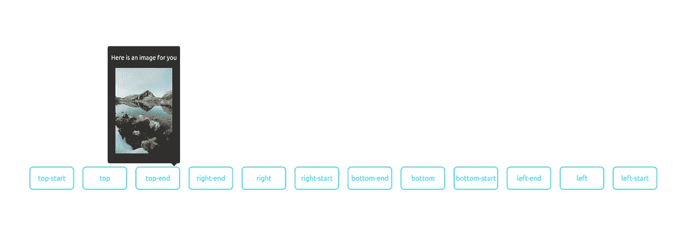

# 让我们用 React 钩子创建一个工具提示

> 原文：<https://itnext.io/lets-create-a-tooltip-with-react-hooks-48d12cf06241?source=collection_archive---------1----------------------->

我最近写了关于 React 中的 [DIY 弹出元素。让我们利用这些知识，使用功能组件和 React 挂钩来创建一个可重用的 React 工具提示。](/diy-react-popups-with-popper-js-2-c76ff6b7fc5d)

让我们从创建一个简单的钩子开始，它将允许我们切换元素的可见性。

如您所见，在本例中，我们导出了一个可以切换元素状态的事件处理程序。

让我们更进一步，实例化一个新的 popper 实例并导出必要的引用。

我们现在使用 React 效果在组件挂载和卸载时创建和销毁 popper 实例。我们将 popup 实例存储在我们的状态中，并在需要时执行更新。

让我们添加一些样式和更多的事件处理程序来切换鼠标和焦点事件上的弹出窗口。

现在，让我们将工具提示逻辑提取到一个可以多次重用的独立组件中:

就是这样。现在，您已经拥有了一个可以在应用程序中任意位置重用的工具提示组件。