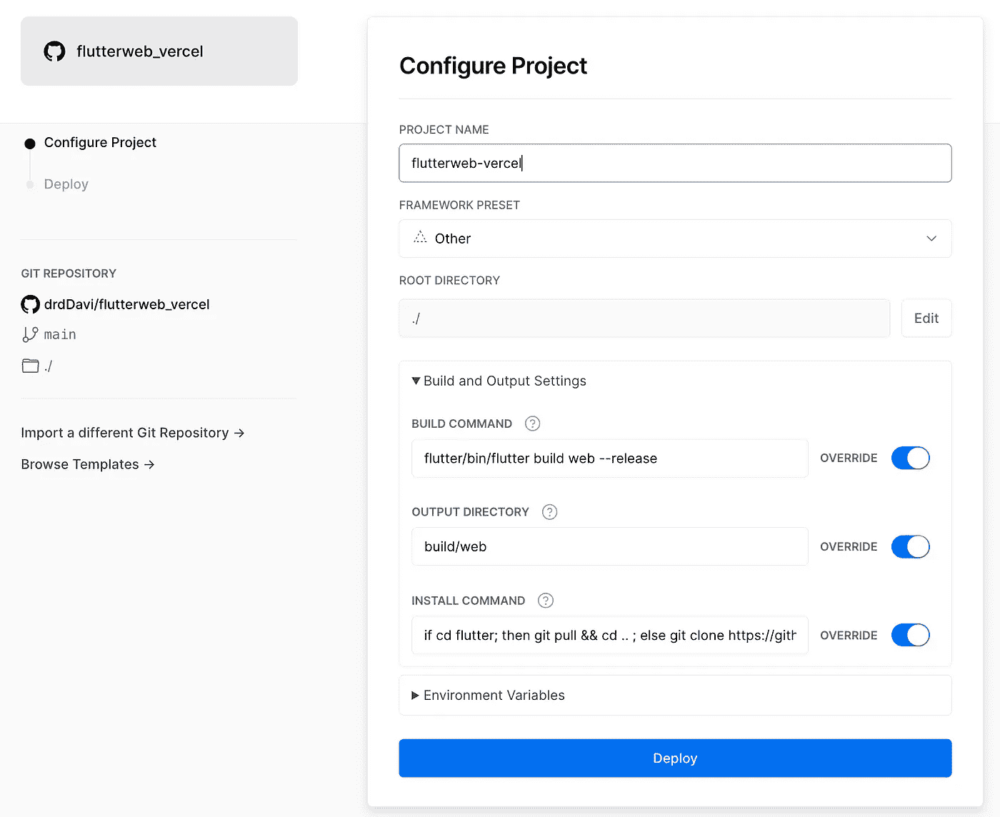
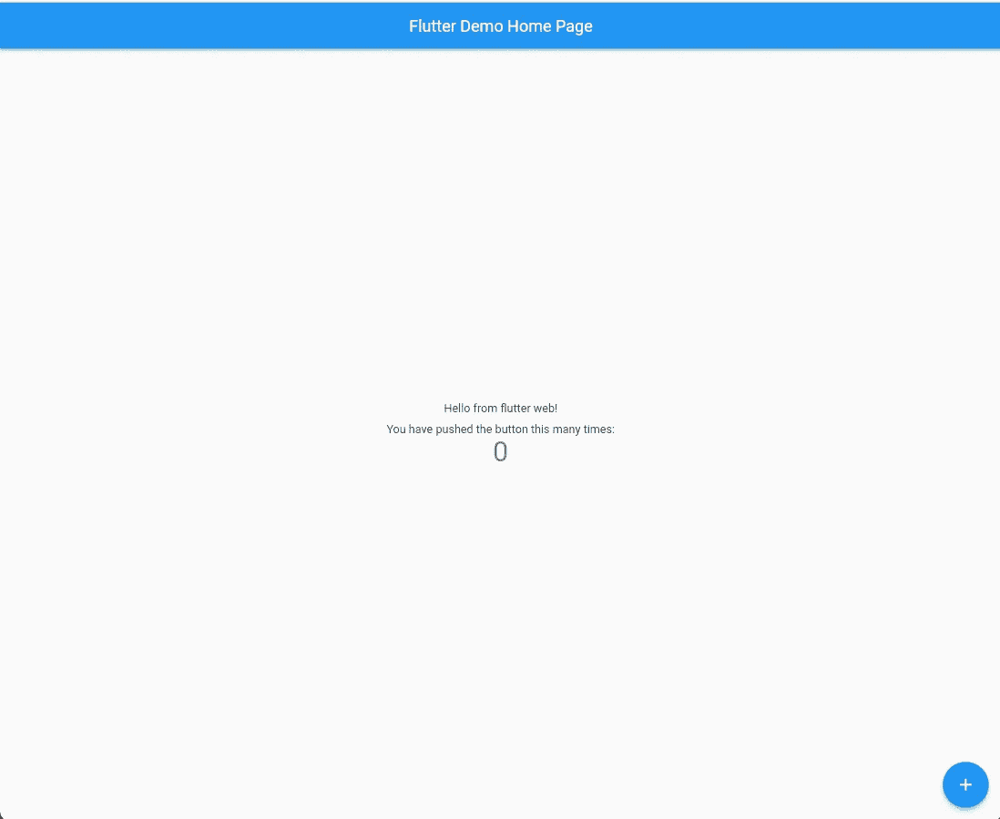

# 让我们将 Flutter-web 部署到 Vercel

> 原文：<https://itnext.io/lets-deploy-flutter-web-to-vercel-2302a94d13be?source=collection_archive---------3----------------------->


Flutter SDK 允许您开发几乎可以部署在任何地方的跨平台应用程序...由于 SDK 的强大功能，您可以“一次编写，随处部署”!

今天，我们将使用 Vercel 将 starter 应用程序部署到 web 上。

**要求**

1.  韦尔塞尔账户
2.  Github 帐户
3.  颤振的基本工作知识:)

# 步骤—

**步骤 1 —** 在 GitHub 上创建一个名为 **flutter_web_vercel** 的新项目

**步骤 2** —创建一个新的 flutter 项目，并将其部署到步骤 1 中的 repo。

```
flutter create flutter_web_vercel
```

**步骤 3** —创建一个新的 Vercel 项目 **flutter_web_vercel**

为了成功部署项目，我们需要对构建脚本进行一些修改。看看下面的截图。



构建命令

```
flutter/bin/flutter build web --release
```

输出目录

```
build/web
```

安装命令

```
if cd flutter; then git pull && cd .. ; else git clone https://github.com/flutter/flutter.git; fi && ls && flutter/bin/flutter doctor && flutter/bin/flutter clean && flutter/bin/flutter config --enable-web
```

现在，拿一杯咖啡，你就大功告成了！

[**工作演示**](https://flutterweb-vercel.vercel.app/#/)



# **结论**

用 Vercel 将你的 Flutter 项目部署到 web 上很容易，不到 5 分钟就可以完成。


# 如果这有帮助的话:请给我一个掌声，它让我保持动力😀

⥅跟着我上[媒](https://medium.com/@drdDavi)

⥅在推特上关注我。

📢在社交媒体上分享。