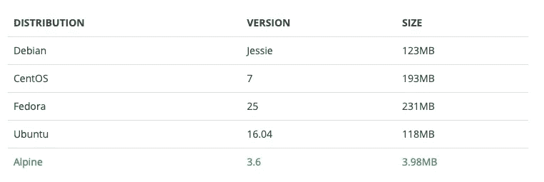

# 让我们对 Nodejs Express API 进行 Dockerize

> 原文：<https://itnext.io/lets-dockerize-a-nodejs-express-api-22700b4105e4?source=collection_archive---------0----------------------->

## 从 Hello World 到持续发展。


## NodeJS Hello World！

首先，让我们创建一个包含简单 GET route 的最小 nodejs api。对于这个例子，我将使用 expressjs，这是一个流行的 nodejs 框架。

1.  初始化新的 npm 项目

```
npm init
```

2.创建所需的文件

```
touch .gitignore
touch .dockerignore
touch server.js
```

3.忽略你的。使用**意外提交到 git 的 env 和 secrets。gitignore** 同样，使用。阻止文件打包成 docker 镜像。

4.让我们使用 expressjs 创建一个简单的服务器。为此，我们将需要以下软件包

```
npm install --save express cors body-parser @rama41222/node-logger
```

6.为了持续开发，您将需要 nodemon。将 nodemon 作为开发依赖项安装。

```
npm install --save-dev nodemon
```

5.安装完这些包之后，创建 server.js，如下所示。

server.js

6.转到 package.json，在脚本下创建以下命令

```
"scripts": {
  "start": "node server.js",
  "dev": "nodemon server.js"
}
```

7.让我们运行它

```
npm run dev
```

8.如果您的 api 运行良好，您应该会看到下面的日志。

```
*2019–03–27 00:25:56 info: sample-express-app running on 0.0.0.0:3000*
```

我们几乎完成了 nodejs 编码。现在让我们进入 docker。

## Docker 文件

1.  首先创建一个 **Dockerfile** 和一个 **docker-compose.yml** 来使用 docker 运行 nodejs api。

```
touch Dockerfile
touch docker-compose.yml
```

2.让我们创建 Dockerfile 和 docker-compose.yml，如下所示

docker-compse.yml 和 Dockerfile

## 让我们快速浏览一下 Dockerfile 文件

所以在 docker 文件中，我们使用的是 **alpine** 图像，因为它非常简单、重量轻且更安全。Alpine Linux 基于 *musl libc* 和 *busybox。*



**alpine** linux 图像大小

```
**FROM** node:11-alpine
```

[运行](https://docs.docker.com/engine/reference/builder/#run)是一个映像构建步骤，容器的状态在一个`RUN`命令后将被提交到 docker 映像中。一个 docker 文件可以有许多`RUN`步骤，这些步骤层层叠加来构建图像。

```
**RUN** mkdir **-**p **/**usr**/**src**/**app
```

然后，我们通过下面的命令设置默认的工作目录

```
**WORKDIR /**usr**/**src**/**app
```

将所有文件复制到映像

```
**COPY** . .
```

安装软件包

```
**RUN** npm install
```

现在，我们必须向外界公开 API 运行端口，以便接收请求。

```
**EXPOSE** 3000
```

[CMD](https://docs.docker.com/engine/reference/builder/#cmd) 是启动构建映像时容器默认执行的命令。一个 Dockerfile 只能有一个`CMD`。使用`docker run $image $other_command`启动集装箱时，可以覆盖`CMD`。

[入口点](https://docs.docker.com/engine/reference/builder/#entrypoint)也与`CMD`密切相关，可以修改容器启动图像的方式

```
**CMD** ["npm", "run", "start"]
```

## 让我们使用 docker 运行 API

1.  让我们建立 docker 图像

```
docker-compose build
```

2.让我们运行容器。

```
docker-compose up
```

3.让我们在后台运行上面的命令

```
docker-compose up -d
```

看看下面的命令。它们非常有用

```
docker-compose stop
docker-compose start
docker-compose run <custom service>
```

*   当你在后台运行 docker 容器时，如果你想查看控制台输出，使用下面的命令。

```
docker logs $(sudo docker ps -aq --filter name=<>
```

*   ***为现场控制台输出***

```
docker logs -f <CONTAINER>
```

# 使用 Nodemon 动态更改运行容器的内容。

为此，我们需要实现一个叫做卷映射的东西，为此，您必须使用 docker-compose 来映射卷。

将卷映射添加到 docker-compose.yml 中

现在，如果我们在本地机器上更改一个文件，它也必须反映在 docker 容器上。这是因为我们正在映射卷。

```
volumes:
 hostDir:WorkDir
```

现在试着在 server.js 文件中做些改变，并检查您的 server.js 是否重新启动。如果到目前为止您一直在学习本教程，它应该还没有重启服务器，因为我们没有在 Dockerfile CMD 中使用 nodemon。现在就用吧。

```
**CMD** ["npm", "run", "dev"]
```

改了这个之后。使用 docker compose 构建映像，然后运行它。

```
docker-compose down
docker-compose build
docker-compose up
```

现在更改 server.js 文件并检查服务器是否重新启动。因此，如果它正在重新启动，你已经成功地完成了本教程。

所以使用这种方法，我们也可以使用 docker 进行持续开发。我在 github 上创建了一个资源库。你可以参考一下。

终于！！！！去集装箱！！！。再见。