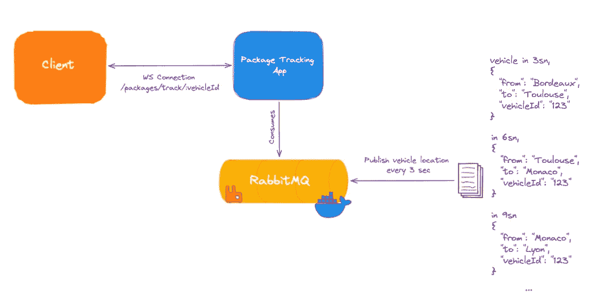
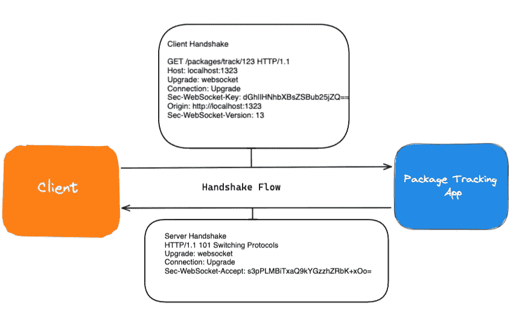
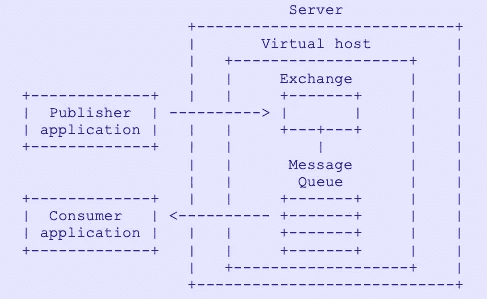
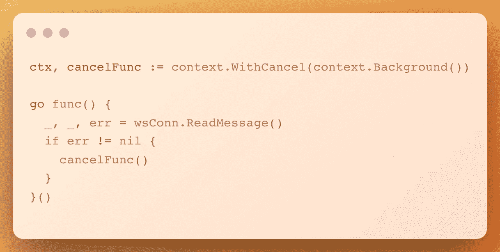
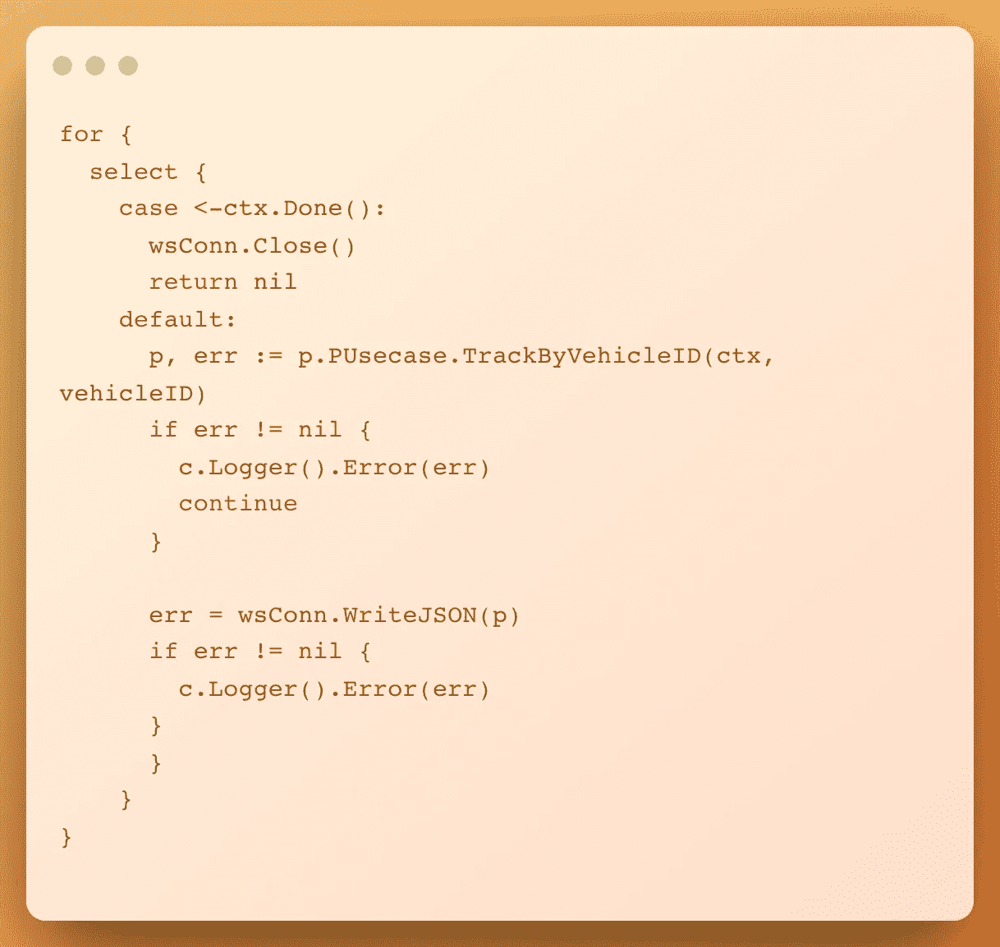
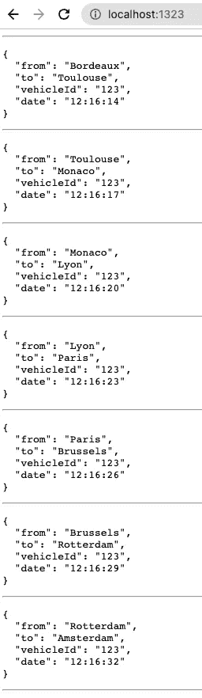

# 让我们用 RabbitMQ 和使用 Go 的 Web socket 实现一个实时包裹跟踪 app🚀

> 原文：<https://itnext.io/lets-implement-a-real-time-package-tracking-app-with-rabbitmq-and-web-socket-using-go-80f5a5ca5c55?source=collection_archive---------3----------------------->

## 这是什么 app？

此应用程序使用车辆信息提供实时包裹位置信息，因为车辆会运送包裹。这样它就能回答我的包裹现在在哪里，它要去哪里？(*目前我还没有在 WebSocket 上实现广播。你可以想到沟通 1-1)*

## 应用架构

整体架构

*   [RabbitMQ](https://www.rabbitmq.com/documentation.htmlü) 与 [docker-compose](https://docs.docker.com/compose/)
*   [Websocket](http://github.com/gorilla/websocket) 带[回显框架](https://echo.labstack.com/)
*   基于[这个干净的架构模板](https://github.com/bxcodec/go-clean-arch)

## 源代码

[https://github.com/Abdulsametileri/package-tracking-app](https://github.com/Abdulsametileri/package-tracking-app)

## Websocket

关于 WebSocket 的资料有很多，但是我强烈推荐你阅读 [WebSocket 的 RFC 文档](https://datatracker.ietf.org/doc/html/rfc6455)。

该协议有两个部分:握手和数据传输。

握手流程

一旦客户端和服务器都发送了它们的握手，并且如果握手成功，那么数据传输部分开始。这是一个双向通信通道，每一方都可以独立于另一方随意发送数据。

# 兔子 q

我认为 RabbitMQ 文档非常优秀。我建议你学习一些基本的概念，比如排队、交换等。)通过跟随他们的教程和阅读 [AMQP 协议规范](https://www.rabbitmq.com/protocol.html)。

AMQ 主要实体

# Websocket 处理程序

`upgrader.Upgrade`将 HTTP 服务器连接升级到 WebSocket 协议。它检查握手过程；例如，它检查请求头是否正确，如`upgrade=Websocket`和`connection=Upgrade`是否相等。

处理 WebSocket 关闭状态

为了处理 WebSocket 关闭握手，当客户端导航到另一个页面时，我使用了`wsConn.ReadMessage()`，或者类似于`ReadMessage()` 返回一个非零错误。当错误不为零时，我调用[上下文的取消](https://www.sohamkamani.com/golang/context-cancellation-and-values/)函数。这样做时，上下文的 done 通道被关闭，因此我们可以关闭底层的 TCP 连接并从我们的处理程序返回它，如下面第一个 select 案例所示。

处理 WebSocket 状态

在 select 语句默认状态下，我们可以监听我们的`package_status`队列；当新的包状态到达时，我们可以将它的信息传递给 WebSocket。注:`p.PUseCase.TrackByVehicleID(ctx, vehicleID)`该方法基于`<-chan amqp.Delivery`。当新消息进入我们的队列时，我们从这个通道获得包信息。

# 包用例

在我们的用例中，没有特定的规则。因此，我们可以从 RabbitMQ 客户端获取字节消息，并编组我们的包结构格式。

# RabbitMQ 客户端

我打开了一个 TCP 连接和其中的一个通道(虚拟 AMQP 连接)。*通道是全双工的，这意味着一个通道可以用于发布和消费消息。*

我用声明关键字*配置队列——如果不存在就创建，否则继续——*并在其上注册消费者变更。

我在`(c *rabbitmqClient) ConsumeByVehicleID`方法中持续倾听。我使用`message_id`属性来区分消息。

注意:我在 main 方法上使用`(c *rabbitmqClient) Publish`方法只是为了测试目的。

# 把它们放在一起

当我们运行应用程序时，我们每 3 秒钟就会看到包的位置。

运行应用程序

# 源代码

[https://github.com/Abdulsametileri/package-tracking-app](https://github.com/Abdulsametileri/package-tracking-app)

# 参考

[我的 RabbitMQ 笔记](https://github.com/Abdulsametileri/package-tracking-app/blob/master/assets/1x.png)

[https://datatracker.ietf.org/doc/html/rfc6455](https://datatracker.ietf.org/doc/html/rfc6455)

[https://www.rabbitmq.com/protocol.html](https://www.rabbitmq.com/protocol.html)

[https://www . sohamkamani . com/golang/context-cancellation-and-values/](https://www.sohamkamani.com/golang/context-cancellation-and-values/)

[https://www . Amazon . com/rabbit MQ-Essentials-distributed-scalable-applications/DP/1789131669](https://www.amazon.com/RabbitMQ-Essentials-distributed-scalable-applications/dp/1789131669)