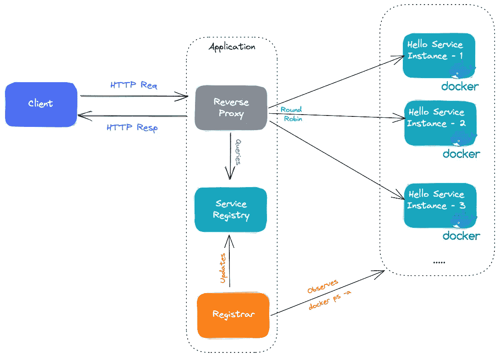

# 让我们使用 Go 实现基本的服务发现🚀

> 原文：<https://itnext.io/lets-implement-basic-service-discovery-using-go-d91c513883f6?source=collection_archive---------0----------------------->

正如我们已经知道的，要请求一个服务实例(服务器)，我们必须知道它的网络位置(IP 地址和端口)。

随着当今世界微服务的突破，越来越多的用户、请求、需求使得这项工作变得非常困难。此外，在基于云的微服务时代，由于各种情况，如[自动伸缩](https://en.wikipedia.org/wiki/Autoscaling)，故障和升级，我们的服务也在不断变化。由于这些变化，他们不断获得新的知识产权。

这就是[服务发现进入微服务场景](https://www.nginx.com/blog/service-discovery-in-a-microservices-architecture/)的地方。我们需要一个系统来监视所有服务，并跟踪在任何给定时间哪个服务部署在哪个 IP/端口组合上，以便微服务的客户端可以相应地无缝路由。[【1】](https://www.amazon.com/Microservice-Architecture-Aligning-Principles-Practices/dp/1491956259)

服务发现在概念上非常简单:它的重要组件是服务注册中心，它是应用程序服务实例的网络位置的数据库。[【2】](https://www.amazon.com/Microservices-Patterns-examples-Chris-Richardson/dp/1617294543)该机制在服务实例启动和停止时更新服务注册表。

实现服务发现有两种主要方式:

*   首先，服务及其客户端直接与服务注册中心交互。
*   部署基础设施 [(k8s 等。)处理服务发现](https://iximiuz.com/en/posts/service-discovery-in-kubernetes/)。

我们将使用第三方注册模式来实现我们的服务发现。由于这种模式，不是服务向服务注册中心注册，而是第三方注册(在我们的例子中，非常基本的 go 函数以特定的时间间隔运行`docker ps -a`)。

图:项目架构概述

让我们更详细地回顾一下我们的应用程序。

# 反向代理

为了实现[反向代理](https://www.cloudflare.com/learning/cdn/glossary/reverse-proxy/#:~:text=A%20reverse%20proxy%20is%20a,security%2C%20performance%2C%20and%20reliability.)，我使用了 [httputil 包](https://pkg.go.dev/net/http/httputil#ReverseProxy)——我实现它的主要目的是提供[负载平衡](https://www.nginx.com/resources/glossary/load-balancing/)。

为了以[循环方式](https://en.wikipedia.org/wiki/Round-robin_tournament)实现客户端请求路由，我做了基本的数学计算，计算获取请求的数量，并对服务注册列表的长度做了一个模块化操作，这样我就可以轻松地找到后端并代理请求。

# 登记员

我用了[时间。勾选](https://www.geeksforgeeks.org/time-tick-function-in-golang-with-examples/)表示在特定时间间隔(默认为 3 秒)之间执行轮询。在每一个节拍，代码使用官方 docker go SDK[运行`docker ps -a`。*(我使用了-a，因为我需要知道哪些容器是 downstate 如果是这样，我从我们的服务注册列表中删除不健康的容器 IP 和端口)。*如果一个新的容器被添加并处于运行状态，检查它是否已经存在于服务注册表中；否则，将其地址添加到服务注册表中。](https://pkg.go.dev/github.com/docker/docker/client)

# 服务注册中心

这是一个非常基本的结构片，由于有了`[sync.RWMutex](https://pkg.go.dev/sync#RWMutex)`，它具有并发访问的安全性，如上所述，它保存了所有健康的后端地址列表。该列表由注册商每 3 秒更新一次。

# 反馈:

## 1-使用 Docker 事件 API 代替时间池来观察容器:

我使用基本的时间池(每 3 秒一次)来跟踪新启动的或死亡的容器。通过这样做，我可以保持我的服务注册是最新的。

根据收到的反馈，最好使用`docker events api`来达到这个目的。多亏了这个 API，我可以从 docker 服务器获得实时更新。

我是这样实现的。([提交](https://github.com/Abdulsametileri/simple-service-discovery/commit/5556fce20c9b9206848a65a421bda13fdcf2089d))

`Init() error`一次性获得初始运行容器的方法。

在`Observe()`方法中，我使用特殊的过滤器来观察事件，比如图像名称等。

我用 docker API 客户端返回的通道监听事件；当一个新事件到来时，我可以根据它的有效负载更新服务注册中心。

## 2-使用原子。值而不是同步。互斥（体）…

我使用`sync.Mutex`来控制服务注册中心的读写。但是当然，使用它也有不好的一面。它在服务注册中心变化期间阻止新的代理连接。

根据另一个反馈，*“一个高级的技巧是使用* `[sync/atomic.Value](https://pkg.go.dev/sync/atomic#Value)` *，构造一个新的查找表(写时复制是可以的)，然后消费者可以在任何时候加载那个值，作为一个不可变的查找快照，就像他们加载的那一刻一样。”*

我如下重构了我的服务注册中心。([提交](https://github.com/Abdulsametileri/simple-service-discovery/commit/6bccef2bd0156f123af907aecb8923e349f0d710))

# 源代码

[https://github.com/Abdulsametileri/simple-service-discovery](https://github.com/Abdulsametileri/simple-service-discovery)

# 参考

[1]微服务架构符合原则、实践和文化

[2]Java 中的微服务模式示例