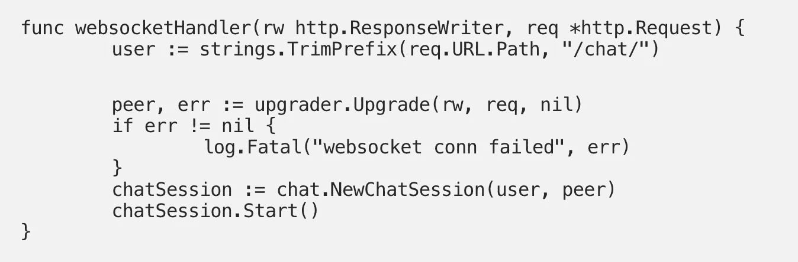

# 让我们学习如何用 Redis、WebSocket 和 Go 构建一个聊天应用程序

> 原文：<https://itnext.io/lets-learn-how-to-to-build-a-chat-application-with-redis-websocket-and-go-7995b5c7b5e5?source=collection_archive---------1----------------------->



`[WebSocket](https://tools.ietf.org/html/rfc6455)`协议提供了一个双向(服务器和客户端都可以交换消息)和全双工(服务器或客户端可以同时发送消息)的通信通道，这使得它适用于实时场景，如聊天应用等。连接的聊天用户(客户端)可以向应用程序(`WebSocket`服务器)发送消息，并且可以相互交换消息——类似于点对点设置。

在这篇博客中，我们将探索如何使用`WebSocket`和`[Go](https://golang.org/)`构建一个简单的聊天应用程序。这个解决方案也将利用`[Redis](http://redis.io/)`(不久将有更多相关内容)。

> *后续博客文章(第 2 部分)将演示如何将该应用程序部署到*[*Azure App Service*](https://docs.microsoft.com/azure/app-service/?WT.mc_id=medium-blog-abhishgu)*，该服务将使用* [*虚拟网络*](https://docs.microsoft.com/azure/virtual-network/virtual-networks-overview?WT.mc_id=medium-blog-abhishgu) *集成*与 Azure Redis 缓存进行通信

您将了解到:

*   Redis 数据结构——这个应用程序使用`[SET](https://redis.io/commands#set)`和`[PUBSUB](https://redis.io/commands#pubsub)`
*   使用`[go-redis](https://github.com/go-redis/redis)`客户端与 Redis 交互
*   `[gorilla WebSocket](https://github.com/gorilla/websocket)`库，它提供了 WebSocket 协议的完整且经过测试的实现
*   [Azure Cache for Redis](https://docs.microsoft.com/azure/azure-cache-for-redis/cache-overview?WT.mc_id=medium-blog-abhishgu) 这是云中的托管 Redis 产品

# 为什么是 Redis？

让我们考虑一个聊天应用程序。当用户第一次连接时，在应用程序(`WebSocket`服务器)中会创建一个相应的`WebSocket`连接，它与特定的应用程序实例相关联。这种`WebSocket`连接使我们能够在用户之间广播聊天信息。我们可以通过运行多个实例来扩展我们的应用程序(例如，考虑到大量用户)。现在，如果有新用户加入，他们可能会连接到新的实例。因此我们有一个场景，其中不同的用户(因此他们各自的`WebSocket`连接)与不同的实例相关联。结果，他们将无法相互交换消息——这是不可接受的，即使对于我们的玩具聊天应用程序也是如此😉

[Redis](https://redis.io/) 是一个通用的键值，支持多种[丰富的数据结构](https://redis.io/commands/)，如`List`、`Set`、`Sorted Set`、`Hash`等。其中一个特性还包括一个`PubSub`功能，利用这个功能，发布者可以向 Redis 通道发送消息，订阅者可以在这些通道上监听消息——两者都是完全独立的，彼此之间是解耦的。这可以用来解决我们的问题。现在，我们可以使用每个聊天应用程序都可以订阅的 Redis `channel`，而不是仅仅依赖于`WebSocket`连接。因此，发送到`WebSocket`连接的消息现在可以通过 Redis 通道传输，以确保所有的应用程序实例(以及相关的聊天用户)都能接收到它们。

在下一节深入研究代码时，我们将对此进行更多的讨论。Github 上有

> 请注意，除了普通的`WebSocket`，您还可以使用诸如 [Azure SignalR](https://docs.microsoft.com/azure/azure-signalr/signalr-overview?WT.mc_id=medium-blog-abhishgu) 之类的技术，这些技术允许应用程序将内容更新推送到连接的客户端，例如单页面 web 或移动应用程序。因此，更新客户端时无需轮询服务器或提交新的 HTTP 更新请求

为了跟进并将该解决方案部署到 Azure，您将需要一个 [Microsoft Azure](https://docs.microsoft.com/azure/cosmos-db/create-cosmosdb-resources-portal?WT.mc_id=medium-blog-abhishgu) 帐户。[还没有的可以免费抢一个](https://azure.microsoft.com/free/?WT.mc_id=medium-blog-abhishgu)！

# 聊天应用程序概述

是时候进行一次快速代码演练了。下面是应用程序结构:

```
.
├── Dockerfile
├── chat
│   ├── chat-session.go
│   └── redis.go
├── go.mod
├── go.sum
├── main.go
```

在`main.go`中，我们[注册我们的](https://golang.org/pkg/net/http/#Handle) `[WebSocket](https://golang.org/pkg/net/http/#Handle)` [处理程序](https://golang.org/pkg/net/http/#Handle)和[启动 web 服务器](https://golang.org/pkg/net/http/#ListenAndServe)——所有使用的都是普通的`net/http`包

```
http.Handle("/chat/", http.HandlerFunc(websocketHandler))
	server := http.Server{Addr: ":" + port, Handler: nil}
	go func() {
		err := server.ListenAndServe()
		if err != nil && err != http.ErrServerClosed {
			log.Fatal("failed to start server", err)
		}
	}()
```

`WebSocket`处理程序处理聊天用户(只不过是`WebSocket`客户)并开始一个新的聊天会话。

```
func websocketHandler(rw http.ResponseWriter, req *http.Request) {
	user := strings.TrimPrefix(req.URL.Path, "/chat/") peer, err := upgrader.Upgrade(rw, req, nil)
	if err != nil {
		log.Fatal("websocket conn failed", err)
	}
	chatSession := chat.NewChatSession(user, peer)
	chatSession.Start()
}
```

一个`ChatSession`(`chat/chat-session.go`的一部分)代表一个用户及其对应的`WebSocket`连接(在服务器端)

```
type ChatSession struct {
	user string
	peer *websocket.Conn
}
```

当一个会话开始时，它启动一个`goroutine`来接受来自刚刚加入聊天的用户的消息。它通过在一个`for`循环中调用`[ReadMessage()](https://godoc.org/github.com/gorilla/websocket#Conn.ReadMessage)` [(从](https://godoc.org/github.com/gorilla/websocket#Conn.ReadMessage) `[websocket.Conn](https://godoc.org/github.com/gorilla/websocket#Conn.ReadMessage)` [)](https://godoc.org/github.com/gorilla/websocket#Conn.ReadMessage) 来实现。如果用户断开连接(`WebSocket`连接关闭)或应用程序关闭(例如，使用`ctrl+c`)，此操作将执行`exits`。总而言之，每个用户都有一个单独的 goroutine 来处理聊天消息。

```
func (s *ChatSession) Start() {
...
	go func() {
		for {
			_, msg, err := s.peer.ReadMessage()
			if err != nil {
				_, ok := err.(*websocket.CloseError)
				if ok {
					s.disconnect()
				}
				return
			}
			SendToChannel(fmt.Sprintf(chat, s.user, string(msg)))
		}
	}()
```

一旦收到来自用户的消息(通过`WebSocket`连接)，它就使用`SendToChannel`功能广播给其他用户，该功能是`chat/redis.go`的一部分。它所做的就是将消息发布到 Redis `pubsub`通道

```
func SendToChannel(msg string) {
	err := client.Publish(channel, msg).Err()
	if err != nil {
		log.Println("could not publish to channel", err)
	}
}
```

重要的部分是等式中的`sub`(订户)部分。与每个连接的聊天用户都有一个专用 goroutine 的情况相反，我们使用一个`single` goroutine(在应用程序范围内)来订阅 Redis 通道，接收消息并将其广播给使用各自服务器端`WebSocket`连接的*所有*用户。

```
func startSubscriber() {
	go func() {
		sub = client.Subscribe(channel)
		messages := sub.Channel()
		for message := range messages {
			from := strings.Split(message.Payload, ":")[0]
			for user, peer := range Peers {
				if from != user {
					peer.WriteMessage(websocket.TextMessage, []byte(message.Payload))
				}
			}
		}
	}()
}
```

> *当应用实例关闭时，订阅结束——这又终止了通道* `*for-range*` *循环，并且 goroutine 退出*

从`redis.go`中的`init()`函数调用`startSubscriber`函数。`init()`功能从连接 Redis 开始，如果连接失败，应用程序退出。

好吧！是时候设置一个 Redis 实例了，我们可以将聊天后端连接到这个实例。让我们在云端创建一个 Redis 服务器！

# Azure Redis 缓存设置

Azure Cache for Redis 提供对托管在 Azure 中的安全专用 Redis 缓存的访问，Azure 内外的任何应用程序都可以访问该缓存。

出于这篇博客的目的，我们将设置一个带有`Basic`层的 Azure Redis 缓存，这是一个非常适合开发/测试和非关键工作负载的单节点缓存。请注意，您还可以从`Standard`和`Premium`层中选择[提供不同的特性，包括持久性、集群、地理复制等](https://docs.microsoft.com/azure/azure-cache-for-redis/cache-overview?WT.mc_id=medium-blog-abhishgu#feature-comparison)。

我将使用 [Azure CLI](https://docs.microsoft.com/cli/azure/install-azure-cli?view=azure-cli-latest&WT.mc_id=medium-blog-abhishgu) 进行安装。如果你是浏览器人也可以用 [Azure 云壳](https://docs.microsoft.com/azure/cloud-shell/overview?WT.mc_id=medium-blog-abhishgu)！

为了快速设置 Azure Redis 缓存实例，我们可以使用`[az redis create](https://docs.microsoft.com/cli/azure/redis?view=azure-cli-latest&WT.mc_id=medium-blog-abhishgu#az-redis-create)`命令，例如

```
az redis create --location westus2 --name chat-redis --resource-group chat-app-group --sku Basic --vm-size c0
```

> *Checkout* [*“为 Redis 创建 Azure 缓存”*](https://docs.microsoft.com/azure/azure-cache-for-redis/scripts/create-cache?WT.mc_id=medium-blog-abhishgu) *获取分步指南*

完成后，您需要获取连接到 Azure Redis 缓存实例所需的信息，即主机、端口和访问密钥。这也可以使用 CLI 来完成，例如

```
//host and (SSL) port
az redis show --name chat-redis --resource-group chat-app-group --query [hostName,sslPort] --output tsv//primary access key
az redis list-keys --name chat-redis --resource-group chat-app-group --query [primaryKey] --output tsv
```

> *Checkout* [*“获取 Redis 的 Azure 缓存的主机名、端口和密钥”*](https://docs.microsoft.com/azure/azure-cache-for-redis/scripts/cache-keys-ports?WT.mc_id=medium-blog-abhishgu) *获取分步指南*

就是这样…

# ….我们聊天吧！

为了简单起见，该应用程序以 [Docker 图像](https://hub.docker.com/r/abhirockzz/redis-chat-go)的形式提供

首先，设置几个环境变量:

```
//use port 6380 for SSL
export REDIS_HOST=[redis cache host name as obtained from CLI]:6380
export REDIS_PASSWORD=[redis cache primary access key as obtained from CLI]
export EXT_PORT=9090
export NAME=chat1
```

> *应用程序在内部使用静态端口* `*8080*` *(用于 web 服务器)。我们使用一个由* `*EXT_PORT*` *指定的外部端口，并将其映射到我们容器内部的端口* `*8080*` *(使用* `*-p $EXT_PORT:8080*` *)*

启动 Docker 容器

```
docker run --name $NAME -e REDIS_HOST=$REDIS_HOST -e REDIS_PASSWORD=$REDIS_PASSWORD -p $EXT_PORT:8080 abhirockzz/redis-chat-go
```

是时候加入聊天了！您可以使用任何 WebSocket 客户端。我更喜欢在终端中使用`[wscat](https://www.npmjs.com/package/wscat)`或者在浏览器中使用 [Chrome WebSocket 扩展](https://chrome.google.com/webstore/detail/simple-websocket-client/pfdhoblngboilpfeibdedpjgfnlcodoo?hl=en)

我将在我的终端上使用`wscat`来演示这一点。打开两个独立的终端来模拟不同的用户:

```
//terminal 1 (user "foo")
wscat -c ws://localhost:9090/chat/foo//terminal 2 (user "bar")
wscat -c ws://localhost:9090/chat/bar
```

下面是一个`foo`和`bar`聊天的例子

`foo`先加入并得到`Welcome foo!`消息，`foo`后加入的`bar`也是如此。请注意，`foo`被告知`bar`已经加入。`foo`和`bar`在`bar`离开之前交换了一些信息(`foo`也收到了通知)。

作为练习，您可以启动聊天应用程序的另一个实例。为`EXT_PORT`旋转另一个具有不同值的 Docker 容器，并命名为，例如

```
//use port 6380 for SSL
export REDIS_HOST=[redis cache host name as obtained from CLI]:6380
export REDIS_PASSWORD=[redis cache primary access key as obtained from CLI]
export EXT_PORT=9091
export NAME=chat2docker run --name $NAME -e REDIS_HOST=$REDIS_HOST -e REDIS_PASSWORD=$REDIS_PASSWORD -p $EXT_PORT:8080 abhirockzz/redis-chat-go
```

现在连接端口`9091`(或者您选择的端口)来模拟另一个用户

```
//user "pi"
wscat -c ws://localhost:9091/chat/pi
```

由于`foo`仍然处于活动状态，它将得到通知，pi 和 foo 可以相互寒暄

## 检查 Redis

让我们通过查看 Redis 数据结构来确认一下。为此，您可以使用`[redis-cli](https://redis.io/topics/rediscli)`。如果你正在使用 Azure Redis 缓存，我会推荐你使用一个非常方便的基于 web 的 Redis 控制台。

我们有一个`SET`(名称`chat-users`)来存储活跃用户

```
SMEMBERS chat-users
```

您应该会看到结果——这意味着用户`foo`和`bar`当前连接到聊天应用程序，并且有一个相关的活动`WebSocket`连接

```
1) "foo"
2) "bar"
```

`PubSub`频道呢？

```
PUBUSB CHANNELS
```

因为所有用户都使用一个通道，所以您应该从 Redis 服务器获得以下结果:

```
1) "chat"
```

这篇博文到此为止。请继续关注第 2 部分！

如果你觉得这很有用，请不要忘记喜欢和关注🙌我很想得到你的反馈:只需在这里留言或在推特上联系🙏🏻