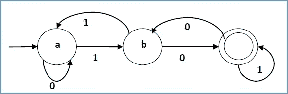
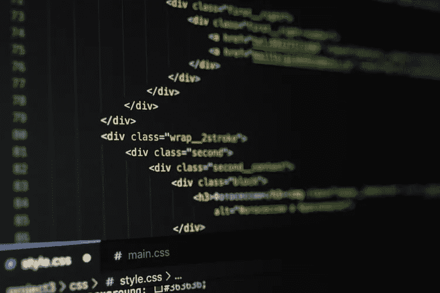

# 让我们来玩玩(元)编译器——设计一个自动化的扫描器

> 原文：<https://itnext.io/lets-play-with-meta-compilers-designing-an-automated-scanner-2ffe2e0e609c?source=collection_archive---------3----------------------->

和其他可怕的事情…😨


就像做蛋糕一样…但也不尽然

我能告诉你什么读者，文件系统不能吸引我的想象力，编译器只是为我做的。说真的，我去年花了大部分时间试图做一个。这是一个有趣的项目，但我最终失败了，因为编译器是非常重理论的，你真的需要进入一个清晰而简洁的计划。

我没有一个清晰简洁的计划，有点不知道自己在说什么或做什么。当我最终鼓起勇气访问 r/Compilers subredit 并询问我一直在纠结的问题时，这一点变得很明显。

读者们，编译器在理论上是如此的密集，以至于当谈论某些你正在纠结的事情时，你很快就会意识到用 CompSci speak 说话是真正通过这些部分的最好方法。您经常会看到来自多个编译器开发人员的不同代码体，它们看起来非常不同，但当以行话的形式向任何阅读它们的人讲述时，它们立刻就有了意义。起初，这确实令人望而生畏；努力了解扫描、解析和词法分析之间的区别，以及抽象语法树生成规则对于某些语言和语法是如何工作的，您不可避免会错过的东西几乎是无穷无尽的。

所以我很自然地认为这是一个挑战，并决定尝试打破所有这些东西，所以也许有一天当时间旅行成为一件事时，我会给过去的自己发一条信息，也许她第一次尝试就不会那么痛苦了。

另一件值得一提的重要事情是，我的理论计算机科学知识来之不易，因为我被迫在真空中自学这些东西；一半是因为我害怕开放的互联网，一半是因为我害怕索要资料，一半是因为我选择了错误的书籍来开始，通常是从一些超出我基本技能的跳跃式发展开始。

所以，这个新的文章系列(是的，我们又做了一次！)，我将进入我已经工作了几个星期的定制编译器生成器的设计和实现。你会问什么是编译器生成器？嗯，这就像如果你把 Lex，Yacc 和协议缓冲区融合在一起，最终会得到无限糟糕和畸形的东西，如果你把它涂在吐司上，味道可能会很差，或者至少我的可能会很差😄。我保证，我们一会儿会谈到这个😅

总而言之，这是我给自己的最大的技术挑战，公开谈论它也将有助于检查自己，并确保我掌握这些东西，如果我能让它有意义，如果比我更好的编译器开发人员能审查我的工作。

事不宜迟，让我们开始吧！

## **到底什么是编译器生成器**


我怎么又来了…？😵

在我们开始之前，我发现某种术语表可能是有价值的。我发现自己被我一直在使用的术语绊倒了，却没有机会用一种不打断这篇相当密集的文章的方式来解释它们。因此，在我们开始讨论肉和土豆之前，这里有一些有用的术语需要了解。

*   **确定性有限自动机(DFA)** —这是模式匹配的科学。从概念上讲，这些是有向图，其节点称为状态。当根据特定的 DFA 模式对字符串进行分析和检查时，字符串中的每个字符都在 DFA 中的每个点进行评估，如果当前状态接受当前字符，则在 DFA 中会遍历新的状态。这个过程重复进行，直到输入字符串用尽；如果字符串的最后一个字符没有结束于接受状态，则该模式将被 DFA 拒绝。

示例 DFA:



以上面的 DFA 为例，最终状态(最右边的双圈)是接受状态。状态`a`是我们的开始状态。我们在状态`a`中的转换告诉我们，如果我们的下一个输入是`0`，那么我们停留在状态`a`，如果是`1`，我们将遍历到状态`b`。观察这种模式，我们可以猜测无论字符串最终是什么，所有可接受的字符串都以`10`或`000`结尾。自动机理论很难理解，但是对于本文来说，这个基本的理解就足够了。

*   Lex —这是一个用于自动生成扫描仪的工具，也是这个项目的灵感来源。它也为它的扫描器生成器使用一个规范文件，并且专门生成 C 代码，当进一步编译时，创建您的标记器。可以在这里详细了解:[https://en . Wikipedia . org/wiki/Lex _(软件)](https://en.wikipedia.org/wiki/Lex_(software))
*   **Regex** —正则表达式；这是一种指定要搜索的字符串模式的字符和符号格式。在这个项目中，它被用来替代代码中的 DFA 实现。DFA 可以转换成正则表达式，反之亦然。
*   **抽象语法树(ASTs)** —一种以特定方式布局的令牌的树状结构，在评估编程语言的语义(或其“含义”)时展示优先顺序。这将不会被涵盖，但我的名字下降，现在，然后😅。

编译器生成器或*元编译器*背后的想法是，能够为任何一种语言编写规范，将其传递给生成器，就创建了该语言的编译器。很酷，对吧？

失败的可能性几乎是无穷无尽的。

我们的元编译器项目将被分成三个主要部分，只要每个部分的输出格式与下一个部分的输入格式相匹配，这些部分就可以单独工作。编译器已经有了这种结构，但是我们将通过自动生成这些组件来更进一步。

这三个部分是:

*   **前端** —编译器的一部分，负责接收源代码，根据语言规范验证标记的语义正确性，并将输出(有时作为抽象语法树)发送到下一层。
*   **中间件** —该部分负责中间代码的生成；这段代码是一种类似汇编指令的伪代码，与任何真正的汇编语言或体系结构完全无关。这让您对最终的程序集输出有了一个概念，并在不依赖于架构的情况下进行优化。如果优化过程很复杂，这个步骤可以由多个层叠的子步骤组成。
*   **后端**——这是我们将中间代码转换成目标机器的本机汇编以供实际执行或进一步编译成目标代码，然后再编译成可执行文件的部分，无论哪种情况都可以。

这就是我们将在接下来的几个月里试图构建的东西。

注意:有些人发现使用“前端”这个词来描述编译器(看起来很像后端)会让人混淆。这个术语有时被用来描述一个具有多层的大型系统的“前端”部分——这只是我本周在工作中学到的一个有趣的事实。

那么，让我们先谈谈我们要做什么。

## 前端——让我们做一个扫描仪



看到了吗？有趣是因为…它是 HTML…因为前端…😶

所以，首先，扫描仪。我们将制作一个扫描器，它可以接收一个规范文件和一个或多个源文件，并使用我们在该规范文件中指定的规则来标记源代码；将语言中的每个有效“单词”转换成单个标记。如果你熟悉`lex`，那么你可能会明白我在这里要说的一点点。

令牌可以是任何东西，从单个字符如`=`或`a`到整个字符串如`"hello world"`。每个令牌由两个值分类；其*文字值*及其*类型*；所以令牌`"hello world"`的字面值是`"hello world"`，其类型是 a `STRING`或 a `LITERAL`，令牌`+`的值是`+`，其类型是`PLUS`，以此类推。

有几组特殊的令牌被归类为`RESERVED`。这些是该语言专门用于其功能、特性和结构的词。考虑大多数语言中单词之间的差异；`if`、`while`和`for`以及`_x`、`hello42`和`this_is_a_function`字样。前者通常用于功能性(分别用于 if 语句、while 和 for 循环)，而后者用于变量和/或函数名。前者令牌将具有单一类型，例如`RESERVED`或`KEYWORD`，而后者将被分类为`IDENTIFIERS`。

注意:有时你可以给每个关键字一个独特的类型；如`if`为`IF`型，而`WHILE`型。如果您的编译器的后续部分需要这种级别的清晰度，那么这没有什么坏处，但是建议将所有不重要的字母数字标记都放在一个类型下，如`ID`或`IDENTIFIER`，因为尽管命名不同，它们通常会遵循相同的规则集。我经常这样做，因为害怕仅仅用`KEYWORD`来代表不同的价值观会产生歧义，而这些价值观会做不同的事情来反咬我一口。

现在，简单的介绍结束了，让我们来谈谈我们将采取什么样的过程来自动生成我们想要的任何东西的扫描仪。

我们将使用的方法依赖于编译器理论中称为**表驱动扫描**的概念。

## 但是什么是表格驱动扫描呢？


当你坐在高档餐桌旁时，咖啡总是更好喝，☕️😁

表格驱动扫描仪是三种常见的扫描仪开发方法之一(另外两种是直接编码扫描仪和手动编码扫描仪)。这种方法利用了三个内存中的表，并在其中存储了成功扫描目标语言所需的所有信息。这种方法看起来很不受欢迎，因为内存中的所有数据都存在缓存访问问题，但它非常适合我们的需求，尽管我最终可能会以某种方式为此付出代价。这种方法依赖于预先确定的表，表中有解析目标语言所需的所有规则和信息。我们的 spec 文件将被设计成适合这些表，尽管会做一些修改，使它在代码和正则表达式方面更容易一些。

顾名思义，这种类型的扫描依赖于表格的使用；准确地说是三个；一个存储用于处理我们的语言的所有 DFA(DFA 表)，另一个用于将标记值与它们的标记类型配对(标记表)，另一个用于识别和分类输入中的字符类型(分类器表)；比如说`a-zA-Z`是`alphabetic`和`0-9`是`digits`。在我们的实现中，我们将把最后一个表扔掉，因为它本身不需要成为一个表。

表格驱动扫描的基本算法如下所示:

```
tables = initTables()
acceptedStates = stack()currentToken = ""
while c = NextChar(){
   if c == EOL
      break

   currentToken.append(c)
   if tables.DFA_match(currentToken) is true {
      push currentToken to acceptedStates
   else if tables.DFA_match(currentToken) is false {
      if acceptedState is not empty
          currentToken = acceptedStates.pop()
          c = rollBack() input to last accepted state
          break
      else
          return errorif currentToken in tables.tokenTypes 
    return token value and token type
else
    return invalid token error
```

这基本上概括了表驱动扫描概念背后的思想；依靠访问保存在表格中的信息来帮助我们的扫描仪做出决策。

我们将这样做，但需要对算法进行一些修改，以满足我们的定制需求。

## 我们经过大量修改的版本


改装！太好了。！💥

我们的将在循环实现和回滚方面使用相同的前提，除了`DFA_table`将只是一个接受正则表达式的字典(一个正则表达式表，如果你愿意的话)；键是正则表达式模式，值是正则表达式模式的标识符。我们将 DFA 表和分类器表合并成一个更好的修改过的 AWESOME Regex 表！太好了。！

我们将添加的唯一附加表是一个调整版的 Regex 表，例外的是这个表被设计为使用分隔模式的 Regex 所以一张餐桌。这个额外的表对于处理像正则表达式匹配字符串和注释这样的事情似乎是必要的；令牌开头的`"`通过接受任何和所有字符来改变正则表达式模式匹配的规则，忽略所有其他匹配模式，直到它看到另一个`"`。我把它做成一个单独的表，因为当我试图把它和其他单标记正则表达式模式放在一起时，它最终做了一些非常不可靠的事情。

最后，我们将为所有令牌类型添加一个令牌表。

和我们的三个表决定；regexes、delims 和 token 类型，我们设置的最后一个难题是讨论我要实现的东西，当然还有 spec 文件看起来会是什么样子。

## **路到此为止**

我将把代码实现留到另一篇文章中，因为要解包的内容太多了，但是我将在这里展示一些伪代码，一个工作规范文件😃。

**伪代码**

事情是这样的

```
savedTokens = tokenList()
tables = tables()
sourceCode = ""
acceptedState = stack() function scanner() 
    tables = createFromSpecFile(specFile)
    sourecCode = readSourceFiles()

    while sourceCode not at EOF
        scan() function scan()
    currentToken = ""
    while c = nextChar()
        if c == EOF {
           break        
        }
        currentToken += c
        if currentToken in tables.Regex_table
           save currentToken and c position in acceptedState
        else 
           if acceptedState not empty
              currentToken, c = acceptedState.pop()
              break
          else
              return error if currentToken not in tables.Tokentype
       return error
    else
       savedTokens.add(currentToken, tables.Tokentype[currentToken]) scanner()
```

因此，这几乎是表驱动扫描中使用的方法的精确复制/粘贴，但魔鬼在管理表和使用正则表达式和函数来模拟 DFA 遍历的细节，但在其他时间更多。😅

减去许多血淋淋的细节，我的实现看起来像这样，但在去。

**规格文件**

程序获取的规范文件格式如下。

```
# classifiers
[classifier tokens go here]
%%
# delims
[delim tokens here]
%%
# tokenTypes
[and token types here
```

很快，就像变魔术一样，我们准备好了我们的规格格式。让我们来看看如果我们指定 C 语言会是什么样子；

```
# Classifier

alphabet    [_a-zA-Z]
digit       [0-9]
number      {digit}+
newline     %NEWLINE
word        {alphabet}({alphabet}|{digit})*
symbols     [-+/\*&!\|\{\}=><:^;,]
equ         ([+-/=*!&\|]|((>)?>)|((<)?<))?=
left        (<)?<
right       (>)?>
brackets    [\[\]\(\)]
comment     //.*{newline}
mcomment    /\*.*\*/
float       [0-9]+((\.[0-9]*)|e((\+|-)?[0-9]+))
hex         0[xX][a-fA-Z0-9]+
string      ".*"
char        '[(\')(\t)(\n)]|(.*)'
arrow       ->

%%

# Delim
'     {char}
"     {string}
//    {comment}
/\*   {mcomment}

%%

# TokenType

{string}    STRING
{number}    INTEGER
{word}      ID
{char}      CH
char        CHAR
int         INT
long        LONG
void        VOID
unsigned    UNSIGNED
*           STAR
...
```

x86 汇编怎么样(反正是 OSX 版)

```
# Classifiersalphabet   [_a-zA-Z]
digit      [0-9]
number     {digit}+
hex        {digit}+h
word       {alphabet}({alphabet}|{digit})*
label      _{alphabet}({alphabet}|{digit})*:
colon      :
newline    %NEWLINE
comma      ,
brackets   [\[\]]
space      %SPACE
gen_regs   [er][abcd]x
small_regs [abcd][lhx]
push       push(a)?
pop        pop(a)?
hex        0[xX][a-fA-F0-9]+
comment    ;.*{newline}
string     ".*"
char       '.*'%%
# delim;      {comment}
"      {string}
'      {char}
0[xX]  {hex}%%
# tokenType{string}  STRING
{word}    ID
section   SECTION
extern    EXTERN
include   INCLUDE
_data     DATA
_text     TEXT
_bss      BSS
db        DB
dq        DQ
dw        DW
mov       MOV
cmp       CMP
rax       GREG64
rbx       GREG64
rcx       GREG64
rdx       GREG64
eax       GREG32
ebx       GREG32
ecx       GREG32
edx       GREG32
ax        GREG16
bx        GREG16
cx        GREG16
dx        GREG16
al        GREG8
ah        GREG8
bl        GREG8
bh        GREG8
cl        GREG8
ch        GREG8
dl        GREG8
dh        GREG8
push      PUSH
pop       POP
pusha     PUSHA
,         COLON
popa      POPA
int       INT
[         OPENBRACKET
]         CLOSEBRACKET
```

它在一个由 3 个部分组成的文件中接受一个可接受标记的规范，这 3 个部分由一个`&&`分隔，每个部分都在它指定的表中(分类器用于我们的 regex 表)。

我们将为我们的生成器添加一个`config`文件，因为我已经预见到未来对各种配置的需求。

现在，它只有一条线

```
spec:{specfile name}
```

它已经被设置为解析语言。

现在，这里有一个扫描仪工作版本的快速演示

编辑:所以我在录制后才发现，当我使用`asciinema`时，演示并没有记录我的鼠标滚动，所以有很多…不动作，那些空隙是我滚动的。但是在这篇文章之后，您可以随意尝试一下；项目链接在文末。在我的回购的自述中还有一个更清晰的版本😓

很抱歉质量不好，我的 Github 上有更好的😭

这就是我们所在的地方！😄。

我希望你喜欢这篇文章，我希望它是可以理解的。我在测试我翻译复杂的计算机科学材料的能力。如果你在我的信息中发现任何不准确的地方，请让我知道，这样我可以快速编辑。我将在后面的文章中详细介绍我的代码实现，因为它非常多，而且在我计划项目的后续部分时，我会不断地清理和改进它。

我添加的一个小特性是 init 代码，它将在新创建的 spec 文件中生成默认的正则表达式，因为它们可能会令人望而生畏，并且在许多语言中也是相似的。

让我知道你对我的项目的看法。你可以在这里查看。

[](https://github.com/AlysonBee/CompilerGenerator) [## GitHub-alyson bee/compiler generator:我当前编译器项目的报告

### 这个回购的目的是存储我目前的中型项目的所有代码。这个项目，目前名为…

github.com](https://github.com/AlysonBee/CompilerGenerator) 

当然，还有激发这一切的那本书:[https://www . Amazon . com/Engineering-Compiler-Keith-Cooper/DP/012088478 x](https://www.amazon.com/Engineering-Compiler-Keith-Cooper/dp/012088478X)

快乐阅读！👋

阿利松