# 让我们把飞镖流放在我们的笔记本电脑上

> 原文：<https://itnext.io/lets-put-boomerang-flow-on-our-laptop-8a63eac2b9e5?source=collection_archive---------2----------------------->

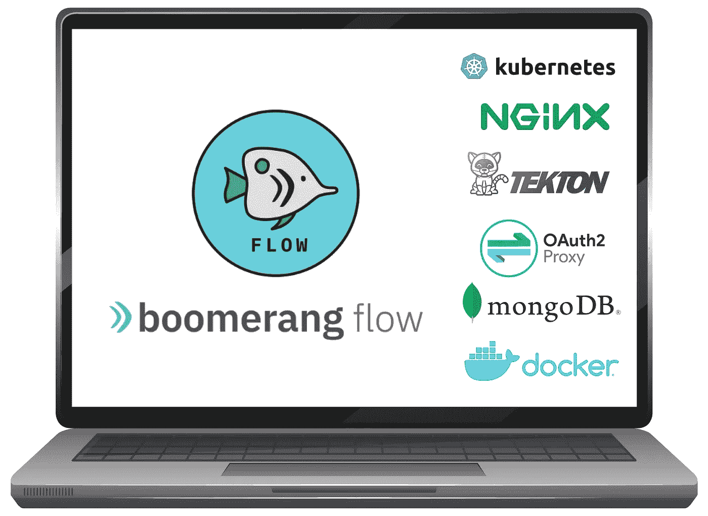

**笔记本电脑上的回旋镖流**

*在过去的几个月里，我们一直致力于将我们的云原生编排工具转换为工作流，也称为* [***回旋镖流***](https://www.useboomerang.io/flow) *以使用*[***Tekton***](https://tekton.dev/)*的任务和任务运行。它很轻，可扩展，有很好的用户体验，今天我们将把它安装在我们自己的笔记本电脑上。让我们看看如何轻松实现这一目标。*

如果你想进一步了解什么是**回旋镖流**，我邀请你浏览项目 [**主页**](https://www.useboomerang.io/flow) ，去 [**GitHub**](https://github.com/boomerang-io/roadmap) 资源库或者从 [**docs**](https://www.useboomerang.io/docs/boomerang-flow/3.3.1/introduction/getting-started) 开始。

> Boomerang Flow 是一个开源的事件驱动的云原生工作流自动化工具，运行在 Kubernetes 上，为工作流创建提供了一个无代码的拖放编辑器。我们首先关注最终用户体验，然后才是技术特性。

如果您想尝试工作流编排工具，并且不一定想在各种提供商中提供 Kubernetes 集群，您仍然可以在您的笔记本电脑上本地运行它。在本文中，我将在一台“*普通*”笔记本电脑上进行 boomerang flow 的端到端安装实践。我运行的是 MacBook Pro，配备了 2.6 GHz 的英特尔 i7，内存为 16 GB。

## 以下是您需要完成的步骤:

*   首先，我们将在本地机器上安装一个 k8s 集群，并配置它的入口控制器，
*   然后我们将快速部署一个`mongodb`实例，由 boomerang 流用来存储它的数据，
*   接下来，我们将在我们的机器上新的 Kubernetes 集群中安装 boomerang flow 项目，
*   最后，我们将激活它并运行它。

# 在本地机器上安装 Kubernetes 集群

首先，我们将使用 kind 在本地机器上安装一个 Kubernetes 集群，但是在此之前，我们需要确保在我们的机器上安装了必要的 cli 工具:`kubectl`、`helm`和`kind`。

您可以遵循以下说明:

**1a。**按照此处的[指示，在本地安装`kubectl`。](https://kubernetes.io/docs/tasks/tools/)

**1b。**按照此处的[中的说明在本地安装`helm`。](https://helm.sh/docs/intro/install/)

**1c。**按照此处的说明在本地安装 kind 或直接运行:

```
**curl -Lo ./kind** [**https://kind.sigs.k8s.io/dl/v0.9.0/kind-darwin-amd64**](https://kind.sigs.k8s.io/dl/v0.9.0/kind-darwin-amd64)**chmod +x ./kind
mv ./kind /some-dir-in-your-PATH/kind**
```

2.现在我们已经在本地安装了 kind 工具，我们需要创建一个 Kubernetes 集群。这将创建一个单节点集群并添加`ingress-ready`标签，为入口控制器安装做准备。打开一个终端并粘贴以下代码片段(创建和启动集群需要 1-2 分钟)。

所有集群的 pod 大约需要 2 分钟才能启动，因此在进入下一步之前，请确保它们正在运行:

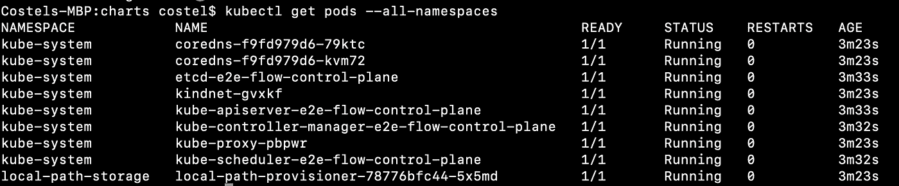

检查所有命名空间中的集群窗格

3.通过运行以下命令在集群中安装 ingress nginx:

```
**kubectl apply -f** [**https://raw.githubusercontent.com/kubernetes/ingress-nginx/master/deploy/static/provider/kind/deploy.yaml**](https://raw.githubusercontent.com/kubernetes/ingress-nginx/master/deploy/static/provider/kind/deploy.yaml)
```

这将创建一个新的名称空间`ingress-nginx`，然后部署 nginx 入口控制器容器。确保 nginx 控制器正在运行，您可能需要等待一分钟，让 pod 准备就绪。


3.1 修补 nginx 配置，配置代理缓存路径。只需运行即可轻松完成:

```
**kubectl patch configmap/ingress-nginx-controller -n ingress-nginx --type merge -p** '**{"data":{"http-snippet": "proxy_cache_path /tmp/nginx levels=1:2 keys_zone=authentication:10m inactive=3s;"}}**'
```

# 安装 mongodb 实例

Boomerang flow 需要在一个`mongodb`实例中持久化其运行数据，如团队、工作流定义、执行和许多其他数据。稍后，boomerang flow 安装将运行一个作业(它的安装的一部分),该作业将设置数据库的初始状态。

我们将使用来自`bitnami`的舵图，这将简化数据库的安装。首先确保你已经将`bitnami`头盔库添加到你的本地库并且是最新的:

```
**helm repo add bitnami** [**https://charts.bitnami.com/bitnami**](https://charts.bitnami.com/bitnami) **helm repo update**
```

然后运行:

```
**helm upgrade --version 7.8.8 --install bmrg-mongodb bitnami/mongodb --set mongodbDatabase=boomerang --set mongodbUsername=boomerang**
```

在继续之前，让我们确保 pod 已启动并运行。

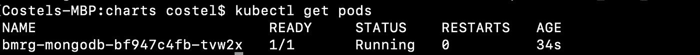

显示 mongodb 正在运行

# 安装回飞镖流

既然繁重的工作已经完成，我们只需将`boomerang-io` Helm chart 存储库添加到我们的本地存储中，并确保它知道 boomerang flow 的版本，就可以安装 boomerang flow 了。

```
**helm repo add boomerang-io https://raw.githubusercontent.com/boomerang-io/charts/index****helm repo update**
```

此时安装 boomerang 流只需运行以下命令，这将安装最新的 helm 版本。你也可以使用`--version x.y.z`安装以前的稳定版本(版本列表可以在[这里](https://github.com/boomerang-io/roadmap/releases)看到):

```
**helm upgrade --version 4.9.7 --install --debug flow boomerang-io/bmrg-flow -f https://raw.githubusercontent.com/boomerang-io/charts/main/examples/flow-basic-auth-values.yaml**
```

> N **注**:值得一提的是，目前的安装是配置 boomerang flow 后端微服务，只要求 128MB 或内存。对于本练习，这已经足够了，但是如果您打算运行更复杂的工作流，请确保将分配给 Docker 守护进程的内存增加到 4GB，并将所提供的 flow-basic-auth-values.yaml 文件中的 boomerang 流后端微服务配置为 1GB。

一旦安装完成，我们将看到发行说明。这些很重要，因为它们向我们展示了如何访问该工具以及如何激活它。

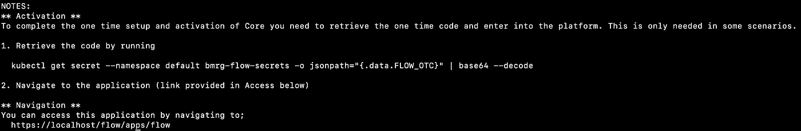

显示**访问端点**以及如何获取**激活码**的发行说明

要获取激活码，只需运行指示的命令。它将提取激活码，并将其放入剪贴板缓冲区。在第一次登录后，我们需要将它粘贴到 UI 中。

```
**kubectl get secret --namespace default bmrg-flow-secrets -o jsonpath="{.data.FLOW_OTC}" | base64 --decode | pbcopy**
```

我们可能需要 2 到 3 分钟的时间让群集下载并启动映像。接下来，让我们打开浏览器并转到[**https://localhost/flow/apps/flow**](https://localhost/flow/apps/flow/)

在登录屏幕上，我们需要使用以下测试凭证，`bmrgadmin` / `youll-come-a-waltzing-maltilda-with-me`。

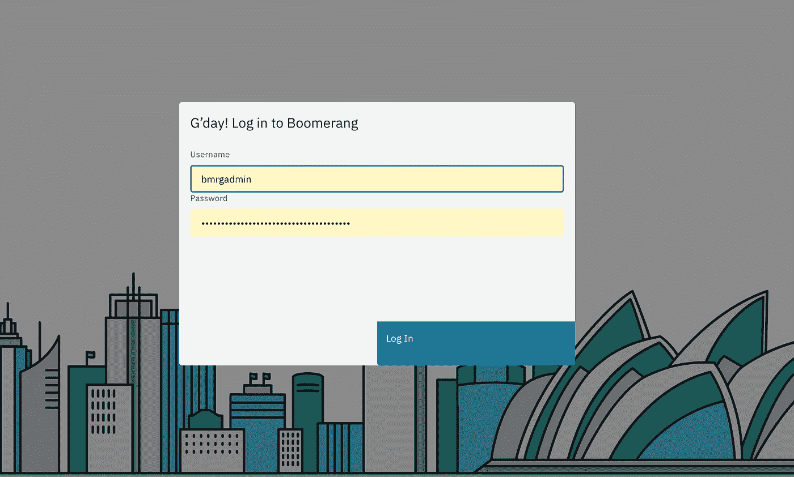

登录屏幕

第一次，我们将需要激活回飞镖流，使用我们之前检索并存储在剪贴板中的激活码。

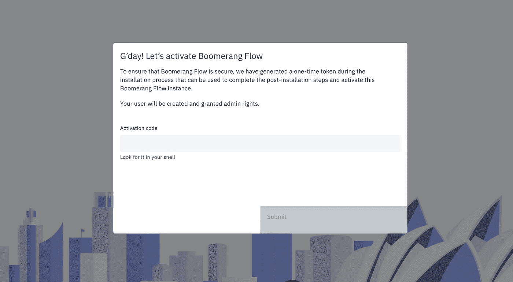

一次性飞镖流**激活屏幕**

粘贴激活码并提交。我们可能需要刷新流应用程序的浏览器页面来获取新的设置。

# 好的，那么现在做什么……

在下一节中，我们将通过创建和执行工作流来测试我们的本地安装。

在公开文档中有 [**教程**](https://www.useboomerang.io/docs/boomerang-flow/3.3.1/tutorials/git-hub-issues-bot/#github-issues-bot) 的专门章节，涵盖了与 [GitHub](https://www.useboomerang.io/docs/boomerang-flow/3.3.1/tutorials/github-teams-and-organizations) 、 [Sendgrid](https://www.useboomerang.io/docs/boomerang-flow/3.3.1/tutorials/email-with-attachments) 、 [Box](https://www.useboomerang.io/docs/boomerang-flow/3.3.1/getting-to-know/tasks/#box) 和[手动审批](https://www.useboomerang.io/docs/boomerang-flow/3.3.1/tutorials/manual-approval-output-details)任务的集成。

## 测试我们的本地安装

打开回飞镖流工具会向我们显示欢迎页面。该工具基于团队和用户，所以我们需要做的第一件事是创建一个团队，并在团队中添加我们自己的用户。

在**欢迎**页面打开左上角的汉堡菜单，选择`Administer` ➲ `Teams`。

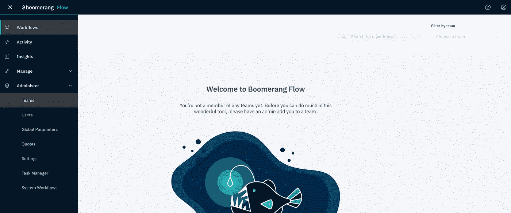

**欢迎来到**回旋镖流页面

在常规**团队**页面中，按下右上角的`Create Team`按钮。在模态窗口中，填入团队名称，然后按`Save`。

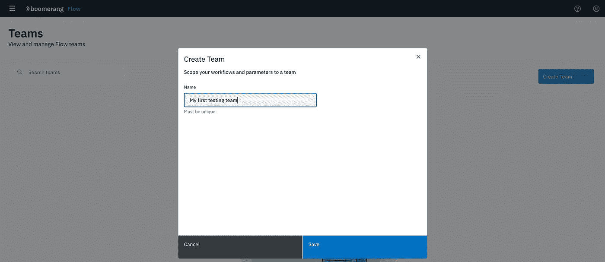

现在我们已经创建了一个团队，我们希望将我们自己的用户`bmrgadmin`添加到这个团队中。选择团队，然后按下`Add Members`按钮。在模态窗口中输入用户名，即`bmrgadmin`，选择结果，然后按`Add to team`。

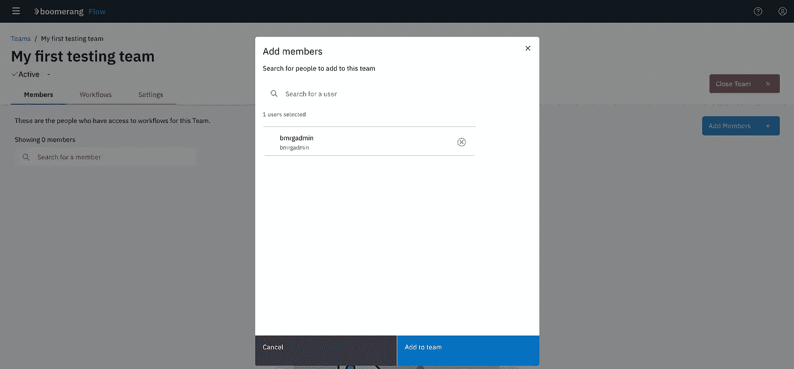

向团队添加成员

现在我们可以返回到**工作流**页面来创建新的工作流。我们通过打开左上角的汉堡菜单并选择`Workflows`来实现这一点。由于我们的用户是团队的一部分，我们可以看到团队名称、配额、现有的工作流以及一个`Create a new workflow`按钮。

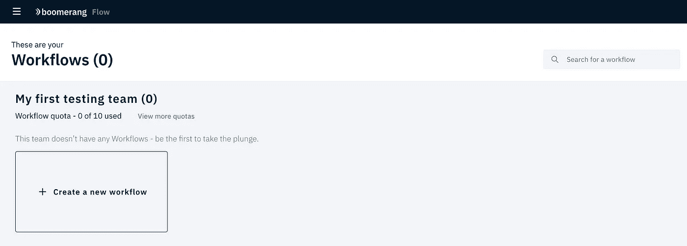

团队的一部分，现在我们可以自动化宇宙

让`Create a new workflow`在模态窗口中填充细节。按下`Create`按钮。

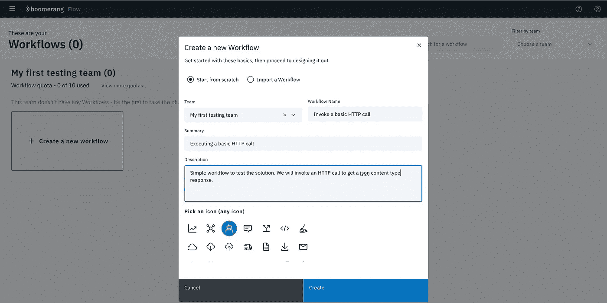

创建新的工作流程

在工作流编辑器中，我们可以通过拖放操作来设计和配置工作流。只要我们有一个工作的 docker 映像，我们就可以疯狂地设计一个使用各种类型的预定义任务和定义自定义任务的工作流。关于这个的更多信息可以在官方文档中找到。现在我们只是将&拖放到可以在`Utilities`类别下找到的`Execute HTTP Call`任务。

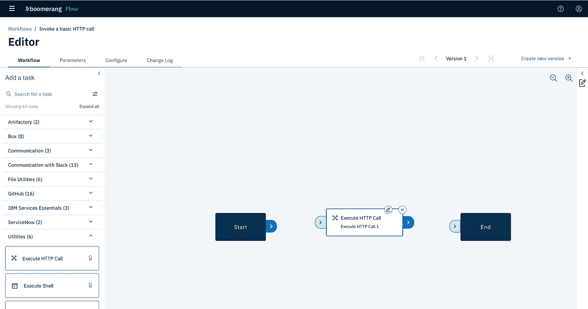

使用工作流编辑器设计您的工作流

让我们通过点击任务上的小铅笔图标来配置`Execute HTTP Call`任务。我们只想进行一个 HTTP 调用，返回一个带有 200 HTTP 状态的 json 响应。在模态窗口中，用以下值更新字段，并按下`Apply`按钮。

*   `URL` : `https://httpstat.us/200`
*   `Method` : `GET`
*   `Headers` : `Accept: application/json`
*   `Content Type` : `application/json`
*   其余的字段可以保持为空

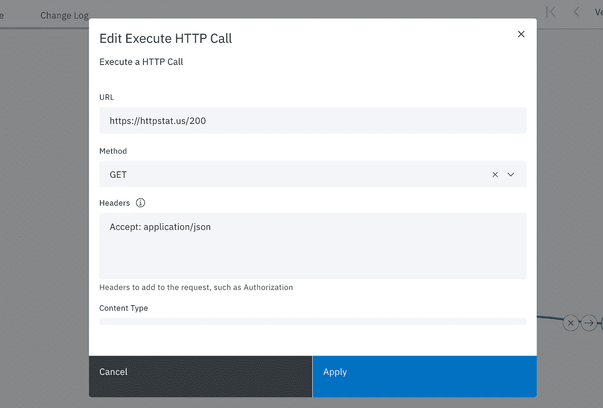

配置**执行 HTTP 调用**任务

将`Start`、`End`和任务本身连接起来，从前面的任务拖动一条线到下一个任务。

一旦工作流程如下图所示，按右上方的`Create new version`按钮保存更改。

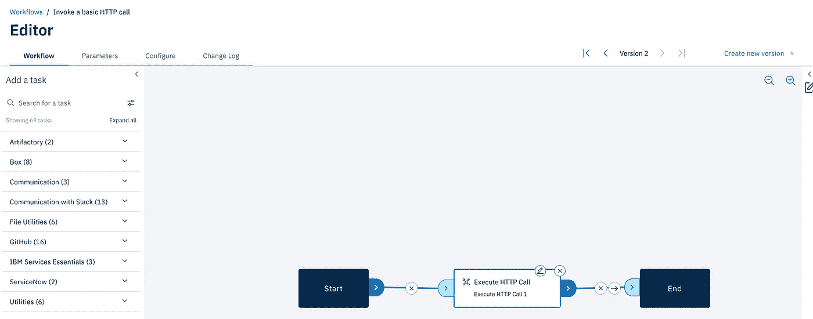

现在，我们可以返回到**工作流**页面，运行新创建的工作流。再次打开左上角的汉堡菜单并选择`Workflows`。按下`Run it` ➲ `Run and View`。

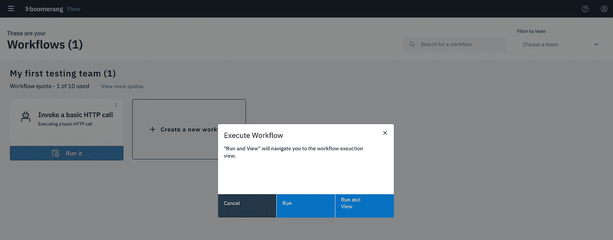

执行工作流

我们将进入工作流运行详细信息页面，在这里我们可以实时看到工作流的执行、日志、结果以及取消运行。

> N **注意**:第一次执行可能需要更长时间，最多 5-10 分钟，直到图像下载并启动。下面的运行将重用这些图像，使执行速度更快。

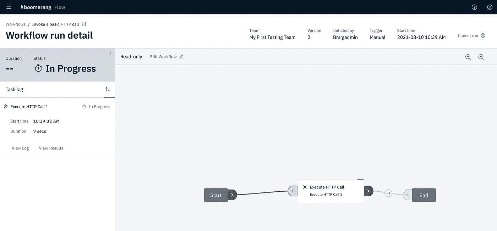

查看云原生工作流的实时执行

打开左上角的 hamburger 菜单并选择`Activity`,我们将看到工作流执行的视图，该视图通过各种标准进行过滤，如:状态、团队、工作流名称和执行日期。


从工作流执行的角度来看发生了什么

这就是你笔记本电脑上的云原生工作流程编排器。我在开始时说过，我们已经将执行转移到 Tekton 的任务运行中。我们甚至可以通过使用 Tekton 的一部分`tkn` cli 来检查任务运行的细节。

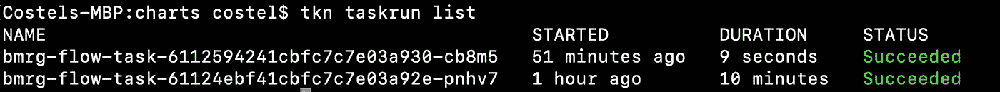

使用 **tkn** cli 检查任务运行细节

## 清理本地安装

要从我们的笔记本电脑上完全删除安装，我们只需要删除我们创建的`kind`集群。如果您按照这里的说明操作，集群的名称是`e2e-flow`,或者如果您在安装过程中手动更改了它，可以通过运行以下命令轻松找到它:

```
**kind get clusters**
```


从我们的笔记本电脑中检索**类**簇

要删除本地集群，只需运行:

```
**kind delete cluster --name=e2e-flow**
```


# 表示你的支持

如果你喜欢回旋镖流项目，并且觉得它很有帮助:

——⭐️[github 知识库](https://github.com/boomerang-io/flow.client.web)
—💬关注我们的 [Twitter](https://twitter.com/useboomerangio)
- [在你自己的 Kubernetes 集群
上安装项目](https://www.useboomerang.io/docs/boomerang-flow/installing/installing)🙏加入我们并帮助[做出贡献](https://github.com/boomerang-io/roadmap)

*大呼出来的同事来自* [***回旋镖-io***](https://github.com/boomerang-io) *团队*👏*感谢他们在构建和维护项目中的所有辛勤工作:* [*本*](https://github.com/BenjaminRuby)*[*马库斯*](https://github.com/marcusdroy) *和* [*泰森*](https://github.com/tlawrie/) *。**