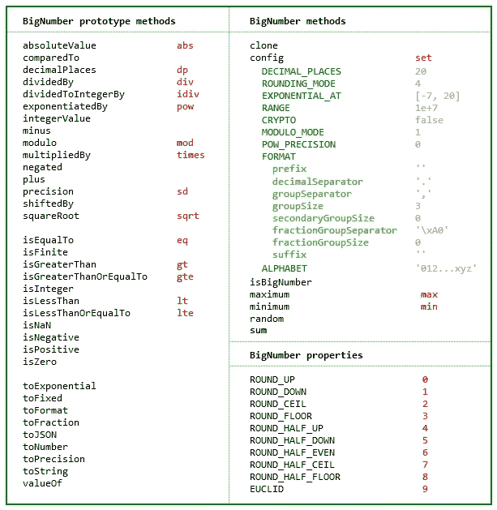

# 我们来谈谈 JavaScript 中的大数字

> 原文：<https://itnext.io/lets-talk-about-big-numbers-in-javascript-b0a2c8edb170?source=collection_archive---------1----------------------->


数字——照片由[https://pexels.com](https://pexels.com/)提供

> 实话实说，在 2020 年，用 JavaScript 处理数字仍然显得很原始！

# 介绍

在本文中，我们将回顾“JavaScript 中的大数支持”的状态，尽管这个话题由来已久，并在社区论坛中被广泛讨论，但它仍然非常重要。对于希望在 JavaScript/Node.js 中找到一个健壮的运行时来构建所有类型的 web 应用程序的 JavaScript 开发人员来说,“最了解”。

从未听说过这个问题？只需在您的 JavaScript 控制台上执行以下算术计算:

```
0.0000000000000001 + 1
```

让我们通过描述当前 JavaScript 支持的数据类型来深入了解一下。

```
The latest ECMAScript standard defines eight data types. Seven data types that are [primitives](https://developer.mozilla.org/en-US/docs/Glossary/Primitive):1\. [Boolean](https://developer.mozilla.org/en-US/docs/Glossary/Boolean)
2\. [Null](https://developer.mozilla.org/en-US/docs/Glossary/Null)
3\. [Undefined](https://developer.mozilla.org/en-US/docs/Glossary/Undefined)
4\. [Number](https://developer.mozilla.org/en-US/docs/Glossary/Number)
5\. [BigInt](https://developer.mozilla.org/en-US/docs/Glossary/BigInt)
6\. [String](https://developer.mozilla.org/en-US/docs/Glossary/String)
7\. [Symbol](https://developer.mozilla.org/en-US/docs/Glossary/Symbol)and [Object](https://developer.mozilla.org/en-US/docs/Glossary/Object)
```

> [https://developer . Mozilla . org/en-US/docs/Web/JavaScript/Data _ structures](https://developer.mozilla.org/en-US/docs/Web/JavaScript/Data_structures)

正如我们所注意到的，数字只能用两种数据类型来表示。JavaScript `Number`类型，即[双精度 64 位二进制格式 IEEE 754](https://en.wikipedia.org/wiki/Floating-point_arithmetic) 值，而任意精度的整数可以使用`[BigInt](https://developer.mozilla.org/en-US/docs/Web/JavaScript/Reference/Global_Objects/BigInt)`类型表示。

```
typeof 3.9 === “number”   // -> TRUE
typeof 2   === “number”   // -> TRUE
typeof -1  === “number”   // -> TRUEtypeof -1**n** === "bigint"   // -> TRUE
typeof 1304958309583095830495830459830459830**n** === "bigint" //-> TRUE1n + 2 // -> Uncaught TypeError: Cannot mix BigInt and other types, use explicit conversions
```

到此为止，我们已经发现了几个问题:

*   没有整数、双精度、小数、浮点数等分类，每个数字都只是一个`Number`
*   `[BigInt](https://developer.mozilla.org/en-US/docs/Web/JavaScript/Reference/Global_Objects/BigInt)`数据类型只包含任意精度的整数。
*   `Number`和`[BigInt](https://developer.mozilla.org/en-US/docs/Web/JavaScript/Reference/Global_Objects/BigInt)`类型不能组合使用。
*   任意精度的小数不能用`Number`数据类型来表示，因为它们会被四舍五入成更小的格式。

我的钱在哪里？

不能支持应用程序运行时涉及大数字的数学运算，实际上听起来像是一个交易破坏者。也许我们需要大量支持的最常见的情况是货币操作。
例如，我们可以提及在线银行、加密货币交易所等金融应用..

# 好吧，我该怎么解决？

幸运的是，JavaScript 社区已经提供了机制来填补 JavaScript 运行时的这一空白。其中，我想强调一下伟大的***bignome . js***库:

[](https://github.com/MikeMcl/bignumber.js/) [## MikeMcl/bignumber.js

### 一个用于任意精度十进制和非十进制算术的 JavaScript 库

github.com](https://github.com/MikeMcl/bignumber.js/) 

这意味着，我们将使用一个名为`BigNumber.`
的 JavaScript 类，而不是使用原始的`Number`类型进行算术运算。让我们通过一个例子来描述它:

```
const BigNumber = require('bignumber.js');const x = new BigNumber('0.0000000000000001')
const y = new BigNumber('1')console.log(x.plus(y).toString()) // -> '1.0000000000000001'
```



[https://github.com/MikeMcl/bignumber.js](https://github.com/MikeMcl/bignumber.js/)

**JSON 解析支持怎么样？**

现在我们知道，使用 bignumber.js 这样的数学库，我们可以使用大数执行基本算术运算，这些运算被视为并表示为字符串。但是，如何解析和序列化包含大数字的 JSON 有效载荷呢？

```
const payload = "{\"user\": \"bill\",\"balance\": 9999999999999999999.000000999999999}"JSON.parse(payload) 
// -> {user: “bill”, balance: 10000000000000000000}
```

再一次，我们需要看看这里的社区解决方案，因为没有我们可以使用的本地技巧。在这种情况下，我们将使用***true-JSON-bigint***库:

[](https://github.com/SebastianG77/true-json-bigint) [## SebastianG77/true-json-bigint

### 这是一个模块，用于将 JSON 字符串解析为 JSON 对象，并将 JSON 对象字符串化为 JSON 字符串。这是一把叉子…

github.com](https://github.com/SebastianG77/true-json-bigint) 

让我们再试一次:

```
const JSON = require('true-json-bigint')const payload = "{\"user\": \"bill\",\"balance\": 9999999999999999999.000000999999999}"const parsed = JSON.parse(payload) 
JSON.parse(payload).balance.constructor.name // -> BigNumber 😘
```

> 这里我们将大数解析为**bignome**(*bignome . js*)对象。

反之亦然:

```
JSON.stringify(parsed) 
// -> “{\”user\”: \”bill\”,\”balance\”: 9999999999999999999.000000999999999}”
```

但是，数据库驱动程序呢？

当我们在 Node.js 中时，数据库驱动程序很可能不支持 BigNumber 类，因为它们自己想出了支持大数的实现。在这里，我们将讨论 MongoDB 驱动程序如何处理大十进制数。

> 我建议你做自己的研究，以防你使用其他类型的数据库引擎。

[](https://docs.mongodb.com/manual/tutorial/model-monetary-data/) [## 货币数据模型- MongoDB 手册

### 集合的值可以通过执行一次性转换或修改…

docs.mongodb.com](https://docs.mongodb.com/manual/tutorial/model-monetary-data/) 

简而言之:

> `decimal` [BSON 类型](https://docs.mongodb.com/manual/reference/bson-types/)使用 IEEE 754 decimal128 十进制浮点编码格式。与基于二进制的浮点格式(即`double` BSON 类型)不同，decimal128 不近似十进制值，并且能够提供处理货币数据所需的精确精度。

```
db.transactions.insert({ 
  ...  
  date: ISODate(), 
  amount: NumberDecimal(“2.0000000000000099”) 
})
```

在您的查询操作中，您现在还应该使用 **NumberDecimal** 构造函数:

```
db.transactions.find({ 
  amount: NumberDecimal(“2.0000000000000099”) 
})
```

# 结论

JavaScript 对数字数据类型的支持很差。对于一门如今被广泛使用的语言来说，这是一件令人惊讶的事情。

> 然而，在本文中，我们分析了可以用来缓解这种需求的可能的替代方案。具体来说，如何在 JavaScript 和 Node.js 中处理大数。

作为一个回顾，我们可以说有几个由社区维护的库，它们允许我们使用字符串表示对巨大的数字执行算术运算。同样，数据库驱动程序也提供了等效的解决方案。

我的目标是创造意识！