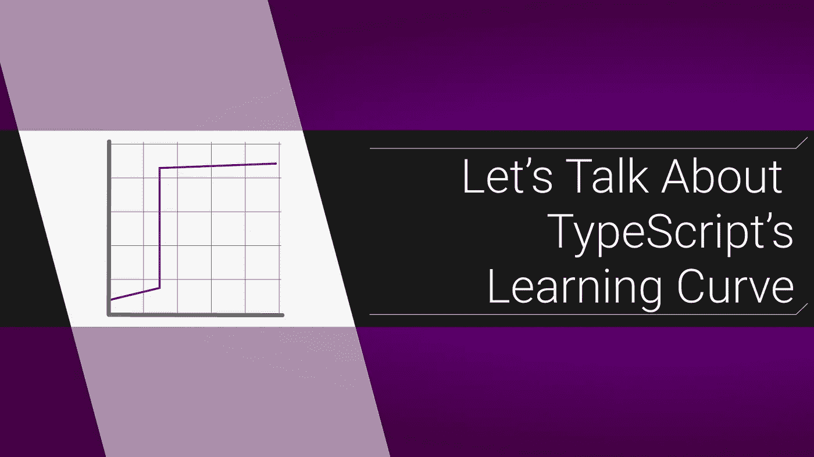

# 我们来谈谈 TypeScript 的学习曲线

> 原文：<https://itnext.io/lets-talk-about-typescript-s-learning-curve-230d6f7eb328?source=collection_archive---------0----------------------->

## 学习 TypeScript 的一些技巧



当我第一次开始[学习打字稿](/a-typescript-startup-guide-for-the-impatient-43dc4063d1cb)时，我记得感觉比平时更沮丧。我交谈过的一些其他开发人员也有同样的感觉，奇怪的是，我认为这是因为它是 JS 的超集，所以没有那么多语法需要学习。通常当你学习一门新的语言时，在你能跑之前，你有时间回去爬。但是，如果你是一个经验丰富的 JS 开发人员，学习 TS 意味着你仍然可以运行，只是现在你旁边有一个人每隔五英尺就会绊倒你。

# 记住你为什么要这么做

最初，TypeScript 会降低您的速度。但是你不是用它来变得更快，而是变得更好。顾名思义，你必须花费宝贵的时间来创建和添加合适的类型。这需要时间。**特别是**在开始的时候，在你为你的模型创建了一个小的类型库并且掌握了配置编译器的窍门之前。

不断提醒自己，一旦你的代码库实际上是自我记录的，并且自动阻止愚蠢的错误，开始时的减速是值得的。另外，免费编译的好处是，不需要巴别塔。但是如果你有什么困难，那也没关系！我知道我做到了，所以这里有一些有用的建议:

# 启用“严格”模式

没错，我是说使用[严格模式](https://dev.to/briwa/how-strict-is-typescript-s-strict-mode-311a)让事情变得更加**困难。这听起来*极其*反直觉，但是听我说完。你越快强迫自己以正确的方式完成 TypeScript，你就能越快地看到它的好处并减少挫败感。TypeScript 的主要障碍是合并类型，所以越快成为肌肉记忆越好。但是，有一个小小的例外:**

# 负责任地使用“any”关键字

虽然你通常应该避免使用`any`关键字，但它确实有它的作用。当您处于编码的“探索”阶段时，设置类型可能会很烦人。你自己可能还不了解他们！这是使用`any`的绝佳机会。扔一些进去，想想你在做什么。一旦您对函数的运行感到满意，*然后*输入正确的类型。我建议`anys`只参与一两次提交，不要将它们包含在代码审查中。

# 很有帮助。tsconfig 设置

[。tsconfig 文件](https://dzone.com/articles/what-is-the-tsconfigjson-configuration-file)，以及 [TS 泛型](/how-to-use-typescript-generics-6c0c09e049c3)，给我带来了比我愿意承认的更多的麻烦。为了节省你的时间，这里有 3 个我认为有用的设置:

```
"compilerOptions": {
  "esModuleInterop": true,
  "moduleResolution": "node",
  "resolveJsonModule": true,
  ...
```

如果您想在项目中使用 JSON 文件，您需要将`[resolveJsonModule](https://mariusschulz.com/blog/importing-json-modules-in-typescript)`和`[moduleResolution](https://www.typescriptlang.org/docs/handbook/module-resolution.html)`设置为“node”。如果您想使用默认导入，如`import abc from 'abc'`而不是`import * as abc from 'abc'`，您将需要`[esModuleInterop](https://stackoverflow.com/questions/56238356/understanding-esmoduleinterop-in-tsconfig-file)`。这些对谷歌来说是恼人的事情，我希望这个警告能节省你一些时间。

# 在哪里定义类型接口

我发现接口应该从它们的相关文件开始，只有当 被多次使用时，才移动到一个共享文件 ***中。所以，对于一个只在单个函数中使用的类型，这个函数在文件的顶部。然而，像模型或实用程序类型这样的东西放在它们自己的文件或目录中。我从更聪明的开发人员那里采用了这种模式，我认为它在保持事物分离和不必经常在文件之间切换之间取得了很好的平衡。***

# 休息一下

当您第一次开始使用 TypeScript 时，您可能会感到有点拘束。所以回到标准 JS 中的其他项目，只用*代码。*这些小小的呼吸装置会让你不再担心类型。但疯狂的是，在你使用 TS 一段时间后，当你回到 JS 时，你会开始希望你是在 TS 中。您可能会发现您错过了那些有用的警告和类型，当然，*而不是*得到`undefined`错误。

我希望这些建议和应对机制能帮助你越过最初的学习悬崖，因为最终结果绝对是值得的。在较小的项目中可能很难注意到这一点，但是当你第一次接触到较大团队中的护栏时，你会非常喜欢 TypeScript。

大家编码快乐，

麦克风