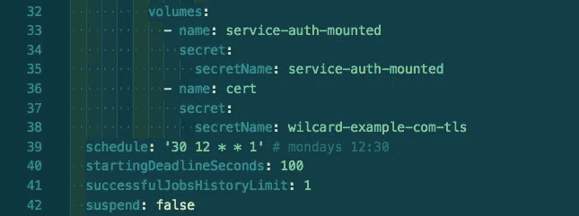

# Letsencrypt 和 GCE HTTPS 负载平衡器，通过 Kubernetes CronJobs

> 原文：<https://itnext.io/letsencrypt-and-gce-https-loadbalancers-via-kubernetes-cronjobs-65ad79ade46?source=collection_archive---------2----------------------->

在 Aller Media，我们直接在 GKE 管理大部分入口资源。这感觉很好，因为我们可以像定义应用部署一样定义面向公众的网络基础设施。在 yaml。在版本控制中。

由于历史原因，我们设置了一些 GCE 负载平衡器资源，最初我们向这些资源提供了供应商提供的 1 年证书。这很好，只是它每年会回来唠叨你一次，你将不得不进入付费使用怪异界面来创建的令人不快的地下世界。pem 的，你以后需要解剖堆叠中间链在正确的顺序亚达亚达…

我们更希望我们用于 kubernetes ingresses 的自动证书更新循环也适用于这个用例。

# 证书管理器

回到 2018 年 3 月，Let's Encrypt 发布了他们的 v2 api，允许通配符证书。Cert-manager 支持这个 api，并允许我们将证书请求定义为 yaml。为了完成这项工作，你需要一个证书管理器发行者来使用 *dns01* 验证方法。设置 cert-manager 超出了本文的范围。

创建通配符证书

这会为*.example.com 创建一个证书请求，使用 Let's Encrypt 完成验证周期，并在 kubernetes 的一个名为 *wilcard-example-com-tls 的秘密中呈现新的有效证书。*

# 更新 HTTPS 负载平衡器

在 IAM 角色文档中，我们发现这个项目的未来 cronjobs 需要所有受影响项目的`compute.securityAdmin`角色。我们从一开始就知道我们需要分配一些特权，但这也太多了。因此，我们在[文档](https://cloud.google.com/iam/docs/creating-custom-roles)之后创建了一个新角色，并想到了这个:

创建新的计算机 IAM 角色

我们将这个角色添加到我们的组织中，并将其授予一个服务帐户，然后将这个服务帐户的密钥文件放在 kubernetes secret 中。

# 更新-证书

所以我们有一个服务帐户和一个证书。我们需要一些狂欢。

做所有的事情

用 Google Cloud SDK 将它构建到一个容器中

或者甚至将脚本挂载到 Googles 官方 SDK 镜像中。

我们在这里假设在哪里可以找到我们的本地证书文件、gcloud cli 的凭据等。当我们介绍我们的 cronjob 规范时，这一切都联系起来了。

# 克朗乔布

定期运行

我们将我们的服务帐户和证书安装到“更新-证书”可以找到它们的地方。

每周一办公时间，该作业将检查由 cert-manager 管理的 letsencrypt 证书和当前在所选目标 https-proxy 中运行的证书之间是否存在差异。diff 提示替换和清除 target-https-proxy 中的证书。

prometheus/alertmanager 会提醒我们 cronjob 设置中的故障。我很乐意看到 cert-manager 向 prometheus 公开成功/错误率，但是有一些 pull 请求等待处理，所以我相信这很快就会发生。

可以设置项目、证书、服务帐户和目标代理的任意组合。管理几个代理只需要添加 cronjobs。