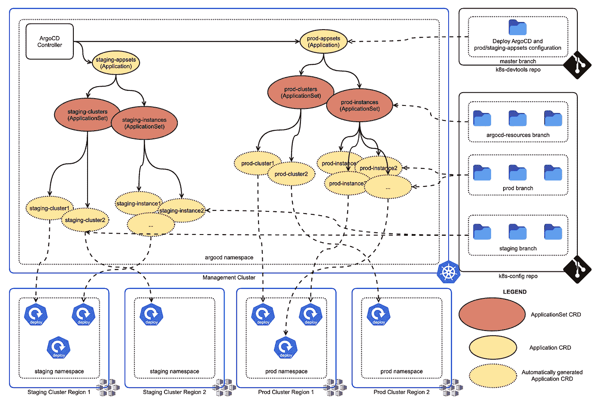
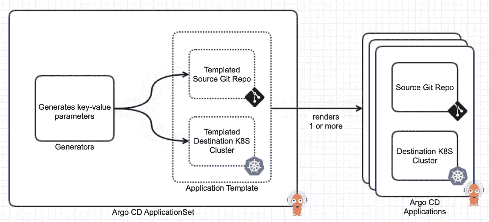

# 用 ApplicationSet 升级你的 Argo CD 游戏

> 原文：<https://itnext.io/level-up-your-argo-cd-game-with-applicationset-ccd874977c4c?source=collection_archive---------1----------------------->



如何在不真正部署 Argo CD 应用程序的情况下部署 Argo CD 应用程序

在 Kubernetes 生态系统中，我最喜欢的工具之一是 Argo CD。它采用了 GitOps 的理论概念，并把它变成了一个实用的、用户友好的工具，并提供了一个 UI 来启动。知道它正在监视您的 Git 存储库(期望的状态)，不断地将它与 Kubernetes 中的清单(实时状态)进行比较，并提醒您任何偏差，这正是 DevOps 工程师需要的自动化类型。

如果你对 Argo CD 不熟悉，我强烈推荐[探索它](https://argo-cd.readthedocs.io/en/stable/)并把它加入你的军火库。博客的其余部分假设你已经基本熟悉。

# 应用程序太多的问题

正如我在[的 Kubernetes 所有权模型](/the-kubernetes-ownership-model-50802b9f264)中所解释的，我使用 Argo CD 来部署一系列商业应用程序。随着应用程序的数量开始增长，一个独特的问题出现了。管理所有 Argo 光盘应用资源变得一塌糊涂。我通过舵图部署 Argo CD，所以我可以使用[值. yaml](https://github.com/argoproj/argo-helm/blob/argo-cd-3.22.1/charts/argo-cd/values.yaml#L838) 到*声明*Argo CD 应用程序资源。但是想象一下，在一个 values.yaml 中有数百个应用程序规范，这可不好玩。

最初，Argo CD 用户社区提出了一个有趣的解决方案。因为 Argo CD 应用程序 CustomResourceDefinition (CRD)只是一个源(Git 存储库)和一个目的地(Kubernetes 集群)的组合，所以它可以用来部署*另一个* Argo CD 应用程序本身！这被称为应用模式的[应用。现在，我不需要在 values.yaml 中声明所有这些应用程序，而是只需要声明一个应用程序(应用程序中的应用程序),并将所有其他应用程序的规范移到 Git 存储库中。](https://argo-cd.readthedocs.io/en/stable/operator-manual/cluster-bootstrapping/#app-of-apps-pattern)

虽然这很酷，但是请注意，它并没有真正解决问题。它只是把问题转移到了别处。如果你够聪明，你可以将那些应用程序转移到由另一个团队管理的 Git 存储库中，并把它变成其他人的问题；-)

# Argo 光盘应用程序集

Argo CD 团队注意到 App of Apps 模式的创新使用，并将其转化为一个更通用、更强大的解决方案，称为 [ApplicationSet](https://argo-cd.readthedocs.io/en/stable/user-guide/application-set/) 。这是*生成* Argo 光盘应用程序的另一个 CRD。

应用程序 CRD 由源和目的地组成，应用程序集 CRD 由[生成器](https://argocd-applicationset.readthedocs.io/en/stable/Generators/)和应用程序模板组成。生成器*生成*键值参数，这些参数在应用程序模板中被替换，以呈现实际的应用程序资源。



Argo 光盘应用程序集

# 何时使用 Argo 光盘应用程序集

首先，如果你没有“太多应用”的问题，你不需要使用 ApplicationSet。其次，如果你有太多的应用程序，考虑一下这些应用程序中的一些是否在功能上*相似。问一个问题，ArgoCD 应用程序代表什么？*

1.  也许应用程序代表您系统中的“租户”。如果每个租户都需要部署一组 pod，那么您需要一个 ArgoCD 应用程序。
2.  也许应用程序代表你公司的“团队”。作为一个平台团队，您希望为每个 DevOps 团队部署一组 pods。
3.  也许应用程序代表了部署在每个 Kubernetes 集群中的“工具组合”。
4.  也许应用程序代表了软件生命周期的“环境”。

在上述所有场景中，您都有许多相似的应用程序，并且需要…

1.  从不同的 Git 存储库/分支部署。
2.  或者部署到多个/不同的 Kubernetes 集群。
3.  或者部署到同一个 Kubernetes 集群的不同名称空间。

所有这些用例都可以通过 ApplicationSet 轻松实现。

# 用什么“发电机”？

有许多可用的生成器，但我更喜欢的是 Git 文件生成器。这将键值参数生成逻辑委托给了一个 JSON/YAML 文件，您猜对了，这是一个 Git 存储库(我知道这很疯狂)。

下面是一个 JSON 文件示例(它可以包含任何参数，没有限制):

```
{
  "tenant": {
    "owner": "contact@tenant.com",
    "name": "tenant",
    "id": "tenantId",
    "region": "eastus2"
  },
  "k8s_cluster": {
    "owner": "admin@company.com",
    "name": "customer-prod",
    "address": "https://1.2.3.4"
  }
}
```

上面定义的参数可用于应用程序集，如下所示:

```
apiVersion: argoproj.io/v1alpha1
kind: ApplicationSet
metadata:
  name: tenant-apps
spec:
  generators:
    - git:
        repoURL: git@github.com:example-tenant-apps.git
        revision: HEAD
        files:
          - path: "argocd/tenant-discovery/**/config.json"
  template:
    metadata:
      name: '{{tenant.name}}'
    spec:
      project: default
      source:
        repoURL: git@github.com:example-tenant-configurations.git
        targetRevision: HEAD
        path: '{{tenant.region}}/tenants/{{tenant.name}}'
        helm:
          valueFiles:
            - values.{{tenant.name}}.yaml
      destination:
        server: '{{k8s_cluster.address}}'
        namespace: prod
      syncPolicy: { }
```

请注意应用程序模板部分。像`values.{{tenant.name}}.yaml`这样的一些字段是通过将被生成器替换的参数来填充的。其他字段如`namespace: prod`是硬编码的，对所有应用程序都是一样的。您希望您的应用程序集是静态的还是动态的，这完全取决于您。

另一个有趣的特性是，*可以通过在路径字段中使用`**`来发现*多个 JSON/YAML 文件。添加一个新租户只需要在`argocd/tenant-discovery`下添加另一个带有自己的`config.json`的文件夹。生成器将自动发现新的租户并创建另一个 Argo CD 应用程序资源。

# 以声明方式部署应用程序集

*虽然 Argo CD 应用程序可以使用 Argo CD 舵图以声明方式*部署*，但它还不支持应用程序集部署。别担心，阿尔戈光盘来拯救！记住 Argo CD 应用程序可以用来部署任何东西，包括应用程序集本身！*

*这可以在上面的标题图像中看到。应用程序`prod-appsets`部署多个 ApplicationSet 资源，这些资源又部署多个应用程序。Argo CD 能够处理这种情况，并正确管理所有应用程序的生命周期。*

# *应用程序集演示*

*想要在您自己的集群中快速尝试应用程序集部署吗？查看 GitHub repo 并按照自述文件中的说明进行操作。*

*[](https://github.com/xsreality/argocd-applicationset-demo) [## GitHub-xs reality/argocd-ApplicationSet-Demo:Argo CD ApplicationSet 的演示库…

### 此存储库包含使用 ApplicationSet 控制器部署 Argo CD 应用程序的示例配置…

github.com](https://github.com/xsreality/argocd-applicationset-demo) 

# 结论

Argo CD 是一个基于 GitOps 的强大的持续部署工具。与 ApplicationSet 相结合，它使您能够部署许多应用程序，而不必在任何地方显式声明它们。利用它为多种环境、团队、客户或您能想到的任何东西部署应用程序！如果你正在使用 ApplicationSet，我想知道更多关于它的信息。*