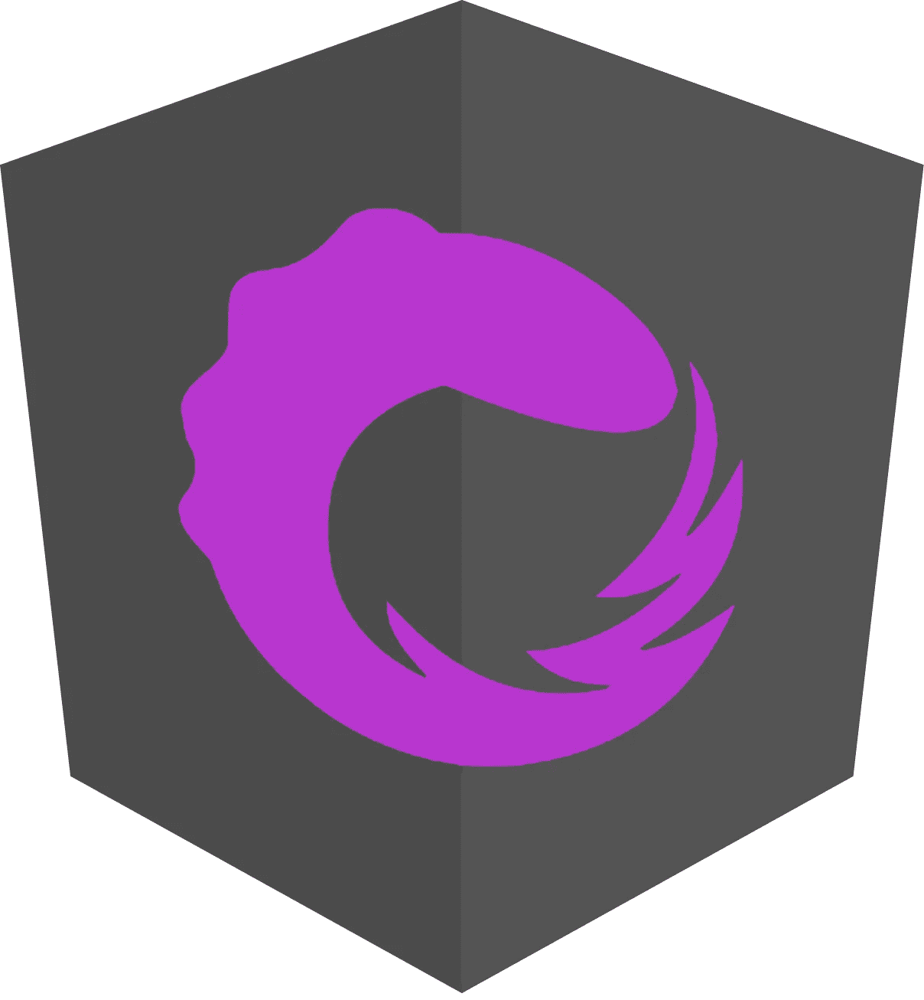
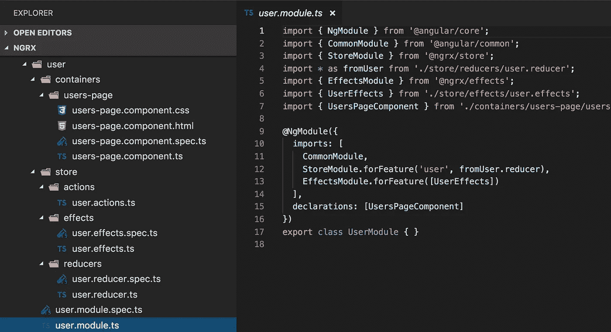
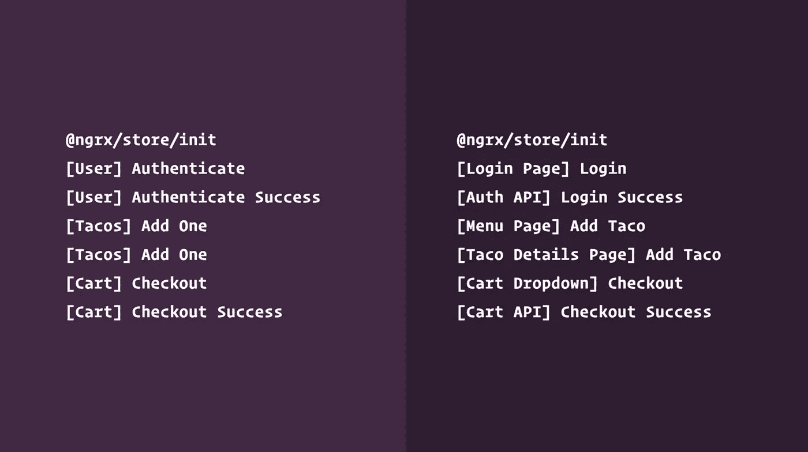
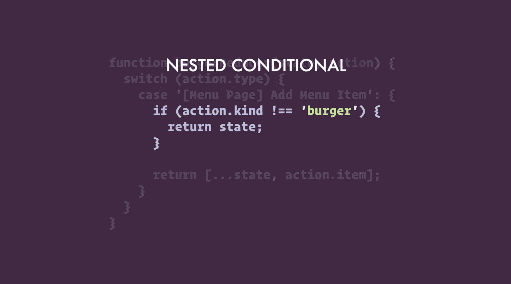

# 升级你的 NgRx 游戏

> 原文：<https://itnext.io/level-up-your-ngrx-game-42652afc25bd?source=collection_archive---------1----------------------->

既然你在这里，很可能你已经在你的 Angular 应用中使用了 NgRx。无论如何，我想引用它的官方网站来简单介绍一下。

> @ngrx 为 Angular 应用中的反应式编程提供了一套干净的、经过充分测试的库。—[http://ngrx.github.io/](http://ngrx.github.io/)



从去年开始，我一直在使用 NgRx 为我们的一个企业客户构建相当复杂的应用程序。

我的 NgRx 之旅包括使用最新版本的 NgRx 构建一个全新的应用程序，将一个有状态的 Angular 应用程序迁移到一个反应式应用程序，以及将一个旧的 NgRx 应用程序迁移到最新版本。

> 我想通过给 NgRx 的现有用户和完全初学者一些提示和技巧来分享我迄今为止的经验。

本文中的例子基于 NgRx v6，它使用动作类，而不是创建类。要查看这篇博文的最新版本— v8 最佳实践示例，您可以观看我在 2019 年 5 月在维罗纳举行的 [angularday 会议](https://2019.angularday.it/)上的演讲:

# 使用示意图

如果你不熟悉《角度世界》里的原理图是什么，请先看看[这个帖子](https://blog.angular.io/schematics-an-introduction-dc1dfbc2a2b2)。

NgRx 团队在版本 5 中引入了@ngrx/schematics。如果你想减少**样板**，你肯定会喜欢这个。它也将帮助你与非官方现有的风格指南保持一致。


NgRx 团队喜欢样板文件上的抱怨。布兰登别挡着我，兄弟。说真的。

NgRx schematics 的一个好方法是将其设置为角度应用的默认集合。安装@ngrx/schematics 后，执行以下操作，将其设置为 Angular 应用程序的默认集合。

```
ng config cli.defaultCollection @ngrx/schematics
```

使用 3 个简单的 CLI 命令，您可以为新的反应式特性生成样板代码，包括测试床配置。它的结构与 [NgRx example-app](https://github.com/ngrx/platform/tree/master/projects/example-app) 中的完全一样。

```
ng g module user --flat false
ng g feature user/store/user --module ./user/user.module.ts --group
ng g container user/containers/UsersPage
```

> 实际上这是一件大事！



与示例应用中相同的文件夹结构—[https://github . com/ngrx/platform/tree/master/projects/example-app](https://github.com/ngrx/platform/tree/master/projects/example-app)

进一步的使用说明可以看一下文档—[https://github . com/ngrx/platform/tree/master/docs/schematics](https://github.com/ngrx/platform/tree/master/docs/schematics)。

# 保持良好的行动卫生

动作是 NgRx 应用程序的基础。良好的行为卫生能够同时帮助业务开发和软件工程师，这一点非常重要。

> 好的行动是一年后你可以阅读的行动，并告诉你他们被派遣到哪里。—迈克·瑞安

正如 [Mike Ryan](https://medium.com/u/d6ba4dcb6838?source=post_page-----42652afc25bd--------------------------------) 在他的[良好行动卫生与 NgRx 谈话](https://www.youtube.com/watch?v=JmnsEvoy-gY)中所说，糟糕的流程导致糟糕的应用程序质量。我想从他的演讲中强调一些常见的陷阱作为参考，希望它能帮助更多的人避免它们。

## 不要重复使用动作

> 动作应该捕捉事件，而不是命令。

试着在你的系统中将你的行为建模为独特的事件，这样一年后你就可以很容易地理解它从何而来。

> 决策者应该是减少者和影响者

在你的应用中，将事件的描述和处理方式分开。把决定权留给你的还原器和效果，你的组件不应该决定状态如何改变。

## 避免使用通用操作类型

当你查看你的代码或者你存储的 devtools 日志时，每个人都应该清楚你的应用程序是如何运行的，以及事件的来源是什么。

特别是对于开发团队来说，在一个大的应用程序中精确定位任何一个动作对每个人的帮助都是超乎你想象的。

实现这一点的一个好方法是使用**【源】事件**格式。



通用操作与专用操作 Mike 演示中的一个例子

## 不要做动作打字

这个缺陷与动作重用密切相关。如果你避免了第一个陷阱，你就不会陷入其中。不要强迫它用子类型来构建通用的动作，并且尽可能地让你的动作具有独特性。



reducer 中的嵌套条件 Mike 演示中的一个例子

落入这个陷阱可能会在整个应用程序中引入条件分支。当它们随着应用程序规模的扩大而增加时，维护它们将是一件痛苦的事情。在 reducers 和 effects 中避免嵌套条件！

# 用@ngrx/entity 简化您的减速器

NgRx 团队努力减少样板文件。这是建立这样一个图书馆的原因之一。但是还有更多！


您可能要处理存储中的集合，用庞大而复杂的实体集合维护存储数据可能会让您头疼，更不用说它会给您的 reducers 带来样板代码了。

@ngrx/entity 是来拯救简化你的 reducers 和域模型的。

## 实体状态

设置实体适配器后，实体状态在存储中将如下所示。

```
interface EntityState<T> {
  ids: string[];
  entities: { [id: string]: T };
}
```

在实体状态中维护实体字典和 id 列表有几个原因:

1.  为了让你的收藏和字典一样有序，你需要一个有序列表。这就是为什么 ids 数组是实体状态的一部分。
2.  如果您以列表形式维护数据，查找操作在大多数情况下都是开销很大的操作。与通过数组搜索相比，对实体使用字典要快得多。

## CUD 操作(创建、更新、删除)

实体适配器为商店中的 CUD 需求带来了许多有用的方法。

看看下面我的应用内事件例子，看看可用的操作，以及部分改变对象的不同用例。

实体适配器和一些 CUD 操作— reducer

## 默认选择器

您的实体适配器实例为您导出了 4 个有用的选择器。您可以将它们导出到您的选择器文件中，如果需要的话，还可以导出您的自定义文件。

```
export const {
  selectIds,
  selectEntities,
  selectAll,
  selectTotal,
} = yourEntityAdapter.getSelectors();
```

## 如果您有太多的领域模型，请使用 ngrx-data

如果你想把领域模型的样板代码减少到另一个水平，你可能想看看 T2 的 ngrx 数据库。它还不是官方@ngrx/platform 的一部分，但他们宣布很快就会是了。

它不是 ngrx 的替代方案，而是 It 扩展管理域模型的一个额外特色。正如他们的文件所述:

> 许多应用程序都有大量的*域模型*，其中有 10 或 100 个[实体类型](https://github.com/johnpapa/angular-ngrx-data/blob/master/docs/faq.md/#entity)，如*客户*、*订单*、*行项目*、*产品*和*用户*。
> 
> 简单地说，为每个实体类型创建、检索、更新和删除(CRUD)数据是一项艰巨的任务。您正在编写*动作*、*动作创建者*、*减少者*、*效果*、*分派者*和*选择器*，以及每个实体类型的 HTTP GET、PUT、POST 和 DELETE 方法*。*
> 
> 即使在一个小模型中，这也是大量重复的代码来创建、维护和测试。
> 
> *ngrx-data* 库是*保持在 *ngrx* 路径上的一种*方式，同时从根本上减少了使用 *ngrx* 管理实体所必需的“样板文件”。

> 如果您还没有在 ngrx 应用程序中使用@ngrx/entity，我强烈建议您这样做。你可以在下面的介绍文章中了解更多。

 [## @ngrx/entity 简介

### 关于用 NgRx 构建应用程序，最常见的抱怨之一是开发人员不得不…

medium.com](https://medium.com/ngrx/introducing-ngrx-entity-598176456e15) 

# 认真使用选择器

选择器是一个纯粹的函数，它将你的状态分割成一部分。它们是过滤掉状态对象的小查询函数。除了在视图层中使用选择器之外，还可以在其他选择器上组合选择器函数。

你应该开始使用选择器，既要符合 [DRY 原则](https://en.wikipedia.org/wiki/Don%27t_repeat_yourself)又要考虑性能。纯选择器函数将帮助您避免在每次需要状态时对其进行切片，最终避免您重复自己。对于它带来的性能优势，让我们来看看 NgRx 选择器文档中的以下引文:

> 因为选择器是[纯函数](https://en.wikipedia.org/wiki/Pure_function)，所以当参数匹配时可以返回最后的结果，而不需要重新调用选择器函数。这可以提供性能优势，特别是对于执行昂贵计算的选择器。这种做法被称为[记忆](https://en.wikipedia.org/wiki/Memoization)。
> 
> — NgRx 选择器文档

下面是选择器的一个用法示例，包括从不同的特性组合选择器:

撰写选择器—选择器

看看选择器高级用例的官方文档，它一定会帮助你解决你的 app 中的复杂问题:[https://github . com/ngrx/platform/blob/master/docs/store/selectors . MD](https://github.com/ngrx/platform/blob/master/docs/store/selectors.md)

# 保持你的店铺整洁

NgRx store 上的一个常见争论是哪个状态实际上属于该存储。当我在 youtube 上看到[迈克·瑞安](https://medium.com/u/d6ba4dcb6838?source=post_page-----42652afc25bd--------------------------------)和[布兰登](https://medium.com/u/637b8a3ce256?source=post_page-----42652afc25bd--------------------------------)的[和*用 NgRx* talk 减少样板文件时，我的脑海里立刻产生了这个想法。我已经在思考这个问题，并在没有他们在演讲中清楚介绍的结构的情况下评估我的应用程序的状态。](https://www.youtube.com/watch?v=t3jx0EC-Y3c)

他们提出的结构无疑有助于决定哪个州属于商店。

答案是 **SHARI** ！如果您的状态符合以下任何类别，您应该将其保留在商店中。

S 共享
— *共享状态被许多组件和服务访问*

H 水化
— *储存后持续水化的状态*

一个可用
——重新输入路线时需要可用的状态

R etrieved
—需要恢复的有副作用的状态

I 受影响
——受其他来源的行动影响的状态

# **序列化和水合**

如果你像我一样，你可能更喜欢在用户的浏览器存储中为你的应用程序商店的一部分持久化数据——比如应用程序设置，并水合它。这可以通过 meta 减速器来实现。

## 序列化

只是在存储数据时要小心序列化。您的数据必须是可序列化的，这意味着您不能将 Map()或 Set()对象实例放在存储中。

检查对象是否可序列化的一个简单方法是，简单地将原始对象与以下输出进行比较:

```
JSON.parse(JSON.stringify(obj))
```

## 持久储存和水合作用

我使用 [ngrx-store-localstorage 包](https://www.npmjs.com/package/ngrx-store-localstorage)将存储数据持久化到 localstorage 中。下面是一个使用 meta reducer 实现的示例:

您商店的持久存储— reducer

商店的持久存储—功能模块

顺便说一下，NgRx 团队已经宣布，下一个版本 7 将内置对水合和序列化的支持。

所以，很期待！查看下面的公告，了解更多新闻。

[](https://medium.com/ngrx/announcing-the-release-of-ngrx-6-new-projects-and-looking-ahead-5fc30bed260b) [## 宣布 NgRx 6 的发布、新项目和展望

### 今天，我们很兴奋地宣布 NgRx 框架的 v6 正式发布。这个版本充满了错误…

medium.com](https://medium.com/ngrx/announcing-the-release-of-ngrx-6-new-projects-and-looking-ahead-5fc30bed260b) 

关注我的 [**Twitter**](https://twitter.com/onderceylan) 以获得更多类似本文中的提示。

如果你觉得这篇文章有用，请不要忘记**鼓掌**和**关注**。*愿纯净与您的功能和部件同在！*