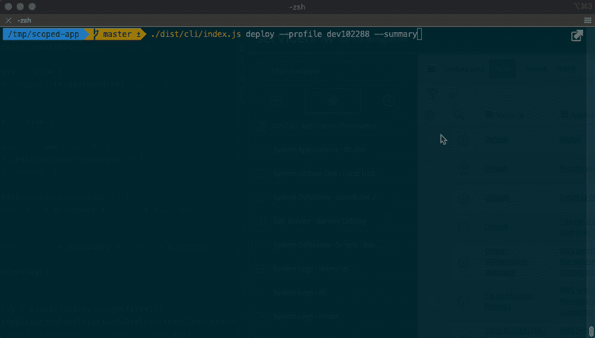

# 用装饰者和变形金刚升级你的打字游戏

> 原文：<https://itnext.io/level-up-your-typescript-game-with-decorators-and-transformers-333cfdaf284a?source=collection_archive---------2----------------------->

立刻:TypeScript 是一种令人惊叹的编程语言。它让您可以编写更好的代码，在设计时发现大多数(如果不是全部)错误，而不是在运行时爆发(尽管如此，还是要对您的错误处理给予一些爱，永远💖)这是一种真正成熟的语言，在全球范围内以及在[云软](https://cloudsoft.io)的工程师中受到了广泛关注。

今天，我想和你分享两个可以极大地增强你的开发工作流程的特性。这些是:

1.  TypeScript 的一个众所周知但未被充分利用的特性:[**decorator**](https://www.typescriptlang.org/docs/handbook/decorators.html)。
2.  TypeScript 的一个未知且不公开的特性: **transformers** 。

我还将向您展示这些功能联合使用时所释放的真正酷的东西。好了，我们走吧！

# 打字稿装饰工，他们是什么？

如果你熟悉编程，有一个同义词你可能已经知道:**注释**。Decorators 不是一个 TypeScript 特性，但实际上来自 JavaScript，是一个 [stage 2 proposal](https://github.com/tc39/proposal-decorators) 。它们的核心只是 JavaScript 函数，可以“挂钩”到类、方法、访问器、属性或参数。

当由 TypeScript 传输时，decorators 包装这些资源来执行元操作。例如，假设您希望以同样的方式初始化几个类，但是您也需要为其中的几个类覆盖这个初始化。编写一个装饰器来注释你的类，让你可以做到这一点，而且不会有什么麻烦:

运行此示例将输出:

> 给猎鹰 9 号加了 100 吨燃料。准备发射🚀
> 给星舰加 250 吨燃料。准备发射🚀

如果你看一下 transpiled 的 JavaScript 代码，构造函数被 decorator 函数包装，这就是如何设置`fuel`属性的。因为这些方法只是包装器，所以它们几乎只在运行时使用。但是如果我告诉你你也可以在编译时使用 decorators 呢？

不会吧，真的吗？

没错，基于 decorators，您可以在编译时执行任意操作，这就是令人兴奋的地方！剧透:如果你用过 Angular，那就是装饰师`@Component`和`@Inject`在幕后发生的事情。

# 看打字变形金刚

对于熟悉 Java 的人来说，您可以将转换器视为注释处理器。虽然，这些功能更强大——在我看来也更酷——因为它们不仅可以生成内容，还可以访问和更新正在处理的文件的 [AST](https://en.wikipedia.org/wiki/Abstract_syntax_tree) 。

虽然转换器对于 TypeScript 编译器来说是一个完全有效的概念，但是 API 并没有公开。所以要使用它，你需要自己的 `*tsc*` *编译器的包装器，或者像* `*ttypescript*` *这样的节点模块，或者使用* `*webpack*` *。*

基本转换器是一个递归函数，它将 AST 节点作为参数，并返回一个 AST 节点。返回的节点可以是同一个节点(没有修改)，也可以是不同的节点，或者是从 AST 中删除的节点。

例如，下面的例子是一个身份转换器，它递归地进入每个节点，并直接返回它。

但是只要有一点点想象力，你就能看到它有多强大。

变形一切！

# 无限的可能性

那么你能用它做什么呢？很高兴你这么问。

我举的最突出的例子是我们为一个客户开发和维护的一个大的、现实生活中的 ServiceNow 范围的应用程序(也就是插件的 ServiceNow 术语)。现在，我已经看到人们在逃跑，一提到服务就像看到了一群僵尸一样尖叫。现在:别担心，我不会谈论这个。嗯……不完全是，但是我必须和你分享一些背景，这样你就能理解为什么我想出了一个包含这两个特性的技术解决方案。

# 语境

我保证，我会长话短说。让我从 30，000 英尺的高度给你一个概述，而不是一头扎进 ServiceNow 的世界。当你为 ServiceNow 开发一个作用域应用的时候，你必须使用他们的“IDE”，也就是所谓的“Studio”。一个限定了作用域的应用程序由“应用程序文件”组成，大多数时候，这些文件是附加了元数据的 JavaScript 脚本。ServiceNow 使用一个定制的 Rhino 引擎来执行这些介于 ES5 和 ES6 规范之间的脚本，因此 JavaScript 在过去几年中带来的大多数酷东西都不能开箱即用，或者需要[polyfill](https://developer.mozilla.org/en-US/docs/Glossary/Polyfill)。

作用域应用程序可以进行版本控制，尽管因为每个应用程序文件实际上都是 ServiceNow DB 上的一条记录，所以最终在 git 上的实际文件是这些记录的序列化，以 XML 文件的形式。

哇，这比预期的要难说…

好吧，你还听得见我吗？太好了，对你来说是个好消息:现在🥳部分的服务结束了

我们通过仅使用 studio 开始了我们在作用域应用程序世界中的开发之旅。然而，我们很快就遇到了障碍，我刚才解释的后果是:

1.  拉请求是一场噩梦:我们必须比较序列化代码+来自数据库记录元数据(例如时间戳、ACL 等)的噪音。
2.  没有办法对我们的代码进行单元测试。
3.  作为开发人员，我们不能使用我们选择的 IDE，因此没有内联帮助，没有代码完成，什么都没有。

我们接下来做的事情可能有点疯狂，但这是解决上面 3 点的最明智的方法:**我们创建了另一个 git repo 来存储这些脚本，并将几乎所有内容转换成 TypeScript** 。

所有的发展都发生在这个“新的”git 回购中，并且仍然在发生。我们的代码现在结构良好，更加健壮，经过测试，并且由于 TypeScript，我们可以享受 IDE 提供的所有开发助手。

然而，这种工作方式引入了一个主要缺点:对于类型脚本文件中的任何更改，transpiled JavaScript 版本都需要手动复制粘贴到“Studio”中正确的“应用程序文件”上。这不仅乏味而且非常容易出错。随着时间的推移，我们想出了一个过程来减少错误并尽早发现它们，但该过程仍然是手动的，远远不够理想。

肯定有更好的方法🤔

# 技术上令人敬畏的方式

我带着以下问题开始了我的探索:

> 如果我们有办法知道从 TypeScript 中更新哪个“应用程序文件”会怎么样？
> 
> 如果它可以自动部署呢？
> 
> 实现这一目标需要什么？

你知道这是怎么回事，对吧？以显而易见为代价，我使用了打字稿**装饰**和**变形金刚**来做以下事情:

1.  每个 TypeScript 文件都用一个`@Deployable`装饰器进行了注释，该装饰器将表名、列名以及记录的 ID 作为参数。这是为了知道要更新什么记录以及在哪里更新。
2.  在编译项目时，一个定制的转换器会寻找任何`@Deployable`decorator，执行一个快速验证来检查一切是否正常，然后存储 TypeScript 和 JavaScript 文件的路径，以及来自(1)的参数。
3.  在编译结束时,( 2)的对象被序列化为 JSON，并被写入磁盘的输出文件夹中。

但你是来找代码的，不是吗？这就是:

@Deployable 注释目前正在我们的项目中使用。

注意，转换器会寻找任何`@Deployable`装饰者。但是，decorators 只能应用于类、方法、属性和参数。我们的代码库还包含脚本，这些脚本是我也需要部署的[生命函数](https://developer.mozilla.org/en-US/docs/Glossary/IIFE)。解决方案是在评论中寻找`@Deployable`装饰者。当转换器遇到一个时，它会动态创建一个`Node`,并将其解析为一个常规节点。

还要注意，当转换器遇到注释时，它会返回`undefined`。这有效地从 AST 中移除了装饰器，意味着 transpiled 版本与没有装饰器的 TypeScript 脚本相同。

然后，在`yargs`的帮助下，我施了一点魔法，在我们的项目中创建了一个小的 CLI 工具来封装上面的逻辑，并把一切都打包好。这意味着通过一个命令，该工具将:

1.  与`master`分支相比，获取已更改文件的列表。
2.  使用我的自定义 transformer + decorator 编译项目。
3.  从转换器中读取输出 JSON，并进行迭代。
4.  对于每个条目，查询 ServiceNow 实例以用新的 transpiled 版本更新记录。

🪄，这一定是魔法！

# 结论

凭借一点创造力和不到 300 行代码，TypeScript decorators 和 transformers 将一个容易出错且冗长的过程变成了一个非常简单的过程。用一个我称之为优雅的解决方案解决了我们最大的瓶颈之一，这是一个快速、可靠而且非常酷的解决方案。

当然，这不是唯一的用例。您可以使用这些来:

*   生成文档。
*   基于 decorators 生成模型类。
*   初始化实例和行为。
*   执行静态分析。
*   等等。

你对如何使用这个有其他的想法吗？它能解决你组织中的问题吗？我很想听听你的想法！

*最初发布于 2020 年 1 月 13 日*[*https://cloud soft . io*](https://cloudsoft.io/blog/level-up-your-typescript-game)*。*