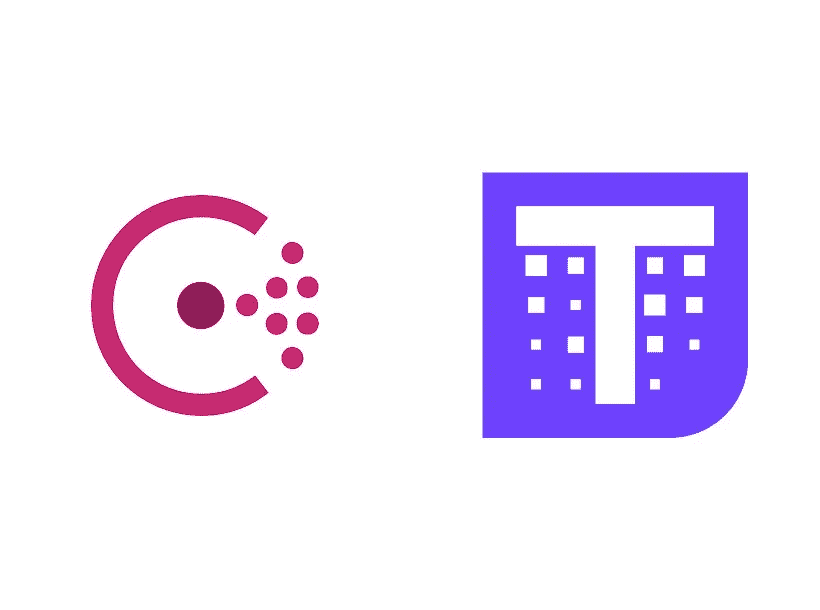
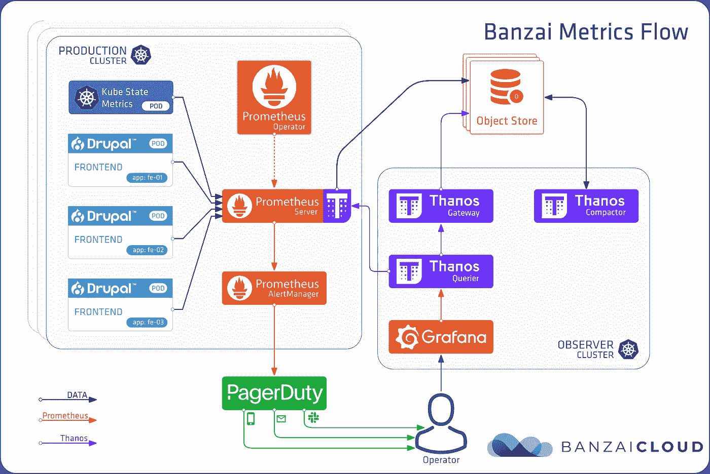
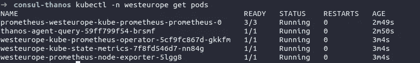
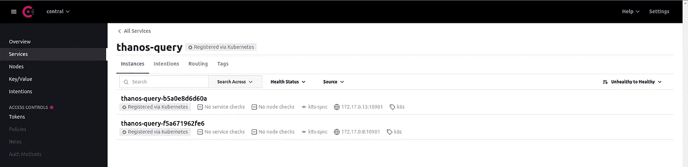

# 利用 Consul 进行灭霸查询发现

> 原文：<https://itnext.io/leveraging-consul-for-thanos-query-discovery-34212d496c88?source=collection_archive---------3----------------------->

对于要求高可伸缩性和动态性的环境，服务发现是一个至关重要的工具，今天我将向您展示如何使用 Consul 来帮助我们构建一个分布式监控平台。



利用 Consul 进行灭霸查询发现

# 放弃

在这篇博文中，我假设你熟悉灭霸、领事以及我将在这里介绍的所有其他工具。

# 多集群监控用例

多集群监控是企业环境中的一个日常用例，通常，您有一个控制平面，作为所有集群的集中视图，如下图所示。



[来自巴扎因的图像——多集束监测哨](https://banzaicloud.com/blog/multi-cluster-monitoring/)

我建议你看一下[坂仔云的博客帖子](https://banzaicloud.com/blog/multi-cluster-monitoring/)，以了解关于该解决方案的详细信息。

# 灭霸极限

正如灭霸的官方文档中所描述的，对于诸如 Consul 这样的商业服务发现解决方案，没有官方支持。

但是按照他们的文档，您可以自己实现它，并利用发现特定操作的 API 目标。

> 目前，还没有计划添加其他服务发现机制，如 Consul SD、Kubernetes SD 等。但是，我们欢迎人们通过将结果写入文件 SD 来实现他们首选的服务发现，这些结果可以由不同的灭霸组件使用。
> 
> [灭霸指标](https://thanos.io/tip/thanos/service-discovery.md/#other)

# 技术解决方案

现在您已经有了关于用例及限制的所有需要的上下文，让我们构建一个解决方案，利用 Consul 和 Consul 模板来发现不同集群中的灭霸查询实例。

## 营造环境

为了构建模拟上面提到的用例所需的所有东西，我将使用 minikube 并使用名称空间模拟多个本地集群，只是为了让示例尽可能简单。

**创建迷你库**

要启动一个新的 minikube 集群，可以使用下面的例子。

```
minikube start --kubernetes-version=v1.23.0 --memory=4g
```

**安装领事**

对于这个例子，我将为 Consul 使用[官方掌舵图](https://github.com/hashicorp/consul-k8s/tree/main/charts/consul)，但是在安装 Consul 之前，您需要使用下面的内容创建一个值文件。

*我想强调的是，我正在启用同步目录* *功能，它允许我们将 Kubernetes 服务同步到 Consul 目录中。*

```
global:
  name: consul
  datacenter: centralserver:
  replicas: 1

ui:
  enabled: true
  service:
    type: 'NodePort'syncCatalog:
  enabled: true
  default: false
  k8sAllowNamespaces: ['*']
  k8sDenyNamespaces: ['kube-system', 'kube-public']
```

现在，您可以运行以下命令:

```
helm upgrade -i consul hashicorp/consul --create-namespace -n consul -f consul-values.yaml
```

现在，如果您想访问 Consul UI，您可以运行以下命令:

```
kubectl -n consul port-forward svc/consul-server 8500:8500
```

**为西欧“集群”安装监控堆栈**

监控堆栈由不同的组件组成。我正在使用 **kube-prometheus-stack** 掌舵图来帮助我部署 prometheus、Node-Exporter 和 KubeStateMetrics，对于灭霸查询我正在使用[灭霸 Bitnami 掌舵图](https://github.com/bitnami/charts/tree/master/bitnami/thanos/)。

**创建名称空间集群**

如前所述，我使用名称空间来模拟集群。记住这一点，让我们创建一个名为 **West Europe 的名称空间。**

```
kubectl create ns westeurope
```

**创建灭霸对象存储秘密**

在安装 **kube-prometheus-stack 之前，**我们需要使用下面的内容创建一个将被灭霸边车使用的对象存储配置的秘密。

```
apiVersion: v1
kind: Secret
metadata:
  name: thanos-secret
type: Opaque
stringData:
  objstorage.yaml: |-
    type: FILESYSTEM
    config:
      directory: "/etc/thanos/data"
```

因为这是一个本地主机环境，并且想法是尽可能简单，所以我使用文件系统选项。

```
kubectl apply -f thanos-secret.yaml -n westeurope
```

**安装 kube-prometheus-stack**

在灭霸秘密创建之后，我们能够使用以下内容作为值文件来安装 **kube-prometheus-stack** 。

```
alertmanager:
  enabled: falsegrafana:
  enabled: falseprometheus:
  prometheusSpec:
    volumes:
      - name: object-storage
        secret:
          secretName: thanos-secretthanos:
  objectStorageConfigFile: /etc/conf/objstorage.yaml
   volumeMounts:
     - mountPath: /etc/conf/
       name: object-storage
```

创建值文件后，我们可以运行以下命令。

```
helm upgrade -i westeurope prometheus-community/kube-prometheus-stack -n westeurope -f kube-prometheus-values.yaml
```

**安装灭霸查询**

我们需要进入西欧集群的最后一个组件是灭霸查询。

灭霸查询将允许我们从观察者群集查询西欧群集的数据。

在安装灭霸查询之前，您必须创建一个包含以下内容的值文件。

```
queryFrontend:
  enabled: falsequery:
  extraFlags:
    - --endpoint=dnssrv+_grpc._tcp.prometheus-operated.monitoring-agent.svc service:
    annotations:
      consul.hashicorp.com/service-sync: 'true'
      consul.hashicorp.com/service-name: 'thanos-query'
      consul.hashicorp.com/service-port: 'grpc'
```

我想在这里强调一下我添加到灭霸查询服务的注释，这些注释将允许领事目录同步到灭霸查询服务。

创建值文件后，您可以运行下面的命令来安装灭霸查询。

```
helm upgrade -i thanos-agent bitnami/thanos -n westeurope -f thanos-agent-values.yaml
```

**西欧监控栈概述**

安装完我上面描述的所有组件后，西欧“集群”上的监控堆栈应该如下所示。



监控堆栈西欧集群

**为北欧“集群”安装监控堆栈**

北欧集群将使用我在西欧使用的相同配置。所以你只需要把所有的东西安装在一个不同的名为 *northeurope* 的名称空间中。

**检查咨询界面**

此时，您可能已经启动了两个“集群”,并运行了所有必需的监控组件。现在，如果您使用我共享给 port-forward 的命令访问 Consul UI，您将能够在服务菜单中看到带有两个实例的灭霸查询服务。



领事 UI

## 构建观察者“集群”

在这篇博文中，观察者集群将只包含灭霸查询，以保持对重要内容的关注。

**领事模板**

Consul Template 是一个项目，它提供了一种便捷的方式将来自 [Consul](https://www.consul.io/) 的值填充到文件系统中，其思想是使用 Consul 模板功能来编写灭霸将寻找的服务发现文件。

**创建领事模板文件**

Consul Template 使用 Go template 引擎的子集来呈现值，记住这一点，我们可以创建一个包含模板逻辑的配置映射。

```
kind: ConfigMap
apiVersion: v1
metadata:
  name: consul-template-config-map
data:
  thanos-sd-file.tpl: |
    - targets:
      {{ range service "thanos-query" -}}
      - {{ .Address }}:{{ .Port }}
      {{ end -}}
```

这个模板迭代了 Consul 上的灭霸查询服务，并构建了灭霸查询可以用来发现新目标的结构。

**创建领事模板 HCL 配置**

如果您熟悉 HashiCorp 产品，您已经知道我们将在下面使用的 HCL 配置标准。

```
kind: ConfigMap
apiVersion: v1
metadata:
  name: consul-template-hcl-config-map
data:
  config.hcl: |
    consul {
      address = "consul-server.consul.svc.cluster.local:8500"
    } log_level = "info" template {
      source = "/consul-template/templates/thanos-sd-file.tpl"
      destination = "/etc/thanos/sd/thanos-sd-file.yaml"
    }
```

我正在配置 Consul 模板，以使用我在上面创建的 TPL 文件，并将其呈现在灭霸目录中。

## **灭霸查询**

现在我们已经有了使用 Consul 模板的所有基础，让我们开始构建灭霸查询舵图将使用的值文件。

**安装领事模板卷**

在我们开始添加 Consul 模板 SideCar 容器之前，我们需要在灭霸查询上将 Consul 模板配置挂载为卷。

```
extraVolumes:
  - name: consul-template-hcl-config
    configMap:
      name: consul-template-hcl-config-map
  - name: consul-template-config
    configMap:
      name: consul-template-config-map
  - name: thanos-sd-dir
    emptyDir: {}

extraVolumeMounts:
  - name: thanos-sd-dir
    mountPath: /etc/thanos/sd
```

**添加领事模板边车**

在卷配置之后，让我们添加 Consul 模板 SideCar 容器。

```
sidecars:
  - name: consul-template
    image: hashicorp/consul-template
    imagePullPolicy: IfNotPresent
    args: 
      - consul-template
      - -config 
      - /consul-template/config.d/config.hcl
    volumeMounts:
      - name: consul-template-hcl-config
        mountPath: /consul-template/config.d
      - name: consul-template-config
        mountPath: /consul-template/templates
      - name: thanos-sd-dir
        mountPath: /etc/thanos/sd
```

**灭霸查询 SD 配置文件路径**

最后但同样重要的是，我们必须提供一个额外的标志，通知灭霸查询使用服务发现文件。

```
extraFlags:
  - --store.sd-files=/etc/thanos/sd/thanos-sd-file.yaml
```

**灭霸查询终值文件**

按照我上面描述的所有步骤，您的灭霸查询值文件应该看起来像下面的例子。

```
queryFrontend:
  enabled: falsequery:
  extraFlags:
    - --store.sd-files=/etc/thanos/sd/thanos-sd-file.yamlsidecars:
  - name: consul-template
    image: hashicorp/consul-template
    imagePullPolicy: IfNotPresent
    args: 
      - consul-template
      - -config 
      - /consul-template/config.d/config.hcl
    volumeMounts:
      - name: consul-template-hcl-config
        mountPath: /consul-template/config.d
      - name: consul-template-config
        mountPath: /consul-template/templates
      - name: thanos-sd-dir
        mountPath: /etc/thanos/sdextraVolumes:
  - name: consul-template-hcl-config
    configMap:
      name: consul-template-hcl-config-map
  - name: consul-template-config
    configMap:
      name: consul-template-config-map
  - name: thanos-sd-dir
    emptyDir: {}

  extraVolumeMounts:
    - name: thanos-sd-dir
      mountPath: /etc/thanos/sd
```

现在，我们只需要通过运行下面的命令，将灭霸查询安装到观察者集群中。

```
helm upgrade -i thanos bitnami/thanos -n observer -f thanos.yaml
```

瞧，神奇的事情开始发生了，如果我们访问灭霸查询用户界面并查看商店菜单，我们将能够看到来自其他集群的灭霸查询实例。


观察者灭霸查询-商店列表

## 解决方案概述

让我们快速了解一下解决方案概述，以确保所有内容都清晰明了，可以开始了。

我们利用 Consul 模板来观察在不同集群中运行的 Consul 上所有可用的灭霸查询服务，然后将这些实例的地址和端口写入[灭霸文件服务发现格式](https://thanos.io/tip/thanos/service-discovery.md/#file-service-discovery)。

这意味着，每当一个新的集群诞生并且该集群的灭霸查询将其自身注册到 Consul 目录中时，它将被观察者集群中的灭霸查询自动发现。

## 结论

嗯！

我希望您喜欢这些内容，并且它可以帮助您轻松实现和扩展您的分布式监控解决方案。

如果您需要更多信息或解决对此解决方案的任何疑问或分享您的反馈，请随时联系我。