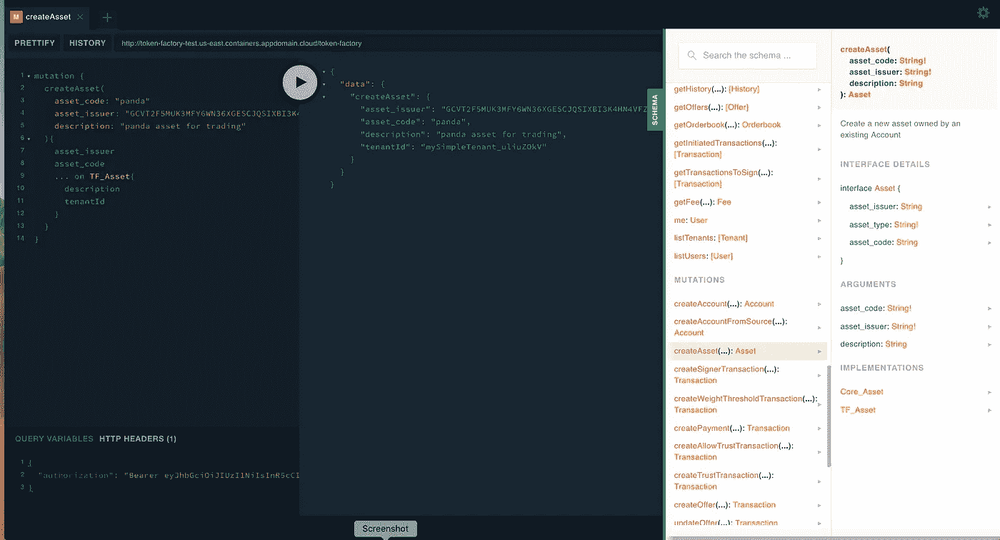

# 使用接口简化您的 GraphQL API 策略

> 原文：<https://itnext.io/leveraging-graphql-schema-and-interfaces-4bfa9b72d6b2?source=collection_archive---------3----------------------->

在最近的一篇文章[探索带有 Stellar](/exploring-tokens-with-stellar-291172208639) 的令牌中，我顺便提到了我们在创建 GraphQL 模式时是如何用额外的`context`来增强一些 [Stellar](https://www.stellar.org/) 数据对象的。这种方法在定义我们的数据模型时提供了很大的灵活性。在本文中，我将展示一种利用 GraphQL 接口来简化这些修饰数据对象的客户端编程模型体验的方法。

**作者注:**由于对这个话题的强烈兴趣，我们于 2019 年 3 月 14 日在 GitHub 上发布了组织 [token-factory](https://github.com/token-factory) 下的源代码。



# 接口作为 GraphQL 返回类型

我发现使用具体的例子通常有助于传达我试图理解的整体概念。因为我最近的焦点主要在 Stellar 上，所以我将使用 Stellar 的一个名为`Asset`的核心数据类型。为了创建资产，我们定义了一个负责资产创建的`mutation`。

```
"Create a new asset owned by an existing Account"
    createAsset(
      "Alphanumeric code that uniquely identifies the asset"
      asset_code: String!
      "Public key of the asset issuer (creator)"
      asset_issuer: String!
      "The description of the asset"
      description: String
    ): Asset
```

在上面的例子中，我们利用 Stellar SDK 来创建资产。有效载荷的输入包括核心恒星数据对象，如 asset_code，但也包含附加元数据，这些元数据存储在我们自己的本地数据库中，供我们在系统中使用。为了在后一个版本中实现最大的灵活性，我们定义了一个名为`Asset`的`interface`，它将允许我们根据正在使用的 API 返回`Asset`的变体，同时也为我们的前端开发人员提供一些提示，以指示正在返回哪个`implementation`接口。

# 资产实现

移动到`interfaces`的决定并不是从一开始就做好的。在我们 API 策略的早期版本中，我们为每个 API 创建了定制的数据对象，很少重用模式对象。当我们开始简化编程模型时，我们觉得接口是最好的方法。这背后的基本原理实际上是关于我们如何返回`Asset`信息。资产是核心数据对象，包含在 Stellar 的许多 API 中，包括支付、报价和历史查询。对于这些 API，返回我们完全修饰的名为`TF_Asset`的`Asset`实现是有益的，而对于更昂贵的查询，我们认为只返回直接映射到 Stellar 的轻量级`Core_Asset`就足够了。

下面是`Asset`的两个实现，用于比较。

```
type Core_Asset implements Asset {
    "Public key of the asset issuer (creator)"
    asset_issuer: String
    "Alphanumeric class that identifies the asset type"
    asset_type: String!
    "Alphanumeric code that uniquely identifies the asset"
    asset_code: String
  }type TF_Asset implements Asset {
    "Public key of the asset issuer (creator)"
    asset_issuer: String
    "Alphanumeric class that identifies the asset type"
    asset_type: String!
    "Alphanumeric code that uniquely identifies the asset"
    asset_code: String
    "The description of the asset"
    description: String
    "Email address for user.  Will be used as display name"
    email: String!
    "Tenant id that the user is a member of"
    tenantId: String!
    "Creation date of the asset"
    createdAt: Date!
    "Last modified date of the asset"
    updatedAt: Date!
  }
```

# 在模式中表示资产类型

由于存在两种可能的实现，包含资产的 API 的消费者需要提示来知道返回的是什么类型的资产。在我们的简单模型中，很容易根据`Asset`的一个必需字段进行识别，该字段只有在类型为`TF_Asset`时才会存在。GraphQL 支持通过定义解析器来表示类型的能力。在我们的解析器中，我们创建了一个基本的 if/else 检查来处理这个问题。

```
Asset: {
        __resolveType(obj, context, info){
            if(obj.tenantId){
                return 'TF_Asset';
            }
            return 'Core_Asset';
        },
    },
```

虽然超出了本文的范围，但让我展示一个更高级的解析器版本。对于我们的`History` API，我们返回一组`History`对象，其中的每个记录都可以是`interface`的不同`implementation`的一个。对于那个`interface`，解算器变得更高级一点，但遵循相同的模型。

```
History: {
        __resolveType(obj, context, info){
            if(obj.type === 'create_account'){
                return 'Create_Account';
            }
            if(obj.type === 'change_trust'){
                return 'Change_Trust';
            }
            if(obj.type === 'allow_trust'){
                return 'Allow_Trust';
            }
            if(obj.type === 'payment'){
                return 'Payment';
            }
            if(obj.type === 'manage_offer'){
                return 'Manage_Offer';
            }
            if(obj.type === 'set_options'){
                if(obj.signer_key || obj.signer_weight){
                    return 'Set_Signers';
                }else if(obj.clear_flags || obj.set_flags){
                    return 'Account_Flags';
                }else{
                    return 'Set_Threshold';
                }
            }
            return null;
        },
    },
```

# 客户端编程模型

当执行处理`interfaces`的 GraphQL 查询时，在如何访问实现特定的数据字段方面有一个小的修改。下面是获取已创建资产的查询，其中我们不仅包括核心`Asset`数据，还包括来自`TF_Asset`的一些附加数据

```
export const GET_ASSETS = gql`
  query getAssets {
    getAssets {
      asset_code
      asset_issuer
      ... on TF_Asset {
        description
        tenantId
        email
        createdAt
        updatedAt
      }
    }
  }
`;
```

注意 TF_Asset 周围的语法，以…开头，这向 [GraphQL Apollo Client](https://www.apollographql.com/docs/react/) 表示这些字段只存在于类型为`TF_Asset`的数据对象中。如果记录不是类型`TF_Asset`，那么这些字段将不会被请求。这为数据模型提供了一些灵活性，我们可以将描述、tenantId 和 email 等字段表示为`TF_Asset`所必需的，而不是其他`Asset`类型所必需的。

# 结论

在 GraphQL 中，接口是一个非常强大的构造，尤其是在试图构建一个包含许多数据类型的复杂 GraphQL 数据模式时。上面的文章展示了一组快速简单的例子，围绕创建一个`interface`很好地映射到恒星。我发现`interfaces`极大地改进了我们 API 的整体设计，并且可以在一本书中写下一章来介绍我们所有的接口用法，但是这已经超出了本文的范围。