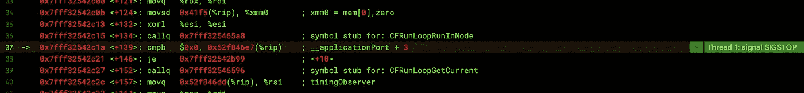

# 在 Xcode 的 LLDB 中利用 Swift

> 原文：<https://itnext.io/leveraging-swift-in-xcodes-lldb-d75e2adc5741?source=collection_archive---------2----------------------->

## 这是一种在 Swift 中定义助手函数的方法，这些函数在运行时注入到您的应用程序中，以便在调试时使用——不需要 LLDB-esque Python！



# 第一幕——设置场景

假设我们正在调试一个焦点视图丢失的问题。换句话说，我们正在寻找任何一个`isFocused`属性为`true`的`UIView`实例。在这个场景中，将视图背景颜色设置为红色很有帮助，这样我们可以很容易地看到它在屏幕上的位置。过去，我通过创建一个函数来递归应用程序中的所有视图，并在适当的地方设置背景颜色来实现这一点:

```
***1.*** func highlightFocusedView(in target: UIView) {
***2.***     target.subviews.forEach {
***3.***         if $0.isFocused {
***4.***             $0.backgroundColor = .red
***5.***        } else {
***6.***            highlightFocusedView(in: $0)
***7.***        }
***8.***     }
***9.*** }
```

我通常会将该函数放在我的`AppDelegate.swift`的顶部，并简单地不将其提交给源代码控制。为了运行这个函数，我用`⌃⌘Y`暂停执行，并在调试器中键入以下内容:

```
**(lldb)** expression -l Swift -O -- highlightFocusedView(in: UIApplication.shared.keyWindow!)*error: <EXPR>:3:1: error: use of unresolved identifier 'highlightFocusedView'*
```

哦，看来我需要导入我的应用程序包。最好先这么做:

```
**(lldb)** expression -l Swift -O -- import MyApp_tvOS
```

再试一次:

```
**(lldb)** expression -l Swift -O -- highlightFocusedView(in: UIApplication.shared.keyWindow!)*error: <EXPR>:3:26: error: use of unresolved identifier 'UIApplication'*
```

又来了——需要导入`UIKit`

```
**(lldb)** expression -l Swift -O -- import UIKit
```

最后，运行`expression -l Swift -O -— highlightFocusedView(in: UIApplication.shared.keyWindow!)`然后取消暂停调试器会导致我的设备屏幕上的视图改变颜色。

总结一下:

*   helper 函数存在于我的代码库中，我需要记住不要提交它
*   我有多个目标，所以我的助手函数需要在它们之间复制和维护
*   我所有的调试器命令都需要以`expression -l Swift -O --`为前缀，以便`lldb`将它们解释为 Swift 代码
*   在调用 helper 函数之前，我需要`import`我的 app bundle 和 UIKit。

# 第二步—定义 lldb 别名

和许多好的命令行工具一样，`lldb`有一个 init 文件。在其中，我们可以定义别名(当然没有 Python)。

```
**$** vi ~/.lldbinit   *# or use your second favourite editor*
```

在这里，我们可以创建一个别名`swift`，它可以扩展为`expression -l Swift -O --`(实际上，它与`po`相同，但是我们将在后面对其进行改进)。既然我们在这里，让我们为老目标 C 也创建一个，以防万一。将以下两行添加到您的`.lldbinit`文件中:

```
***1.***command alias objc expression -l objc -O --
***2.*** command alias swift expression -l Swift -O --
```

现在，下次我们启动应用程序并暂停调试器时，我们只需:

```
**(lldb)** swift import UIKit; import MyApp_tvOS
```

那么，为什么不创建一个别名来定义我们的助手函数呢？通过将我们的函数转换成一行(这是这种无 Python 方法的一个警告)并在它前面加上前缀`$`，我们可以将该函数标记为属于`lldb`。让我们把它和我们需要的两个导入结合起来。在你的`.lldbinit`后面加上下面一行:

```
***1.***command alias import_helpers expression -l Swift -O -- import UIKit; import MyApp_tvOS; func $highlightFocusedView(in target: UIView) { target.subviews.forEach { if $0.isFocused { $0.backgroundColor = .red } else { $highlightFocusedView(in: $0) } } };
```

现在当我们第一次暂停调试器时，我们可以运行

```
**(lldb)** import_helpers
```

从那时起，我们就可以`swift $highlightFocusedView(in: UIApplication.shared.keyWindow!)`随心所欲了！当然，您可以继续将`func $helpers(...)`添加到同一个别名中——只要确保它们都在一行上，并用`;`隔开

# intermission—cat transaction . flush()

您知道在暂停的调试器中进行更改后，可以强制设备屏幕更新吗？在运行任何改变 UI 的命令后，在`lldb`提示符下调用`swift CATransation.flush()`应该会强制刷新屏幕！您可以将它插入到您的助手函数中，或者将`func $flush() { CATransation.flush() }`添加到您的`import_helpers`别名中，这样您就可以根据需要使用`swift $flush()`了——不再需要解挂起调试器了！

使用`CATransation.flush()`对我来说是一种常见的技术，所以我希望能够以最简单的方式调用它(也就是说，我不想总是伸手去拿`$()`键)。使用正则表达式，我们可以在别名的变量输入周围插入代码。可选地，用下面一行替换我们之前制作的`command alias swift ...`:

```
***1\.*** command regex swift 's#(.+)#expression -l Swift -O -- defer { CATransaction.flush() }; %1#'
```

这是一种在每个命令后利用`defer`运行`CATransaction.flush()`的偷偷摸摸的方法。我们当然可以简单地在`%1`后添加`; CATransaction.flush()` *，但是这意味着调试器将打印所述函数的返回值(`Void`)供我们检查，而不是我们输入的代码。希望这种变通办法在将来仍然有效！*

# 第三幕——大结局

在每个调试会话开始时调用`import_helpers`并不困难，但是我们应该尽可能自动化重复的任务。另一个问题是我们的`import_helpers`包含了`import MyApp_tvOS`——如果我们正在处理其他目标或项目呢？如果别名中的一条语句失败，所有后续语句都将被跳过。相反，让我们使用一个断点。

Xcode 的 UI 为我们提供了一种创建运行命令的“符号断点”的方法——然而这些小窗口可能有点挑剔。所以让我们再次添加我们的`.lldbinit`:

```
***1.***breakpoint set -n AppDelegate.application --one-shot true --auto-continue true
***2.***breakpoint command add
***3.***swift import UIKit
***4.***swift import MyApp_tvOS
***5.***swift func $highlightFocusedView(in target: UIView) { target.subviews.forEach { if $0.isFocused { $0.backgroundColor = .red } else { $highlightFocusedView(in: $0) } } } ;
***6.***DONE
```

它是如何工作的？

*   `-n AppDelegate.application`使断点停在任何匹配该名称的函数上。在我的例子中，这分解为六个独立的函数。理想情况下，我们可以使用`AppDelegate.application(_:didFinishLaunchingWithOption:)`作为这个参数的值，但是我无法让它(或者它的变体)工作。基本上，对于这个参数，我们希望选择一个在尽可能接近应用程序生命周期开始时调用的函数，这样我们的助手就可以尽早创建。
*   `--one-shot true`表示断点在第一次遇到后应被删除(解决前一点的问题)。
*   意味着我们实际上并不想在到达这个断点时暂停执行:只是评估它的命令并继续。
*   `breakpoint command add`表示后面的每一行都应该追加先前创建的断点列表，当到达断点时必须执行这些命令。
*   `DONE`标志着`breakpoint command add`所期望的命令列表的结束

我们现在有能力创建一个可无限扩展(且可合理维护)的 Swift 语言助手函数列表，这些函数可在调试器中使用！

# **结语—我的助手函数**

## **$findViews(_:in:)**

我实际上没有一个`$highlightFocusedView(...)`助手，因为用一个通用函数找到某个类的所有视图很容易。例如，以下代码查找屏幕上的所有 UIButtons，并将它们的背景色更改为红色:

```
**(lldb)** swift $findViews(UIButton.self).filter({ $0.isFocused }).forEach({ $0.backgroundColor = .red })
```

我的另一个常见用途是更改标签的文本:

```
**(lldb)** swift $findViews(UILabel.self).first(where: { $0.text == "Interstellar" })!.text = "This is a really long string to test how the layout reacts to it"
```

## **$打印子视图(共个)**

这个助手简单地将私有消息`recursiveDescription`发送给一个视图，这样它就可以打印出它的继承性:

```
**(lldb)** swift $printSubviews(of: self.view.headerContainer)
```

## **n 对象。$from(_:)**

我最喜欢的:这个扩展有助于从一个地址获得一个具体的类型，你可能会在 Xcode 的视图调试器中找到这个地址(或者在打印一个数组时，可能会从`swift $findViews(UIView.self)`的输出中找到这个地址？).例如，如果我在视图调试器中看到一个视图，我想隐藏它，我可以从对象检查器中复制它的地址并运行:

```
**(lldb)** swift UIView.$from(0x7f921c5144a0).isHidden = true
```

可能性是无限的！

最后，这里是我的`.lldbinit`的一个活拷贝:

[https://gist . github . com/maxchuquimia/3eb 255 b 0ea 2088829 b 460358d 9 f 058d 3](https://gist.github.com/maxchuquimia/3eb255b0ea2088829b460358d9f058d3)