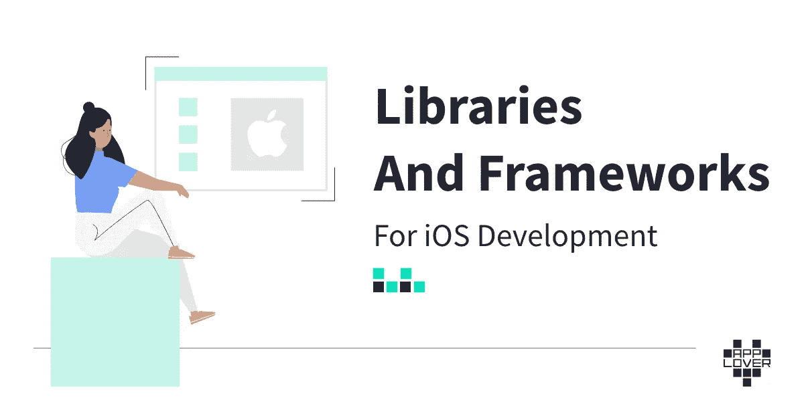

# iOS 开发的库和框架

> 原文：<https://itnext.io/libraries-and-frameworks-for-ios-development-2974e93c818d?source=collection_archive---------2----------------------->

当查看 [GitHub](https://github.com/) 或搜索解决方案时，有许多用于 [iOS 应用程序开发](https://applover.com/services/ios-app-development/)的库、工具和框架可供选择，但由于 [iOS](https://www.apple.com/ios/ios-14/) 是一项小众技术，因此评估解决方案是否值得您花费时间总是一个问题。

GitHub 上的星星是一个度量，但是 500 颗星星很多吗？对于 web 开发来说，这可能是沧海一粟，但是对于 iOS(有一个相当小的社区)，这足以让您对解决方案感兴趣。但是实际上并没有好的方法仅仅通过星星的数量来评估库的质量！

另一个(可能更好的)衡量标准是通过知名的 iOS 社区博客和出版商，查看他们使用或提供教程的内容。不过，还有一个问题:如何评估发布者/博主是否被认为是专家，是否在 iOS 圈子中受欢迎？又或许出版社只是出于个人喜好喜欢图书馆？

为技术做出最佳选择的关键并不在于具体的库和它们的受欢迎程度，而在于它们处理的基本概念。听起来不直观？看起来似乎是这样，但是在这篇文章中，我将试图证明，一旦你理解了这个库试图解决的问题，评估它们是非常容易的。

# 图书馆极其重要

所以让我直接列出在数千个项目中使用的 iOS 相关技术。该列表无论如何都不是详尽的。这是一组在招聘中很常见的例子，对我来说很有用。

**rx swift/rx cocoa/ReactiveSwift**:这个库为反应式异步序列和 UI 绑定提供 API。从我的经验来看，现在大约有 50%的现代项目在使用它，所以加入一个项目就像抛硬币一样。

**Google Maps/MapKit/OpenStreetMaps**:如果你正在开发的应用程序中有地图，它可能使用了这三个库中的一个。我认为你只需要知道其中一个，因为它们非常相似。

**CoreData/Realm** :当你想在本地存储数据，而 UserDefaults 又过于简单时，iOS 提供 CoreData 作为解决方案。虽然 CoreData 没有任何问题，而且许多人更喜欢它，但有些人更喜欢 Realm 作为替代。

**Firebase Cloud Messaging/user notifications+APNS**:第一个是 Google 做的接收和发送通知的整个系统。它允许您通过推送通知和 Websockets 发送消息。第二个是 FCM 在引擎盖下使用的苹果解决方案。Firebase 解决方案的最大优点是，您获得了推送通知之外的 web 套接字连接，并且您不必从头开始在后端实现 APNS(苹果通知服务)。

**Mixpanel / Google Analytics** :这两个是应用程序事件跟踪的主要部分。如果你想知道用户如何与应用程序互动，这项服务可以让你跟踪和收集数据。

**阿拉莫菲尔**:当你需要复杂的网络时，这是一个必去的图书馆。如果你的网络很简单，建议你坚持使用 URLSession。

如果你想显示从网络上获取的图像并缓存它们(不要每次显示时都下载)，你可以写一大堆代码，重新发明轮子或者使用其中的一个。第一个只是较新的和 Swift 的，而后者是一个旧的和经过验证的 Objective-C 库。

如果你有一个庞大的应用程序，并且很难跟踪对象的创建流程，以及数据是如何传递的，为什么不在代码中有一个地方专门用于所有的依赖项呢？

**浪子**:在将持续集成引入 iOS 应用程序开发方面，它绝对是一个重要因素。因此，需要定期发布测试版本的每个人都应该知道。

**XCTests/Quick&Nible:**第一个是 Xcode 内置的单元测试和 UI 测试库。后者允许你编写行为驱动的测试。Nimble 也可以与 XCTests 一起使用，用于更简单、异步和更具表达性的断言。

# 但他们不是！

我提到的每一个库都以自己特定的方式解决编程问题，但大多数时候它们实际上是基于更一般的概念。理解这些基本概念是很重要的。我认为这是每个应用开发者最重要的技能。库和技术栈一眨眼就变了，但是底层概念相对稳定。很多想法甚至是七八十年代的！记住它们，实现它们的库将立即变得不言自明，评估起来也很简单。

让我们举几个例子:

# Swift(或任何相关的编程语言)？面向对象编程和函数式编程！

当你学习一种编程语言时，精通另一种语言是一件非常简单的事情。为什么？因为所有语言的基本概念都是一样的，你需要理解的只是语法和方法上的差异。

如果你理解**面向对象编程**，Swift 中如何实现封装或者继承如何工作都是简单的话题。同样的规则也适用于**函数式编程**以及类似“为什么可选类型有平面图？”或者“为什么我的闭包中捕获的实例必须是常量，如果我想改变值，该如何处理？”。

# rx Swift/联合/反应 Swift？功能范式，反应范式

RxSwift 和其他类似的框架是函数范式知识的闪耀之处。根据我的经验，不了解 RxSwift 的人经常会说，“啊，这只是另一个库。我会在我们进行的项目中学习它”。很抱歉把它分解给你，但它不是，你也不会。是的，它“只是一个库”，但是这个**需要**你知道**功能和反应范例**。还记得学习面向对象范式和理解封装、多态、类和实例以及所有这些东西有多麻烦吗？还记得当一切最终“合二为一”时，那种突破的感觉有多强烈吗？要想擅长 RxSwift，你需要再有两个这样的突破，一个是函数式编程，一个是反应式编程。这同样适用于联合收割机或反应 Swift，它们大致相同。

# CoreData/Realm？关系数据库，对象数据库，ORM，SQL，noSQL，存储库模式

数据库是一个庞大的主题，很容易搞砸。虽然移动开发人员不必担心可伸缩性之类的问题(手机上不会有一百万个到数据库的连接，只有一个，来自使用该设备的用户)，但移动开发人员确实与数据库专家有许多共同的问题。 **ACID 缩写**就是一个很好的例子。**数据规范化**又是一个。当您拥有大量数据集时，直接使用 **SQL** 查询的能力也可以让您走得更远。如果你想从这些数据集中创建一个 Swift 对象呢？这里出现了 ORM 的概念(CoreData 不仅仅是一个 ORM，它还可以作为一个 ORM 来使用)。以及如何决定应该从本地数据库还是后端获取特定的信息？**储存库模式**来救援了！

# XCTest，快/捷？单元测试和模拟

为了正确地编写单元测试，你必须简单地理解**测试加倍的概念**(经常被错误地称为模拟)**和依赖**。一旦你看到了代码中所有的依赖问题，以及用测试替身来填补这些问题有多困难，你会很快发现所有这些库都是不言自明的！您还可以深入研究不同的测试方法！Quick library 推出的**行为驱动测试**就是一个很好的例子。

# 那么实际上我应该如何了解 iOS 库呢？

每个人都有自己的过程，所以我不能给你一个适合所有人的建议，你应该自己决定。也就是说，在吸收了库本身的基础知识之后学习底层概念将保证你的**知识不会随着这个特定的库实现****！一旦你理解了特定领域的所有问题，为 iOS 开发选择正确的库和框架就变得非常容易。**

# **最后一件事**

**我提到过关注博客是评估解决方案的一种相对较好的方式，所以下面是我的列表。这些资料帮助我完成了我的职业生涯，并帮助我理解了特定的库和底层概念。这个列表并不详尽，我非常确定我已经忽略了一些伟大的作者，但我保证如果你的谷歌搜索指向这些网站之一，它是值得一查的:**

*   **[raywenderlich.com |高质量编程教程:iOS、Android、Swift、Kotlin、服务器端 Swift、Unity 等等！](https://www.raywenderlich.com)**
*   **[利用 Swift 进行黑客攻击——通过免费的 Swift 4.2 教程学习编写 iPhone 和 iPad 应用程序的代码](https://www.hackingwithswift.com)**
*   **[目标 io](https://www.objc.io)**
*   **[可可与爱情](https://www.cocoawithlove.com)**
*   **关于函数式编程和 Swift 编程语言的视频系列。**
*   **[NSScreencast:面向 iOS 开发的小型屏幕截图](https://nsscreencast.com/episodes)**
*   **[RxSwift 松弛度](http://slack.rxswift.org)**
*   **[停笔雨燕那个烂](https://cocoacasts.com)**
*   **克拉肯德夫**
*   **[动动脑筋——iOS 开发新闻&小贴士](https://useyourloaf.com)**
*   **[雨燕 by Sundell](https://www.swiftbysundell.com)**
*   **[GitHub—JohnSundell/Swift tips:我在 Twitter](https://github.com/JohnSundell/SwiftTips) 上分享的一组 Swift 提示&技巧**
*   **[NSHipster](https://nshipster.com)**
*   **[尚有一篇](https://www.vadimbulavin.com) [其他 Swift 博客](https://www.vadimbulavin.com)**

***原载于 2021 年 5 月 28 日 https://applover.com***。****