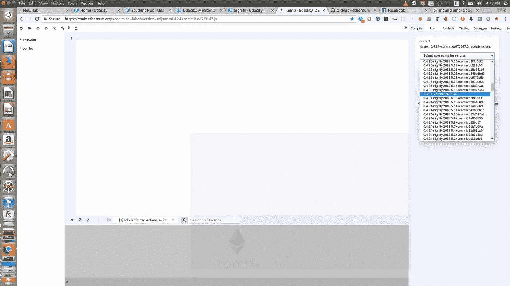
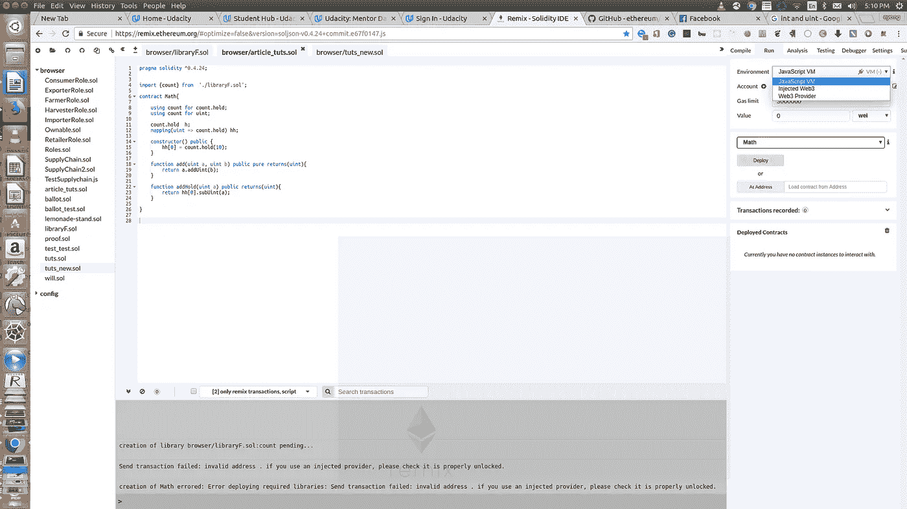
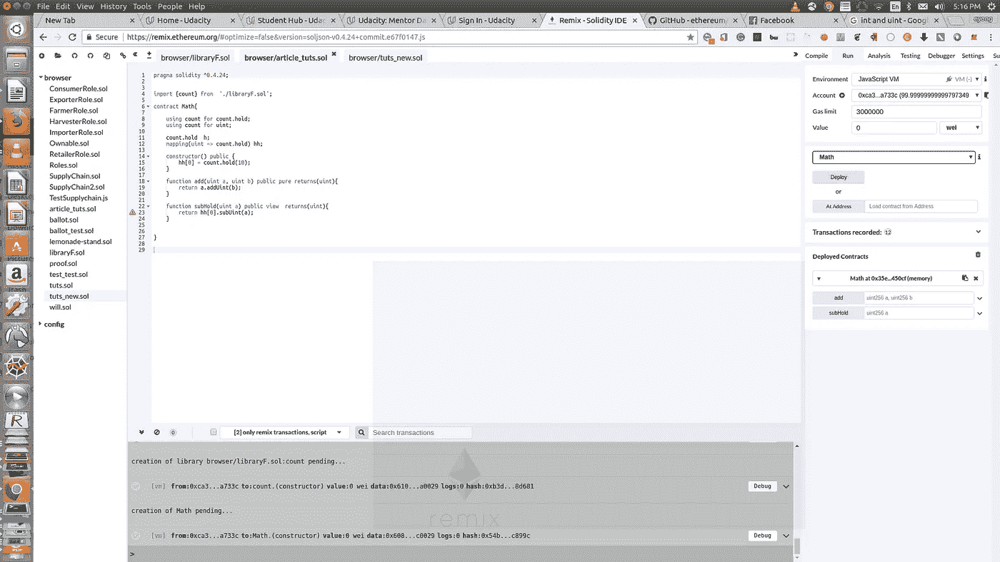
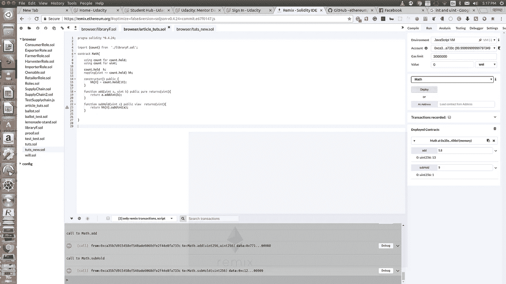

# 图书馆与图书馆的使用

> 原文：<https://itnext.io/libraries-and-using-for-in-solidity-5c954da04128?source=collection_archive---------2----------------------->


图片取自[https://www . bennettinstitute . cam . AC . uk/blog/why-are-uks-public-libraries-decning/](https://www.bennettinstitute.cam.ac.uk/blog/why-are-uks-public-libraries-declining/)

solidity 是一种面向对象的高级语言，用于实现智能合约。智能合约是在以太坊状态下管理账户行为的程序。在本文中，我们将通过涵盖以下主题来了解两个可靠性特性`Libraries`和`Using for`:

*   图书馆
*   用于
*   Solidity 库和 Solidity 使用，例如在 [Remix](https://remix.ethereum.org) 上。

# 固体图书馆

Solidity 库类似于契约，但是它们的目的是在一个特定的地址只部署一次，它的代码被不同的契约重用。如果调用库函数，它们的代码将在调用契约的上下文中执行。由于库是源代码的一个孤立部分，所以它只能访问调用契约的状态变量，如果它们被显式提供的话

> 库不能有状态变量；他们不支持继承，也不能接收以太。但是，它们可以包含结构和枚举。

Solidity 库一旦部署到区块链，任何人都可以使用，假设您知道它的地址并有源代码(只有原型或完整的实现)。solidity 编译器需要源代码，这样它可以确保你试图访问的方法确实存在于库中

实体库具有以下格式

```
library libraryName
{// struct and or enum declaration// function definition with body
}
```

> `libraryName`可以改成自己喜欢的名字。库主体可以包含 struct 和/或 enum 声明，以及将在库中执行各种操作的函数。

## 可靠性库使用案例/优势

Solidity 库有以下优点/用例

**可用性**:一个库中的函数可以被很多契约使用。如果您有许多包含一些公共代码的契约，那么您可以将这些公共代码部署为一个库。

经济实惠:将公共代码部署为库将节省汽油，因为汽油也取决于合同的大小。使用基础契约而不是库来分割公共代码不会节省汽油，因为在 Solidity 中，继承通过复制代码来工作。

**好的插件** : Solidity 库可以用来给数据类型添加成员函数。

> Solidity 库被称为使用它的契约的基础契约，因为它的函数具有内部可见性，并且它的所有结构和枚举都被复制到使用它的契约。此外，如果一个库只包含内部函数和/或结构/枚举，那么就不需要部署这个库，因为库中的所有内容都被复制到使用它的契约中。

## **Solidity 库示例代码**

将下面的代码复制到名为`libraryF.sol`的文件中

*   我们首先提到使用`pragma Solidity`指令编写代码的编译器版本
*   我们使用`library`关键字定义我们的库，并将其命名为`count`
*   我们的库有一个结构和两个功能。

> **注意**函数`subUint`如何接收一个结构体作为参数。在 Solidity v0.4.24 中，这在契约中是不可能的，但在 Solidity 库中是可能的

[在](https://docs.openzeppelin.org/docs/math_safemath)[open zeppelin smart contracts collection](https://openzeppelin.org/)中可用的 SafeMath 库是一个流行的 solidity 库，用于防止[溢出](https://ethereumdev.io/safemath-protect-overflows/)。

# 坚固性用于

Solidity 库可以和 Solidity `using for`一起使用。指令意味着我们附加库函数(从库 A 到任何类型 B)。当这种情况发生时，这些函数将接收调用它们的对象作为它们的第一个参数，很像 Python 中的变量`self`。

> `using A for *;`的作用是来自库 A 的函数被附加到所有类型上。

无论哪种方式，每个单独的函数，包括那些第一个参数的类型与对象的类型不匹配的函数，都会被附加。调用函数时，除了执行函数重载解析之外，还会检查类型。

**比如:**利用上面的`libraryF.sol`。我们可以对类型 uint 使用指令 using for libraryF，如下所示；

```
import {count} from  './libraryF.sol';using count for uint;uint a = 10;
uint b= 10;uint c = a.subUint(b);
```

**注意**:我们仍然可以做`uint c = a - b;`，它将返回相同的结果`0`。然而，我们的库有一些额外的属性，以防止溢出，例如；`assert(a >= b);`检查以确保第一个操作数`a`大于或等于第二个操作数`b`，这样减法运算不会产生负值。

# 实度库和实度在混音上的应用。

我们学习了`Solidity libraries`和`Solidity using for`。现在是时候把所有的放在一起了。我们将使用 [Remix](https://remix.ethereum.org) ，这是一个基于浏览器的编译器和 IDE，使用户能够用 Solidity 语言构建以太坊契约并调试事务。

## 设置混音

在浏览器上打开 [Remix](https://remix.ethereum.org) 并进行以下设置:

选择一个编译器(在本例中是版本:0.4.24)



创建两个名为`libraryF.sol`和`article_tuts.sol`的文件。要创建一个文件，你应该点击左上方的加号图标，如下图所示。这些文件将在**浏览器**下的左侧面板中找到并易于访问


## 编写您的可靠性函数

将上面**实体库示例代码**中提供的代码行复制到文件`libraryF.sol`中

将下面的代码行复制到文件`article_tuts.sol`

关于上面的代码，我们应该知道一些事情

*   我们已经从文件`libraryF.sol`中导入了我们的库**计数**
*   我们使用`using for`将我们的库计数链接到一个`struct`和 `uint`类型。
*   第一个函数`add`将调用我们的库函数`addUint`，这将把`b`添加到`a`。注意这里我们使用格式`a.addUint(b);`,意思是`a`作为库函数的第一个参数被自动传递。
*   第二个功能`subHold`与第一个功能相同。因为这个库函数接受一个 struct 对象作为第一个参数，这就是为什么我们使用了`hh[0].subUint(a);`，其中`hh[0]`是自动作为第一个参数传递的 struct 对象。

## 部署并运行

选择环境 **JavaScrip VM**



部署合同**数学**



执行各种操作(**添加**和**子保持**



# 谢谢你

干得好！！🙌

感谢你的阅读，我希望这篇文章能帮助你理解`using for` 和`libraries`。

快乐编码😇