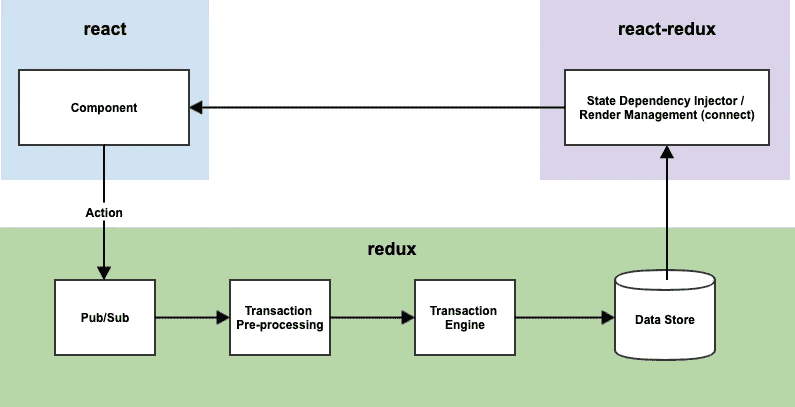
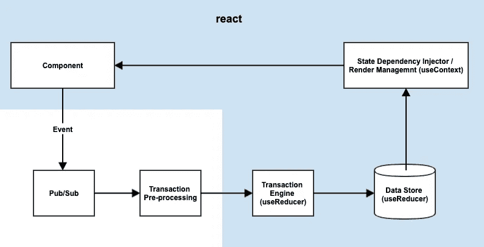
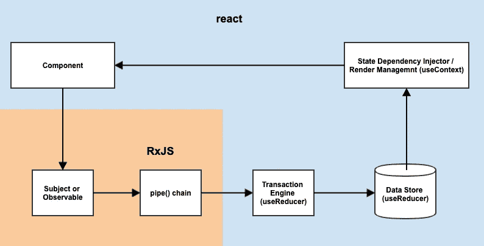
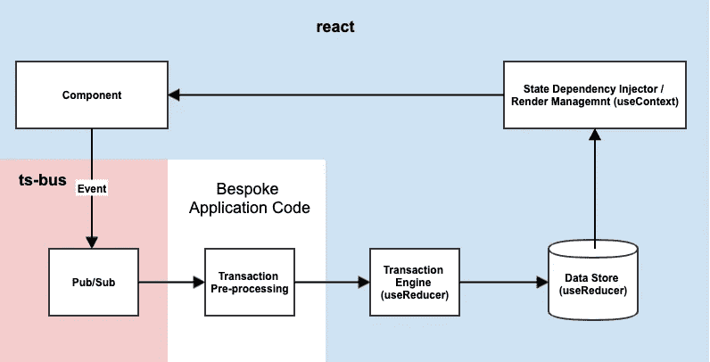
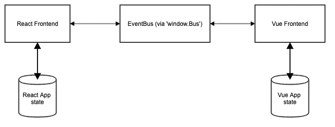
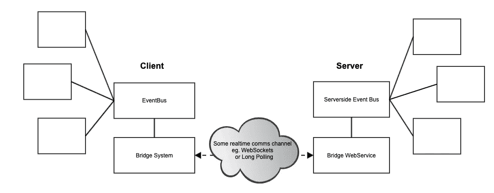

# 重生后的生活

> 原文：<https://itnext.io/life-after-redux-21f33b7f189e?source=collection_archive---------0----------------------->

## *Redux 是一个有用的工具，然而，React 的新 API 可以提供暂停，以确定它是否是你下一个应用程序的必需品。*

> 在本文中，我将探讨如何将 React 的新 useReducer 挂钩与简单的事件总线结合起来，为您的应用程序架构提供急需的可伸缩性，同时防止 Redux 在大型应用程序中经常出现的一些问题。

照片由阿里夫·瓦希德在 Unsplash 上拍摄

# 根据 React 的新功能进行重复

流行的状态容器 [Redux](https://github.com/reduxjs/redux) 为前端应用程序提供了几个好处，包括在分离的组件之间共享数据，确保数据一致性，以及为代码组织提供模板。然而，React 核心 API 的最新添加可能表明它可能值得重新考虑，Redux 是否适合你的应用程序。

由于最近的 API 变化，思维的转变已经开始出现，导致超过三分之二的 Redux 功能现在可以在 React core 本身中找到。除此之外，有人会说缺失的部分在作为“独立”实体维护时比在一个大的额外依赖中提供了更多的灵活性。

有些人[已经研究了](https://medium.com/octopus-labs-london/replacing-redux-with-react-hooks-and-context-part-1-11b72ffdb533)使用新的[钩子](https://reactjs.org/docs/hooks-reference.html#usereducer)和[上下文 API](https://reactjs.org/docs/context.html)进行状态管理的基本思想，但是我在这里想要探索的是如何将 Redux 分解成它的复合部分，然后替换那些 React】而不是提供的部分，这实际上使我们能够创建比纯 Redux 更灵活的架构，并且没有它的一些隐含缺陷。

# 探索 Redux 和一些权衡

Redux 是一个功能性的不可变状态管理容器，它使用动作对象来控制，动作对象实际上就像事件一样。它允许应用程序使用这些事件来表示对全局不可变数据对象的更新，该更新被传播到状态改变监听器。Redux 的定义和有效特性之一是程序员使用 Reducer 函数(想想`Array.prototype.reduce`)将任何给定的动作对象与存储的当前状态合并的方式。

然而使用 Redux 既有好处也有坏处。让我们探讨一下在 React 应用程序中使用 Redux 的优缺点。

使用 Redux 有很多好处。

*   它允许开发人员通过使用像`react-redux`这样的助手库，轻松地在整个应用程序的不同组件之间共享状态数据。
*   您得到了控制流、中间件模式和可用的中间件扩展生态系统。
*   通过使用单个主存储，您可以确保您的状态保持一致，这在 Redux 和 Flux 之前的某些 MVC 模式中是一个问题。
*   随后，集中化允许开发人员随着时间的推移潜在地探索和调试应用程序状态，这是一种由 [Redux Devtools](https://github.com/reduxjs/redux-devtools) 支持的技术，也称为时间旅行调试。
*   状态缩减器模式是管理和配置原子状态变化的一种有效而简单的方式，重要的是 Redux 为 JavaScript 应用程序中的状态管理提供了一种公共语言和约定。

所以一切都很好，但是 Redux 仍然存在一些问题:

*   Redux 趋向于成为一个全球性的依赖，它的触角将遍及你的代码库。
*   这可能导致开发人员倾向于存储比实际需要多得多的全局状态。
*   Redux 被认为是一个状态管理容器，但经常被用作事件总线，这是一种依赖于上下文的实践，可以被认为是一种反模式。
*   Redux 不能很好地处理开箱即用的异步性，甚至需要中间件来支持异步事件。
*   Redux 也不处理开箱即用的副作用。
*   与其他隐式状态管理容器(如路由器)的集成一直存在问题。
*   因为有了新的 React APIs，您实际上不需要 Redux 来管理您的应用程序数据。

这些折衷中的一些可以通过将 Redux 拆分成单独的组件来部分解决，而其他的则不能。同时，我们可能会失去像 Redux 这样的标准库所提供的一些优势。为了查看我们的选项，现在让我们检查数据更改事务的流程，以便更好地理解 Redux 和现在都为我们提供了什么。

# 分解数据事务

在探索如何最好地使用 React now 带来的东西之前，有必要更深入地了解一下 Redux 在概念上的工作方式，以便我们能够与我们所拥有的新的内置 React 工具进行有意义的区分。

`(state, action) => state`缩减器是 Redux 的核心，因为它控制数据事务的转换阶段。这是定义大部分前端业务层的关键配置，但围绕它还有子系统或构建块，它们构成了事务序列中的一个链。在构建 Redux 驱动的 React 应用程序时，您可能需要考虑类似如下的构建模块:

1.  一个*组件*以动作的形式向 Redux 中的*发布/订阅*或*事件总线*实现发送数据。
2.  *Pub/Sub* 通过一系列的中间件发送数据，这些中间件操纵动作，进行突变或延迟。我喜欢称之为*事务预处理*
3.  最终，动作被发送到一个*事务引擎*，它运行一个纯粹的 Reducer 函数，将当前状态与给定的动作不变地合并，产生一个新的状态树。
4.  新的状态树存储在*数据存储器*中，该数据存储器作为内存对象存在，但也可以缓存在其他地方，如本地存储器或数据库。
5.  *状态依赖注入器*从数据存储器接收变化，并向需要它的组件提供新状态
6.  接收者*组件*最终接收新状态并重新呈现显示更新的数据。

你可以用下面的方式来考虑这个流程和提供每个部分的技术组合，其中`react-redux`是状态依赖注入器，而`redux`本身提供了几个部分。参见下图:

*Redux 交易的构建模块*

# 那么 React 现在会带来什么呢？

React 的[新](https://reactjs.org/docs/hooks-intro.html)[API](https://reactjs.org/docs/context.html)提供了替换大量 Redux 组件以及所有`react-redux`的设施。在它的`useReducer` API 中可以找到一个类似的事务引擎。`useReducer`钩子也设法提供了一个不可变的数据存储。然后我们可以利用新的`useContext` API 作为状态依赖注入器。如果将客户端组件包括在内，可以说现在整个事务流的几乎三分之二是在 React 捆绑的特性中管理的。这是一个巨大的卸载量！

*用 React 代替 Redux*

现在，您可以看到缺少的是一个发布/订阅(或事件系统)和一个事务预处理器。

有些人可能会说，`useReducer`已经提供了一个事件系统，因为它公开了一个可以被孩子共享的`dispatch`函数。事情是这样的，因为 React 的纤程重写和最终一致的状态解析的细节，没有简单的方法将顺序事务预处理层应用到 T2。基本上，这意味着使用`dispatch`作为事件系统的客户端以及流入事务的反应端(与事件系统本身相反)的问题要少得多。您还获得了一个额外的优势，将您的事件调度程序从您的状态中分离出来，这在您临时将应用程序上下文捆绑在一起时变得非常重要，因为它们不应该混合数据。

对于`createContext`的性能，也有一些担心(见下面的评论),因为它能够将非常快的状态更新渲染到一个大的共享状态 redux 树中。你可以在`react-redux`的[技术挑战中看到这一点的证据，这些挑战正在转向创建一个环境](https://github.com/reduxjs/react-redux/issues/1177)，因为他们正在努力为小的边缘情况支持预先存在的性能问题。通过将事件总线从状态管理中分离出来，您获得的一个好处是能够根据状态的性能需求来区别对待状态的每个部分。因此，在大多数情况下，使用 React 的`createContext`就可以了，但是当您需要更快的更新性能时，一种可用的技术是直接监听来自事件总线的调度事件，并在需要时使用本地缓存进行内部管理。

您可能会认为不避免 Redux 意味着您不得不失去对优秀工具工作流的访问，例如流行的 Redux Devtools 项目，但是，随着像 [reinspect](https://github.com/troch/reinspect) 这样的项目允许开发人员将 Devtools 连接到 useReducer 和 useState，现在 Redux devtools 不再有对 Redux 的硬性依赖。

# 添加事件系统

那么你应该用什么作为你的事件系统呢？嗯，几乎任何你喜欢的东西。您可能会考虑类似 RxJS 的东西，因为您可以免费获得一个事务预处理引擎。比方说，如果你正在从 redux-observable 迁移一个应用程序，这可能是正确的举措。

使用 RxJS 作为事件总线和事务预处理系统

或者，我们可以使用节点的 [EventEmitter](https://www.npmjs.com/package/events) 模块的同构端口来调度事件。这将工作，但它不支持监听通配符或名称间隔事件，这在我们想要将应用程序的各个部分分离出来以仅响应相关事件时会很有用。我发现成功的 [EventEmitter2](https://github.com/EventEmitter2/EventEmitter2) 允许通配符事件。这可能不适合所有人，但我的技巧是将它包装在一个[简单的事件总线 API 中，该 API 包含良好的类型脚本支持](https://github.com/ryardley/ts-bus)，仅提供我在事件总线中实际需要的一小部分功能。我为这项技术创建了自己的库，名为`[ts-bus](https://github.com/ryardley/ts-bus)`。

仅使用事件总线

这两种安排都比单独使用 Redux 提供了更大的灵活性。

# 独立事件系统的一些好处

将事件系统从状态管理中分离出来有很多好处。

**你并不总是需要状态根据一个事件而改变** 虽然状态响应一个事件而改变是很常见的，但你并不总是需要将状态改变与一个事件联系起来。有时所需要的只是启动一个异步后台进程，并让它在完成时进行报告。在不需要的地方引入外部状态会增加复杂性和开销。

**您已经将您的依赖暴露限制在一个小的简单组件** 事件系统将成为任何大型应用程序的主要依赖危害，因为必须与另一个组件通信的每个组件都需要访问您的事件调度程序的实例。通过使用独立的事件系统，我们避免了将状态管理自动连接到所有应用程序组件。

**您可以随心所欲地管理异步性**
事件不再与状态变化联系在一起，因此异步变得更加容易。想使用异步函数来管理异步事件吗？简单。您可以控制如何管理异步性，以及可以使用哪些状态依赖项。诚然，实现一个可取消的 saga 工作流更加困难，但这从一开始就不是一个容易解决的问题，而且实际上也很少需要。

在单独的存储中跟踪状态很简单，例如路由器
偶尔状态需要被管理，但是不能在状态容器中被跟踪。这通常发生在导航中，其中状态通过某种路由器保存在浏览器 URL 中。拥有一个独立的事件系统意味着你可以很容易地为你的路由器提供一个抽象点。这项技术的另一个好处是，您不需要在整个应用程序中共享路由器代码。

**你拥有事件驱动架构的灵活性** 通过使用一个简单的事件发射器，你可以随心所欲地处理你的事件。无论是通过在服务工作者中运行处理程序，还是通过建立可观察的流或将计算卸载到服务器。向服务器发送事件，从服务器接收事件，同步第二个 micro-Vue 前端应用程序，用 RxJS 管理副作用；只要你能共享你的事件总线，你的应用程序架构就能支持它。这就是基于事件的架构的力量，你可以随心所欲地连接你的应用。

作为一个例子，我们可以看到如何在概念上共享一个事件总线来在不同的前端框架之间进行通信。对于有几个团队在前端堆栈上工作的大型组织，或者对于缓慢地一部分一部分地重新编写系统的团队来说，这可能是一个很好的方法:

事件总线上的微前端通信示例。请注意，每个应用程序管理自己的状态，以避免代码库之间的依赖性

或者，您可以通过类似 [socket.io](https://socket.io/) 的桥接系统设置您的事件总线，例如在浏览器和工业事件流平台(如 [Kafka](https://kafka.apache.org/) )之间创建一个多路传输消息通道，以便为大型事件源应用程序提供信息。对于需要实时数据的金融交易所来说，这可能是一个好方法。

客户端和服务器之间同步事件的可能例子。

最后，因为我们讨论的是基本的事件总线架构，而 Redux 包含一个事件总线，所以这些系统当然可以通过使用 Redux 本身来建立。这里需要注意的是，使用 Redux 时，你用总线拖动数据，这实际上可能弊大于利，因为*开发人员无意中在应该保持分离的系统之间共享了状态。*

# 结论

Redux 是一个有价值的多功能库，但它不仅仅是一个状态管理容器。当您选择使用 Redux 时，您就选择了您的事件总线、您的数据存储、您的规范 DI 机制等等，并且依赖一个包来实现所有这些独立的应用程序功能可能并不是您在每种情况下都需要的。

虽然重新编写大型应用程序来删除 Redux 毫无意义，但由于 Redux 有成为全局依赖项的趋势，新的或较小的应用程序应该仔细考虑是否可以通过选择适当的事件总线和使用内置的 React 状态管理来满足他们的需求，因为这将导致更干净和更灵活的架构。

这篇文章是一篇活的文档，如果你想投稿或在这里看到任何不准确的地方，请联系我们。

*你可以在 Twitter 上以*[*@ Rudi Yardley*](https://twitter.com/rudiyardley)*关注 rudiyardley 或者在 Github 上以*[*@*ryardley](https://github.com/ryardley)