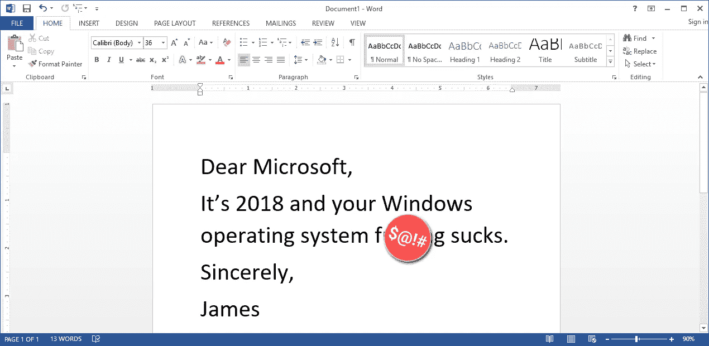
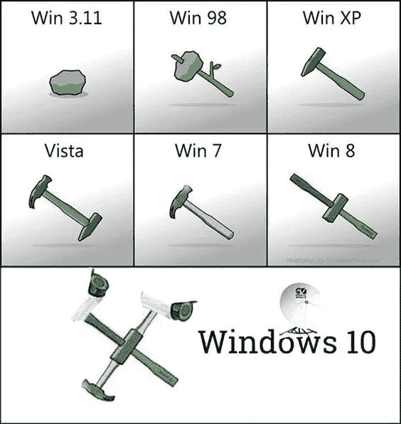
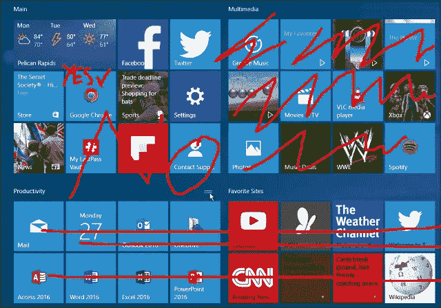
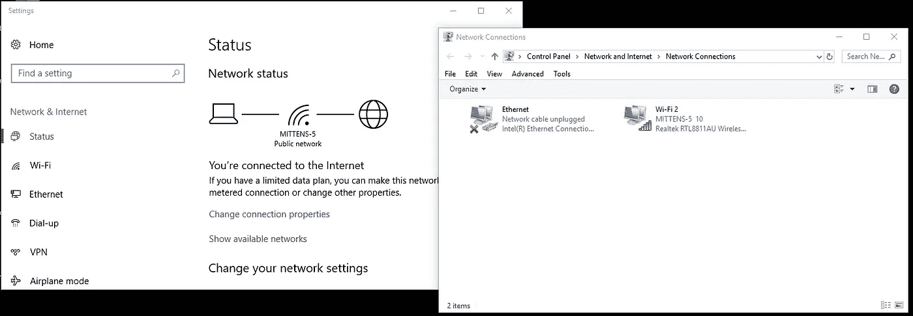
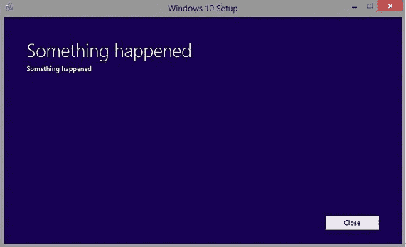
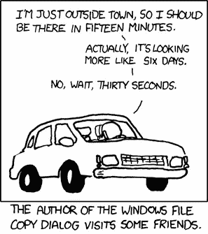
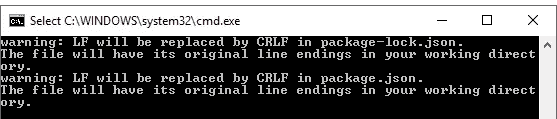
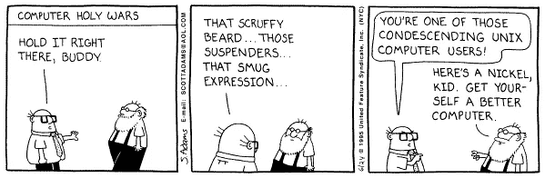
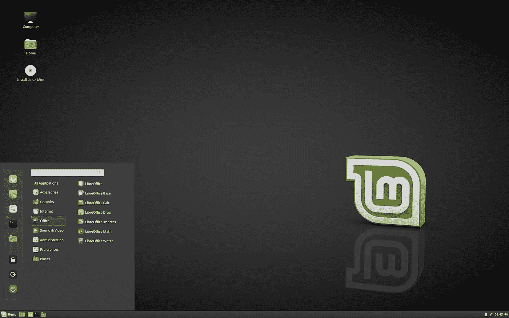

# 没有窗户的生活是一股新鲜空气。

> 原文：<https://itnext.io/life-without-windows-is-a-breath-of-fresh-air-4b2c3d1c3035?source=collection_archive---------6----------------------->

自从我放弃微软视窗系统转而使用 Linux Mint 以来，已经过去 60 天了。

作为一个终生的 Windows 用户，想到微软曾经发布过一些真正可怕的版本，但不知何故 Windows 粉丝们设法忘记了，至少如果不能原谅的话。Windows 8 是一场意识形态的大屠杀，而 Windows 98 则是一场纯粹的史诗般的垃圾箱大火。然而，与 Windows ME 相比，这两个操作系统都是颓废的巧克力蛋糕，Windows ME 是某种相当于核融化混合行尸走肉级病毒爆发的操作系统。

作为一个品牌，Windows 在版本 7 时达到了顶峰——这是微软有史以来提供的最干净、最快、最简洁的安装。但在达到这一峰值后，雷德蒙的人们决定将变速杆猛地换成倒档，尽可能快地向后倒。随着 Windows 10 的准强制“YOLO”升级，我们又回到了那个庞大的、没有重点的垃圾，它只是在当今超级光滑的替代品世界中懒洋洋地下垂。

## 抛弃窗户并不容易。

我使用 Windows 已经有很长时间了。曾几何时，我是午夜排队购买微软视窗 95 光盘的人之一。过去，我破解了 config.sys 文件，让 Lemmings 在我的 IBM 386 上工作。我怎么能忘记我的第一份工作，一份写 C++的暑期实习，看着我的软件每次出现错误，整个 Windows 3.1 都陷入火海？美好时光。

老实说，我有一阵子一直想把窗户踢开。但是总有不好的一面——Office、Photoshop、Steam 以及所有我认为我会放弃的东西。这是一个艰难的选择。但就像所有最终会结束的事情一样，它结束了。壮观地。

# Windows 10 的最后 10 根稻草。

10.每一次 Windows 10 安装都是从从开始菜单中移除所有**膨胀软件磁贴**的仪式开始的。很难知道这是故意让用户难以接受非谷歌的选择，还是只是混乱的企业决策的产物。

> “太好了，Windows 10 有邮件而不是 Gmail，”从来没有人这么说过。

你必须[手动右键](https://www.pcworld.com/article/3051121/windows/remove-live-tiles-from-the-windows-10-start-menu.html)移除每个磁贴，有些没有第三方工具根本无法卸载[。我经常思考，如果没有鼠标，这是如何做到的，但在某些情况下，这就是做不到的。我不想让微软的钱、雅虎财经和 Xbox 天天被强行塞在我的屏幕上。在所有 48 个磁贴中，我只需要 1 个——谷歌浏览器——当然，我必须单独安装。](https://www.thurrott.com/windows/windows-10/64488/windows-10-tip-remove-built-in-apps)

神圣的地狱。

9.登录界面只需要几个框来输入你的用户名和密码。出于某种原因，我的个人资料里有一张橡胶鸭子的照片。当 *Ducky* 决定游遍我的锁屏时，很难把自己伪装成某种职业 It 人。

不

我不想要个人资料照片，尤其是*那张*个人资料照片。Windows 8 有多种颜色的方块让婴儿忙碌，但 Windows 10 有一种更微妙的方法，让你看起来稍微不那么专业。“平易近人但不称职”是他们追求的形象，他们做到了。

除了鸭子，还有一些不必要的有趣事实和 **Cortana** 潜伏在所有不速之客周围。我被告知，如果你有时间研究哪个设置屏幕隐藏了令人讨厌的功能，这些可以被禁用，但我怀疑在康卡斯特的网站上找到*取消服务*按钮更容易。

说到 Cortana，我猜在 Windows 上工作的微软员工和在 Xbox 上工作的不是同一批人。作为《光环》中的精神病人工智能反派[,我不知道他们为什么认为我会信任 Cortana 来组织我的日历或询问我的亚马逊包裹在哪里。](https://www.forbes.com/sites/davidthier/2015/10/27/halo-5s-biggest-twist-is-pretty-brilliant/#27912c4564ec)

就像让《指环王》里的萨马拉给阿利克夏配音一样。

8.看起来像电脑专家的一部分是知道**设置**在哪里。就像机械师知道查看汽车引擎盖下一样，你也应该相当确定所有的开关、数值和开关都藏在哪里。Windows 设置在最近的版本中变得越来越没有意义，但 Windows 10 通过隐藏选项变得更加疯狂，就像一只患有强迫症的松鼠。

选项无处不在，在多个领域，用户界面和布局，从控制面板到魅力到混合“平板模式”窗口到经典窗口。所有这些都是对注册表和组策略编辑器的补充。甚至网络设置也在两个共存的布局中重复，这两个布局相互调用，尽管您永远无法确定哪个键盘快捷键会使其中一个出现。

相同的功能。两种不同的用户界面。

7.掩盖在 Windows 10“体验”的日常快乐中的是做你不想做的事情的无休止的唠叨。从创建一个毫无意义的微软账户到让你使用 OneDrive，这是无情的。“是否要将您的默认浏览器更改为 **Microsoft Edge** ？你知道吗？现在呢？现在呢？边缘？现在准备好了吗？”我如何停止微软对我的唠叨？像这样的问题 Clippy 在哪里？

微软确信你不知道如何正确地设置任何东西。但是当你确实需要帮助时，比如弄清楚为什么网络消失了，或者为什么 20 年后 Explorer 仍然一次复制一个文件，祝你好运。

太棒了。

6.说到唠叨，当到了一个 **Windows 10 更新**的时候，你最好先检查一下你的日历。专业提示:我更喜欢等到假期周末，只是为了确保我的电脑在周二之前可以使用。

如果你推迟升级，机器会神奇地在一夜之间从睡眠模式中醒来。起初，这让我怀疑 PC 是否闹鬼。一些新的数千兆字节的更新可能需要*小时*和多次重启才能完成，通常是在你需要工作的时候。因为某些原因，他们经常需要中途的用户交互来按回车键或确认对话框。

这个时代的其他设备都可以在几分钟内完成这项工作(Chromebook 只需 20 秒，耶！)但不适用于 Windows 10。现在就取消你的计划吧:打电话请病假，完成那个延迟装修项目，或者带家人去奥兰多。

# 这是引起眼睛抽搐的小问题。

5.为什么我不能从命令行使用 **ssh？为什么我必须用油灰？为什么 Windows 仍然有不同的行尾被 Git 和 Atom“处理”,但当我使用 AWS CLI 时又重新出现？为什么现在反斜杠不是正斜杠？为什么 Git Bash 必须存在？**

# 但我的最后 4 个原因是主要的。

3.在 IT 部门工作就像是一名电脑医生，所以我也要对其他人的 Windows 10 电脑负责。这真的很不幸，但总的来说我已经接受了。

我妻子的宏碁需要一分钟才能启动，风扇持续运转，电池很快就会耗尽，而这一切除了看着桌面，什么也不做。她把它带到我的诊所，我进行一些诊断，看起来很严肃，发出一些哔哔的声音。我不能告诉你为什么。詹姆斯博士对此毫无头绪。

与此同时，我的姻亲经常被骗在他们的 Windows 10 笔记本电脑上安装**间谍软件**，每年一次——通常是在我的主电脑更新的长周末——我必须花几个小时重新安装。其他人都在看足球或者和孩子们玩大富翁游戏，而我却坐在黑暗中运行我的第一千次 Windows 重装。

去年圣诞节，一条据称来自微软的弹出勒索信息要求支付 200 美元才能解密硬盘。我意识到这不是真正来自微软，因为它没有唠叨或建议我使用 Cortana 或 One Drive 支付赎金。我只是扔掉了机器，给了他们一台 Chromebook，因为我不想每个假期的记忆都是关于修电脑的。因为 Chromebooks 和老人相亲相爱，从此再没听到一点动静。

2.自从安装了 Android Studio，我的 **C:\Program Files\** 目录就膨胀了。这很好，因为我可以将目录移动到另一个驱动器，对吗？

没有。将 Program Files 文件夹转移到另一个驱动器[会对 Windows 10 的家庭安装造成严重破坏](https://techreport.com/forums/viewtopic.php?t=119063)，就像在谷歌上搜索“谷歌”会在时空连续体中造成裂缝一样。驱动器位置到处都是硬编码的。我花了一个周六在网上寻找无穷无尽的技术技巧，但它[基本上不工作](https://www.techadvisor.co.uk/how-to/windows/how-install-software-second-hard-drive-move-program-files-folder-in-windows-3500581/)。

除了有一个重要的目录，它的名字不必要的长，中间有一个空格，在命令提示符中强制使用引号(单引号或双引号，谁也说不准)这种明显的奇怪现象。它的表亲“Program Files (x86)”正在做其他重要的事情。**为什么不干脆/bin？**

1.我需要用一个更大的磁盘升级我老旧的 100GB 主硬盘，但我发现我不能用 Windows 10。我之前使用的可靠工具( [EaseUS](https://www.easeus.com/) )无法将 Windows 的工作副本从旧驱动器迁移到新驱动器。在浪费了另一个周末试图做任何事情来避免完全重装之后，最后我决定就这样了。我们正在抛弃这个糟糕透顶的操作系统。

# 选择一个替代品。

我家里有一堆笔记本电脑和个人电脑，都是不同的品牌和型号，我的目标是尽可能为它们找到一个通用的操作系统。问题不在于找到一个像样的操作系统，而是要确保所有的软件替代品都能够匹配它们的 Windows 等价物，以最大限度地减少技术支持。

多年来，我一直是 Chromebook 的超级粉丝，我一直用它来完成日常任务。Chromebooks 对我需要的一切都很棒*，除了开发的*，所以这些不是一个选项。你也不能在 PC 上安装 ChromeOS——是的，有[never ware](https://www.neverware.com/)commercial fork，但 ChromeOS 是为 Chrome 硬件设计的。

然后是苹果的**。出于哲学和财务两方面的原因，我不能转用苹果，我想继续使用我现有的所有设备。我也不是那种夸夸其谈硬件之美的人，所以可能会怨恨毁掉我的 401k 去这个方向。请收下你的恐吓信，除非你要寄一部免费的 MacBook。**

我断断续续使用 Ubuntu 已经有一段时间了，但最近我注意到了 Linux Mint 的崛起。我最担心的是，对于我的一些纯 Windows 应用程序，是否有可接受的开源替代方案——五年前，当我进行这项工作时，自由/开源软件的前景对于转换来说绝对不够成熟。我决定将一份拷贝刻录到 u 盘上，并进行测试。

# Linux 薄荷:肉桂

从 u 盘上运行 Mint 需要几分钟时间，并提供它在设备上的外观。我的第一印象非常好——这是一个光滑、快速的操作系统，它跳过了所有臃肿的软件，但让用户可以轻松访问自由软件的世界。即使与 Ubuntu 相比，Cinnamon 看起来也像是有人深入思考了用户体验以及如何让所有复杂的东西变得显而易见。

Linux Mint——普通安装后的桌面。

在任何设备上，安装过程都不超过 5 分钟。在一个非常简单的设置过程之后，我花了 15 分钟安装了 Libre Office、Atom、SublimeText 和 Git，所有这些都是从更新管理器 GUI 完成的。咔嚓，咔嚓，搞定。虽然谷歌 Chrome 不在这里提供(Chrome 是首选浏览器)，但从[谷歌的下载页面](https://www.google.com/chrome/browser/desktop/index.html)添加这个很容易。

我妻子的宏碁不再在无所事事时自动旋转到电死。她轻松地采用了新的操作系统，并认为 Windows 已经经历了一次大规模升级。一切都很好，没有任何崩溃，太阳仍然每天早上升起。我真希望几年前就这么做了。