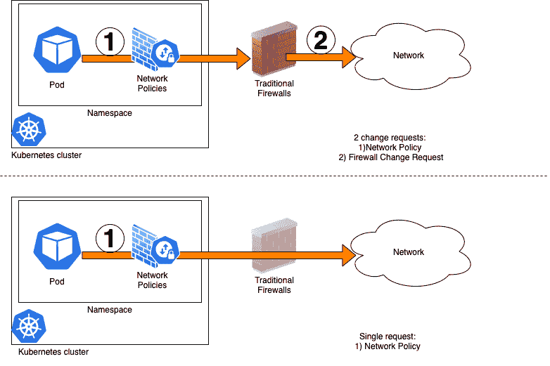
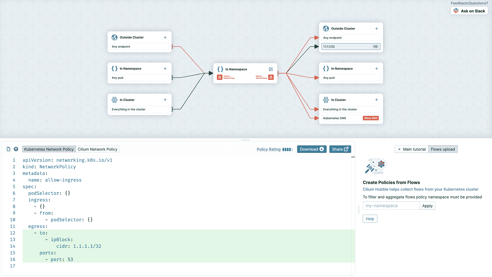

# Kubernetes 网络策略和最佳实践的生命周期

> 原文：<https://itnext.io/lifecycle-of-kubernetes-network-policies-749b5218f684?source=collection_archive---------3----------------------->

在这篇博文中，我们将讨论 Kubernetes 网络策略的整个生命周期，包括创建、编辑、治理、调试等主题，我们还将分享在处理网络策略时可以创造更好用户体验的最佳实践和见解。

安迪·纳普 *对这篇文章进行了评论，并提出了一些修改建议。非常感谢安迪！*

## 输入网络策略

随着 Kubernetes 适应在大型企业中的不断发展，Kubernetes 的安全相关方面变得更加重要，例如网络策略，它允许您控制哪些网络资源允许从/到 Pods 访问。

Kubernetes 是一个非常强大的平台，在强大的同时也引入了一些复杂性。尤其是那些刚刚开始了解 Kubernetes 的人，很容易被淹没，因为他们需要接触和掌握所有的新事物。Kubernetes 毕竟应该帮助公司变得更加灵活，但单靠一个平台无法解决企业的大多数典型问题，如文化、流程和孤岛。即使你的公司有最好的 Kubernetes 平台，如果你没有很好地将其集成到企业的 it 生态系统的其余部分，你将永远无法获得 Kubernetes 的全部好处。

不幸的是，许多采用 Kubernetes 的大型企业都面临着组织整体不够敏捷的问题。不幸的是，在当今的一般大型企业中，仍然需要进行大量的手动工作来完成任何与 IT 相关的订单/变更。从组织的角度来看，网络/安全团队通常与平台和应用团队相隔离，这种“孤岛”心态加上每个组织单位都有自己的目标和激励措施，与安全相关的话题通常会成为问题和缓慢的主要来源。

网络策略是网络安全的一个非常重要的组成部分，它的好坏取决于用户的体验，比如创建它们有多容易？批准和应用它们有多容易？在这篇博文的剩余部分，我们将讨论一些针对网络策略不同阶段的想法，这些想法应该有助于您围绕使用网络策略创建最佳的用户体验。

## 一种模式:网络边界安全委托给 Kubernetes

在许多企业中非常有用的一种模式是开放通信(至少对于一些公共服务，如日志服务、监控服务),一直到 Kubernetes 集群的外围，然后让网络策略控制网络流量。当一个团队需要管理网络策略，同时通过不同的机制(如 ServiceNow 或一些其他工作流/票证系统)请求新的防火墙规则时，获得网络访问的总周转时间太长了。这种模式背后的主要动机是在 Kubernetes 平台级别上只做一次冗长的防火墙更改，并依赖网络策略进行细粒度控制。



当在 Kubernetes 集群级别上控制网络边界安全时，需要小心控制默认允许的流量，也就是说，您可能希望限制默认情况下允许的入/出网络流量。应该记住，当没有在名称空间上应用网络策略时，Kubernetes 不会对网络流量进行控制。这可以根据 Kubernetes 集群中使用的 [CNI(容器网络接口)](https://github.com/containernetworking/cni)插件以不同的方式完成。一种方法是应用一个网络策略来阻止所有名称空间的大部分流出/流入流量，并控制 RBAC(基于角色的访问控制),使得 Kubernetes 集群的非管理员用户在没有某种管理的情况下不能自己创建/编辑/删除网络策略对象。基于实现集群使用的 CNI 插件的软件，您可能还需要限制每个名称空间默认获得的网络访问。使用 [NSX](https://www.vmware.com/products/nsx.html) 防火墙规则来实现这个想法是我们从 VMware Tanzu 实验室的领域中了解到的。

同时，为了使这种模式成功工作，应用网络策略的周转时间应该尽可能短。在这篇文章的治理部分，有几个关于如何形成治理的想法，使得网络政策可以尽快地被接受或拒绝。

## 创建网络策略

## 基础

对网络策略有一个基本的了解是很重要的，下面的两个文档是很好的起点:

*   [Kubernetes 关于网络政策的官方文件](https://kubernetes.io/docs/concepts/services-networking/network-policies/)
*   来自 Kubernetes 网络政策社区的教程

一旦你理解了基础知识，可能是时候获得一些实践经验了。看看你是否能在 [minikube](https://minikube.sigs.k8s.io/docs/) 或另一个你能访问的 Kubernetes 集群上安装你最喜欢的支持网络策略的 CNI 插件。如果你必须自己安装一个 CNI 插件，你需要管理员权限。这里需要注意的是，尽管网络策略是 Kubernetes 的官方部分，也是标准的 Kubernetes 资源，但实际上是 CNI 插件“实现”了网络策略，所以只要 CNI 工具支持网络策略，你就应该能够测试网络策略的基本功能。也就是说，普通的 Kubernetes 网络策略有一定的局限性，正如这里的[所解释的那样](https://kubernetes.io/docs/concepts/services-networking/network-policies/#what-you-can-t-do-with-network-policies-at-least-not-yet)，所以如果可能的话，使用您将在生产中使用的实际 CNI 插件来测试网络策略是非常有意义的。

如果您希望看到一个涵盖大多数用例的示例网络策略的良好目录，请查看这个 github repo 。

另一个需要考虑的要点是如何处理网络策略的 pod 选择器。名为`spec.podSelector`的键控制网络策略将应用于哪些策略。当密钥为空时，即`podSelector: {}`，它适用于创建网络策略的名称空间中的所有 pod。如果您想要定位特定的窗格，可以使用窗格选择器来实现，例如:

```
podSelector:
    matchLabels:
      app: bookstore
```

如果您有许多网络策略要编写，因为您的应用程序有许多组件，如果您想编写一个尽可能精确地控制流量的策略，这意味着编写只针对需要特定出口/入口规则的 pod 的 pod 选择器，您可以使用一个名为 **matchExpressions** 的键。参见下面的示例，该示例可帮助您通过标签*app =书店*或*app =数据库*定位两种不同的 pod:

```
podSelector:
    matchExpressions:
      - {key: app, operator: In, values: [bookstore, database]}
```

## 域名服务器(Domain Name Server)

忘记为 DNS 调用添加**网络策略是另一个常见错误。根据您的 pod 如何配置，如这里的[所述](https://kubernetes.io/docs/concepts/services-networking/dns-pod-service/#pod-s-dns-policy)，应用程序 pod 可能需要与运行在您的集群上的 DNS 服务器或运行在外部的 DNS 服务器通信。确保添加一个网络策略，以满足您的命名空间的 DNS 通信需求。如果你的 CNI 插件允许的话，你也可以在集群层面上应用 DNS 策略，比如使用 [Antrea 的 ClusterNetworkPolicy](https://github.com/vmware-tanzu/antrea/blob/28ef522ced7045f567c22b916cb29d9272f9c92b/docs/antrea-network-policy.md) 。**

## A 舱的出口是 B 舱的入口

如果 **Pod A** 需要调用 **Pod B** ，您将需要创建一个具有针对 **Pod A** 的**出口**规则的网络策略，以及另一个具有针对 **Pod B** 的**入口**规则的网络策略。对于 pod 之间的通信，经常会忘记出口&入口规则之间的对称要求。

## 编辑网络策略

“在每个人的心目中，Kubernetes 和 YAML 真的是不可分割的，”Kubernetes 的联合创始人之一 Joe Beda 在本次演讲中说道。他是对的，这是编写配置文件的推荐方式，正如你在这里看到的，我合作过的大多数人都使用 YAML(而不是 JSON)。如果我每次看到有人弄坏 YAML 文件都能得到一便士，我现在应该很富有了:)。所以帮你自己一个忙，使用一个带有插件的编辑器来帮助你容易地注意/修复这些问题。基本的 YAML 语法支持肯定会有很大帮助，如果你能得到一个插件，也能更好地理解 Kubernetes YAML 语法！改进的 Kubernetes YAML 编辑体验显然不仅有助于网络策略，您还可以通过更愉快的资源编辑体验来改善整个 Kubernetes 体验。以下是一些建议:

*   [这里的](https://www.youtube.com/watch?v=eSAzGx34gUE)是一个视频，这里的[这里的](https://octetz.com/docs/2020/2020-01-06-vim-k8s-yaml-support/)是一篇博文，展示了如何使用 Vim 做到这一点。
*   如果 Visual Studio 代码是你的编辑器选择，你可能想看看这个插件
*   对于大多数编辑器，你至少应该能够获得 YAML 语法支持，所以继续安装插件或更新你的编辑器配置，以便激活 YAML 支持。

[Cilium editor](https://editor.cilium.io/) 是一个用图形编辑器创建网络策略的工具。尤其是在开始编写网络策略时，可视化交互可能非常有帮助。以下是纤毛编辑器的快照:



对于包括许多不同种类组件的应用程序，例如微服务应用程序，手动编写大量网络策略可能相当麻烦。如果您的应用程序是 COTS(商用现货)软件，也许该软件应该提供所有的网络策略，并随着软件及其组件的发展而不断更新。

[这篇博客](/generating-kubernetes-network-policies-by-sniffing-network-traffic-6d5135fe77db)讲述了一个关于如何根据实际应用网络流量自动生成网络策略的想法。

## 管理

尽管网络策略是定义良好的 Kubernetes 资源，但出于监管/审计的目的，您的公司可能希望实施特定于他们的某些事情。例如，某些可能提供关于网络策略上下文的更多信息的注释可能是安全部门想要强制执行的，例如网络策略的元数据部分中的*k8s.example.com/projectId*这样的注释。在这种情况下，记录期望、提供良好网络策略的示例并让平台用户了解文档就变得至关重要。

## Git 拉请求救援

在大多数需要网络策略的环境中，通常会有一个在 kubernetes 集群上应用网络策略的过程。这种过程可以是某种批准/审核过程，并且用户不会被授权直接编辑网络策略。一种非常常见的方法是基于 Git 存储库实现审计流程。这种设置中的典型流程如下所示:

*   开发人员检查网络策略所在的 Git repo
*   开发人员创建一个新分支，并编辑/创建网络策略
*   开发人员基于他的分支创建一个拉请求
*   安全专家需要批准或拒绝拉取请求，并提供足够的信息，说明拒绝拉取请求的原因
*   如果一个 pull 请求被批准，一个管道将获得更改并将其应用到集群上，开发人员将得到通知。

上面的步骤抓住了 Git 拉请求过程的要点。与传统模式(在 ServiceNow 等系统中打开票证)相比，可能会有一些改进。例如，用户不再使用一些自由文本或其他格式来捕获数据，而是以一种可以直接在 Kubernetes 集群上使用的方式来创建网络策略。理想情况下，应该尽可能多地使用自动化来确保网络策略请求得到尽可能正确和快速的处理。

在下一节中，我们将详细介绍如何在没有任何人工交互和 GIT 的情况下完全自动地创建网络策略。使用类似[看门人](https://github.com/open-policy-agent/gatekeeper)和安全人员让整个过程完全自动化，有时是一个太大的概念变化，即负责安全的人员必须理解并可能在这种自动化的实施中合作。使用基于 Git 的方法，至少有一些自动化，可能已经给你带来了很多好处，并大大缩短了生产时间。以下想法可以嵌入到基于 Git 拉取请求的流程中:

*   编写 yaml 文件时很容易出错，所以首先要确保传入的 Pull 请求包含有效的网络策略。使用带有`kubectl apply`或`kubectl create`的`--dry-run`参数，查看网络策略资源文件是否有效。越早发现流程中的验证错误，修复的成本就越低。
*   也许您不能通过自动化自动批准所有传入的网络策略，但您至少可以通过检查 IP 范围是否被允许、是否有任何跨名称空间的请求等，来使用一些关于传入网络配置文件的有用见解。因此，可能需要一个人来最终批准网络策略，但他的工作可以通过相对便宜的自动化来简化。 [OPA(开放策略代理)](https://www.openpolicyagent.org/docs/latest/)及其[减压阀](https://www.openpolicyagent.org/docs/latest/#rego) DSL 可以帮助您编写一些自动化程序，或者简单地使用您最喜欢的(脚本)语言来解析网络策略文件，并根据您根据组织需求创建的一系列规则对其进行评估。

## 基于 OPA/网守的全自动网络策略创建控制

[开放策略代理(OPA)](https://www.openpolicyagent.org/) 是一个云本地计算基础项目，旨在解决跨云本地堆栈(Kubernetes、Docker、Envoy、Terraform 等)的“策略执行”问题。).OPA 附带了一种叫做[减压阀](https://www.openpolicyagent.org/docs/latest/policy-language/)的语言来有效地创作策略，除了减压阀，OPA 中还有许多工具&组件来更容易&有效地使用策略。

自动审核网络策略的最快方法是直接在 K8S 集群上实现。OPA 附带了一个叫做[看门人](https://www.openpolicyagent.org/docs/latest/kubernetes-introduction/)的组件。Gatekeeper 是一个准入控制器，它的目标是在 K8S 集群上方便地管理和实施策略。也就是说，可以挂钩到 Kubernetes 的[准入控制器](https://kubernetes.io/docs/reference/access-authn-authz/admission-controllers/)机制来拒绝策略不允许的 K8S 资源修改。通过编写*减压阀*策略来控制哪些网络策略被允许和拒绝，开发人员将很快得到关于哪些网络流量被允许的反馈。OPA 和 Gatekeeper 是非常有趣的技术，在 Kubernetes 生态系统中越来越受欢迎，绝对值得花一点时间来更好地理解它。我们计划在另一篇文章中提供一个更实际的例子，说明如何使用减压阀来控制网络策略。

## 排除故障

使用网络策略的另一个重要阶段是调试网络策略。复杂的应用程序通常通过网络与许多端点进行通信，这有时可能非常耗时&当应用程序出错时，很难找出哪个缺失或配置错误的网络策略是罪魁祸首。在这种情况下，应用程序日志应该提供一些见解。然而，根据应用程序日志的质量或日志搜索工具的可用性，仅有日志可能是不够的。在这种情况下，网络工具可能会提供最大的帮助。

在运行目标应用程序 pods 的 Kubernetes 节点上运行 tcpdump 这样的工具可能会非常方便。您可以将 tcpdump 作为应用程序 pods 的附属程序运行，或者在 Kubernetes 节点的界面上运行 tcpdump 并应用必要的过滤器。这篇文章和[这篇文章](https://xxradar.medium.com/how-to-tcpdump-effectively-in-kubernetes-part-1-a1546b683d2f)应该会给你一个关于如何做的想法。

此外，根据你使用的 CNI 工具，你可以直接从 CNI 软件中提取有用的信息。对于 NSX-T 用户来说，[这个](https://blogs.vmware.com/management/2019/06/kubernetes-insights-using-vrealize-network-insight-part-1.html)可能会派上用场，对于 Cilium 也有一些不错的工具，见[这里](https://docs.cilium.io/en/v1.9/policy/troubleshooting/#policy-tracing)和[这里](https://github.com/cilium/hubble)。对于 Antrea，您可能想要检查[这个](https://github.com/vmware-tanzu/antrea/blob/main/docs/network-flow-visibility.md)和 [iptables](https://en.wikipedia.org/wiki/Iptables) 相关问题[这个](https://github.com/box/kube-iptables-tailer)。