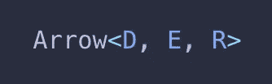
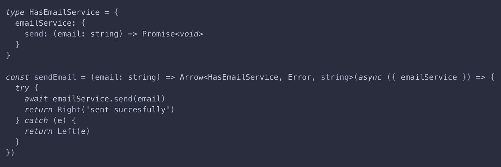
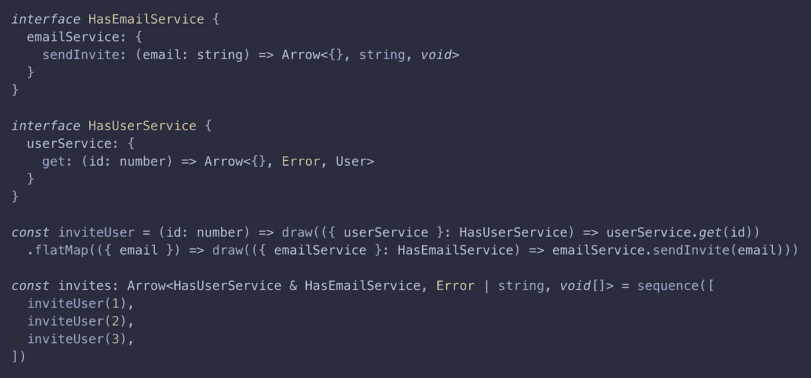
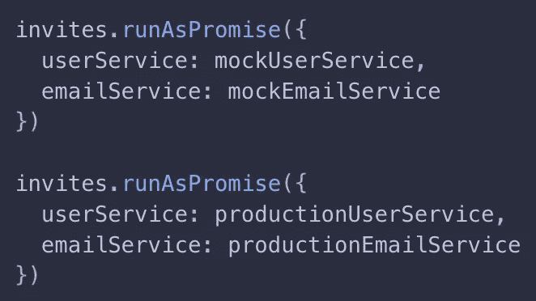

# Light-Arrow:用于 Typescript 的可组合且类型安全的异步编程

> 原文：<https://itnext.io/light-arrow-composable-and-type-safe-asynchronous-programming-for-typescript-6d6b3380b8d0?source=collection_archive---------2----------------------->

**欢迎**阅读本系列的第 1 部分，使用 typescript 库 Light Arrow 在 Typescript 中进行函数式编程。在第 1 部分中，我们将介绍箭头数据类型。在第 2 部分中，我们将构建一个完全类型安全的 http 服务器。

*我是《光之箭》的作者，该项目仍处于早期阶段，如有任何反馈，请联系***，谢谢！**

**

*箭头数据类型*

## ***箭头和承诺***

*箭头是**描述**异步操作的数据结构，异步操作可以成功，结果值为 R 或错误值为 E，这取决于一些依赖关系 d。实际上，我们编写的许多程序或程序的一部分都符合这种描述，并且经常使用承诺来实现这一目的。然而，承诺也有一些缺点。*

*让我们先来看看承诺型签名。*

**Promise < A >* 代表一个异步操作，可以成功，值为 A 类型，但是失败怎么办？这在类型签名中没有表现出来，所以我们必须查看我们特定承诺的实现内部，并确定我们的 catch 错误处理程序需要处理什么类型。承诺也会被急切地评估，并且不透明，这在我们重构时会引起问题。引用透明意味着我们可以用表达式返回的值替换程序中的所有表达式，而不改变程序的行为。关于承诺潜在问题的更多信息，请查看这篇[文章](https://medium.com/@avaq/broken-promises-2ae92780f33)。*

**

*异步代码和副作用会变得复杂…我们都知道这种感觉*

## *箭头*

*与承诺相比，箭头有很多好处，包括引用透明性、类型错误和内置的依赖注入功能。下面将更详细地讨论其中的每一个。箭头有一个可发现的“流畅的”链式 API，类似于本机承诺和数组。要查看 Arrow 的完整 API 列表，请查看[文档站点](https://lauri3new.github.io/light-arrow-docs/docs/Arrow)。*

*更普遍的是，不仅仅是异步操作，箭头可以用来模拟同步或异步副作用，并以一种类型安全的方式将它们组合在一起，而不实际执行任何副作用，因此，数据结构如箭头也被称为“功能效应”。对于那些熟悉函数式编程的人来说，箭头是一种阅读工具。*

*箭头本质上可以被看作是函数类型
`D => Promise<Either<E, R>>`的有用包装器，它使得使用这种类型更加方便，并且为可组合性和便利性提供了帮助方法。为了将现有的数据类型转换成箭头，提供了几个`draw`函数来简化这个过程。我们也可以像使用`new Promise`的承诺一样`construct`箭头，也可以选择指定一个“整理”回调(例如，清除超时)，参见[这里的](https://lauri3new.github.io/light-arrow-docs/docs/Arrow#arrows)示例。*

**

*示例功能“发送电子邮件”返回一个箭头，取决于基于承诺的电子邮件服务*

*现在让我们通过例子来看看我提到的一些好处。在示例中，所有类型都是推断出来的，但只是出于演示的目的写出来的。*

## *错误处理*

*箭头使用任一数据类型来启用集中式类型安全错误处理。通过跟踪错误类型，我们可以从类型签名中知道我们的程序可能如何失败，并涵盖我们传递给 run 方法的错误处理函数中的所有情况(类似于我们可能在承诺末尾添加的 catch 处理程序)。*

**

## *对透明性有关的*

*在 run 方法被调用之前，箭头实际上不会执行任何操作，这意味着箭头具有引用透明的良好属性。这意味着我们可以重构包含箭头的表达式，比如调用一个返回箭头的函数，用返回的值替换它们，而不改变程序的含义。事实证明，通过用箭头表示程序中的所有副作用，无论它们是异步的还是同步的，是可失败的还是不可失败的，我们可以在整个程序中保持引用透明性，使推理变得更容易。*

*由于我们的程序副作用现在由箭头表示，我们可以将它们组合在一起成为一个描述整个程序的箭头，等待通过 run 方法执行，在 run 方法中，我们提供依赖和成功、失败和异常处理程序。*

****

*使用模拟和生产依赖关系运行我们的程序*

## *依赖注入*

*通过延迟执行直到 run 方法被调用，Arrows 提供了一种方便的方式来执行依赖注入，因为我们可以将程序的所有依赖项分组到单个对象类型中，并根据我们的需要在 run 方法中提供这些依赖项的测试和生产实现。*

## *可组合性*

*通过不同的方法，箭头是高度可组合的(所有方法参见[文档](https://lauri3new.github.io/light-arrow-docs/docs/Arrow))。`orElse`和`andThen`方法也作为接受 n 个箭头的组合函数提供。`orElse`可用于“横向”构图，如构建快递 App 的路线。`andThen`可用于“垂直”组合，例如在授权中间件中更改请求的上下文，在授权中间件中，发出请求的用户的详细信息被添加到上下文中，供后续中间件使用。还包括熟悉的功能如`all`和`race`(箭头等同于`Promise.all`和`Promise.race`)以及更多的组合子如`retry`和`repeat`。*

## *表演*

*Arrows 是堆栈安全的，在性能测试中的表现类似于本机承诺，但是具有本文中列出的所有优点。箭头还支持[取消](https://lauri3new.github.io/light-arrow-docs/docs/Arrow#cancellation)和资源整理。*

## *互用性*

*有许多帮助函数可以将现有的类型转换成箭头，包括基本值、函数、异步函数。这些都列在[文档](https://lauri3new.github.io/light-arrow-docs/docs/Arrow)中。*

**

*成为一名 Arrow 程序员，控制异步代码和副作用*

*Light Arrow 的目标是成为一个实用的库，拥有一个基于 Arrow 数据类型的小型 API，这样那些使用它的人就可以获得函数式编程的许多好处，而理论上不会有太多的开销。要开始，请在此处查看文档[并安装](https://lauri3new.github.io/light-arrow-docs/docs/Arrow) [npm 模块](https://www.npmjs.com/package/@light-arrow/arrow)。对于那些有兴趣学习更多关于函数式编程的人，我强烈推荐从优秀书籍[Scala](https://www.oreilly.com/library/view/functional-programming-in/9781617290657/)中的函数式编程的前几章开始。*

*在第 2 部分中，我们将使用 Arrows 为路由、中间件和处理程序构建一个类型安全的 express 服务器。感谢阅读，希望下次再见！*