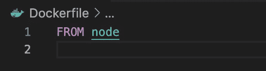
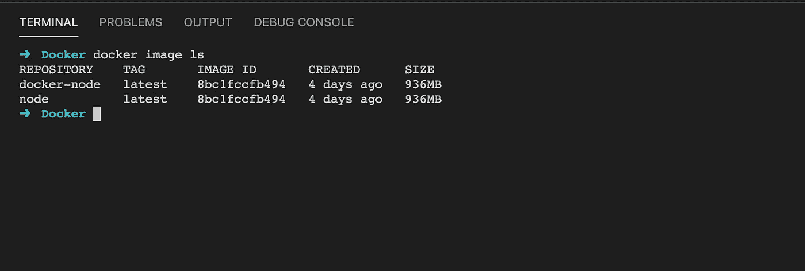
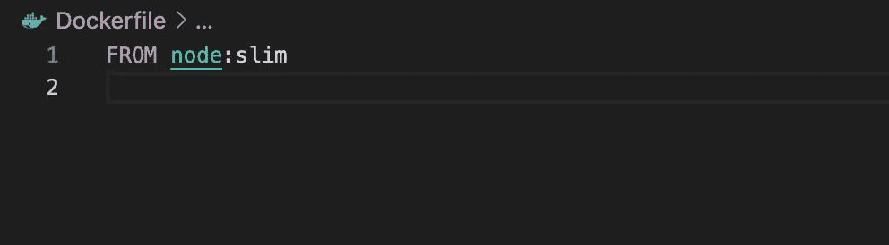
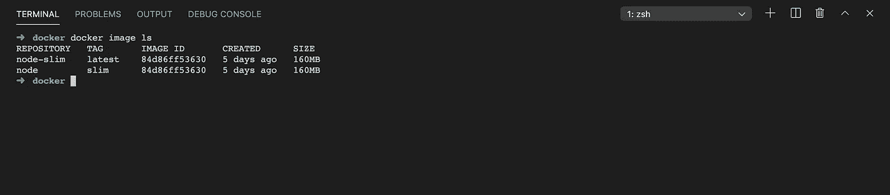
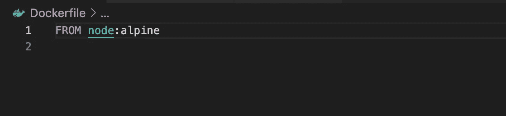
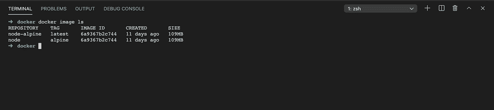
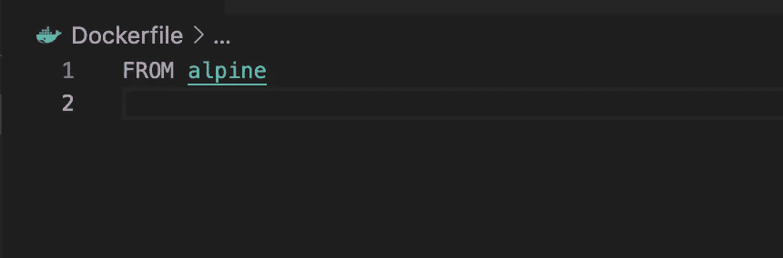
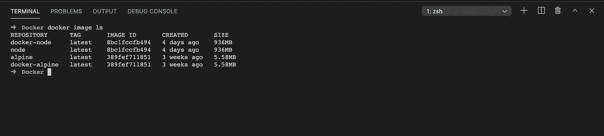
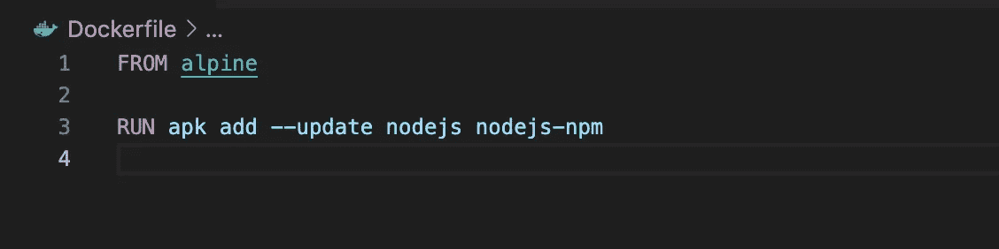
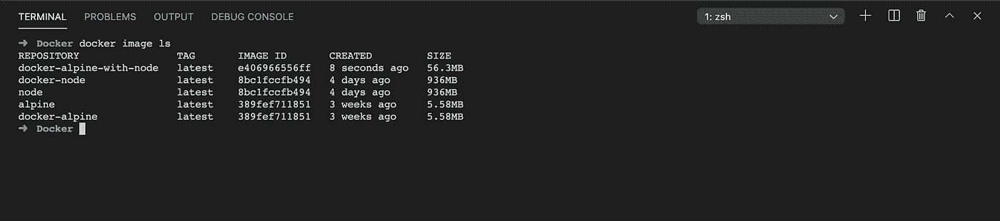

# Node.js 的轻量级和高性能 docker 文件

> 原文：<https://itnext.io/lightweight-and-performance-dockerfile-for-node-js-ec9eed3c5aef?source=collection_archive---------0----------------------->

## 如何特别为 Node.js 应用程序创建轻量级和高性能的 Dockerfile？


照片由 [Victoire Joncheray](https://unsplash.com/@victoire_jonch?utm_source=medium&utm_medium=referral) 在 [Unsplash](https://unsplash.com?utm_source=medium&utm_medium=referral) 上拍摄

你好世界！今天我将分享我关于`Node.js`应用的笔记和想法。我希望你会发现它很有用，并创建`Dockerfile`，它将满足你的所有需求。

# Docker 简介

如果你在这里，这意味着你以前曾经面对过`Docker`，但为了确保我们在同一页上，让我们提醒它是什么。

因此，没有秘密——`Dockerfile`是如何建立我们形象的指南。一步一步，一层一层这个文件描述了我们的形象会是什么样子。

好的，那么另一个问题——什么是图像？我们可以把它当作一个模板。一旦你从你的`Dockerfile`建立了一个图像，它就可以与其他人分享。您可以从映像运行容器。

最后但同样重要的是，容器，它是一个运行的映像，实际的进程。

我们为什么需要这个系统？它解决了一个特殊的问题——环境。你可以在你需要的地方运行一个容器，不管你的操作系统是什么。所以，如你所见，一切都从`Dockerfile`开始。

# 从

先做最重要的事情— `FROM`。命令，描述将用作容器基础的内容。我们应该记住，我们正在构建`Node.js` `Dockerfile`，因为我们是在本文的上下文中讨论它的。通常，你可以遇到下一种方法:

```
FROM node
```

接下来的图片也很常见:

```
FROM node:slim
```

和

```
FROM node:alpine
```

但我更喜欢另一个:

```
FROM alpine
```

`[Node](https://hub.docker.com/_/node)`、`[node:slim](https://hub.docker.com/_/node)`、`[node:alpine](https://hub.docker.com/_/node)`、`[alpine](https://hub.docker.com/_/alpine)`为官方图像。你可以在官方网页上读到更多关于他们的信息。好吧，那是为了什么，为什么？这里的原因是重量。因此，如果我们使用一个`node`映像，我们从一开始就得到 900+ Mb，`node:slim`给出 160 Md，`node:alpine` — 109 Mb，而同时`alpine`只有 5 Mb。

`**node**`



带有节点的 docker 文件



基于节点的映像重 936 Mb

`**node:slim**`



带有节点的 docker file:slim



该图像基于 node:slim，重 160 Mb

`**node:alpine**`



带有节点的 docker file:alpine



这张图片基于 node:alpine，重 109 Mb

`**alpine**`



阿尔卑斯山码头文件



该图像基于 apline，重 5.58 Mb

# 节点. js

我可以同意你，镜像`node`、`node:slim`和`node:alpine`已经可以使用了，而`alpine`只是一个轻量级的 Linux，根本没有`Node.js`。没问题，让我们安装它:

```
RUN apk add --update nodejs npm
```

现在我们有了`Node.js`，重量仍然可以接受——56mb:



带有 alpine 和 node.js 的 Dockerfile



该映像基于安装了 node.js 的 apline，重 56.3 Mb

# 工作方向

这一步，我会跳过，因为你可以在任何教程中找到它，没有太多的谈论，但我不得不这样做。文件夹，我们的应用程序将位于容器中:

```
WORKDIR /app
```

# package.json

由于 out `Dockerfile`的每一行都是一层，Docker 试图尽可能地缓存它，以提高构建速度。这意味着，很少改变的命令必须在开始。你记得我们已经安装了`alpine`和`Node.js`，接下来，变化很少的是`package.json`。所以让我们开始吧:

```
COPY package*.json ./
```

由于我们已经将`/app`设置为我们的工作目录——我们正在处理的所有内容都将保存到这个文件夹中。

# npm

现在我们必须安装我们所有的依赖项:

```
RUN npm ci
```

我们使用`npm ci`而不是`npm install`来避免包意外更新，这可能会导致生产中的问题。

# 复制源代码

没有源代码，我们的容器毫无用处，所以我们需要将它复制到我们未来的映像中:

```
COPY . .
```

应该注意的是，这种方法将所有内容从源复制到目标。为了避免不必要的文件和文件夹，例如，`/node_modules`我们必须将它添加到`.dockerignore`。其工作原理与`.gitignore`相同:

```
node_modules/
```

# 标准命令

以下几行是大多数`Dockerfiles`常用的，不需要解释:

```
EXPOSE 5000CMD ["npm", "start"]
```

`EXPOSE` -容器在运行时监听指定的网络端口。

`CMD` -该命令，可以单为`Dockerfile`。它为正在执行的容器提供默认值。

# 结果呢

`**Dockerfile**`

```
FROM alpineRUN apk add --update nodejs npmWORKDIR /appCOPY package*.json ./RUN npm ciCOPY . .EXPOSE 5000CMD ["npm", "start"]
```

`**.dockerignore**`

```
node_modules/
```

使用这个`Dockerfile`，您可以为`Node.js`构建轻量级和高性能的映像。我希望你觉得它有用，并学到了新的东西。

# 关闭顶部

以下信息不属于`Dockerfile`，但仍属于`Docker`字段。有几个命令，它们时不时地帮助我。我相信将它添加到您的工具包中是很好的。

通过控制台打开容器:

```
docker exec -it container-id sh
```

通过控制台打开图像:

```
docker run -it image-name sh
```