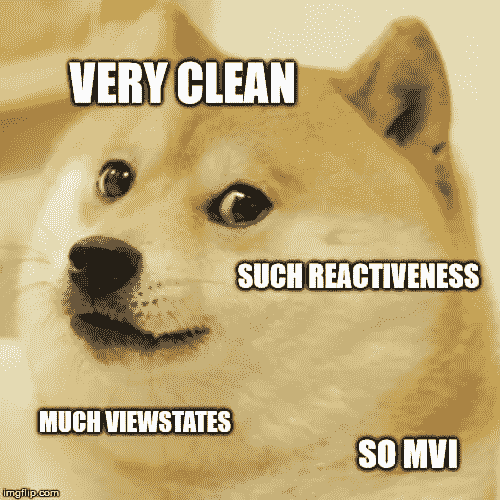
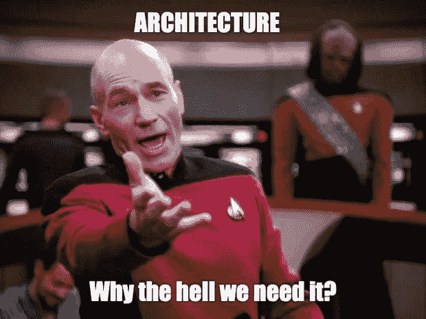
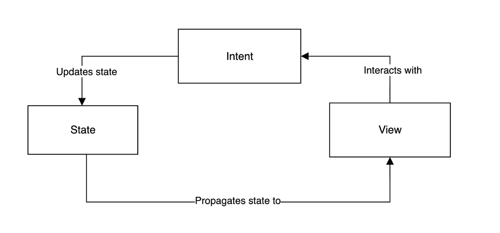
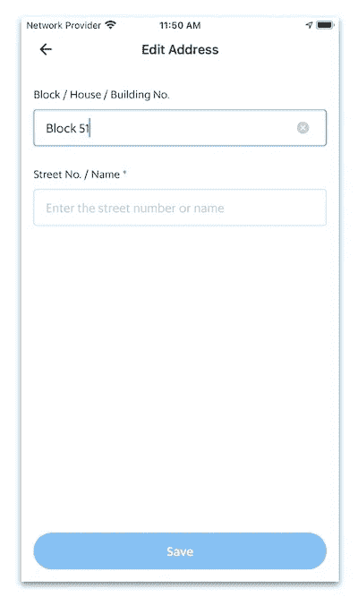
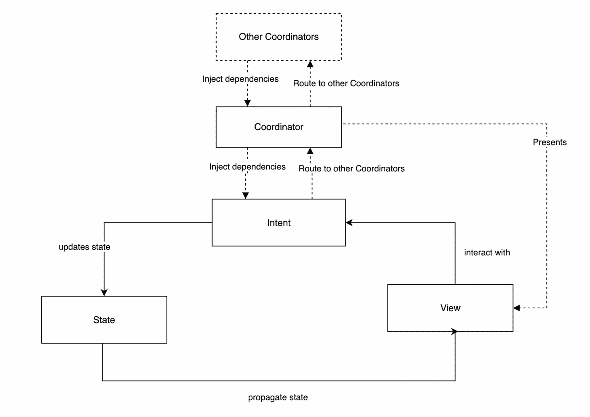

# 带有 UIKit 的 iOS 上的轻量级 MVI 架构

> 原文：<https://itnext.io/lightweight-mvi-architecture-on-ios-with-uikit-ef75e4797eeb?source=collection_archive---------1----------------------->

# 语境

在我做 iOS 工程师的整个过程中，我几乎处理过所有类型的架构模式，从 ***香草 MVC 到所有 MV<>中间*** 的 VIPER。随着时间的推移，我们大多数人意识到，在选择这样的模式时，没有正确或错误的答案，只是随着时间的推移使它适应项目和团队的需要。

也就是说，在与 React Native 一起工作了一段时间，并对 Flutter 和 SwiftUI 进行了修改后，前端行业作为一个整体正在向这些可以说是更“现代”的概念发展，即**单向数据流**和**声明式** UI。

尽管 UIKit 很快就要寿终正寝了，我还是想尝试最后一种模式，看看我们是否可以在一个真正的产品应用程序中加入这些概念的一些外观。这就是我如何发现 MVI 模式的。这里已经有一篇关于它的很棒的文章，从中我受到了很大的启发。然而，我想试着简化一下。因此，这是我自己在 iOS 上使用 UIKit 的 *MVI 模式。*

## 考虑

*   必须使用 UIKit(因为我们仍然针对 iOS 11 用户 [🥲](https://emojipedia.org/smiling-face-with-tear/)
*   适合中型团队(类似于 MVVM 用例)
*   最少样板文件(如 VIPER 或 RIB)
*   易于升级(要求对 RxSwift 或反应性概念有最低限度的了解)
*   单向数据流和(几乎)基于状态的声明式 UI
*   可扩展性(它应该能够适应不断增长的团队和产品需求)

# 什么是 MVI？

MVI 是模型视图意图。虽然它被称为 MVI，但更恰当的名称应该是状态视图意图。它与其他常见模式的关键区别之一是它非常严格地使用单向数据流。

*   状态(型号)
*   视角
*   目的

MVI 图

## 状态

*   虽然类似，但不应该与传统 MV <x>架构中的模型相混淆</x>
*   它是一个**不可变的**数据结构，表示应用程序这一部分在任何时刻的状态，就像快照一样
*   包含业务逻辑的结果(即来自服务请求的响应)以及表示 UI 的状态(加载、文本字段值等)

## 视角

*   从概念上讲，它与其他常见的 MV <x>架构相同</x>
*   它可能是 UIView 或 UIViewController
*   与 MV <x>的一个很大的区别是，它有一个单独暴露的*update(with State:State)*函数。这是一个纯函数，它接收新状态和以前的状态作为输入。</x>
*   给定相同的输入，视图的输出应该总是相同的。因此，视图可以被认为是状态函数的产物 **f(状态)=视图**

## 目的

*   从概念上讲，它类似于 MVVM 的视图模型或 RIB/Viper 的交互器
*   它可以访问所有需要的服务和其他依赖项
*   它处理视图中的所有用户交互
*   它处理所有业务逻辑
*   它处理所有的状态变化
*   与 MVVM/RIB/Viper 的一个很大的区别是，新的状态是通过一个单独的状态流发送给视图的
*   因此，数据流是单向的

# **例子**

**让我们考虑一个简单的例子，一个有两个输入和一个保存按钮的表单屏幕，在这个例子中输入一个地址。**

****

**示例屏幕**

## **状态**

**陈述例子**

***AddressState* 是一个具有 3 个属性的简单结构。它符合*状态*协议，该协议要求静态*初始状态*，这将在以后发挥作用。它还有一个特殊的 *init* 来从先前的状态生成一个新状态，并带有所需的修改值。**

## **视角**

**在这种情况下，我们的*视图*是一个简单的 *UIViewController* 。它符合*视图*，因此具有*更新(带状态)*功能。该函数负责根据所有状态值更新 UI。**

**请注意我们是如何将状态与之前的状态进行比较的，并在更新 UI 之前确保它们是不同的。在这种情况下，这似乎微不足道，但你可以想象更复杂的情况，我们希望避免任何不必要的 UI 更新。视图还负责接收用户输入并将它们发送给 Intent，在这种情况下，更新输入字段并点击 save 按钮。**

**请注意*视图*实际上没有任何反应代码，比如订阅 *Observables。它只是接收状态(从哪里接收并不重要)并更新 UI。***

## **目的**

***AddressIntent* 与您期望的*视图模型*或*交互器*没有太大的不同。它处理一些输入并发出状态变化。注意，除了绑定*状态驱动*之外，还有最小的反应代码。这就是主要魔力的来源。你可以认为它与 *React* 中的 *setState()* 非常相似。**

**我们可以看到 *stateDriver* 只是一个包装好的 *BehaviorRelay* ，它将通过总是发出新状态和先前状态来驱动它所绑定的视图。注意，我们在这里使用了 *RxSwift* 来实现 *StateDriver* ，但它也可以很容易地用 *Combine* 或任何其他反应式概念来实现。**

**仅此而已。我们现在有了一个充分发挥作用的 MVI。对于一个只有 3 个输入的简单形式的屏幕来说，代码是不是太多了？也许吧。然而，对于具有许多状态的复杂用例，我发现它实际上大大简化了代码量。**

# **航行**

**可能马上想到的一个问题是如何处理导航。像大多数其他 MVx 模式一样，MVI 没有规定一个关于导航的特定模式。在我们的特定项目中，我们简单地决定采用*协调者*模式。所以技术上我们可以称之为 **MVI+C****

****

# **增量采用**

**你也可以想象，如果你正在处理一个使用 *MVVM+C* 之类的现有项目，那么这个架构可以被逐步采用，因为只有*协调器*内的内容可以从 *MVVM* 更改为 *MVI* 。类似地，如果您正在处理一个 VIPER 代码库，那么*交互器+实体*可以替换为*意图+状态*。**

# **展开性**

**反过来，随着代码库的增长，人们可以看到这种模式可能开始出现裂缝。然而，它可以根据需要发展。如上所述，我们可以采用*协调器*或*路由器*模式来处理导航。我们可以引入一个*构建器*模式来处理依赖注入。如果我们发现这样做的目的是为了将业务数据转换成视图数据，我们可以考虑引入一个 *Presenter* 模式。**

# **测试**

**这种模式特别适合快照测试。每个*视图*可以用*状态*对象的所有组合进行测试，以生成该视图的所有可能状态。**

# **逮到你了**

**UIKit 的命令性质有时确实违背了这种模式。**

*   ****table view/collection view**:UICollectionView/UITableView API(委托)的异步设计使得在没有“临时”保持状态的情况下很难进行更新。**
*   ****文本输入:**文本值应该由输入状态设置，而不是由用户直接输入。这需要对 *UITextField* 或 *UITextView* 委托的工作方式进行一些操作。**
*   ****高效更新**:通过与之前的状态不同，避免不必要的 UI 更新**

# **结论**

**总的来说，我对结果很满意。我们在中型/大型应用程序中使用了这种模式，它为我们提供了很好的服务。它确实满足了我们前面提到的所有考虑因素。这也让 UI 编码变得更加有趣。这确实需要一点心态上的转变，尤其是对于那些习惯于命令式方式，并且从未处理过声明式 UI(比如 React/Flutter/swift UI/Compose/等)的人来说。然而，一旦它“咔嚓”一声，就一帆风顺了。[😎](https://emojipedia.org/smiling-face-with-sunglasses/)**