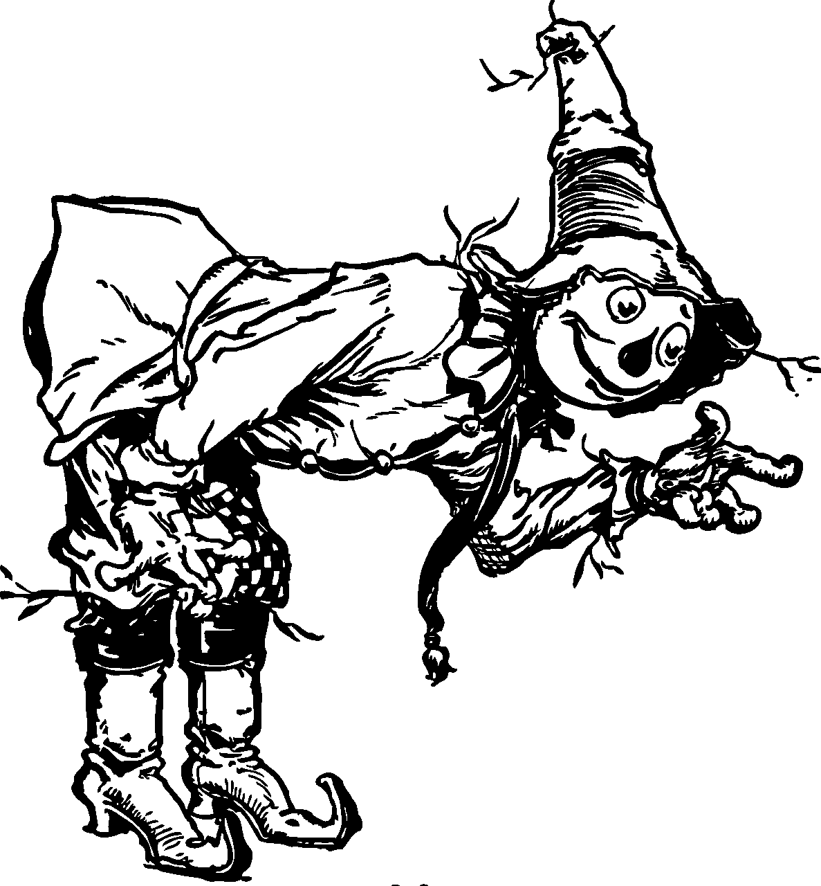
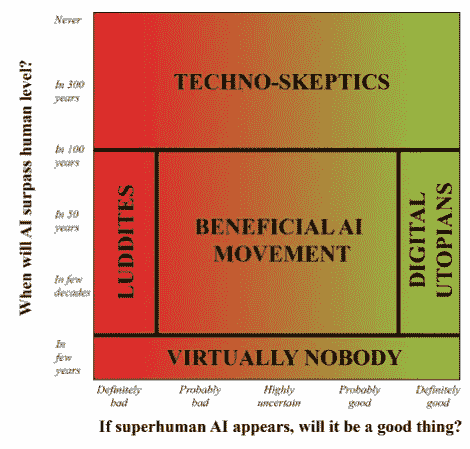
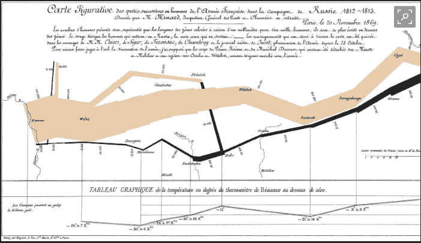
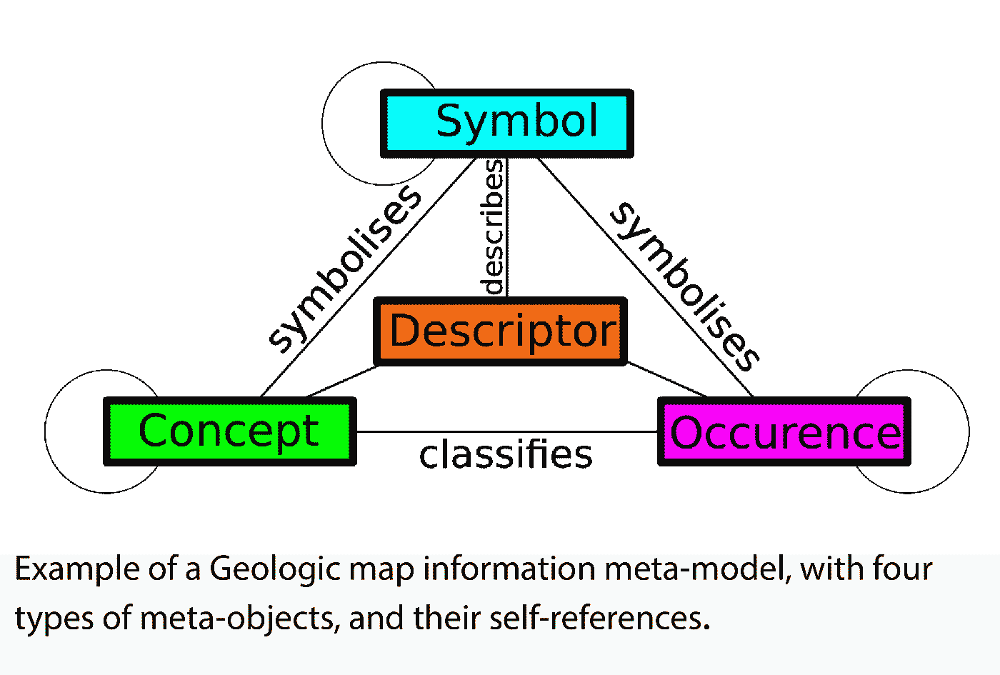
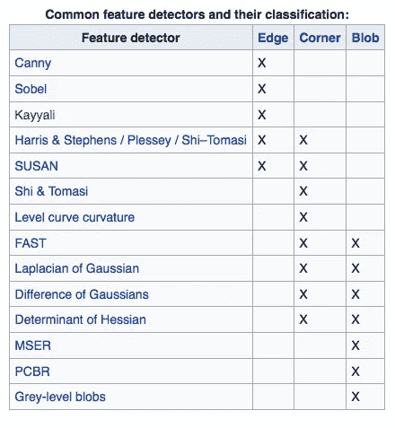
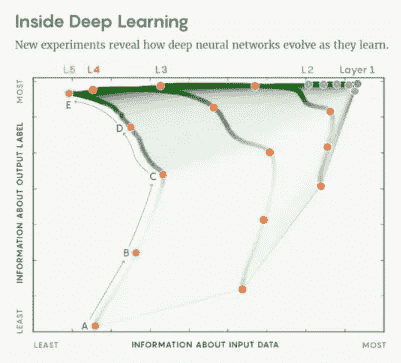

# 就像《奥兹国》中的稻草人一样，我们寻求我们一直拥有的智慧

> 原文：<https://itnext.io/like-the-scarecrow-in-oz-we-seek-the-intelligence-weve-always-had-9d2ec6e37cb3?source=collection_archive---------1----------------------->

[*点击这里在 LinkedIn* 上分享这篇文章](https://www.linkedin.com/cws/share?url=https%3A%2F%2Fitnext.io%2Flike-the-scarecrow-in-oz-we-seek-the-intelligence-weve-always-had-9d2ec6e37cb3)

**稻草人**是虚构的[绿野仙踪](https://en.wikipedia.org/wiki/Land_of_Oz)中的一个角色，由美国作家[L·法兰克·鲍姆](https://en.wikipedia.org/wiki/L._Frank_Baum)和插画家 [W.W .丹斯洛](https://en.wikipedia.org/wiki/William_Wallace_Denslow)创造。在他第一次出现时，在《绿野仙踪》中，稻草人悲叹自己没有大脑，并且最渴望拥有一个。

在整个故事的过程中，他证明了自己已经拥有了他所寻求的智慧，并且后来被公认为“全奥兹最聪明的人”。然而，他足够聪明，知道自己的局限性，非常乐意将巫师传给他的奥兹国的统治权交给 Ozma 公主，成为她信任的顾问。

当我们进入 2018 年时，目前最热门的技术是“*人工智能(AI)* ”。几乎不可能摆脱它的话语。**人工通用智能** ( **AGI)** 或**“强人工智能”**，是一台能够像人类一样成功执行任何智力任务的机器的智能。与**弱或者** **人工狭义智能** (ANI)形成对比，人工狭义智能是专攻一个领域的 AI。今天，人工智能应用的优势是弱人工智能，就像《绿野仙踪》中的稻草人一样，大多数计算机科学家哀叹缺乏强人工智能。然而，我们可能会像稻草人一样，再次发现我们在一段时间内已经拥有了我们所需要的全部智慧。只是形式和我们预想的不一样。

仅仅因为人工智能是 2017 年的热门话题，并不意味着它是一个新想法。现代人工智能的种子是由古典哲学家播下的，他们试图将人类思维过程描述为“*对符号的机械操纵*”，从这一点上来说，事情可能已经误入歧途。人工智能的早期工作在 20 世纪 40 年代以[可编程数字计算机](https://en.wikipedia.org/wiki/Computer)的发明达到高潮，这是一种基于数学推理的抽象本质的机器。这个设备及其背后的想法激发了一些科学家开始认真讨论建造一个“*电子大脑*”的可能性。

麻省理工学院教授马克斯·泰格马克(Max Tegmark)是一名宇宙学家，顺便提一下，他不仅仅是普通的计算机科学家，根据他的说法，围绕能够在任何认知任务上与人类相匹配的强人工智能的大多数争议都围绕两个问题

*   它什么时候(如果有的话)会发生？(从几年后到永远)
*   对人类会是好事吗？(从绝对不好到绝对好)

泰格马克博士将研究人员对这两个问题的观点归纳为五类:

1.  **技术怀疑论者—** 确信人类级别的人工通用智能(GAI)在可预见的未来不会出现
2.  数字乌托邦者认为这将会发生，但几乎肯定是一件好事。
3.  **有益的人工智能运动**认为关注是有保证的和有益的，因为人工智能安全研究和讨论现在增加了良好结果的机会。
4.  卢德分子确信会有不好的结果，并反对大赦国际。
5.  几乎没有人认为强人工智能会在未来几年出现

这是一个图表，说明了泰格马克博士对人工智能研究人员的调查。由于研究小组中“几乎没有人”认为强人工智能将在相当长的一段时间内出现，

似乎大多数人工智能研究人员都满足于让人工智能对话围绕着它何时发生以及它是好是坏。然而，我们很少听到关于我们所说的人工智能的“智能”部分的讨论。这似乎是一个移动的目标，由每个计划来决定。

乔治亚理工学院的雅各布·明兹博士提出了一个关于“智力”的工人定义，这可能会让我们所有人回到正轨。明兹博士将智力分为两部分:

*   知识和
*   分析能力

根据 Minz *“拥有广博的* ***知识*** *(来自阅读、学习/记忆、与他人交谈)* ***并不一定使人聪明。*** *根据他的说法，是人的* ***分析能力处理信息使人变得聪明。*** *明兹说“分析能力本身就是适应性的。我相信这些能力的适应性和进化速度是对智力的真正衡量。”*

明兹发现，“ ***的知识是如何表现出来的*** *允许对* *更快或更高效的分析处理从而导致日益智能的见解****。因此，我们能在多大程度上影响信息的表达，我们就能影响我们所寻求的“智能”。如果我们能够以一种增强“分析能力”的方式来表示知识，我们也许能够加速人工智能的进步。***

*代表是使用符号来代表和代替其他事物。正是通过表现，人们通过命名元素的行为来组织世界和现实。符号的排列是为了形成 [**语义**](https://en.wikipedia.org/wiki/Semantics) 结构，表达关系。符号学家****普遍认为，表征关系可以分为三个不同的类别:*****

*   *******图标**——这个术语指的是通过相似性来表现的符号，比如肖像和一些绘画，尽管它们也可以是自然的或数学的*****
*   *******符号**——可以是自然的、文化的，也可以是抽象的、逻辑的。作为符号，它们依赖于它们将如何被解释，而缺乏或已经失去了对相似性以及与它们所代表的对象的实际的、索引的联系的依赖*****
*   *****索引(index)——通过事实的联系，通常是通过原因和结果来引起注意的符号。例如，如果我们看到烟，我们就断定它是一个原因——火的结果。如果这种联系是事实性的，不管是相似性还是解释，这就是一个指标。*****

*****虽然以数字数据的形式表示信息，尤其是以索引、表格数据的形式表示信息，确实提高了计算和获取知识的能力，但也限制了可用于从知识中获取情报的“*分析能力*的类型。*****

*******数据可视化**一直是高效分析师的重要武器，能够高效地表示复杂的数据集，清晰简洁地传达复杂的想法。随着大数据时代数据量和分析复杂性的增加，可视化已被视为一种更加重要的技术。*****

*****数据可视化**、**被很多人视为*、*、[、*视觉传达*、](https://en.wikipedia.org/wiki/Visual_communication)、*、*涉及到**、**、**视觉化**、、**表示[数据](https://en.wikipedia.org/wiki/Data)的**的创造和研究，从而“信息被抽象成某种示意性的形式或用[、](https://en.wikipedia.org/wiki/Dimension)二维图像表示，它包括:[符号伴随文字的视觉信息具有更大的告知、教育和](https://en.wikipedia.org/wiki/Signage)[说服的力量。](https://en.wikipedia.org/wiki/Persuade)*****

*****个人可能有特定的分析任务，如进行比较或理解[因果关系](https://en.wikipedia.org/wiki/Causality)，图形的设计原则(即显示比较或显示因果关系)遵循该任务。表格通常用于用户查找特定测量，而各种类型的图表用于显示一个或多个变量的数据模式或关系。*****

*****很少有人像**一样对信息的表现给予如此多的思考。按照 Tufte 博士的说法，“*设想信息……就是在图像、文字、数字、艺术……的交叉点上工作。而质量的标准是那些来源于告诉我们如何* ***把正确的标记放在正确的位置*** *的原则。********

**********

*****图为查尔斯·密纳德绘制的 1812 年拿破仑的俄国战役地图，塔夫特称之为“有史以来最好的统计图”。在其中，密纳德设法表现了五种类型的信息:*****

1.  *****地理，*****
2.  *****时间，*****
3.  *****温度*****
4.  *****大陆军的运动方向*****
5.  *****战场上的军队数量。*****

*****在[**设想信息**](https://www.amazon.com/Envisioning-Information-Edward-R-Tufte/dp/0961392118/ref=sr_1_1?s=books&ie=UTF8&qid=1513285905&sr=1-1&keywords=envisioning+information+edward+tufte) **、**图夫特博士关于主题的“三部曲”中的中卷，他侧重于在二维空间中渲染复杂且往往是三维的信息；他称之为“逃离平地”。”*世界是复杂的、动态的、多维的；塔夫特说，这种纸是静态的、扁平的。他以图表、地图、图表、时间表等形式展示了数百个有效信息表达的例子。******

*****虽然可视化可以让人类更容易理解信息，但它对机器的操作没有什么帮助。本质上，我们的机器仍然是 20 世纪 40 年代的机器，是基于数学推理的抽象本质的机器。卡洛斯·佩雷斯和其他人认为，我们需要克服他所谓的“**认知偏见**”，这种偏见倾向于逻辑推理而不是直觉推理，以便能够获得我们所寻求的人工智能。根据佩雷兹的说法，“至少 60 年来，人们一直在探索基于逻辑推理的认知机制，却没有在 AGI 方面取得多大进展。诺贝尔奖得主理查德·费曼似乎也同意这一点:*****

*****“识别事物”目前对机器来说是很困难的，有些事情是由一个人瞬间完成的。所以有些事情是人类可以做的，那就是我们不知道如何在 ***一个归档系统********

*******“****分析能力****”Jacob Minz 认为智能的两个部分之一可以被认为是计算机系统中的软件，而“* ***知识*** *”可以被认为是数据。当它们结合在一起时，可以产生智慧。许多人喜欢将软件和人类的分析能力以及人类的记忆和知识相提并论。最大的不同是，人类的智能虽然可能有自己的限制，但没有计算机化知识系统的限制，最大的限制是:*******

*   ******[***元模型***](https://en.wikipedia.org/wiki/Metamodeling) *用于存储数据和*******
*   *******软件的语法和语义规则。*******

************

******所有程序员开发的软件都是用软件语言创建的，软件语言既有词汇又有语法，就像人类语言一样。然而，当涉及到数据或知识时，就有显著的差异。计算机系统中的所有数据根据数据模型来组织，并且数据模型根据元模型来组织。这些模型可能被认为类似于人类知识在记忆中的存储方式，但我们不知道人脑的元模型。此外，人类 i ***智能是一种*** [***多态的***](https://en.wikipedia.org/wiki/Polymorphism) *，适应性程序，通过学习、试验、记忆结果、修复其逻辑和用经验增强其分析能力而进化。*******

******卡洛斯·佩雷斯认为人类能力的适应性和进化速度是衡量智力的真正标准。我们不知道人类分析能力的限制，类似于数据模型对软件的限制。******

******根据 Perez " t**he big cham "**的说法，要实现更通用的人工智能，需要跨越的是直觉和逻辑之间所谓的"**【语义鸿沟】。我们如何将深度学习(子符号)系统的能力与逻辑(符号)系统融合？佩雷斯认为我们有一个**20 世纪 40 年代，一个基于数学推理抽象本质的机器**需要由逻辑机器驱动的技术和方法。他总结说，这是优秀的老式人工智能(GOFAI)几十年来失败的原因，它试图从形式逻辑作为出发点来解决智能问题。********

> **********直观的头脑*** *是神圣的礼物，理性的头脑是忠实的仆人。我们创造了一个尊重仆人而忘记礼物的社会”。* —阿尔伯特·爱因斯坦*******

*******根据佩雷斯的说法，深度学习网络是直觉机器**。**他们通过使用****“学会”执行推理(或做出预测)。**深度学习系统能够执行通常为生物系统保留的任务。传统计算难以完成的任务，如面部和语音识别，可以通过直观的深度学习机器在超人级别上执行。*********

> ********“大多数人类没有被教导逻辑思维，但大多数人类仍然是聪明的，大脑应该基于逻辑是难以置信的；智能从数百万个嵌套的微观直觉中涌现，而那个* ***人工智能需要人工直觉*** *。”—莫妮卡·安德森********

*******[**直觉**](https://en.wikipedia.org/wiki/Intuition) 是在没有[证明](https://en.wikipedia.org/wiki/Proof_(truth))、[证据](https://en.wikipedia.org/wiki/Evidence)，或者有意识[推理](https://en.wikipedia.org/wiki/Reason)，或者不了解知识是如何获得的情况下，获得知识的能力。**机器学习**专注于开发**能够从数据中学习并做出后续预测的算法。*********

*******深度学习的核心思想被称为**特征(或表征)学习，**适用于广泛的应用。正如新加坡总理办公室国家研究基金会的研究人员所指出的，“*一旦我们有了实体的有效表示，例如图像、文字、表格行或列，我们就可以计算实体的相似性，执行聚类，训练预测模型，并检索不同模态的数据。*"(([https://sigmodRecord . org/publications/sigmodRecord/1606/pdf/04 _ vision _ Wang . pdf](https://sigmodrecord.org/publications/sigmodRecord/1606/pdfs/04_vision_Wang.pdf))王巍等著《SIGMOD 记录》2016 年 6 月(第 45 卷，№2)*******

*******在[**机器学习**](https://en.wikipedia.org/wiki/Machine_learning) 中，特征学习或 [**表示学习**](https://en.wikipedia.org/wiki/Feature_learning) 是一套技术，允许系统从原始数据中“自动发现”特征检测或分类所需的表示。这取代了手动[特征工程](https://en.wikipedia.org/wiki/Feature_engineering)，允许机器学习特征并使用它们执行特定任务。*******

*******对于什么构成一个特性，没有一个通用的或确切的定义，确切的定义通常取决于问题或应用程序的类型。例如，假设特征被定义为[图像](https://en.wikipedia.org/wiki/Digital_image)的“有趣”部分，那么特征就被用作许多计算机视觉算法的起点。由于特征是作为后续算法的出发点和主要图元，所以整体算法往往只会和它的[**特征检测器**](https://www.reference.com/world-view/feature-detection-4799814677438410) 一样好。因此，特征检测器的理想属性是 [***重复性***](https://en.wikipedia.org/wiki/Repeatability)；在同一场景的两个或多个不同图像中是否会检测到相同的特征。下表列出了特征检测器及其可以检测的图像特征类型。*******

**************

*******特征检测是一个低级的[图像处理](https://en.wikipedia.org/wiki/Image_processing)操作。也就是说，它通常作为对图像的第一个操作来执行，并检查每个[像素](https://en.wikipedia.org/wiki/Pixel)，以查看该像素处是否存在特征。如果这是更大算法的一部分，那么该算法通常将只检查特征区域中的图像。*******

*******如下图，来自精彩 Oct 08《连线》文章《*新理论破解深度神经网络黑盒*》举例说明，一个深度神经网络从成千上万个样本中“学习”后(如 A 级)，它能像人一样准确地识别新物体中的物体。学习过程中从特例到一般概念的神奇飞跃(B- D 水平)赋予了深度神经网络超越“刚性表示”系统的能力，正如它是人类推理、创造力和其他统称为“智能”的能力的基础一样*******

**************

*******专家们现在想知道深度学习是什么使概括成为可能(D 级)——以及大脑在多大程度上以同样的方式理解现实，克服对表现的严格要求。这是人工智能(AI)已经发展到的奇妙状态，就像《绿野仙踪》中的稻草人一样，我们可能已经拥有了我们所寻求的大脑。尽管我们的深度学习大脑还有许多工作要做，但这段旅程不再是沿着“*黄砖路”*的旅程。*******

*******__________________________________________________________________*******

*********备注:*********

1.  *******[https://en . Wikipedia . org/wiki/History _ of _ 人工智能](https://en.wikipedia.org/wiki/History_of_artificial_intelligence)*******
2.  *******泰格马克，麦克斯。《生活 3.0:成为人工智能时代的人类》，Knopf Doubleday 出版集团。*******
3.  *******[https://en . Wikipedia . org/wiki/re presentation _(arts)](https://en.wikipedia.org/wiki/Representation_(arts))*******
4.  *******米切尔，“再现”，F .伦特里基亚和 T .麦克劳克林(编辑)，*文学研究的关键术语*，芝加哥大学出版社，芝加哥 1990 年*******
5.  *******[https://www . LinkedIn . com/pulse/worth-千言万语-权力-限制-数据-马丁-威尔考克斯](https://www.linkedin.com/pulse/worth-thousand-words-power-limitations-data-martin-willcox)*******
6.  *******[https://en.wikipedia.org/wiki/Data_visualization](https://en.wikipedia.org/wiki/Data_visualization)*******
7.  *******爱德华·塔夫特，展望信息，图形出版社，柴郡，康涅狄格州 1990 年。*******
8.  *******卡洛斯·佩雷斯。*人工直觉:不可能的深度学习革命*，Kindle 版。*******
9.  *******[https://medium . com/intuition machine/the-first-rule of-agi-is-BC 8725d 21530](https://medium.com/intuitionmachine/the-first-rule-of-agi-is-bc8725d21530)*******

*********参见:*********

*******([https://medium . com/intuition machine/alpha zero-how-intuition-disrupted-logic-66a 4841 e 6810](https://medium.com/intuitionmachine/alphazero-how-intuition-demolished-logic-66a4841e6810))&*******

*******([https://medium . com/intuition machine/artificial-intuition-a-breakthrough-cognitive-paradigm-3905 c6d 76561](https://medium.com/intuitionmachine/artificial-intuition-a-breakthrough-cognitive-paradigm-3905c6d76561))&*******

*******([https://medium . com/intuition machine/the-first-rule-of-agi-is-BC 8725d 21530](https://medium.com/intuitionmachine/the-first-rule-of-agi-is-bc8725d21530))*******