# (第七部分。)Unity 中的 Limbo 风格菜单

> 原文：<https://itnext.io/limbo-style-menu-in-unity-4fe3fdee3420?source=collection_archive---------2----------------------->

在本教程中，我将复制 2010 年著名游戏《地狱边缘》的菜单风格:

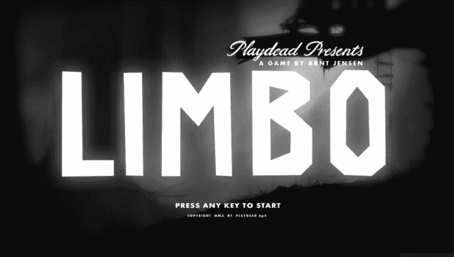

(上一部分教程[这里](/killing-enemies-with-telekinetic-bricks-in-unity-gamedev-tutorial-part-6-4d43874eae29))。

下载大气图像，例如从 unsplash 下载:

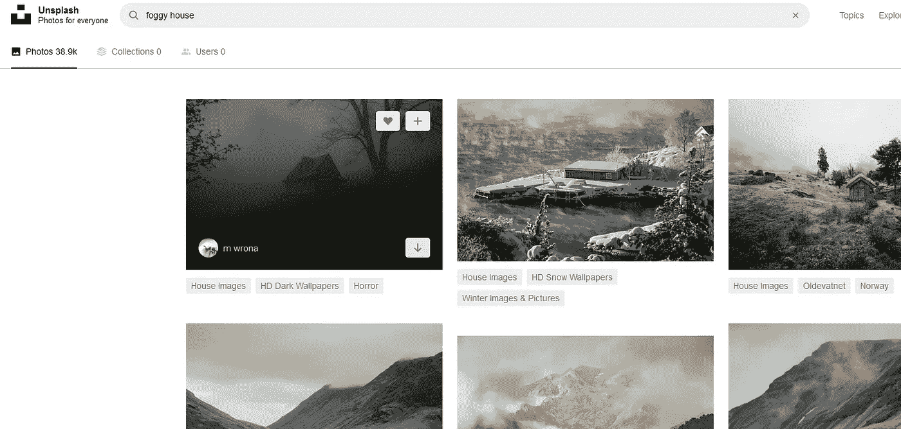

在 Unity 中创建新场景:

将图像用户界面添加到场景中

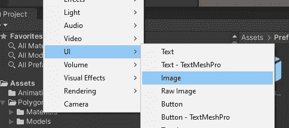

导入图像并将纹理类型更改为 UI:

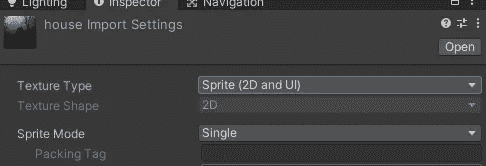

将图像拖到源图像上:

更改锚点以扩展(按住 alt 并选择右下角的选项)

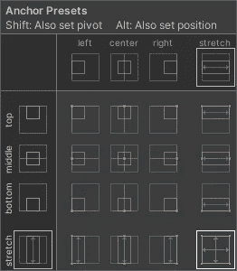

现在看起来是这样的(我增加了图像的对比度，转换成黑白):

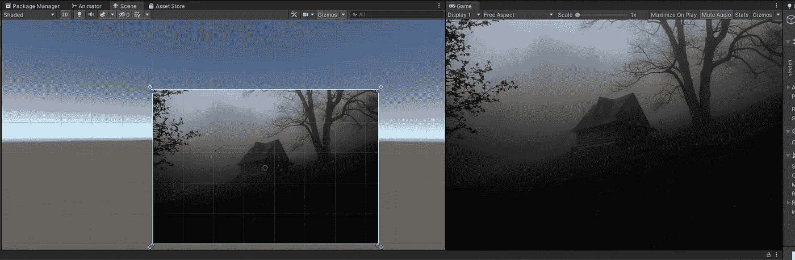

点击画布，将用户界面缩放模式改为“随屏幕尺寸缩放”。改变你的目标分辨率。

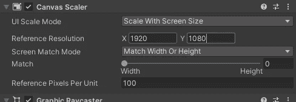

向画布添加一个新按钮(TextMeshPro)。

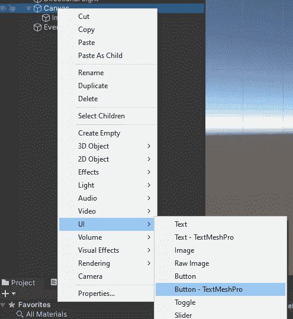

在弹出窗口中导入 TMP:

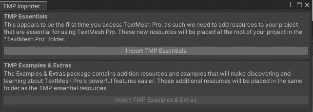

调整按钮的大小，并根据您的喜好更改值。

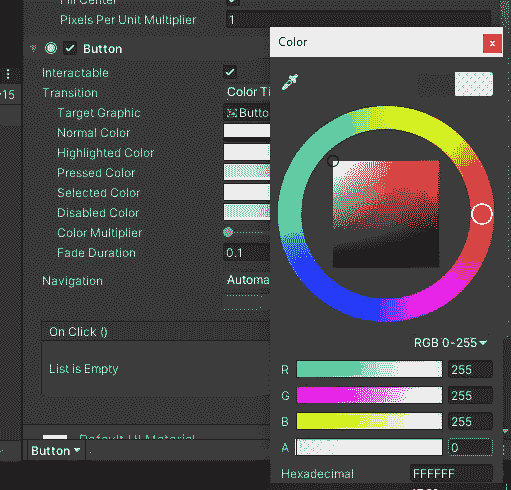

在按钮中，删除图像组件:

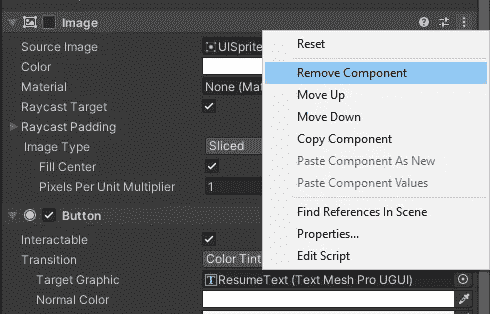

更改按钮的文本:

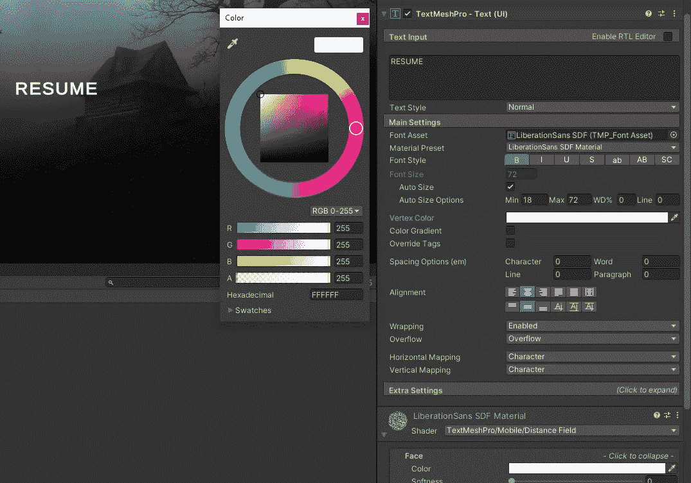

在按钮设置中，将动画/淡入淡出的目标图形更改为按钮的文本:

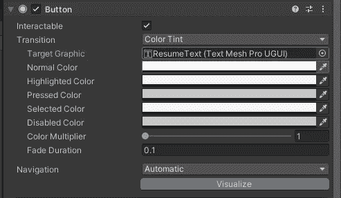

使用高亮/聚焦/鼠标悬停选项。我将*的正常颜色*设置为浅灰色，将*的高亮颜色*设置为白色。

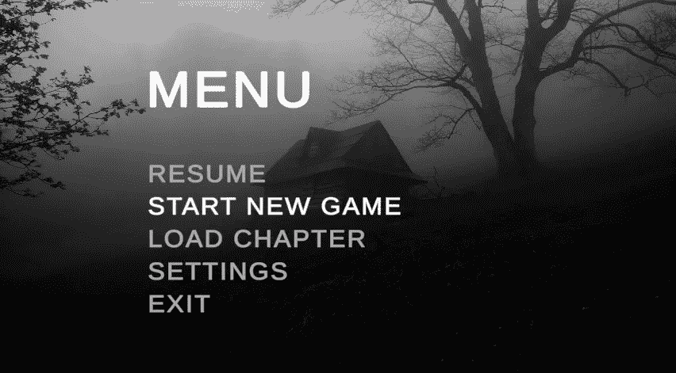

将按钮重复几次，并添加更多菜单选项:

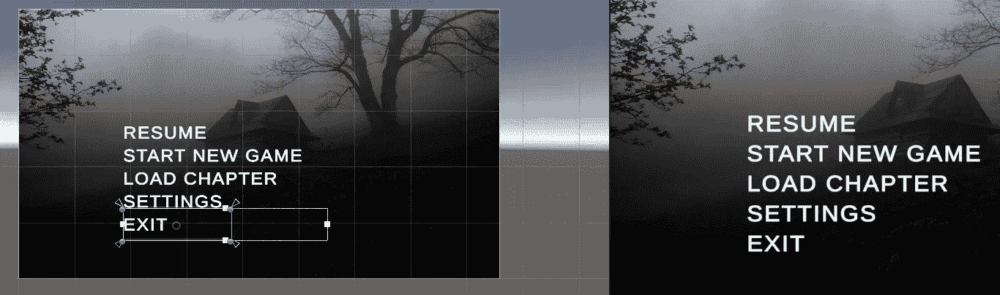

将标题文本添加到画布:

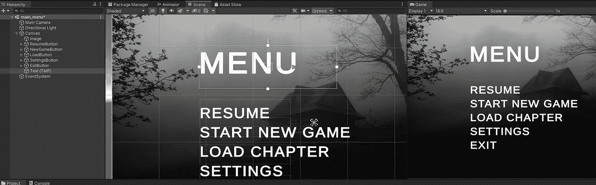

创建一个新脚本，它将保存菜单的逻辑:

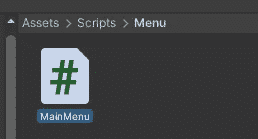

右键单击画布对象，创建一个空对象，调用它的主菜单，并分配按钮给它。

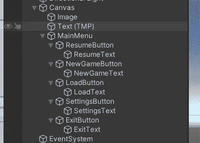

将脚本附加到主菜单对象。

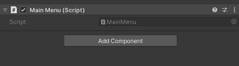

我想让新的游戏按钮开始一个新的场景。为此我需要知道去现场的路。

转到文件->构建设置和场景你有“场景在构建”。我的*新游戏场景*是*样本场景。*

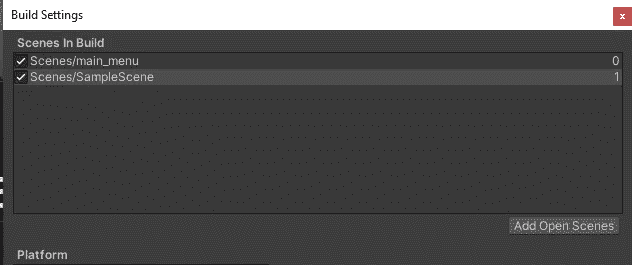

在脚本中，使用 SceneManager 将场景加载到一个新函数中，稍后我们会将该函数与按钮挂钩。

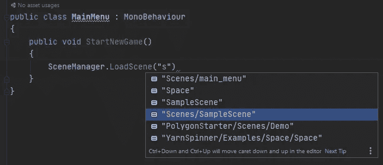

转到按钮检查器并添加一个新的 OnClick 事件。将 MainMenu 对象分配给它，以便它可以访问其功能:

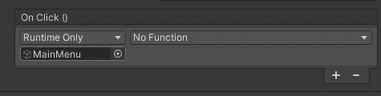

选择 StartNewGame 功能(如果您希望能够在 Unity 编辑器中运行，也可以切换到*编辑器和运行时*):

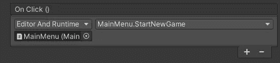

类似地，将功能分配给其他按钮(退出等。):

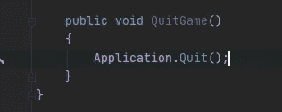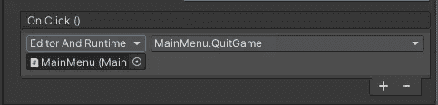

“设置”按钮需要另一个子菜单。复制主菜单对象，并重命名它及其子项目:

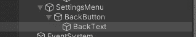

停用它以将其隐藏在场景中:

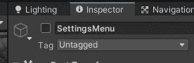

向设置按钮添加新的 *OnClick* 功能(OnClick 隐藏主菜单并显示设置菜单):

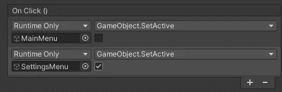

在设置菜单中的后退按钮上，执行相反的操作:

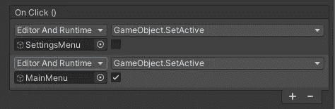

点击 play 后，你可以用鼠标、箭头键或游戏手柄控制菜单。

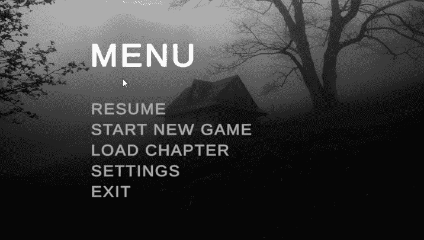

如果你刚刚开始学习如何开发游戏，你可以关注我的 udemy 初学者 Unity 开发课程:

 [## 完整指南:Unity 2020 中的动作恐怖 3D 游戏

### 大家好，我叫 Jan Jileč ek，是一名拥有计算机科学硕士学位的专业游戏开发人员，我…

www.udemy.com](https://www.udemy.com/course/make-a-3d-game-in-unity-2020-from-scratch-with-free-assets/?referralCode=8B96F6C67527AEEA39D9)