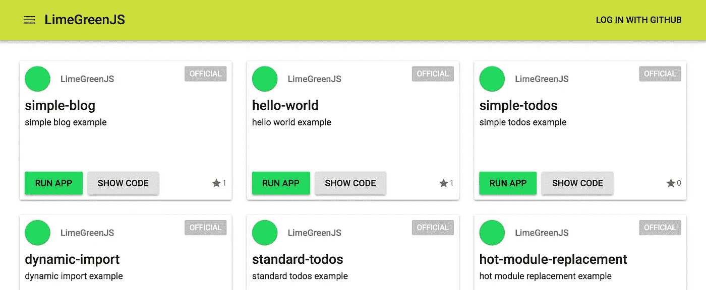

# LimeGreenJS:轻松学习和开发 React-GraphQL Web 应用程序

> 原文：<https://itnext.io/limegreenjs-learn-and-develop-react-graphql-web-applications-without-trouble-f12547f089e7?source=collection_archive---------1----------------------->



在本文中，我将介绍我的新服务 LimeGreenJS 及其基本用法。目标读者是那些开始学习 [GraphQL](http://graphql.org) 和 [Apollo](https://www.apollographql.com) 的人。

## 背景

对于初学者来说，为 React 应用程序构建开发环境是一项艰巨的任务。像 [create-react-app](https://github.com/facebook/create-react-app) 这样的工具很有帮助，但是我想为 GraphQL 做一些更专业的东西。此外，我认为非常重要的是部署应用程序，以便您可以允许某人使用它们。回想过去， [Meteor](https://www.meteor.com) 提供了一个很好的部署服务，你只需一个命令就可以部署你的应用。这对于学习 Meteor 和发布相对较小的应用程序来说非常方便。

## 我的解决方案

limegrinjs 是一个运行应用程序的 web 服务，该应用程序的代码在 GitHub 存储库中，没有任何配置。它在某种意义上类似于 [RawGit](https://rawgit.com) 。目前，它假设该应用程序是用 React Apollo stack 开发的，并且系统中包含了相关的包。它还包括官方示例应用程序，这些应用程序被维护以在系统中正常工作。这使得该服务成为 React-GraphQL 示例应用程序的存储库。一旦我们有了足够的例子，我们可以把它们组织成一个教程。

换句话说，LimeGreenJS 是:

*   在 GitHub 中运行 React-GraphQL 应用程序的工具
*   React-GraphQL 示例应用的存储库
*   面向小型生产应用的部署服务

## 如何使用 LimeGreenJS

首先，我们来看一些官方 app。打开[limegrinjs](https://limegreenjs.axlight.com/)网站，寻找“hello-world”，这是你想看的第一个应用。只是一个没有 GraphQL 的 React app。你能做的只是“运行应用程序”和“显示代码”。你可以尝试其他官方应用，比如“简单博客”就是 React-GraphQL 的一个极小的例子。

接下来，如果你使用 GitHub 帐户登录，你可以看到你的存储库中的应用程序，如果你愿意，还可以看到所有应用程序。你可以派生一些官方应用，你应该可以在你的存储库中看到它们。您可以修改代码并通过 LimeGreenJS 运行它。(限制:在编写本文时，您需要刷新页面以反映存储库中的更改。这应该在将来得到解决。)现在，你想尝试分叉应用程序“hello-world”，看看它是如何工作的。

您可以通过 GitHub 中的内置编辑器编辑您的代码，但是一旦您习惯了，您可能会在本地编辑器中编辑您的代码，并且您可能希望在没有 LimeGreenJS 站点的情况下运行代码，因为这需要 git 提交和推送。LimeGreenJS 提供了一个 CLI 工具来本地运行应用程序，就像 create-react-app 一样。

```
npx limegreenjs dev
```

在您的签出目录中运行此命令。它假设有与 npm5 捆绑在一起的`npx`。

## 其他一些笔记

*   如果你在你的 GitHub 项目的描述中放入“limegrinjs-enabled ”,它将会在 limegrinjs 中列出。
*   LimeGreenJS 不提供 GraphQL 后端，期望使用现有的 baa 如 [Graphcool](https://www.graph.cool) 和 [GraphCMS](https://graphcms.com) 。
*   LimeGreenJS 生成的应用程序 URL 是基于 git 提交 id 的，所以从技术上来说是可缓存的。

## 对于下一步

我在本文中只描述了基本的用法，以后我可能会发布后续文章，因为有些信息可能会在本文中遗漏。

我将感谢任何反馈。对于 LimeGreenJS 核心系统，我在 GitHub 做了 [issues](https://github.com/LimeGreenJS/issues) 项目。因此，请随时在那里提出问题。其他评论也欢迎在 Medium 或 Twitter 上发表。