# 线性回归:如何克服局部加权线性回归(lwr)的拟合不足

> 原文：<https://itnext.io/linear-regression-how-to-overcome-underfitting-with-locally-weight-linear-regression-lwlr-e867f0cde4a4?source=collection_archive---------2----------------------->


线性路径

在本文中，我们将首先讨论线性回归、它的意义以及如何在 Python 中实现它。接下来，我们将了解一种用于局部平滑估计以更好地拟合数据的技术。即使用[lwr](https://vsoch.github.io/2013/locally-weighted-linear-regression/)克服装配不足。

获取 [GitHub](https://github.com/Eyongkevin/Linearly-Weighted-Linear-Regression) 上的完整代码

## 什么是线性回归

让我们首先理解什么是回归。回归是一种有监督的学习，其中我们有一个目标变量或我们想要预测的东西。回归和分类的区别在于，在回归中，我们的目标变量是数字和连续的。

LR 用于找到目标和一个或多个预测因子之间的线性关系。我们预测的变量被称为(**标准变量、结果变量、内生变量或回归**)，而我们预测所基于的变量被称为(**预测变量、外生变量或回归**)。线性回归有两种类型:**简单回归**或**多重回归**。当只有一个预测变量时，预测方法称为简单 LR。简单 LR 的图总是形成一条直线。

LR 的一些性质是:

*   **优点**:结果易于解释，计算成本低
*   **缺点**:对非线性数据建模较差
*   **配合**使用:数值、额定值

## 寻找与 LR 最匹配的系列

使用回归时，我们的主要目标是预测数字目标值。一种方法是写出目标值相对于输入的等式。让我们假设，我们想预测我们的能源基础上的食物和我们喝的水的数量。一个可能的等式是:

```
Energy = 0.0015*food - 0.99*water
```

这就是所谓的回归方程。值 *0.0015* 和 *-0.99* 称为**回归权重**。找到这些回归权重的过程称为**回归。**

线性回归意味着你可以将输入与一些常数相乘得到输出。还有一种回归叫做**非线性回归**，但事实并非如此；输出可以是相乘在一起的输入的函数。

```
Energy = 0.0015*food/water
```

就此而言，我们将为此[数据](https://github.com/Eyongkevin/Linearly-Weighted-Linear-Regression/tree/master/data)寻找最佳拟合线。让我们加载数据:

从文件中加载数据

> *loadDataSet()* 函数打开一个带有制表符分隔值的文本文件，并假定最后一个值是目标值。

为了可视化数据，我们将使用这个 python 代码来绘制数据的线性分布

```
# Convert arrays to matrix
xMat = np.mat(data.dataMat)
yMat = np.mat(data.labelMat)# Plot
fig = plt.figure(figsize=(20,10))
ax = fig.add_subplot(111)
ax.scatter(xMat[:,1].flatten().A[0], yMat.T[:,0].flatten().A[0])
plt.show()
```

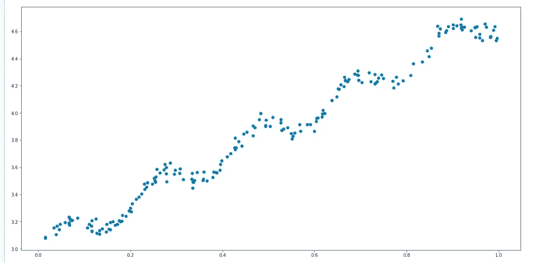

数据线性分布图

假设我们的输入数据在矩阵 X 中，我们的回归权重在向量 w 中。对于给定的数据 X1，我们的预测值由下式给出:

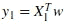

我们有 **Xs** 和 **ys** ，但是怎么才能找到 **ws** ？一种方法是找到最小化误差的 ws。我们将误差定义为预测的 *y* 和实际的 **y** 之差。仅使用误差将允许正值和负值相互抵消，因此我们使用平方误差:

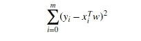

用矩阵符号表示，我们有:

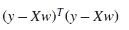

如果我们对 w 求导，我们会得到

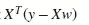

我们可以将其设置为零，并求解 **w** 以获得以下最终等式:

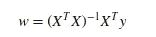

> **NB** :最终方程有矩阵求逆。因此，在使用它之前，我们必须首先检查矩阵的逆存在，否则我们可能会有一个错误。

让我们看看最终的等式是如何用 Python 实现的

> 我们已经使用了 [linalg.det(m)](https://docs.scipy.org/doc/numpy-1.15.0/reference/generated/numpy.linalg.det.html) 来找出一个矩阵是否有逆。如果等于零，那么它是一个奇异矩阵，所以没有逆矩阵

## 绘制并显示最佳拟合线

到目前为止，我们已经加载了数据，并根据上面的公式实现了线性回归。现在我们将使用它来显示图上的最佳拟合线

```
ws = standRegres(data.dataMat, data.labelMat)
xMat = mat(data.dataMat)
yMat = mat(data.labelMat)# Our predicted value yHat using the weights (ws)# Sort it to avoid out of order
xCopy = xMat.copy()
xCopy.sort(0)
yHat = xCopy*ws# Plot
fig = plt.figure()
ax = fig.add_subplot(111)
ax.scatter(xMat[:,1].flatten().A[0], yMat.T[:,0].flatten().A[0])
ax.plot(xCopy[:,1],yHat)
plt.show()
```

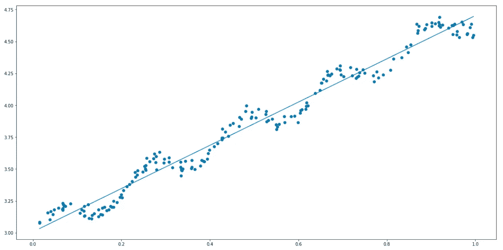

显示最佳拟合线的图

## 检查相关系数

为了计算预测值 *yHat* 与实际数据 **y** 的匹配程度，我们检查两个序列之间的相关性

```
# Get predicted value(unsorted)
# Transpose yHat so we have both vectors as row vectors
yHat = xMat*ws
np.corrcoef(yHat.T, yMat)>>> array([[ 1\.        ,  0.98647356],
       [ 0.98647356,  1\.        ]])
```

> Numpy.corrcoef()用于求 2 个数列(矩阵)之间的相关系数，从而知道它们有多相似。

从上面的结果来看，对角线上的元素是 **1.0** ，因为 *yMat* 和 *yMat* 之间的相关性是完美的。然而，我们在 *yHat* 和 *yMat* 之间有一个 **0.98** 的相关性。因此，我们的模型在预测方面做得很好

## 局部加权线性回归

线性回归有一个问题，就是它倾向于对数据进行欠拟合。它给出了无偏估计量的最小均方误差。因此，在拟合不足的情况下，我们得不到最好的预测。

降低均方误差的一种方法是一种称为 LWLR 的技术。对于 LWLR，我们对感兴趣的数据点附近的数据点赋予权重；然后我们计算最小二乘回归。该公式现在变为:

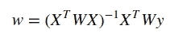

**(W)** 这是一个用来给数据点加权的矩阵。LWLR 使用一个类似于 SVM 的核来加权附近的点。最常用的内核是一个**高斯**。这分配了由下式给出的权重:

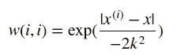

*   根据上面的公式，数据点 **x** 离其他点越近， **w(i，i)** 越大。
*   我们还看到一个常数 **k** ，这是一个用户定义的常数，它将决定附近点的权重。所以它决定了衰变发生的速度。对于 LWLR，这是我们唯一需要担心的参数

**优点**

*   有了合适的 k 值，我们就可以得到最佳拟合的数据，避免过度拟合和欠拟合

**缺点**

*   这涉及到大量的计算。您必须使用整个数据来找到一个估计值

在 Python 代码中，我们有以下内容

> 函数 *lwlr()* 根据输入数据创建矩阵，然后创建一个对角权重矩阵，称为*权重*。权重矩阵是具有与数据点一样多的元素的正方形矩阵。该函数接下来迭代所有数据点并计算一个值，该值随着远离*测试点*而呈指数衰减。输入 *K* 控制衰减发生的速度。在我们填充了权重矩阵之后，我们找到了类似于函数*standregregs()*的测试点的估计值。
> *lwlrTest()* 为数据集中的每一点调用 *lwlr()* 。

我们之前说过，有了合适的 K 值，我们就可以获得数据的最佳拟合，避免过度拟合和欠拟合。在这方面，我们将测试 K 的 3 个值(1.0，0.01，0.003)，并查看 K 的哪个值最符合我们的数据。

我们将使用下面的代码来绘制最佳拟合

```
# find extimate yHat for all data points.k = 0.01
yHat = lwlrTest(data.dataMat, data.dataMat, data.labelMat, k)# Plot needs the data to be sorted. Here, we sort xArr
srtInd = xMat[:,1].argsort(0)
xSort = xMat.copy()
xSort.sort(0)# Plot
fig = plt.figure()
ax = fig.add_subplot(111)
ax.plot(xSort[:,1], yHat[srtInd])
ax.scatter(xMat[:,1].flatten().A[0], mat(data.labelMat).T.flatten().A[0], s=2, c='red')
plt.show()
```

**情况 K=1.0**

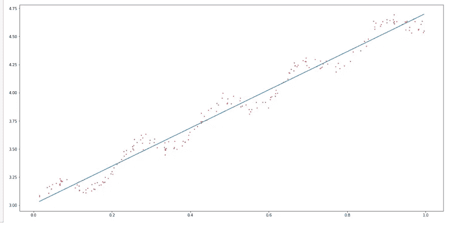

当 *K=1.0* 时，我们看不到任何变化，它仍然会出现欠拟合。

**案例 K=0.003**

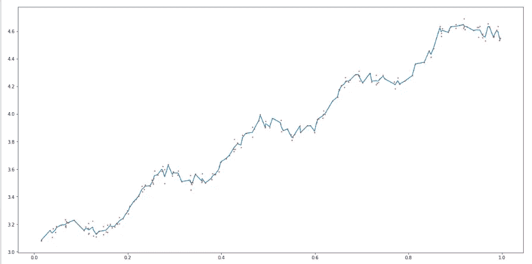

随着 *K=0.003* ，我们看到我们的模型经历过拟合。

**案例 K=0.01**

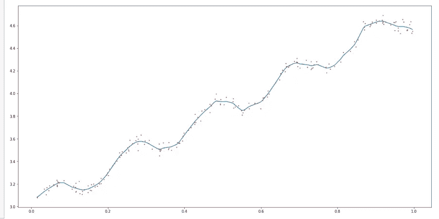

使用 *K=0.01* ，我们有最佳拟合线，不会过度拟合和欠拟合。

## 结束！

我们看到了如何使用 LWLR 方法找到没有欠拟合和过拟合的最佳拟合线。然而如上所述，LWLR 的一个问题是它涉及大量的计算。

我希望你喜欢读这篇文章，如果你有任何关于比 LWLR 更好的其他方法的建议，或者我错过了在这篇文章中包括的任何东西，请欢迎你的评论。