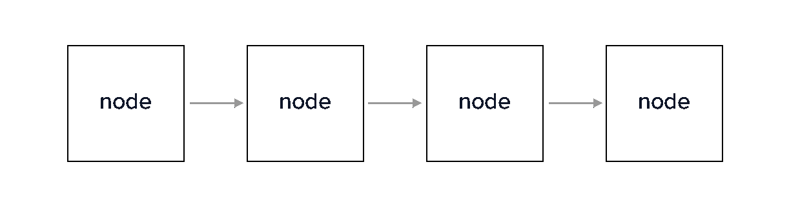
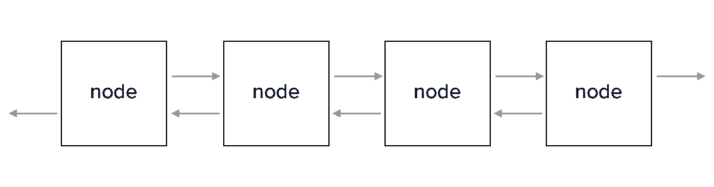
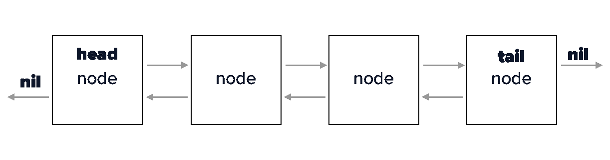
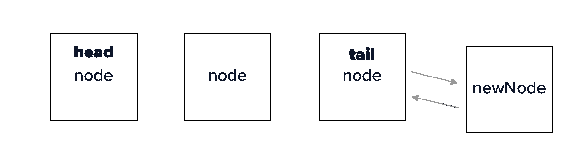

# Swift 中的 LinkedList—在 Swift Playgrounds 中编写 linked list 数据结构。

> 原文：<https://itnext.io/linkedlist-in-swift-code-a-linkedlist-data-structure-in-swift-playgrounds-97fe2ed9b8f1?source=collection_archive---------1----------------------->

目标:在 Swift 5 和 Xcode Playgrounds 中创建一个 LinkedList。

我叫马克斯韦尔·尼尔森，你可以在 [maxcodes.io](http://maxcodes.io) 或 [maxnelson.io](http://maxnelson.io) 上找到我

# 什么是链接列表？

LinkedList 是节点的集合，每个节点包含数据以及指向集合中上一个和下一个节点的指针。这与数组不同，链表的数据不是按照节点在内存中的物理位置排序的，而是按照它所连接的其他节点排序的。

# 节点如何连接？

节点通过指针连接到其他节点。下面是一个单链表的图表，显示了通过指向节点对象的指针连接的每个节点。



单向链表，指针指向链表中的下一个节点

然而，我们将创建一个**双向链表**，它的节点不仅包含一个**下一个节点指针**，还包含一个**前一个节点指针。**这个图表展示了双向链表的样子。



指向链表中下一个节点和上一个节点的双向链表

# 头和尾巴

第一个和最后一个节点分别称为头和尾。



-链表图，显示了具有零指针的头节点和尾节点

*   头的前一个节点指针为零，因为在它之前没有节点。
*   尾的下一个节点指针为零，因为没有节点跟在它后面。

# **性能*****

*在本文中了解链表与数组相比的性能:*[https://beginnersbook . com/2013/12/difference-between-ArrayList-and-linked list-in-Java/](https://beginnersbook.com/2013/12/difference-between-arraylist-and-linkedlist-in-java/)

# 开始编码吧。

周密计划的行动方案

*   步骤 1 —创建节点类
*   步骤 2 —创建一个 LinkedList 类
*   步骤 3-提供最后一个节点
*   步骤 4 —添加附加节点的功能
*   步骤 5 —获取链表中的数字节点
*   步骤 6 —打印链表中的每个节点值
*   步骤 7—从指定的索引中提取节点
*   步骤 8 —在特定索引处插入一个节点
*   步骤 9-删除特定索引处的节点

# 步骤 1-创建节点结构

节点有三个属性

*   一个**值**
*   指向列表中下一个节点**的指针**
*   指向列表中**前一个**节点的指针

**仿制药**

我们希望我们的列表能够使用任何类型，换句话说，我们希望我们的列表是通用的。所以在定义我们的节点结构时，我们确保通过在 node 后面写 **< T >** 来给它一个泛型类型。[关于仿制药的更多信息可在 Swift 文档中找到。](https://docs.swift.org/swift-book/LanguageGuide/Generics.html)

```
public class Node<T> {
  var value: T
  var next: Node?
  weak var previous: Node?

  public init(value: T) {
    self.value = value
  }
}
```

注意事项

*   值的类型是 T，所以无论我们给它什么类型。
*   下一个和前一个节点是可选的，因为头部没有前一个节点，尾部没有下一个节点。

# 步骤 2-创建一个链表类

```
public class LinkedList<T> {

  private var head: Node?

  public var isEmpty: Bool {
    return head == nil
  }

  public var first: Node? {
    return head
  }
}
```

我们将 LinkedList 声明为一个泛型类，在标题后面加上<t>，这样我们就可以在链表中使用任何值。在本教程中，我们将使用字符串。</t>

在类中，我们提供了一个可选的 Node 类型的变量 head。这将是声明时链表中的第一个值。

我们还提供了一个布尔变量" ***isEmpty* "** ，如果没有 head，它就返回 nil。如果 head 有一个值，那么我们列表确实不是空的，条件检查将返回 false。

# **步骤 3——提供最后一个节点来跟踪尾部。**

```
public var last: Node? {
    guard var node = head else {
      return nil
    }

    while let next = node.next {
      node = next
    }
    return node
  }
```

我们可以通过首先检查头部是否有值来访问列表中的最后一个节点。通过这样做，如果头是零，我们可以立即沟通，确实没有最后一个节点，甚至没有一个头开始。

如果 head 有值，那么我们需要检查它的下一个节点，看它是否有值，如果有，检查它的下一个值，看它是否有值，以此类推，直到最后一个节点上没有下一个值。

当 while 循环失败时，我们将知道我们已经到达了列表的末尾，我们可以返回最后一个节点。

# 步骤 4 —追加节点

我们可以添加数据到我们的列表中。

```
public func append(value: T) {
    let newNode = Node(value: value)
    if let lastNode = last {
      newNode.previous = lastNode
      lastNode.next = newNode
    } else {
      head = newNode
    }
  }
```

*   根据传入的值创建一个新节点
*   检查我们是否有最后一个节点
*   如果我们有最后一个节点，它的上一个现在等于最后一个节点，它的下一个现在等于新节点。

请看这张图，以便更好地理解这里发生了什么。



追加新节点

# 步骤 5 —计算节点数

```
public var count: Int {
    guard var node = head else {
      return 0
    }

    var count = 1
    while let next = node.next {
      node = next
      count += 1
    }
    return count
  }
```

*   首先检查 head 是否有值，如果没有，我们简单地返回 0
*   如果 head 有一个值，那么我们自动知道至少有一个值，所以当我们声明 count 时，我们从 1 开始
*   使用 while 循环遍历 LinkedList，直到没有 node.next，就像我们在查找最后一个节点时到达列表末尾一样。
*   当 node.next 不再有值时，我们知道我们已经到达了尾部，并且我们有了完整的列表计数，返回计数。

# 第 6 步—打印我们列表的内容

```
public var print: String {
   var s = "["
   var node = head
   while node != nil {
       s += "\(node!.value)"
       node = node!.next
       if node != nil { s += ", " }
   }
   return s + "]"
}
```

*   创建一个名为 print 的公共变量。
*   将当前节点设置为我们的头节点
*   使用 while 循环遍历我们的列表。虽然 node 不为零，但它必须有一个值，将该值添加到我们的字符串中
*   一旦 node.next 有了一个值，我们知道我们已经到达了列表的末尾，我们可以继续返回节点的字符串。

# 步骤 7 —获取给定索引处的节点

```
public func node(atIndex index: Int) -> Node {
    if index == 0 {
        return head!
    } else {
        var node = head!.next
        for _ in 1..<index {
            node = node?.next
            if node == nil { //(*1)
                break
            }
        }
        return node!
    }
}
```

*   检查索引是否为 0，如果是，那么就返回头。
*   如果 index 不为 0，那么使用 for 循环来遍历我们的节点，直到我们到达索引，如果它不为 0，那么返回该节点。
*   如果其他方法都失败了，只需返回节点

# 步骤 8—在特定索引处插入新节点

```
public func insert(value: T, atIndex index: Int) {
   let newNode = Node(value: value)
   if index == 0 {
       newNode.next = head
       head?.previous = newNode
       head = newNode
   } else {
       let previousNode = self.node(atIndex: index-1)
       let nextNode = previousNode.next

       newNode.previous = previousNode
       newNode.nextNode = previousNode.next
       previousNode.next = newNode
       nextNode?.previous = newNode
   }
}
```

*   取我们想要插入的值，并用它创建一个 Node 实例。
*   如果索引为 0，只需将新节点的下一个节点设置为我们的头
*   取头部，设置它在新节点之前
*   让头部成为我们的新节点

*   如果索引不为 0，则获取插入位置前一个空格的节点，并将 previousNode 设置为等于它。
*   然后用 previousNode.next 获取它的下一个节点，并设置 next Node 等于它。
*   取 newNode 的 previous，并将其设置为等于 previousNode
*   获取新节点的下一个节点，并将其设置为等于前一个节点的下一个节点
*   获取前一个节点的下一个节点，并将其分配给新节点
*   获取 nextNode 的前一个节点，并将其分配给 newNode

# 步骤 9-删除给定索引处的节点

```
public func remove(node: Node) -> T {
    let previousNode = node.previous
    let nextNode = node.next

    if let previousNode = previousNode {
        previousNode.next = nextNode
    } else {
        head = nextNode
    }
    nextNode?.previous = previousNode

    node.previous = nil
    node.next = nil
    return node.value
}public func removeAt(_ index: Int) -> T {
    let nodeToRemove = node(atIndex: index)
    return remove(node: nodeToRemove)
}
```

*   接受要移除的节点，并将 previousNode 设置为节点的 previous
*   对 nextNode 分别做同样的事情
*   如果前一个节点存在，则获取它的下一个节点，并将其分配给我们要删除的节点的下一个节点
*   如果我们要删除的节点的 previousNode 不存在，那么将 head 设置为等于下一个节点，因为它的 previousNode 是头，所以它现在是头
*   将 nextNode 的 previous 设置为要删除的节点的 previous 节点
*   获取我们要删除的节点，并释放对其他节点的所有引用
*   返回值告诉我们刚刚删除了哪个

在使用该函数之前，我们需要从我们提供的值中获取节点，因为我们不能只创建节点并将其传入

*   获取我们试图移除的节点的索引，并获取该索引处的节点
*   用我们刚刚写的方法删除节点

# **那都是乡亲。**

让我知道我是否错过了什么，我会尽快更新这篇文章。

如果你想在 Swift 中构建 [**通用数据结构，在我最新的课程中，将从头开始介绍 LinkedList 和 Array 类开发**](https://www.udemy.com/swiftdatastructures/?couponCode=MEDIUMSPECIAL) 。 [***这里有打折优惠券代码！***](https://www.udemy.com/swiftdatastructures/?couponCode=MEDIUMSPECIAL)