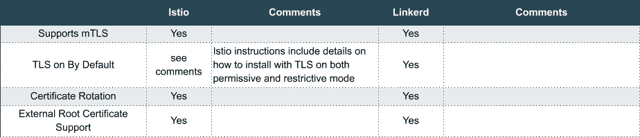
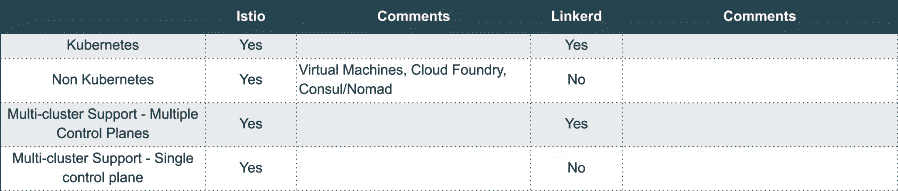
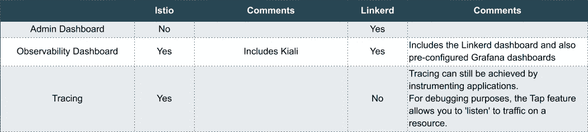
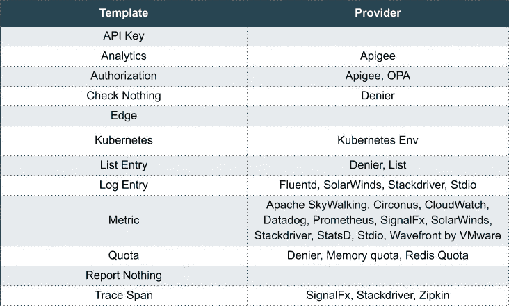

# Linkerd 还是 Istio？

> 原文：<https://itnext.io/linkerd-or-istio-2e3ce781fa3a?source=collection_archive---------2----------------------->

哪种服务网格最适合您？

酷吧。

本周，我开始写一篇比较 Istio 和 Linkerd 的帖子，我告诉自己:我将创建比较功能的表格，这将非常棒，人们会喜欢，世界会在几秒钟内变得更快乐。我向自己保证，这将是一个公平的比较，没有任何偏见。虽然“比较表”仍然在这里，但我转移了文章的重点:目标不是哪个更好，而是哪个对您、您的应用程序、您的组织更好。

在我的职业生涯中，有一段时间我是 Red Hat 的售前架构师，我记得有很多次我们被要求填写产品比较表。我经常需要发挥我的创造力，以确保产品看起来不错，几乎不惜一切代价避免令人不快的“不支持”框。但是，通过优先考虑诚实的工作，我有时不得不这样做。

站在评估者的立场上，我理解他们(希望)是为了进行公正的比较，在这种程度上，比较表似乎是一种安全的方法。我们知道项目的成功可以预测职业发展，我们都喜欢这一点。但这里有一个问题:如果比较表，而不是运行业务并能使组织更具竞争力的质量软件，是该评估的最终目标，那么你就在“表”业务中。

比较不是最终目的，知道什么对你的用例更好才是。因此，让我们深入了解七个不同的技术领域，它们是:

*   交通管理
*   安全性
*   安装/配置
*   支持的环境
*   可观察性
*   政策管理
*   表演

对于其中的每一个领域，我将提出我的观点，希望能帮助你更接近做出一个简明的决定。

# 交通管理

这里要强调的显著区别是，数据平面使用了两种不同的代理技术。

Istio 使用[特使](https://www.envoyproxy.io/)作为其代理。Envoy 是用 C++编写的，最初是由 [Lyft 以非 Kubernetes 的方式构建，以方便微服务](https://eng.lyft.com/announcing-envoy-c-l7-proxy-and-communication-bus-92520b6c8191)的流量管理。许多公司已经将 Envoy 扩展为 Kubernetes 集群入口技术。

Linkerd (v2)正在使用一个名为 *linkerd-proxy* 的专用服务网格代理。这个代理内置于 Rust 中，与代理一起，许多低级代理(网络客户端和服务器)功能也内置于 Rust 的另一个名为[塔](https://github.com/tower-rs/tower)的项目中。Tower 依赖于 [Tokio](https://docs.rs/tokio/0.1.19/tokio/) ，一个事件驱动的、非阻塞的 Rust I/O 库。如果你像我一样欣赏统计数据，Rust 已经连续四年成为 Stack-overflow 中最受欢迎的语言( [2016](https://insights.stackoverflow.com/survey/2016#technology-most-loved-dreaded-and-wanted) 、 [2017](https://insights.stackoverflow.com/survey/2017#most-loved-dreaded-and-wanted) 、 [2018](https://insights.stackoverflow.com/survey/2018/#most-loved-dreaded-and-wanted) 、 [2019](https://insights.stackoverflow.com/survey/2019#technology-_-most-loved-dreaded-and-wanted-languages) )。

Istio 的优势在于它建立在 Envoy 之上，Envoy 已经包含了 IMHO 的基本功能，比如子集路由。用户仍然可以通过 Linkerd 实现金丝雀/蓝绿色/A-B，但必须依赖单独的 Kubernetes 服务和能够分流流量的集群入口技术，如 Gloo (gloo.solo.io)

Linkerd 团队[在最近的一次社区会议](https://www.crowdcast.io/e/linkerd-online-community)上公开了更高级的 L7 流量管理特性计划在未来的版本中推出。

# 安全性

在这种情况下，我会考虑保护通信通道的能力。两者都提供了相当合理的功能。

这两种技术都可以依赖外部根证书，这将产生一种情况，即您可以在 Linkerd 和 Istio 之间进行安全通信。听起来是个不错的周末项目。有人吗？

# 安装和配置

考虑到 Istio 可以安装在许多不同的平台上，说明可能会有很大的不同。关于 Linkerd，在写这篇文章时，可用的需求预检查特性给我留下了深刻的印象。很多次，我继续在共享的 Kubernetes 集群中安装一些东西，但不清楚我是否有必要的权限这样做。对于 Linkerd，预检查(或 check-pre)验证您是否有权限创建安装过程中所需的 Kubernetes 资源。

# 支持的环境和部署模型

关于 Kubernetes 与非 Kubernetes，这是一个直截了当的问题，Linkerd 2 是以只支持 Kubernetes 的心态构建的，至少目前是这样，而 Istio 收到了一些公司的贡献，他们也希望看到它在非 Kubernetes 环境中运行。

关于多集群部署的话题，公平地说，它的解释可能很棘手。从技术上讲，共享同一个根 CA 的多个不同集群(具有不同的控制平面安装)上的服务可以有效地相互通信。

Istio 扩展了上述概念，它支持不同环境下的多个集群:

*   当不同集群中的 pod 之间的网络连接和 IP 寻址可用时，使用单个控制平面。
*   通过将集群边界网关(出口和入口)与能够访问多个集群上的 Kubernetes API 服务器的单个控制平面一起使用。

在上述两种情况下，包含控制平面的集群成为网格管理的 SPOF(单点故障)。在我们的世界中，单个集群可以部署在同一地区的多个可用性区域上，这虽然不是什么大问题，但仍然不能完全忽视。

# 可观察性

我可以说 Istio 的管理控制台是缺失的一部分。Kiali 可观察性控制台确实解决了管理员对服务网格的一些需求。Kiali (κιάλι)是一个希腊语单词，意思是望远镜，从它的网站上可以清楚地看到，它打算成为一个可观测的控制台，而不是一个服务网格管理控制台。

Linkerd 控制台还不完整，但是社区决定建立一个管理仪表板的目标是一个优点。

Linkerd 无法提供跟踪。希望以非侵入方式查看跟踪跨度的用户将不得不等待该特性的实现。Istio 利用了 Envoy 支持添加跟踪头这一事实。

应该提醒用户，应用程序需要准备好转发跟踪头。否则，代理可以生成新的跟踪 id，这可能会无意中将单个请求分割成多个跟踪范围，而没有所需的相关性。大多数开发框架都有转发头的选项，用户无需编写大量代码块。

# 政策管理

Istio 爱好者们，欢呼吧！Istio 的政策管理能力令人印象深刻。

该项目构建了一个广泛的策略管理机制，允许其他技术从多个方面与 Istio 集成，参见下面支持的[【模板】](https://istio.io/docs/reference/config/policy-and-telemetry/templates/)列表，以及构建集成的提供商。你可以认为“模板”是一种集成。

为了突出显示其他策略类型，Istio 还可以应用评级和限制，并提供对主体身份验证的现成支持。Linkerd 用户可以依靠集群入口控制器来提供评级和限制。对于主体身份验证，这被委托给应用程序，我认为应该总是这样。记住#4 分布式计算的谬论:网络是安全的。零信任政策。

Istio 令人印象深刻的策略管理功能是有代价的。鉴于其范围之广，管理众多选项会增加本已昂贵的运营成本。

istio (Mixer)的策略管理组件也显著提高了性能，我们将在下面详细讨论。

# 表演

我的对比表呢？幸运的是，就在最近，两个伟大的博客发表了 Istio 和 Linkerd 的性能比较，我在下面引用了一些结论:

> 对于这种合成工作负载，Istio 的 Envoy 代理使用的 CPU 比 Linkerd 多 50%以上。Linkerd 的控制平面只使用了 Istio 的一小部分，尤其是在考虑“核心”组件时。
> [迈克尔·基普 **—基准测试 Istio & Linkerd CPU**](https://medium.com/@ihcsim/linkerd-2-0-and-istio-performance-benchmark-df290101c2bb)

还有…

> 在本实验中，与基准设置相比，Linkerd2-meshed 设置和 Istio-meshed 设置都经历了更高的延迟和更低的吞吐量。Istio-meshed 设置中产生的延迟高于在 Linkerd2-meshed 设置中观察到的延迟。与 Istio-meshed 设置相比，Linkerd2-meshed 设置能够处理更高的 HTTP 和 GRPC ping 吞吐量。
> [Ivan Sim — **Linkerd 2.0 和 Istio 性能基准**](https://medium.com/@ihcsim/linkerd-2-0-and-istio-performance-benchmark-df290101c2bb)

意识到 Mixer 增加的处理时间，Istio 团队目前正在重写 Mixer 组件:“… *Mixer 将用 C++重写，并直接嵌入到 Envoy 中。将不再有任何独立的混音器服务。这将提高性能并降低操作复杂性。”—* 来源[搅拌机 V2 设计文件](https://docs.google.com/document/d/1QKmtem5jU_2F3Lh5SqLp0IuPb80_70J7aJEYu4_gS-s/edit#heading=h.qex63c29z2to)。

# 结论

是的，Istio 比 Linkerd 2.3 拥有更多的功能。太棒了。更大的特性集通常意味着处理更复杂和边缘用例的能力增强。这里没有魔法，更多的功能通常意味着更多的配置选项，可能会增加资源利用率和运营成本，因此这里有三条建议:

*   如果您不知道 80%最常见的工作负载是什么样的，那么您将很难选择服务网格。我甚至质疑你，如果你不知道这些数字，你的企业现在可能还没有准备好服务网格。如果你只是在探索，那就另当别论了。
*   如果你想计划解决所有可能的当前和未来用例(通常被称为*比较电子表格*)，你会有一段糟糕的时间。你很可能会过度获取，对于你获取的任何软件都是如此。
*   盲目地选择一种或另一种技术会让你很难受。炒作可以很强烈，但记住，你不是在*炒作业务*(嗯，除非你是)。

# 两个都试试！

> 我使用 SuperGloo 是因为快速启动两个服务网格非常简单，几乎不需要我付出任何努力。我们没有在生产中使用 SuperGloo，但它非常适合这样的任务。实际上每个网格有两个命令。
> [迈克尔·基普 **—基准测试 Istio&Linkerd CPU**](https://medium.com/@michael_87395/benchmarking-istio-linkerd-cpu-c36287e32781)**—Shopify**

Solo SuperGloo 是一个服务网格编排器，可以用直观和简单的命令安装和管理流行的服务网格技术。正如上面 Michael 提到的，安装 Istio 或 Linkerd 变成了一行程序。然而，SuperGloo 并没有止步于此。它在不同的服务网格技术之上提供了一个抽象，允许对多个网格进行一致且可重复的操作。SuperGloo 是完全开源的，你现在就可以试用。