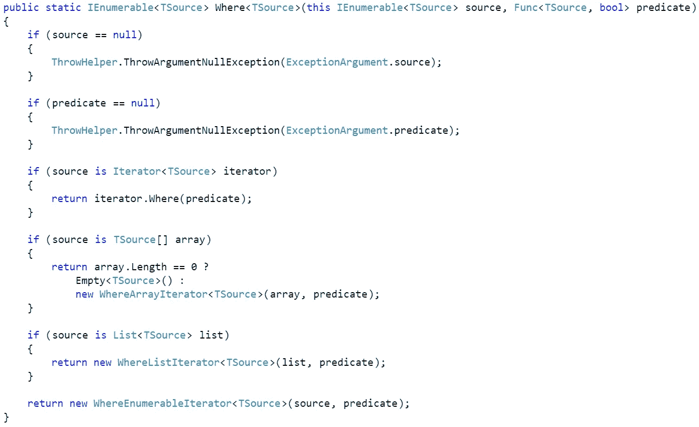
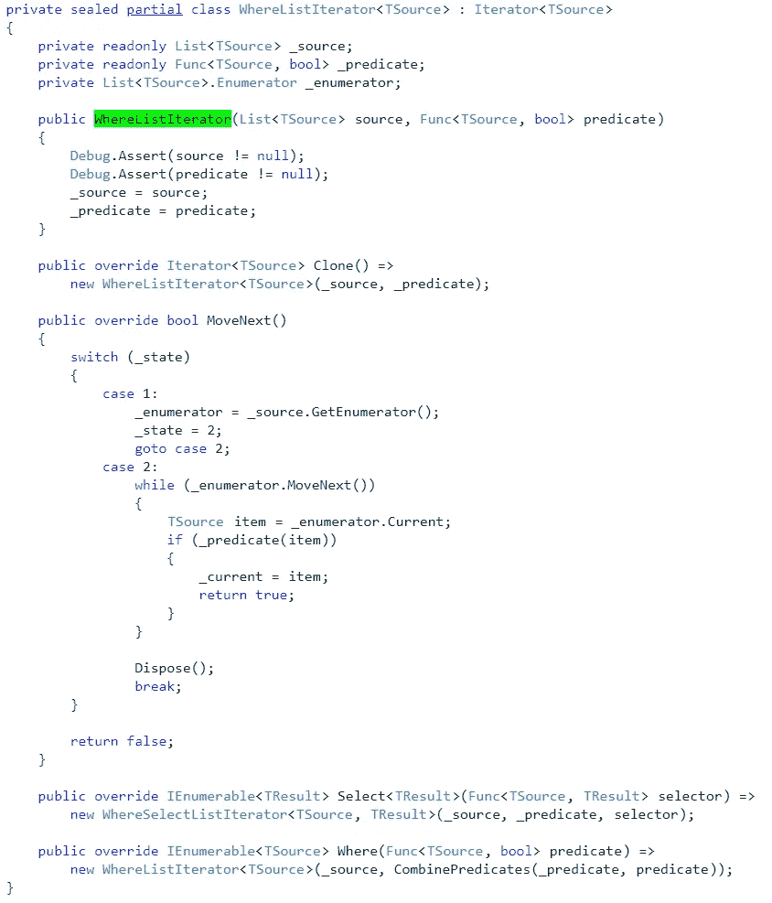

# LINQ 延期执行解释道

> 原文：<https://itnext.io/linq-deferred-execution-explained-2844838f83ef?source=collection_archive---------3----------------------->


在我看来，C#的一个——如果不是最好的——特性是 LINQ，也称为“语言集成查询”。它使处理数据变得非常容易，感觉非常自然，并提供了很大的可扩展性。这是我在给定任务中切换到其他语言时经常错过的功能之一。

除了可用性之外，Linq 最大的优点之一就是出色的性能。即使是大型查询也能以相当快的速度执行。这就提出了一个问题:尽管看起来做了很多迭代，Linq 怎么会这么快？

这背后的秘密叫做“延期执行”。本质上，这意味着一个查询，不管有多大，只有在被明确告知要执行时才会被执行(或物化)。直到这个执行被触发的时间点，查询的枚举都没有完成，查询实际上只是一个查询。

在这篇文章中，我将解释这种延迟执行到底是如何执行的。我们走吧！

# 该查询

解释某事的最好方法是用一个例子。让我们继续使用下面的。

```
var fruitList = new List<string>(){ "Banana", "Apple", "Cherry", "Apricot"};var fruitsWithA = fruitList.Where(fruit => fruit.StartsWith('A'));foreach (var fruit in fruitsWithA)
{
   Console.WriteLine(fruit);
}// Output: 
Apple
Apricot
```

很简单，这里没有太多惊喜。我们已经成功地使用 Linq 按照给定的条件过滤了一个列表，在本例中，所有的水果都以‘A’开头。

然而，在这个查询中有一个隐藏得很好的秘密。大多数人会认为，代码做了以下事情:

1.  初始化列表
2.  浏览列表，过滤所有的水果
3.  遍历过滤后的列表，打印所有的结果。

然而，这是一个错误的假设！相反，第二点和第三点实际上是紧密交织在一起的，而不是一个连续的事情。

让我们试着看看，如果我们改为运行以下经过修改的代码，会发生什么:

```
var fruitList = new List<string>(){ "Banana", "Apple", "Cherry", "Apricot"};var fruitsWithA = fruitList.Where(fruit => {
    Console.WriteLine("Filtering...");
    return fruit.StartsWith('A');
});foreach (var fruit in fruitsWithA)
{
    Console.WriteLine(fruit);
}// Output:
Filtering...
Filtering...
Apple
Filtering...
Filtering...
Apricot
```

这很有趣，对吧？正如我提到的，过滤和迭代不是一个连续的过程，而是一起工作。这是怎么回事？

# 引擎盖下的 LINQ

我们刚刚看到了 LINQs 出色性能的主要原因之一。秘密在于 LINQ 如何巧妙地使用*IEnumerator*&*IEnumerable*组合来延迟(defer)实际执行。

让我们解剖一下*。*法在哪里，看看怎么回事。的。Where 方法是驻留在 *Where.cs* 文件([https://source.dot.net/#System.)中的扩展方法 Linq/System/Linq/Where.cs，a75569430a96c893](https://source.dot.net/#System.Linq/System/Linq/Where.cs,a75569430a96c893)



我们可以直接看到，LINQ 对*IEnumerable<t source>*对象做了一些检查，然后，根据对象的类型，挑选一个合适的*迭代器*对象。

在我们的例子中，LINQ 将选择*where list iterator<t source>*返回值。



如你所见，*where list Iterator<t source>*实现了*Iterator<t source>*基类，这是许多 LINQ 迭代器的基类，并且实现了*IEnumerable<t source>*以及*IEnumerator<t source>*接口。如果你对这些接口的作用感到困惑，请随时查看我的上一篇帖子([https://Stefan sch . medium . com/c-s-ienumerable-ienumerator-explained-79967 f 828586](https://stefansch.medium.com/c-s-ienumerable-ienumerator-explained-79967f828586))。

它还存储谓词和源，但还没有对其进行操作。这非常重要，因为这允许以延迟的方式执行。

既然我们知道 LINQ 为我们提供了什么，现在关键是要认识到我们现在有一个*IEnumerable<T>提供给我们，它基本上还没有做任何事情。在真正的 LINQ 方式中，以*where list iterator<T>*形式提供的 *IEnumerable < T >* 现在可以用于进一步构建，例如通过添加*。Select()* 子句，但是到目前为止，它仍然只是一个查询蓝图。*

回到我们的查询:

```
var fruitList = new List<string>(){ "Banana", "Apple", "Cherry", "Apricot"};var fruitsWithA = fruitList.Where(fruit => fruit.StartsWith('A'));
```

这基本上就是我们现在的处境。我们现在已经构建了一个查询蓝图，它还没有做任何事情。现在，只要我们物化查询，奇迹就会发生。

物化涉及到对 *IEnumerable < T >* 的实际迭代。如果这让你困惑，我可以再一次指出我的上一篇文章。

对于 LINQ 查询，物化通常伴随着类似*的方法。ToList()，。*ToArray()等。-基本上，当方法以“，”开始时。To”，它已经表明它将具体化您的查询。

在我们的示例中，我们使用了一个简单的 foreach 循环:

```
foreach (var fruit in fruitsWithA)
{
   Console.WriteLine(fruit);
}
```

这将编译成:

```
IEnumerator<string> enumerator = enumerable.GetEnumerator();
try
{
    while (enumerator.MoveNext())
    {
        string current = enumerator.Current;
        Console.WriteLine(current);
    }
}
finally
{
    if (enumerator != null)
    {
        enumerator.Dispose();
    }
}
```

现在，我们可以看到发生了什么:

1.  获取*where list iterator<t source>*的枚举器。这来自基类*迭代器< T >，*并取决于一些条件，如枚举状态或线程 id，要么返回 *this，要么*返回迭代器*的克隆。*
2.  *MoveNext()* 被调用。这将检索源枚举器。在我们的例子中，这将检索 *fruitList* 变量的迭代器，但是对于复杂的 Linq 查询，这将检索链中前一个调用的枚举器。
3.  现在，源集合被枚举。这可能是最重要的一步！对于每个源项，我们将运行谓词(就像我们在*中一样)。Where()* 方法)，如果谓词匹配，设置 *foreach* 生成的枚举选取的*当前*项并返回 true。如果谓词不匹配，我们跳过该项。了解这里发生了什么是最重要的。请随意花几分钟来思考这个问题。把整个过程想象成一条小溪。源枚举返回一项，然后暂停。然后，我们的枚举处理该项，并将其返回给链中最顶层的调用者。一旦调用者完成了，我们将转移到下一个项目，实际上将这个调用一直传递到 LINQ 查询操作的源集合。理解这个“流”可以作用于许多层是很重要的。
4.  对于每个匹配的条目，我们将匹配的字符串输出到控制台。

如果您还记得我上面的例子，现在应该很清楚为什么“Filtering…”输出与水果输出交织在一起，以及延迟执行是如何工作的——每个项目都被一个接一个地拖过执行链。

我意识到这需要很长时间才能理解，我衷心建议您花一些时间阅读 LINQ 源代码，以便真正熟悉手头的整个过程，为了将重点放在最重要的事情上，我现在跳过了几行内容，您可能仍然对此感到疑惑。

# 结论

了解 LINQ 在更大的链中是如何真正工作的，这是一项非常了不起的知识，对性能评估和优化有很大的帮助。

如果我必须从这篇文章中提到两件事:

1.  想象 LINQ 像一个连续的溪流一样工作，而不是一个不断列举你的源序列的怪物。
2.  考虑何时何地实现你的 LINQ 查询。很多*。ToList()* 调用会导致大量潜在的不必要的实体化。

希望我能给你们一些启发！