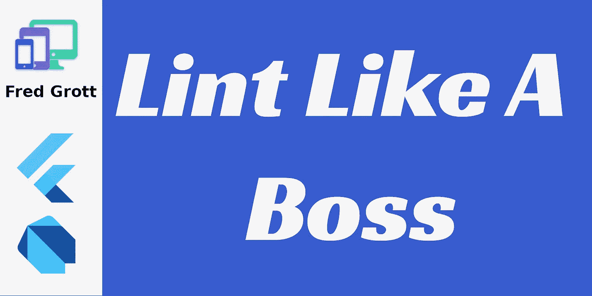

# 像老板一样

> 原文：<https://itnext.io/lint-like-a-boss-60b85e82c227?source=collection_archive---------6----------------------->



有没有尝试过复制一些 Flutter 代码，试图将其转换成其他代码，却发现它无法与全新版本的 Dart 一起工作？想象一下，如果您团队中的另一个开发人员用您自己的 flutter 代码得到了相同的结果，会有多尴尬。

让我向您展示框架开发人员使用的技术，让您的项目和应用程序代码看起来更加完美。


照片由[杰玛](https://unsplash.com/@_gemmajade?utm_source=unsplash&amp;utm_medium=referral&amp;utm_content=creditCopyText)在 [Unsplash](https://unsplash.com/s/photos/market?utm_source=unsplash&amp;utm_medium=referral&amp;utm_content=creditCopyText) 上拍摄

# **认知负荷**

就林挺而言，框架开发者的神奇之处在于他们从认知负荷的基本概念开始。认知负荷指的是人类拥有的工作记忆量，恰好在 4 项左右。

嗯，有了 linter dart 插件，有超过 250 个 lint 规则。如果我们在一个插件中应用所有这些规则，甚至一半的 lint 规则供每个开发人员使用，那么如何跟踪使用了哪些 lint 规则呢？

Dart 和 Flutter SDK 团队使用复制和粘贴方法，因为在项目根中的 analysis_options.yaml 文件中，您可以随时查看应用了哪些 lint 规则。


[制作者 UX 设计工作室](https://unsplash.com/@weareprocreator?utm_source=unsplash&amp;utm_medium=referral&amp;utm_content=creditCopyText)在 [Unsplash](https://unsplash.com/s/photos/developer?utm_source=unsplash&amp;utm_medium=referral&amp;utm_content=creditCopyText) 上拍摄的照片

# **开发者的秘密诡计**

当然，有一些开发人员的秘密技巧来应用 lint 规则子集列表以允许定制。但是，首先应该挑选哪个 lint 规则子集呢？

lint 规则子集列表从 Google 自己的 pedantic 开始，然后是 effective-dart，然后是 extra-pedantic，最后是 Pascal Welsch 的 dart lint 规则 lint 子集。

在我的例子中，我选择使用 Pascal Welsch 的 Lint 规则子集的原因是，我能够更好地解决如何为即将到来的 Dart 语言变化编码的问题。

但是，无论您选择什么 lint 规则子集，都有一些定制它的技巧。让我展示一下设置和定制它的简单方法。

要启用在 flutter 项目中应用的 lint 规则，您需要在项目的根目录中放置一个 analysis_options.yaml 文件。以下是我的定制技巧:

```
analyzer:
  strong-mode:
    # my own setting 2-2-2021
    implicit-dynamic: false
    # Will become the default once non-nullable types land
    # [https://github.com/dart-lang/sdk/issues/31410#issuecomment-510683629](https://github.com/dart-lang/sdk/issues/31410#issuecomment-510683629)
    implicit-casts: false
  errors:
    # treat missing required parameters as a warning (not a hint)
    missing_required_param: warning
    # treat missing returns as a warning (not a hint)
    missing_return: warning
    # allow having TODOs in the code
    todo: ignore
linter:
  rules:
```

基本上，如果您不想进行更严格的类型检查，可以将这两个强模式项设置为 true。在 errors 下，您可以列出 lint 规则并更改它们发出的反馈。并且，您选择的特定 lint 规则子集将被复制并粘贴到 linter 规则块下。

# **结论**

通过林挺你的 Flutter 项目 Dart 和 Flutter SDK 团队的做法，你减少了团队中每个开发人员的工作记忆负荷；您还使得团队中的每个开发人员更容易理解您选择以特定方式编写代码的意图。

**商标公告**

谷歌拥有以下商标:飞镖，颤振，机器人，机器人，诺托。苹果拥有 iOS、MacOSX、Swift 和 ObjectiveC 等商标。尽我所能，我遵守上述商标的品牌和使用指南。

# **资源**

定制静态分析@ dart . dev[https://dart.dev/guides/language/analysis-options](https://dart.dev/guides/language/analysis-options)

迂腐@ github[https://github.com/google/pedantic](https://github.com/google/pedantic)

有效的 Dart@github.com[https://github.com/tenhobi/effective_dart](https://github.com/tenhobi/effective_dart)

帕斯卡尔·韦尔施的 Lint@github.com[https://github.com/passsy/dart-lint](https://github.com/passsy/dart-lint)

# **关于弗雷德·格罗特**

我是一个疯狂的 SOB，作为一名前 android 移动开发者，我开始写关于 flutter 移动应用程序开发、设计和生活的文章。我会达到关键的每月 100 万观众大关吗？静观其变。在这些社交平台上找到我:

[](https://www.xing.com/profile/Fred_Grott/cv) [## 弗雷德·格罗特-安卓软件工程师-弗雷德·格罗特

### 信息、投资组合和价值:或者弗雷德·格罗特先生。

www.xing.com](https://www.xing.com/profile/Fred_Grott/cv)  [## 弗雷德·格罗特-首席执行官-首席采购官-设计师-格罗特| LinkedIn

### 查看弗雷德·格罗特在全球最大的职业社区 LinkedIn 上的个人资料。弗雷德有 3 份工作列在他们的…

www.linkedin.com](https://www.linkedin.com/in/fredgrottstartupfluttermobileappdesigner/) [](https://keybase.io/fredgrott) [## 弗雷德·格罗特(弗雷德·格罗特)

### Keybase 是什么鬼东西？Keybase 为您提供了管理身份、创建安全聊天和…

keybase.io](https://keybase.io/fredgrott) 

[https://twitter.com/fredgrott](https://twitter.com/fredgrott)