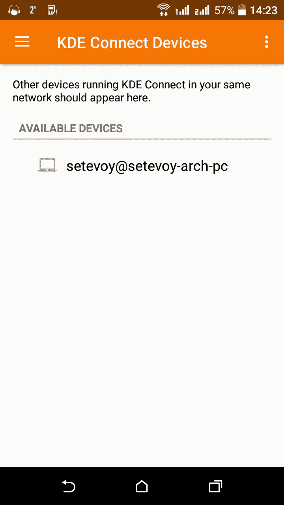
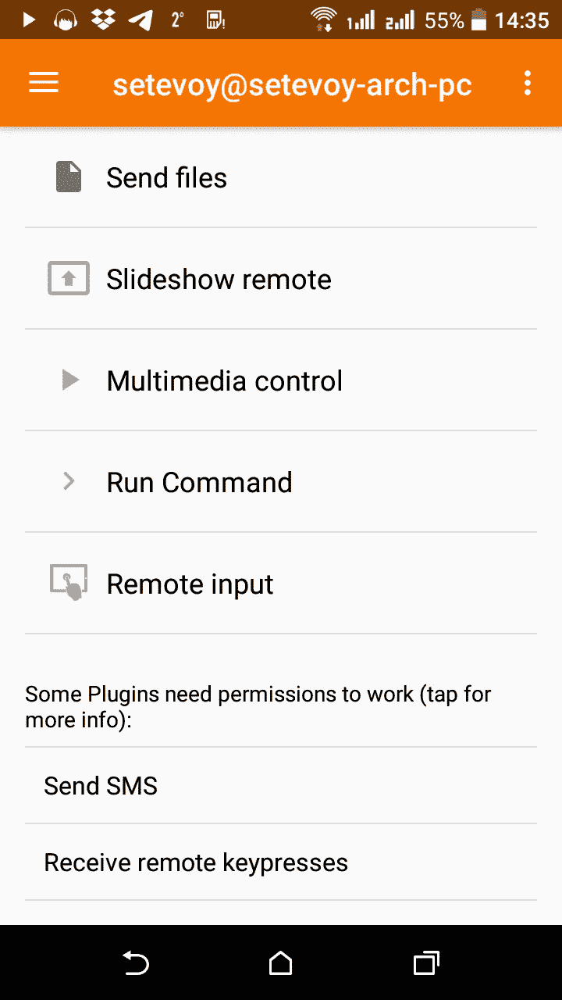
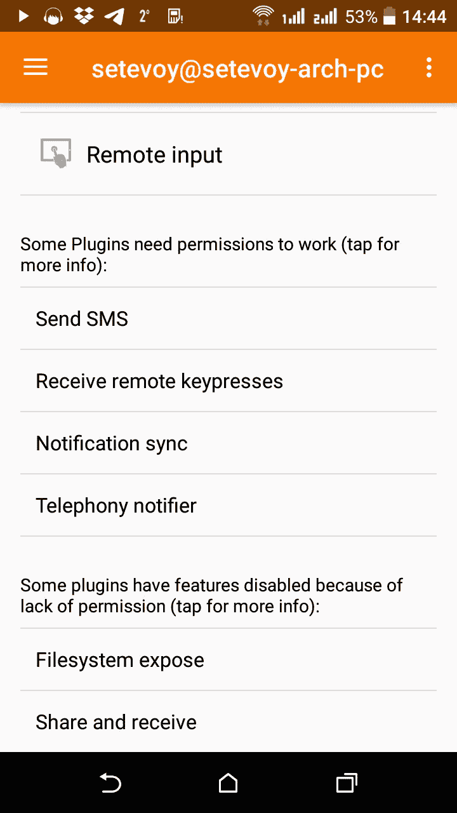
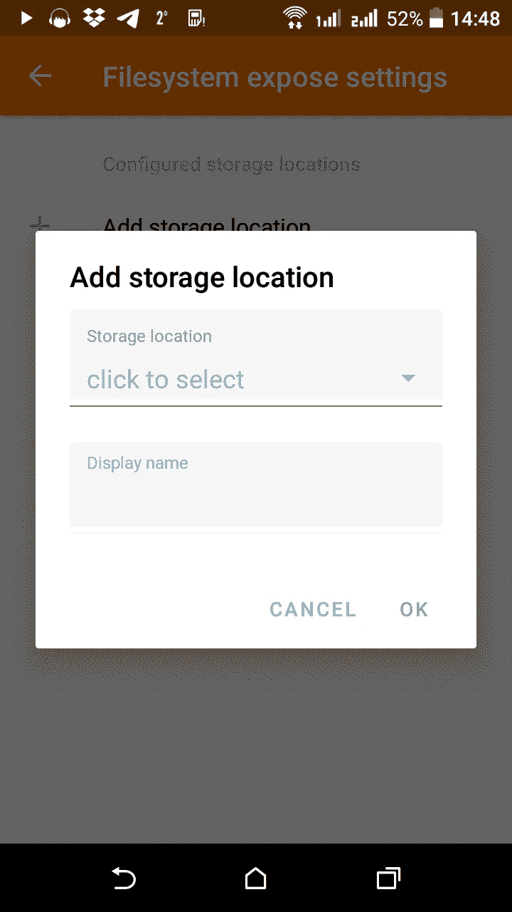
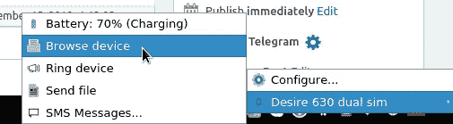
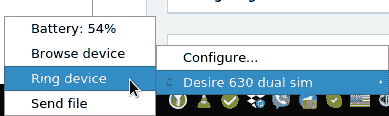
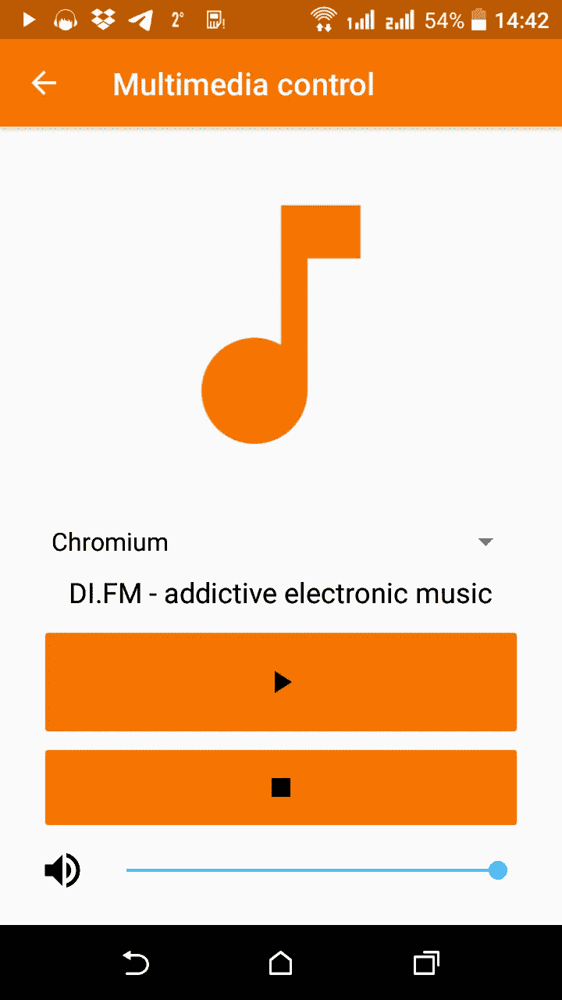
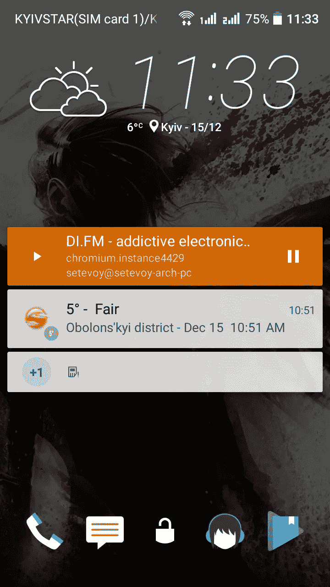
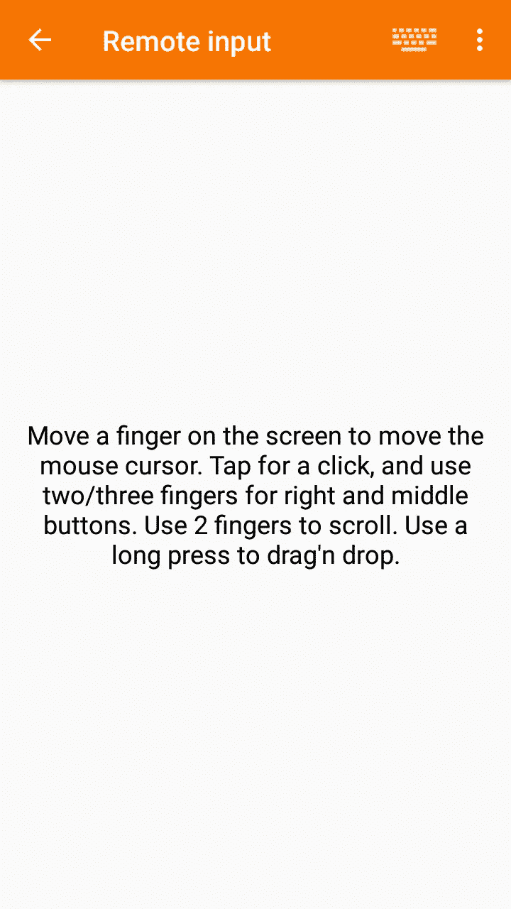

# Linux:配置 KDE 连接并连接到 Android 手机

> 原文：<https://itnext.io/linux-configuring-kde-connect-and-connection-to-an-android-phone-813a4736f693?source=collection_archive---------5----------------------->

一个非常好的 Android 手机和 Linux 操作系统的集成。

除了 [KDE 连接](https://wiki.archlinux.org/index.php/KDE#KDE_Connect)，如果你更喜欢 Gnome 项目，你可以使用`[gnome-shell-extension-gsconnect](https://github.com/andyholmes/gnome-shell-extension-gsconnect)`。

在本帖中，我们将在 Android HTC 手机和 Arch Linux 之间建立 KDE 连接。

在 Android 上安装来自 Play Market 的 KDE 连接。

在 Linux 上，从存储库安装:

```
$ sudo pacman -S kdeconnect
```

对于文件交换功能—添加`sshfs`包:

```
$ sudo pacman -S sshfs
```

## KDE 连接连接

在你的电脑上手动运行`kdeconnectd`，稍后会将其添加到自动启动:

```
$ /usr/lib/kdeconnectd
qt5ct: using qt5ct plugin
kdeconnect.core: KdeConnect daemon starting
kdeconnect.core: My id: “_7d44a796_22cc_46c7_846a_a3ffef9b1247_”
kdeconnect.core: onStart
kdeconnect.core: KdeConnect daemon started
kdeconnect.core: Broadcasting identity packet
…
```

查看您的手机:



从 Linux 检查可用设备:

```
$ kdeconnect-cli -l
- Desire 630 dual sim: da65691faaa832d6 (reachable)
1 device found
```

使用上面输出中的 ID 发出连接请求:

```
$ kdeconnect-cli -d da65691faaa832d6 — pair
Pair requested
```

在机器人上确认，瞧:



现在，运行`kdeconnect-indicator`:

```
$ kdeconnect-indicator
```

在系统托盘中，您将看到连接器图标，右键单击可检查同步设置:

## 许可

回到您的手机，向下滚动—查找权限:



转到*设置*并启用通知访问:

返回并在*中禁用某些插件的特性[…]* 从*文件系统暴露*开始授予所有其他权限:



选择您手机上的磁盘，通过`sshfs`授予访问权限，在这张截图上，它将是我的 SD 卡:

## 浏览设备和文件传输

选择了*浏览设备*:



通过`sshfs`，您可以访问上面配置的 SD 卡:

系统日志:

```
$ kdeconnect.plugin.sftp: Starting process: “sshfs kdeconnect@192.168.1.138:/ /run/user/1000/da65691faaa832d6 -p 1739 -s -f -F /dev/null -o IdentityFile=/home/setevoy/.config/kdeconnect/privateKey.pem -o StrictHostKeyChecking=no -o UserKno
wnHostsFile=/dev/null -o HostKeyAlgorithms=+ssh-dss -o uid=1000 -o gid=1000 -o reconnect -o ServerAliveInterval=30 -o password_stdin”
```

## 手机铃声

不错的功能—“在我的公寓里找到我的电话”叫做*响铃装置*:



手机将开始响铃(即使静音),屏幕上会出现以下按钮:

## 多媒体控制

此外，您可以从手机上控制 Linux 浏览器中的播放器:



更重要的是，在 Andoird 欢迎屏幕上有一个按钮:



## 鼠标控制

现在，您可以在手机上移动 Linux 上的鼠标光标了:



## Linux 通知

系统托盘通知可与标准`org.freedesktop.Notifications`一起使用。

这在我关掉电话铃声的办公室里真的很方便，但现在我不会错过任何短信/电话，因为我会在我的桌面上看到它们。

检查 D-Bus，查看系统中接收通知的方式:

```
$ qdbus — session org.freedesktop.DBus / org.freedesktop.DBus.GetConnectionUnixProcessID org.freedesktop.Notifications
881
```

检查 PID:

```
$ ps uax | grep -w 881
setevoy 881 0.0 0.2 286260 44824 tty1 Sl 11:15 0:00 lxqt-notificationd
```

在我的情况下这是`[lxqt-notificationd](https://wiki.archlinux.org/index.php/Desktop_notifications)`。

和通知本身，例如在来电期间:

## 自动启动

奇怪的是，它没有任何系统单元文件。

在 Openbox 中，我只是将`kdeconnectd`和`kdeconnect-indicator`添加到我的`~/.config/openbox/authostart`中:

```
...
/usr/lib/kdeconnectd &
...
kdeconnect-indicator &
...
```

仅此而已。

实际上，KDE 连接提供了比这篇文章中描述的更多的能力，所以——只是玩玩它。

*最初发布于* [*RTFM: Linux、DevOps、系统管理*](https://rtfm.co.ua/en/linux-configuring-kde-connect-and-connection-to-an-android-phone/) *。*