# 通过创建我们自己的 Docker 来了解它

> 原文：<https://itnext.io/linux-container-from-scratch-339c3ba0411d?source=collection_archive---------2----------------------->

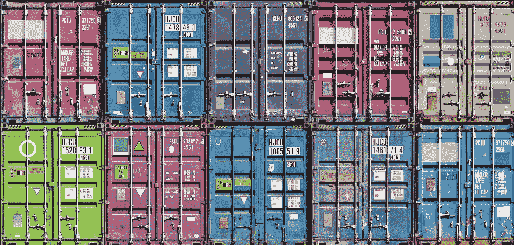

图片取自[此处](https://theloadstar.com/wp-content/uploads/%c2%a9-Binkski-containers_9754977.jpg)

让我们假设我们有一个网上商店，里面有一些你在*亚马逊网络服务*或者*谷歌云平台*上托管的服务器。当只有少数人访问我们的网站时，我们不想花很多钱，但是我们的网站可能在一年中传播几次(假设在[黑色星期五](https://www.adweek.com/digital/5-digital-stats-that-sum-up-cyber-monday-and-black-friday/))，在这个访问高峰期，我们应该为我们的网站购买多少额外的资源？

如果你熟悉这些云技术，你应该已经知道它们有自动扩展选项，但是它是如何工作的呢？也许他们使用**虚拟机，但是他们配置/复制速度很慢**，并且实际上花费了大量的递归来实现所有的硬件虚拟化，等等。所以这可能是用[容器](https://www.docker.com/resources/what-container)完成的，它们更轻、更快，也更容易[管理](https://www.infoworld.com/article/3268073/kubernetes/what-is-kubernetes-container-orchestration-explained.html)。

**TL；容器是一种将程序与其所在的真实系统隔离开来的方式。它依赖于提供隔离并让我们管理资源的 linux 特性。在这篇文章中，我们将尝试理解它是如何工作的，同时创建我们的容器化程序。**

# 范围和前提条件

在本文中，我们将展示创建容器化程序 [doqueru-kun](https://github.com/joseims/doqueru-kun/) 的步骤。不幸的是，我花了很多时间来写这篇文章，所以主题之间可能会有一些不一致的地方，如果你发现了，请告诉我。

我们将介绍我们将使用的 linux 名称空间，并展示如何将它与系统的其他部分隔离开来，但是你可能会发现(正如我们所做的一样) [LiveOverflow 的方法](https://www.youtube.com/watch?v=-YnMr1lj4Z8)更具娱乐性。

我们选择用 C/C++实现来直接调用系统调用，而不像某些语言或库那样进行抽象。通过这种方式，我们了解了很多关于 linux 实现的一些名称空间和系统调用。

可以做很多事情来隔离一个系统。在本文中，我们处理的是:**进程**、**主机名**、**文件系统**的隔离。

我们是**而不是**处理隔离/绑定:**网络**、 **cpu 使用率**、**内存使用率**、**使用率**、 **I/O 速率**限制、**磁盘使用率**等。但是大多数界限可以通过使用 cgroups 来控制。我们已经在 doqueru-kun 中使用了 cgroup，所以也许我以后会发布关于它们的内容。

> 注意:网络隔离是一个我们正在讨论如何处理的问题。如果你对此有什么意见，请在我们的 git 上发表。

# 叉子()

**fork** 和 **exec** 是*进程* genesis 中最重要的[系统调用](https://en.wikipedia.org/wiki/System_call)(简称 syscall)。

**Linux 程序员手册**上的叉子(2)

**fork()** :它创建了一个新的进程，这个进程将*成为他的调用者*的形象和肖像，它将在调用者程序调用 fork()之后的那个点开始运行完全相同的代码。对这个新流程进行了非常小的修改，对我们来说重要的是它有自己的 PID，并且他的调用者将作为他的父流程关联(因此，它是父流程的一个子流程)。

只有这一点不同，我们可以使用相同的代码编写两个不同的程序:

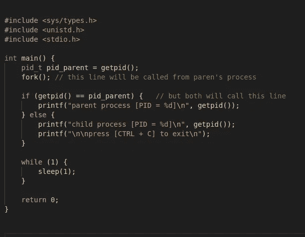

**fork()** 示例用法

在关闭这个程序之前，我们可以用 **ps fc** 来可视化我们的进程的层次结构，它会显示我们的程序有另一个同名的，是他的孩子。

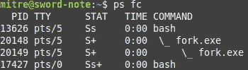

记住这些知识，把图像放在一边，您可以猜测 bash 也在调用 **fork()** 来启动一个新的进程。但是如果程序的实际代码不在 bash 的代码中，那怎么可能呢？

# 执行()

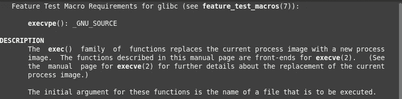

**Linux 程序员手册**上的 exec(3)

当**分支**被调用一次并返回两次时(子级上的 **0** 和父级上的**子级 PID**)**exec**实际上返回不止一次(实际上，如果发生错误，两者都返回一次)。

它只是将调用进程的执行代码替换为指定的可执行代码。

> 注意: **exec** 是一系列函数，它们以不同的方式或用不同的参数做同样的事情，所以我们将从这个项目中使用 **execvp** 。 **execvp** 需要一个带有可执行文件路径的字符串和一个指向参数的指针。

为了快速测试并使事情有所进展，让我们创建一个名为 test.cpp 的文件，它只打印 dies 之前的进程 PID，让我们将它编译到**test.exe**，我们将使用这个文件来检查我们开发容器的进度。

在清理了一些代码之后，我们有了一个程序，它调用另一个程序(听起来制作一个终端应该不是很难)，然后把自己变成同一个程序。

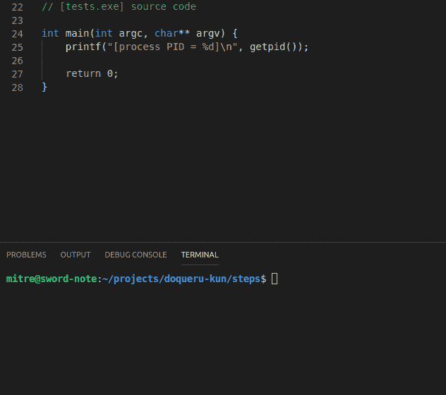

所以，现在我们知道如何用 **fork()** 和 **exec()** 来创建另一个程序。我们编写的这个程序将成为我们的容器，我们在里面调用的每个程序都不会影响我们真正的系统。

# 防御性编程

有了[我们当前的程序](https://github.com/joseims/doqueru-kun/blob/master/steps/exec.cpp)我们可以通过传递他的位置来运行任何可执行文件，因此我们可以运行 **/bin/bash** 并执行几个命令和乱搞(键入**退出**或按下 **CTRL+D** 来关闭它)。

但是在程序内部，我们仍然在我们真实的系统中，所以无论发生什么仍然会反映在我们的系统中，这就是为什么我们需要在每一步都小心谨慎。

> 举一个真实的例子:在我们以多种方式隔离了进程之后，在某个时刻我们将从系统中完全替换掉我们的**"/**，这不会影响真实的工作空间。如果这个过程中的任何一步没有奏效，我们必须在下一步之前知道。

Linux 提供了一个名为 **< errno.h >** 的头文件，我们调用的所有 syscall 都有一种方法来判断是否出错。一般情况下，如果有错误会返回-1，我们可以在 **errno** 中查看错误代码。

所以，在编写了一些 C 宏和我们自己的 assert() 之后，在我们调用我们调用的任何 syscall 之后，让我们断言一切都在按预期工作，然后继续。

# 取消共享()和命名空间

在 [unshare 的手册页](https://linux.die.net/man/2/unshare)中，我们有一个不可共享名称空间的列表(我们可以在 [clone 的手册页](https://linux.die.net/man/2/clone)中读到关于名称空间的内容)。现在让我们继续使用 UTS、PID 和 MNT 名称空间。

*   **【UNIX 分时】**:这个名称空间隔离了我们可以从 [uname](https://linux.die.net/man/2/uname) syscall 中获取的属性，比如操作系统的名称、版本、用户和域名等。
*   **PID(进程 ID)** :这个隔离了 PID 树，那个我们用 ps -auxf 可视化的，[剧透]这将是一个非常有趣的[/剧透]。
*   **MNT(挂载)**:所以我们也有了一个包含所有挂载点的名称空间，酷。事实上，我以前并不太关心它，直到我发现有多少 linux 机制依赖于它…我会更深入地谈论它，但我们不要本末倒置。

# **UTS 命名空间**

如上所述， **UTS 名称空间**隔离了一些属性。这是一个非常简单的名称空间，它将帮助我们更深入地研究 linux 文档和程序员手册。

让我们通过在容器中创建一个新的 UTS 来探索我们能做些什么。克隆人的手册上提到了 **CLONE_NEWUTS** 标志，以及 **sethostname()** 函数。在这一节的最后，还提到只有 **CAP_SYS_ADMIN** 才能创建一个新的 UTS。我们还不熟悉这个命令，所以我们将讨论每个关键字。

**clone()** syscall 有许多标志，用于创建能够隔离其名称空间的进程，这些标志也在 **unshare()** syscall 中使用， **CLONE_NEWUTS** 就是其中之一。这些标志是整数，其中每一位都有不同的含义，因此我们可以对标志进行按位“或”运算来组合它们。

**sethostname()** 只是一个改变处理器主机名的系统调用(类似于 hostname 命令)，我们将用它来设置我们容器的主机名。我们可以通过 **uname -n** 命令或 **gethostname()** 函数来实现这一点。

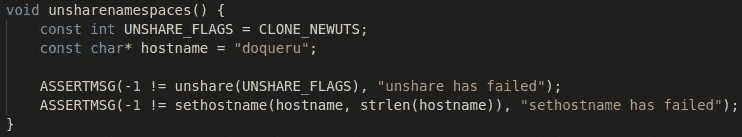

创建新的 UTS 名称空间并将主机名设置为“doqueru”的函数。

因此，在我们的程序上添加这个小函数，我们隔离了真正的 UTS 命名空间。如果它内部的任何进程改变了它的某些东西，它不会对我们的计算机产生影响。

但是…如果您尝试像以前一样运行代码，您会得到一个 **EPERM** 错误。这就是 **CAP_SYS_ADMIN** 需求警告我们的，从现在开始需要用 sudo 特权调用我们的程序。

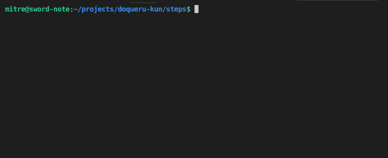

> 提示:如果您在运行 syscall 时遇到这样的错误，最好在 syscall 的手册页中查找错误的参考资料。在 **man 2 unshare** 上寻找错误部分，你会发现如果“调用进程没有这个操作所需的特权”就会抛出 EPERM 错误。使用 **errno** 终端命令查看错误的名称或描述也可能对您有所帮助。

# PID 命名空间

在我们的容器中，我们仍然可以访问所有其他进程，并可以与它们交互，通过使用它们的 PID 创建文件描述符或向它们发送信号(例如使用 [kill](https://linux.die.net/man/3/kill) )。现在我们将通过创建一个新的 PID 名称空间来避免这样的事情。

操纵 linux 的进程树可能很棘手，但是在阅读了[文档](http://man7.org/linux/man-pages/man7/pid_namespaces.7.html)之后，看起来非常聪明和简单。

每个进程都必须有一个父进程，因此我们有一个进程树，其根是 PID 为 1 的进程(让我们忘记 PID 为 0 的进程)。根被称为 **init** 并且在 PID 名称空间上有一个特殊的角色:这个进程将采用所有孤儿进程(当他的父进程在他们之前结束时发生),并且对于创建新进程的操作是必不可少的。如果它死了，那么就不能创建任何进程，所有命名空间的进程都将随着内核发送的 **SIGKILL** 信号而结束。

当使用 **CLONE_NEWPID** 标志取消共享时，调用进程将保留在其当前名称空间中，但是在**取消共享**后创建的其子进程将进入新的 **PID 名称空间**。

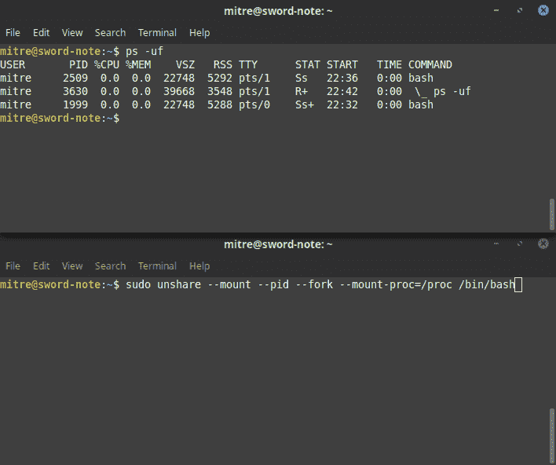

过程树及其非共享可视化

在上面的 *gif* 中，我们可以看到带有 **PID 名称空间**非共享的进程(底部终端)无法从外部看到进程，但是整个名称空间从父进程的 **PID 名称空间**(顶部终端)中是可见的。同样值得注意的是，相同的进程在不同的名称空间中使用不同的 PID。我在 **unshare** 命令中使用了 *mount-proc* 参数，这个 unshare**mount namespace**并在 **/proc** 中挂载*procf*，我们将到达那里。

返回代码:我们将需要调用**unshare(CLONE _ new uts | CLONE _ NEWPID)**来组合这些标志。在这之后，我们的第一个孩子可以是我们作为参数得到的可执行文件，但是这将是 **init** 进程，我们不应该相信任意代码来承担这个责任。如果我们在**分叉**之前**取消共享**，那么我们的 fork()已经产生了 **init** 。然后，让我们在我们的" **init** 中调用 fork+exec 来保存它，并让它等待所有子进程死亡(我们已经在 **main** 函数上用 **wait** syscall 完成了这一点)。

# MNT 命名空间

挂载名称空间是一种链接设备、文件系统和目录的方式，我们可以从文件系统访问它们。坐骑实际上很棘手，但主要是这个。

所以现在我们已经学到了足够的东西，可以直截了当了，对吗？我们应该在 **unshare** 上添加 **CLONE_NEWNS** 标志(是的，他们没想到将来会有更多的名称空间),这样就很好了。难道我们不是吗？

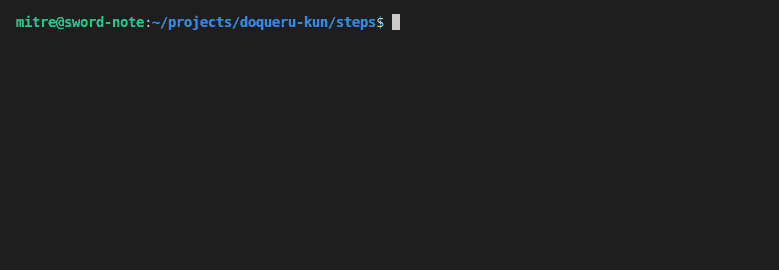

安装在共享子树上

哦，我们使用 mount 在**中创建了一个到 **/** 的链接。/link** 目录，但是当我们退出容器时，链接仍然存在。这里的问题是，即使不共享，我们的[子树也是共享的](http://man7.org/linux/man-pages/man7/mount_namespaces.7.html#SHARED_SUBTREES)。我们应该用 **MS_REC** 和 **MS_PRIVATE** 标志使它们成为私有挂载。

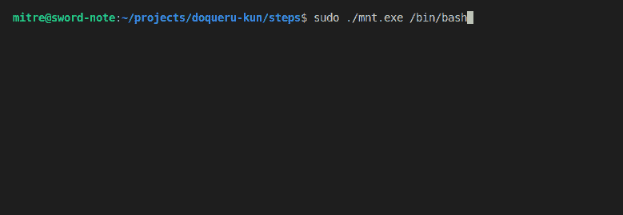

安装在私有子树上

很好，继续前进。您可能已经读过 PID 名称空间的手册说:

> 创建新的 PID 命名空间后，子进程可以更改其根目录，并在 */proc* 处装载新的 procfs 实例，以便 [ps(1)](http://man7.org/linux/man-pages/man1/ps.1.html) 等工具正常工作。

我们需要这个挂载不影响我们的主系统，我们已经完成了，所以我们已经可以这样做了(在新的 PID 名称空间内)，但是不要用 **chroot** 来改变 root，让我们用我们的最终 boss: El Pivoto-Rooterino 来做一些过度工程。

# 枢轴根

当然，我们有同样目的的 chroot 东西，但是那太容易了(而且不安全！).我们当时的选择是使用 pivot_root()系统调用，我们为此后悔了很长时间，直到我们用尽了所有的信息来源，最终做出了一个可以正常工作的代码！在你看到代码和我们的解释后，我们希望这对你来说是小菜一碟，因为我们真的很难了解关于这个程序的信息。

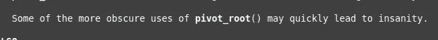

**男人 2 枢轴 _ 根**的入口

首先，pivot_root 的签名是**int pivot _ root(const char * new_root，const char *put_old)** ，但是它没有包装器，所以我们应该称它为 **syscall(SYS_pivot_root，new _ root，put_old)** 。

**new_root** 和 **put_old** 的前置条件:它们必须是目录，不能在当前 **/** 的同一个文件系统中， **put_old** 必须在 **new_root** 之下。

**支点生根:**

*   我们将下载一个小的 linux (Alpine 是我们的选择，也是 Docker 的选择)并把它解压到我们的 **new_root**
*   我们将使 **new_root** 成为新文件系统的挂载点(这是通过绑定挂载文件夹本身来完成的)
*   之后，让我们在 **new_root** 内部的某个地方创建 **put_old**
*   我们现在可以 **pivot_root(new_root，put_old)**
*   让我们把脚本精确地由 **chdir** 变成 **/**
*   最后，我们将懒惰地卸载(用**MNT _ 分离**)put _ old 目录，这样就没有办法从容器限制的文件系统中逃脱。

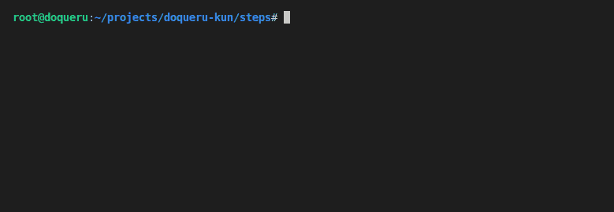

就是这样。这个序列现在看起来似乎很琐碎，但是我们在尝试中失败了很多，有些失败实际上是因为我们挂载的文件系统不是私有的，并且使用 **mount** 的语义乍看起来并不琐碎。

感谢您的阅读(或阅读意图),欢迎在 [github](https://github.com/joseims/doqueru-kun/) 与我们一起投稿，如果您发现本文中有错误，请联系我。

2020 年 2 月 26 日编辑: [LiveOverflow 刚刚发布了一个视频](https://youtu.be/sHp0Q3rvamk)提到了这篇文章。我强烈推荐他的这个系列的教育内容，但我也很高兴和自豪，所以这个推荐也有点儿*炫耀*。