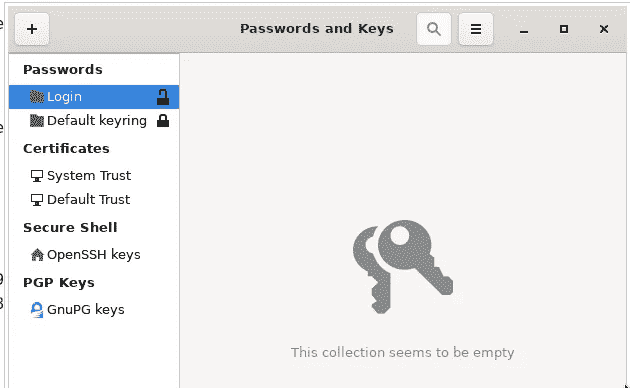
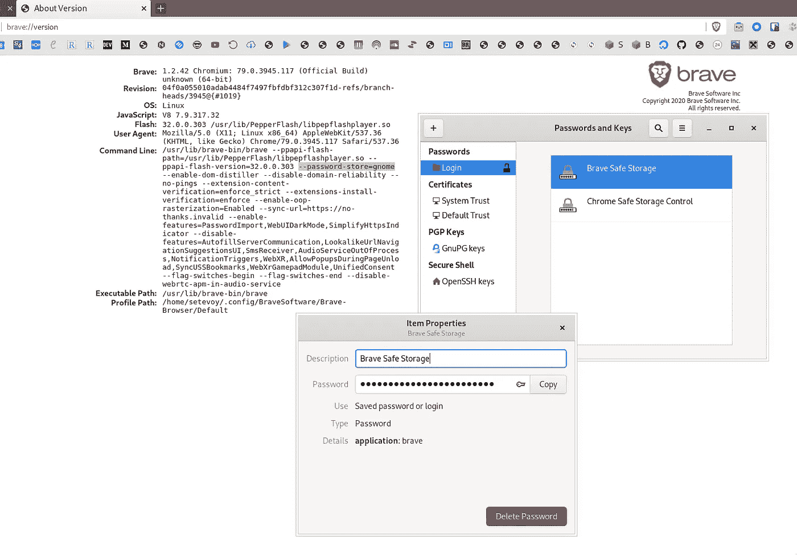
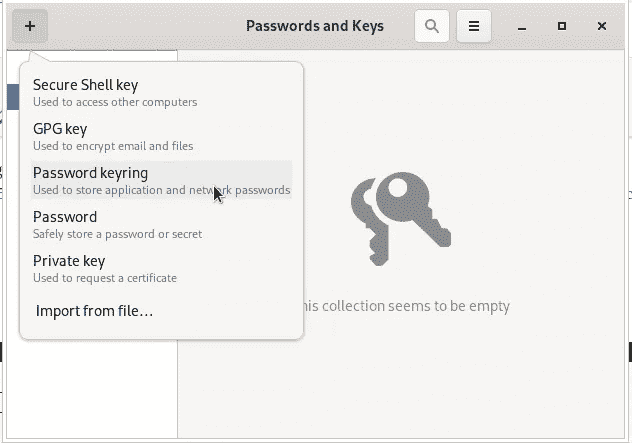
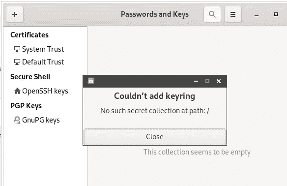

# Linux: gnome-keyring 设置为 Freedesktop SecretService

> 原文：<https://itnext.io/linux-gnome-keyring-setup-as-freedesktop-secretservice-99521a20e9c4?source=collection_archive---------2----------------------->


目前，我使用 KeePass 作为密码，RSA-keys，并作为免费桌面 SecretService，见 [KeePass:一个 MFA TOTP 代码，一个浏览器的密码，SSH 密钥密码存储配置和特勤局集成](https://rtfm.co.ua/en/keepass-an-mfa-totp-codes-a-browsers-passwords-ssh-keys-passwords-storage-configuration-and-secret-service-integration/)职位。

在这样的设置过程中，我面临的第一个问题是，KeePass 的数据库在我的计算机之间同步(它的数据库只是存储在 Dropbox 文件夹中)，例如，KeePass 重写了一些密码——Chromium 为其本地 SQLite 数据库加密创建了自己的名为“ *Chromium Safe Storage* 的密钥，它在每台 PC 上必须是不同的，但随着数据库的同步——我在这里遇到了一个问题。

第二个不便之处是 KeePass 是用一个锁定的数据库启动的，在我不解锁它之前，应用程序不能开始使用它。

例如，这可以通过使用`-pw`选项(参见 [KeePass 选项](https://keepass.info/help/base/cmdline.html))或通过使用 GPG 密钥来实现自动化，但是这样我就失去了整个数据加密的想法，因为所有的访问凭证将以明文形式存储在同一个文件系统中。

因此——让我们尝试使用本地应用程序的`gnome-keyring`作为 SecretService，并将其他所有事情留给 KeePass。

## GNOME 钥匙圈安装

现在检查 D-Bus `org.freedesktop.secrets`服务:

```
$ ps aux |grep $(qdbus — session org.freedesktop.DBus / org.freedesktop.DBus.GetConnectionUnixProcessID org.freedesktop.secrets)
setevoy 1534 0.0 0.6 705436 102524 tty1 SLl Jan09 0:03 keepassxc
```

禁用 KeePass 中的 SecretService 支持，安装`gnome-keyring`:

```
$ sudo pacman -S gnome-keyring
```

再次检查 SecretService:

```
$ ps aux |grep $(qdbus — session org.freedesktop.DBus / org.freedesktop.DBus.GetConnectionUnixProcessID org.freedesktop.secrets)
setevoy 829496 0.0 0.0 236292 8528 ? SLl 13:19 0:00 /usr/bin/gnome-keyring-daemon — start — foreground — components=secrets
```

开始，工作，选项- `*--start --foreground --components=secrets*` -正确，一切就绪。

## GNOME 钥匙圈在登录时解锁

现在，需要在登录到操作系统期间添加存储解密，参见 [Arch Wiki](https://wiki.archlinux.org/index.php/GNOME/Keyring#PAM_method) 和 [GNOME 手册](https://wiki.gnome.org/Projects/GnomeKeyring/Pam/Manual)文档。

检查库:

```
$ ll /usr/lib/security/ | grep gnome
-rwxr-xr-x 1 root root 46768 Oct 29 11:38 pam_gnome_keyring.so
```

编辑`/etc/pam.d/login`，向*授权*和*会话*添加以下字符串:

```
...
auth       optional     pam_gnome_keyring.so
...
session    optional     pam_gnome_keyring.so auto_start
...
```

要在系统中更改用户密码时更新密匙环的密码，请在`/etc/pam.d/passwd`中添加以下行:

```
...
password  optional     pam_gnome_keyring.so
```

文档说有必要将`eval $(/usr/bin/gnome-keyring-daemon --start --components=secrets)`执行添加到`~/.xinitrc`(或者，例如，`~/.config/openbox/environment`)，但是在我的例子中，一切都已经在工作了(Arch Linux + Openbox DE，通过`startx`手动启动 X-server)。

重启电脑并再次检查 D-Bus:

```
$ ps aux |grep $(qdbus — session org.freedesktop.DBus / org.freedesktop.DBus.GetConnectionUnixProcessID org.freedesktop.secrets)
setevoy 1338 0.0 0.0 236376 6932 ? Sl 14:35 0:00 /usr/bin/gnome-keyring-daemon — daemonize — login
```

`gnome-keyring`流程:

```
$ ps aux | grep gnome
setevoy 1351 0.1 0.0 236288 6776 ? Sl 16:32 0:00 /usr/bin/gnome-keyring-daemon — daemonize — login
setevoy 1874 0.0 0.0 235988 7244 ? Sl 16:33 0:00 /usr/bin/gnome-keyring-daemon — start — foreground — components=secrets
```

## 登录和默认密钥环

安装完成后，我们检查了服务，结果如下:

```
$ ps aux |grep $(qdbus — session org.freedesktop.DBus / org.freedesktop.DBus.GetConnectionUnixProcessID org.freedesktop.secrets)setevoy 829496 0.0 0.0 236292 8528 ? SLl 13:19 0:00 /usr/bin/gnome-keyring-daemon — start — foreground — components=secrets
```

但是在我的家用笔记本电脑上“出了点问题”,只有`*--daemonize --login*` 启动了`gnome-keyring-daemon`服务，没有`*--components=secrets*`:

```
$ ps aux |grep $(qdbus — session org.freedesktop.DBus / org.freedesktop.DBus.GetConnectionUnixProcessID org.freedesktop.secrets)setevoy 666 0.0 0.0 380756 7280 ? Sl 21:19 0:00 /usr/bin/gnome-keyring-daemon — daemonize — login
```

在 Seahorse 中(参见下面的 gnome-keyring 部分的[Seahorse-GUI ),我有一个空的*登录* keyring 和*默认*——它甚至无法解锁:](https://rtfm.co.ua/?p=23147#Seahorse_GUI_gnome-keyring)



检查钥匙圈文件:

```
$ ll .local/share/keyrings/.
total 16
-rw — — — — 1 setevoy setevoy 2689 Dec 8 09:38 Default_keyring.keyring
-rw-r — r — 1 setevoy setevoy 15 Dec 6 08:51 default
```

移除*Default _ keyring . keyring*和 *default* 文件，重新登录——它现在工作了。

## 海马——用于`gnome-keyring`的图形用户界面

安装海马:

```
$ sudo pacman -S seahorse
```

例如，运行浏览器 Brave，并检查*登录*钥匙圈(必须由`gnome-keyring`在首次登录系统后创建):



出现了 *Brave 安全存储*记录，因此— Brave 正在使用`gnome-keyring`，SecretService 工作正常，一切正常。

数据库文件:

```
$ ll .local/share/keyrings/
total 8
-rw — — — — 1 setevoy setevoy 2480 Jan 10 14:38 login.keyring
-rw — — — — 1 setevoy setevoy 207 Jan 10 13:41 user.keystore
```

## 路径中没有这样的秘密集合:/

有时，在创建新的密匙环时，海马可能会返回一个错误，显示“ ***在 path: /*** 中没有这样的秘密集合”消息:



解决方案是更新 D-Bus 的环境变量:

```
$ source /etc/X11/xinit/xinitrc.d/50-systemd-user.sh
```

完成了。

*最初发布于* [*RTFM: Linux、DevOps 和系统管理*](https://rtfm.co.ua/en/linux-gnome-keyring-setup-as-freedesktop-secretservice/) 。