# Linux: LEMP 设置——NGINX、PHP、MySQL、SSL、监控、日志和 WordPress 博客迁移

> 原文：<https://itnext.io/linux-lemp-set-up-nginx-php-mysql-ssl-monitoring-logs-and-a-wordpress-blog-migration-a6bd86090df6?source=collection_archive---------5----------------------->


终于有时间用 Debian 10 把 RTFM.CO.UA 的博客迁移到新的服务器上了。这一次手动，没有任何自动化将建立一个 LEMP 堆栈

在 2016 年写了一篇类似的文章——[Debian:установкаLEMP——NGINX+PHP-FPM+Maria db](https://rtfm.co.ua/debian-ustanovka-lamp-nginx-php-fpm-mariadb/)(*Rus*)，但在时间上，这篇文章更完整地描述了用于托管网站的现成 Linux 服务器的过程和工具，实际上是一个 WordPress 博客。

再一次，它计划作为一个关于安装 NGINX + PHP + MySQL 的快速笔记，但结果是，我描述了 LEMP、Linux 监控、日志、电子邮件等设置过程和配置。

所以，在这篇文章中我们要做的是:

*   在数字海洋中创建一个水滴
*   来自“让我们加密”的 SSL
*   NGINX
*   PHP-FPM
*   MySQL (MariaDB)作为数据库服务器
*   NGINX Amplify agent——监控和警报(我试过 Grafana и Loki，但他们使用了太多的资源，但这仍然是一个非常有趣的自动化设置，请查看用 ansi ble——Grafana、Loki 和 promtail 设置的 Prometheus: RTFM 博客监控)
*   WordPress 备份脚本——一个自己写的 Python 脚本，查看[Python:скрииптбекапатарловибазMySQLвAWS S3](https://rtfm.co.ua/python-skript-bekapa-fajlov-i-baz-mysql-v-aws-s3/)(*Rus*
*   Logz.io —将日志收集到 ELK-stack
*   Debian 和已安装的软件包自动升级
*   `logrotate` -日志旋转

# 内容

*   [数字耳蜗:创建一个液滴](https://rtfm.co.ua/en/linux-lemp-set-up-nginx-php-mysql-ssl-monitoring-logs-and-a-wordpress-blog-migration/#DigitalOceal_create_a_droplet)
*   [为 SSH 创建一个 RSA 密钥](https://rtfm.co.ua/en/linux-lemp-set-up-nginx-php-mysql-ssl-monitoring-logs-and-a-wordpress-blog-migration/#Create_an_RSA_key_for_SSH)
*   [防火墙](https://rtfm.co.ua/en/linux-lemp-set-up-nginx-php-mysql-ssl-monitoring-logs-and-a-wordpress-blog-migration/#Firewall)
*   [浮动 IP](https://rtfm.co.ua/en/linux-lemp-set-up-nginx-php-mysql-ssl-monitoring-logs-and-a-wordpress-blog-migration/#Floating_IP)
*   [LEMP——Linux，NGINX，PHP，MySQL](https://rtfm.co.ua/en/linux-lemp-set-up-nginx-php-mysql-ssl-monitoring-logs-and-a-wordpress-blog-migration/#LEMP_%E2%80%93_Linux,_NGINX,_PHP,_MySQL)
*   [让我们加密 SSL](https://rtfm.co.ua/en/linux-lemp-set-up-nginx-php-mysql-ssl-monitoring-logs-and-a-wordpress-blog-migration/#Let%E2%80%99s_Encrypt_SSL)
*   [让我们加密 DNS 验证](https://rtfm.co.ua/en/linux-lemp-set-up-nginx-php-mysql-ssl-monitoring-logs-and-a-wordpress-blog-migration/#Let%E2%80%99s_Encrypt_DNS_validation)
*   [NGINX](https://rtfm.co.ua/en/linux-lemp-set-up-nginx-php-mysql-ssl-monitoring-logs-and-a-wordpress-blog-migration/#NGINX)
*   [FPM PHP](https://rtfm.co.ua/en/linux-lemp-set-up-nginx-php-mysql-ssl-monitoring-logs-and-a-wordpress-blog-migration/#PHPFPM)
*   [Linux:非登录用户](https://rtfm.co.ua/en/linux-lemp-set-up-nginx-php-mysql-ssl-monitoring-logs-and-a-wordpress-blog-migration/#Linux_nonlogin_user)
*   [MySQL](https://rtfm.co.ua/en/linux-lemp-set-up-nginx-php-mysql-ssl-monitoring-logs-and-a-wordpress-blog-migration/#MySQL)
*   [WordPress 博客迁移](https://rtfm.co.ua/en/linux-lemp-set-up-nginx-php-mysql-ssl-monitoring-logs-and-a-wordpress-blog-migration/#WordPress_blog_migration)
*   [归档文件](https://rtfm.co.ua/en/linux-lemp-set-up-nginx-php-mysql-ssl-monitoring-logs-and-a-wordpress-blog-migration/#Archiving_files)
*   [MySQL 数据库转储](https://rtfm.co.ua/en/linux-lemp-set-up-nginx-php-mysql-ssl-monitoring-logs-and-a-wordpress-blog-migration/#MySQL_database_dump)
*   建立数据库连接出错
*   PHP:检查 MySQL 连接
*   WP_ALLOW_REPAIR
*   [“建立数据库连接时出错”原因](https://rtfm.co.ua/en/linux-lemp-set-up-nginx-php-mysql-ssl-monitoring-logs-and-a-wordpress-blog-migration/#The_%E2%80%9CError_establishing_a_database_connection%E2%80%9D_cause)
*   [SSL: webroot 验证](https://rtfm.co.ua/en/linux-lemp-set-up-nginx-php-mysql-ssl-monitoring-logs-and-a-wordpress-blog-migration/#SSL_webroot_validation)
*   [让我们加密:webroot 验证](https://rtfm.co.ua/en/linux-lemp-set-up-nginx-php-mysql-ssl-monitoring-logs-and-a-wordpress-blog-migration/#Let%E2%80%99s_Encrypt_webroot_validation)
*   [证书更新—自动更新证书](https://rtfm.co.ua/en/linux-lemp-set-up-nginx-php-mysql-ssl-monitoring-logs-and-a-wordpress-blog-migration/#certbot_renew_%E2%80%93_autoupdate_certificates)
*   [让我们加密 hook — NGINX reload](https://rtfm.co.ua/en/linux-lemp-set-up-nginx-php-mysql-ssl-monitoring-logs-and-a-wordpress-blog-migration/#Let%E2%80%99s_Encrypt_hook_%E2%80%93_NGINX_reload)
*   [Amplify — NGINX、PHP 和服务器监控](https://rtfm.co.ua/en/linux-lemp-set-up-nginx-php-mysql-ssl-monitoring-logs-and-a-wordpress-blog-migration/#Amplify_%E2%80%93_NGINX,_PHP,_and_server_monitoring)
*   [网站备份脚本](https://rtfm.co.ua/en/linux-lemp-set-up-nginx-php-mysql-ssl-monitoring-logs-and-a-wordpress-blog-migration/#Backup_script_for_websites)
*   [数字海洋卷](https://rtfm.co.ua/en/linux-lemp-set-up-nginx-php-mysql-ssl-monitoring-logs-and-a-wordpress-blog-migration/#DigitalOcean_Volume)
*   [Linux:挂载一个卷](https://rtfm.co.ua/en/linux-lemp-set-up-nginx-php-mysql-ssl-monitoring-logs-and-a-wordpress-blog-migration/#Linux_mount_a_volume)
*   [Logz.io，Filebeat и логи NGINX](https://rtfm.co.ua/en/linux-lemp-set-up-nginx-php-mysql-ssl-monitoring-logs-and-a-wordpress-blog-migration/#Logz_io,_Filebeat_%D0%B8_%D0%BB%D0%BE%D0%B3%D0%B8_NGINX)
*   [安装无人值守升级](https://rtfm.co.ua/en/linux-lemp-set-up-nginx-php-mysql-ssl-monitoring-logs-and-a-wordpress-blog-migration/#Install_unattendedupgrades)
*   [日志旋转](https://rtfm.co.ua/en/linux-lemp-set-up-nginx-php-mysql-ssl-monitoring-logs-and-a-wordpress-blog-migration/#logrotate)
*   [mailx 和 msmtp —从服务器发送电子邮件](https://rtfm.co.ua/en/linux-lemp-set-up-nginx-php-mysql-ssl-monitoring-logs-and-a-wordpress-blog-migration/#mailx_and_msmtp_%E2%80%93_sending_emails_from_the_server)
*   [550 001.RDNS/PTR 错误。被拒](https://rtfm.co.ua/en/linux-lemp-set-up-nginx-php-mysql-ssl-monitoring-logs-and-a-wordpress-blog-migration/#550_001_RDNS/PTR_error_Rejected)
*   [mailx:无法发送消息:进程以非零状态退出](https://rtfm.co.ua/en/linux-lemp-set-up-nginx-php-mysql-ssl-monitoring-logs-and-a-wordpress-blog-migration/#mailx_cannot_send_message_process_exited_with_a_nonzero_status)

# 数字电路:创建一个液滴

RTFM 的博客是在 AWS 上托管的，但去年因为价格较低，我把它移到了数字海洋。

创建新的 droplet:

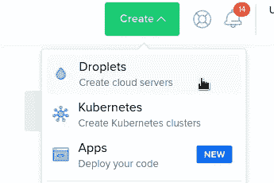

将在 2 个 CPU，2 GB RAM 的虚拟服务器上使用 Debian 10。

例如，在当前使用的具有相同配置的 droplet 上，CPU 和内存的使用情况如下(图来自 NGINX Amplify):

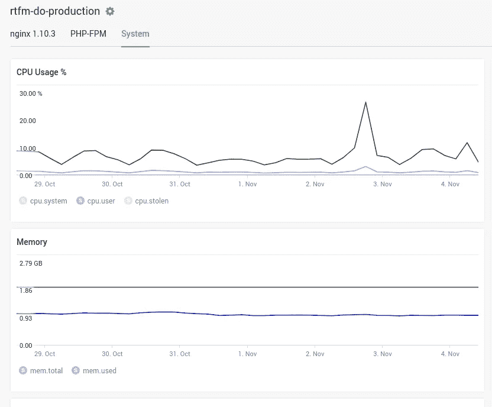

选择操作系统和实例类型:

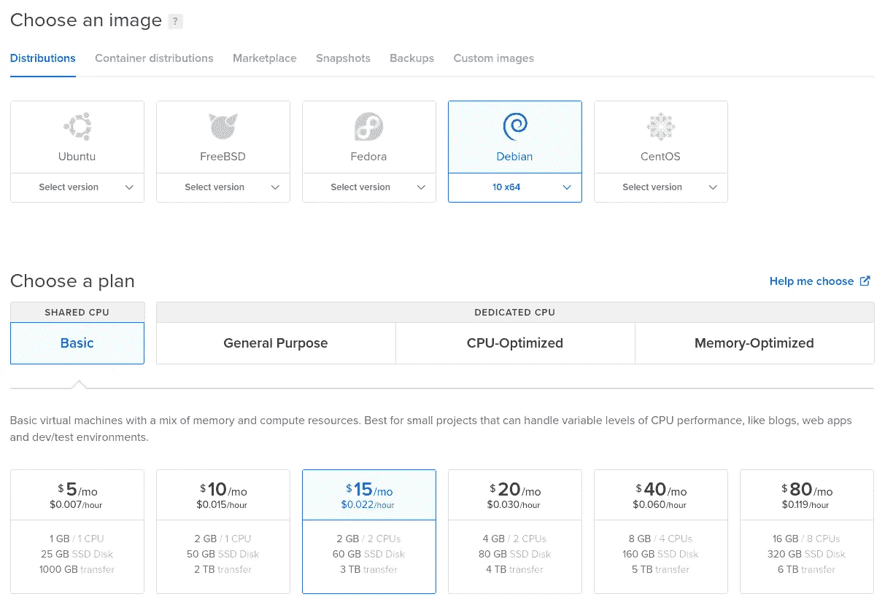

我正在使用法兰克福地区，将启用对水滴的监控—它将由数字海洋代理创建，以便在 DO 的控制面板中有更多图表:

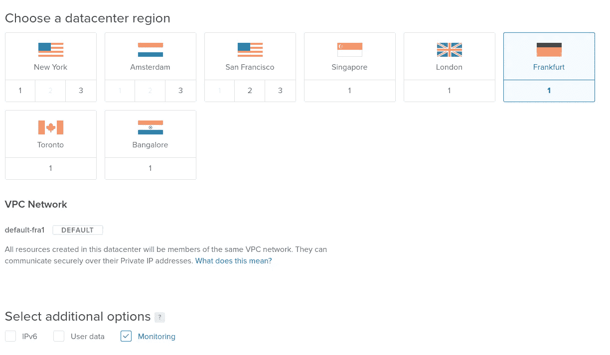

## 为 SSH 创建 RSA 密钥

在工作站上创建一个 ket 对:

```
$ ssh-keygen -f ~/Dropbox/AWS/setevoy-do-nextcloud-production-d10–03–11
Generating public/private rsa key pair.
Enter passphrase (empty for no passphrase):
Enter same passphrase again:
Your identification has been saved in /home/setevoy/Dropbox/AWS/setevoy-do-nextcloud-production-d10–03–11
Your public key has been saved in /home/setevoy/Dropbox/AWS/setevoy-do-nextcloud-production-d10–03–11.pub
…
```

复制其公共部分:

```
$ cat /home/setevoy/Dropbox/AWS/setevoy-do-nextcloud-production-d10–03–11.pub
ssh-rsa AAAAB3NzaC1***Ht3UEYuGtdQgc0= setevoy@setevoy-arch-work
```

在 DO:

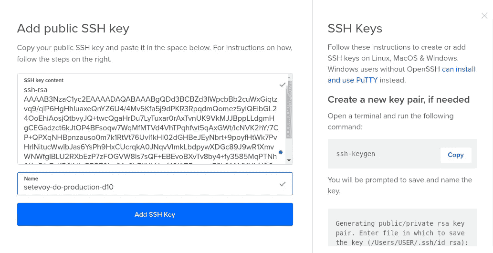

选择 droplets number-one，并将其主机名设置为 *rtfm-do-production-d10* :

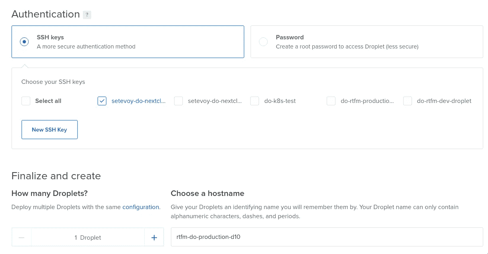

或者，启用备份并创建 droplet:

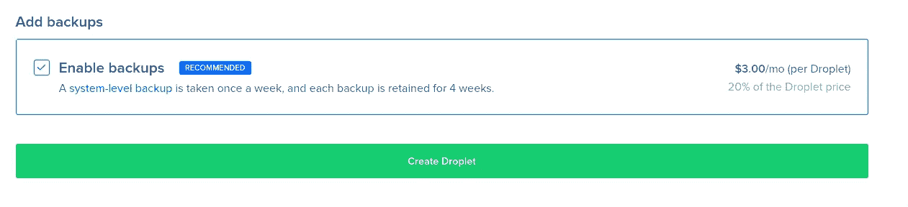

## 防火墙

创建 droplet 时，让我们为它配置一个防火墙:

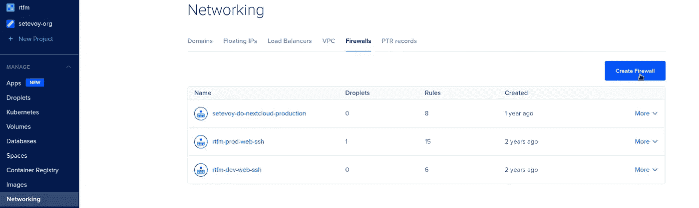

添加规则:SSH、ICMP——受我当前 IP 的限制，以及来自任何地方的 HTTP/S，尽管限制它也是一个好主意，因此 Google 不会在迁移期间将博客索引为原始站点的副本:

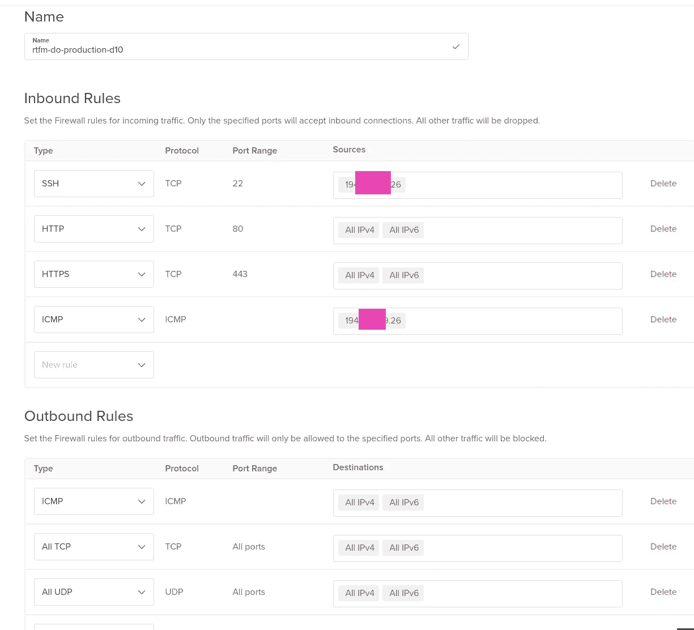

将防火墙连接到 droplet:

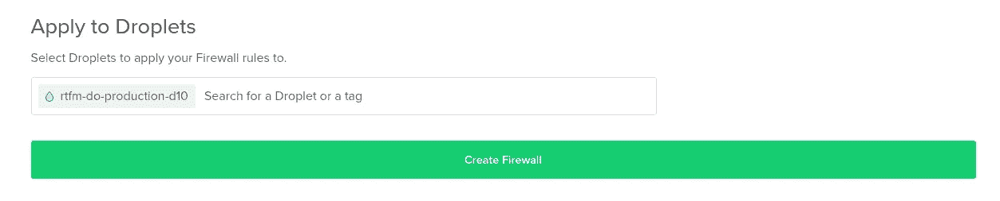

## 浮动 IP

模拟 AWS 中的弹性 IP，为新服务器创建一个新 IP:

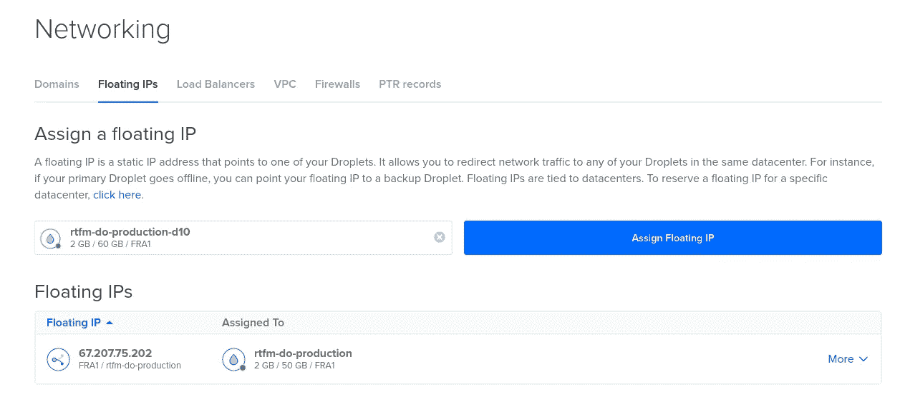

其实都在这里了。

让我们转到服务器配置。

# LEMP——Linux，NGINX，PHP，MySQL

好吧，再问一次——我们需要什么？

*   nginx
*   php-fpm
*   让加密
*   关系型数据库
*   放大剂—монитоиинг
*   备份脚本
*   logz . io——有一个免费层，但是将只存储一天的日志，不过，这对我来说已经足够了，因为我只需要一个漂亮的 web-UI 来检查它们
*   无人值守升级—操作系统和软件包自动升级
*   log rotate——默认情况下已经安装在 Debian 上，只是会检查它的配置
*   msmtp —发送电子邮件

连接到主机:

```
$ chmod 400 Dropbox/AWS/setevoy-do-nextcloud-production-d10–03–11
ssh -i Dropbox/AWS/setevoy-do-nextcloud-production-d10–03–11 root@139.59.205.180
root@rtfm-do-production-d10:~#
```

更新系统并重新启动:

```
root@rtfm-do-production-d10:~# apt update && apt -y upgrade
root@rtfm-do-production-d10:~# reboot
```

为 LEMP 安装软件包:

```
root@rtfm-do-production-d10:~# apt -y install certbot nginx php php-xml php-curl php-gd php-zip php-mysql php-mbstring php-fpm mariadb-server
```

检查 NGINX 是否工作:

```
root@rtfm-do-production-d10:~# curl localhost
<!DOCTYPE html>
<html>
<head>
<title>Welcome to nginx!</title>
…
```

安装其他必要的软件包:

```
root@rtfm-do-production-d10:/data# apt -y install htop git wget unzip unattended-upgrades apt-listchanges dnsutils telnet python-pip python-boto3 mailutils
```

当使用`mailx`和`msmtp`时`mailutils`有问题，所以我不得不用`bsd-mailx`替换它，参见 [mailx 和 msmtp 从服务器发送电子邮件](https://rtfm.co.ua/en/?p=25142#mailx_and_msmtp_%E2%80%93_sending_emails_from_the_server)。

## 让我们加密 SSL

将使用 Let's Encrypt 来获取博客的 SSL 证书。

## 让我们加密 DNS 验证

这里有一个关于验证过程的问题，因为*rtfm.co.ua*域仍然指向旧服务器，我们不能对`.well-known`目录使用通用方法。

我们在这里可以做的是，在获得新证书时使用 DNS 验证，然后当我们已经配置了 NGINX 和 PHP 时，将重新配置`certbot`以使用 webroot 验证，因为 DNS 验证似乎不支持证书`renew`(但我不确定这一点)。

获取证书:

```
root@rtfm-do-production-d10:~# certbot certonly — preferred-challenges dns -d rtfm.co.ua — manual — email user@example.com — agree-tos
Saving debug log to /var/log/letsencrypt/letsencrypt.log
Plugins selected: Authenticator manual, Installer None
Obtaining a new certificate
Performing the following challenges:
dns-01 challenge for rtfm.co.ua
- — — — — — — — — — — — — — — — — — — — — — — — — — — — — — — — — — — — — — — -
NOTE: The IP of this machine will be publicly logged as having requested this
certificate. If you’re running certbot in manual mode on a machine that is not
your server, please ensure you’re okay with that.
Are you OK with your IP being logged?
- — — — — — — — — — — — — — — — — — — — — — — — — — — — — — — — — — — — — — — -
(Y)es/(N)o: Y
- — — — — — — — — — — — — — — — — — — — — — — — — — — — — — — — — — — — — — — -
Please deploy a DNS TXT record under the name
_acme-challenge.rtfm.co.ua with the following value:
ORWOP6KR4C3csx-ngoSWbqVAJuVo8kFDgV8AqNFUemg
Before continuing, verify the record is deployed.
- — — — — — — — — — — — — — — — — — — — — — — — — — — — — — — — — — — — — — — -
Press Enter to Continue
```

在域的 DNS 上添加新记录:

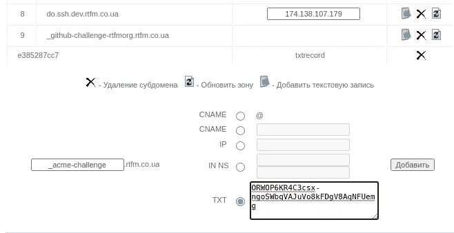

检查一下:

```
$ dig _acme-challenge.rtfm.co.ua TXT +short
“ORWOP6KR4C3csx-ngoSWbqVAJuVo8kFDgV8AqNFUemg”
```

回到服务器，按*回车*——就完成了:

```
…
Press Enter to Continue
Waiting for verification…
Cleaning up challenges
IMPORTANT NOTES:
- Congratulations! Your certificate and chain have been saved at:
/etc/letsencrypt/live/rtfm.co.ua/fullchain.pem
Your key file has been saved at:
/etc/letsencrypt/live/rtfm.co.ua/privkey.pem
Your cert will expire on 2021–02–01\. To obtain a new or tweaked
version of this certificate in the future, simply run certbot
again. To non-interactively renew *all* of your certificates, run
“certbot renew”
```

## NGINX

为 NGINX 生成 Diffie-Hellman 密钥(检查`[ClientKeyExchange](https://rtfm.co.ua/what-is-ssl-tls-v-detalyax/#ClientKeyExchange)`):

```
root@rtfm-do-production-d10:~# openssl dhparam -out /etc/nginx/dhparams.pem 2048
```

删除`default`配置——这里 RTFM 将是默认主机:

```
root@rtfm-do-production-d10:~# rm /etc/nginx/sites-enabled/default
```

为 RTFM 虚拟主机创建一个配置文件— `/etc/nginx/conf.d/rtfm.co.ua.conf`。我只是从旧服务器上下载的。

它足够长了，我过去几年没有改变它，只是一些 SLS 设置。

https://www.ssllabs.com 上一次检查还是给了我 A+的等级，所以可以用。

另外，看看 NGINX 配置生成器，例如，Mozilla 的【https://www.serverion.com/nginx-config】的或 [SSL 配置生成器](https://ssl-config.mozilla.org/)。

在我的配置中，我限制对`/wp-admin`和`wp-login.php`的访问，因为我是唯一使用它的人:

```
server {

    listen 80 default_server;
    server_name rtfm.co.ua [www.rtfm.co.ua;](http://www.rtfm.co.ua;)

    server_tokens off;
    return 301 [https://rtfm.co.ua$request_uri;](https://rtfm.co.ua$request_uri;)
}

server {

    listen 443 ssl default_server;
    server_name rtfm.co.ua;

    root /data/www/rtfm/rtfm.co.ua;

    add_header Strict-Transport-Security "max-age=31536000; includeSubdomains" always;
    server_tokens off;

#    access_log /var/log/nginx/rtfm.co.ua-access.log main_ext;
    error_log /var/log/nginx/rtfm.co.ua-error.log warn;

    ssl_certificate /etc/letsencrypt/live/rtfm.co.ua/fullchain.pem;
    ssl_certificate_key /etc/letsencrypt/live/rtfm.co.ua/privkey.pem;

    ssl_protocols TLSv1.2;
    ssl_prefer_server_ciphers on;
    ssl_dhparam /etc/nginx/dhparams.pem;
    ssl_ciphers "EECDH+AESGCM:EDH+AESGCM:ECDHE-RSA-AES128-GCM-SHA256:AES256+EECDH:DHE-RSA-AES128-GCM-SHA256:AES256+EDH:ECDHE-RSA-AES256-GCM-SHA384:DHE-RSA-AES256-GCM-SHA384:ECDHE-RSA-AES256-SHA384:ECDHE-RSA-AES128-SHA256:ECDHE-RSA-AES256-SHA:ECDHE-RSA-AES128-SHA:DHE-RSA-AES256-SHA256:DHE-RSA-AES128-SHA256:DHE-RSA-AES256-SHA:DHE-RSA-AES128-SHA:ECDHE-RSA-DES-CBC3-SHA:EDH-RSA-DES-CBC3-SHA:AES256-GCM-SHA384:AES128-GCM-SHA256:AES256-SHA256:AES128-SHA256:AES256-SHA:AES128-SHA:DES-CBC3-SHA:HIGH:!aNULL:!eNULL:!EXPORT:!DES:!MD5:!PSK:!RC4";
    ssl_session_timeout 1d;
    ssl_session_cache shared:SSL:50m;
    ssl_stapling on;
    ssl_stapling_verify on;

    error_page 500 502 503 504 /50x.html;
        location = /50x.html {
        root /usr/share/nginx/html;
    }

    client_max_body_size 1024m;

    location ~ /\.ht {
        deny all;
    }

    location ~* \.(jpg|swf|jpeg|gif|png|css|js|ico)$ {
        root /data/www/rtfm/rtfm.co.ua;
        expires 24h;
    }

    location /wp-admin/admin-ajax.php {

    location ~ \.php$ {
        include /etc/nginx/fastcgi_params;
        fastcgi_pass unix:/var/run/rtfm.co.ua-php-fpm.sock;
        fastcgi_index index.php;
        fastcgi_param SCRIPT_FILENAME $document_root$fastcgi_script_name;
        }
    }

    location /wp-admin/ {

        index index.php, index.html;

        auth_basic_user_file /data/www/rtfm/.htpasswd_rtfm;
        auth_basic "Password-protected Area";

        # office
        allow 194.***.***.24/29;
        # home 397 LocalNet
        allow 31.***.***.117/32;
        # home 397 Lanet
        allow 176.***.***.237;
        deny all;

        location ~ \.php$ {
            include /etc/nginx/fastcgi_params;
            fastcgi_pass unix:/var/run/rtfm.co.ua-php-fpm.sock;
            fastcgi_index index.php;
            fastcgi_param SCRIPT_FILENAME $document_root$fastcgi_script_name;
        }
    }

    location /wp-config.php {
        deny all;
    }

    location /.user.ini {
        deny all;
    }

    location /wp-login.php {

        auth_basic_user_file /data/www/rtfm/.htpasswd_rtfm;
        auth_basic "Password-protected Area";

        # office
        allow 194.***.***.24/29;
        # home 397 LocalNet
        allow 31.***.***.117/32;
        # home 397 Lanet
        allow 176.***.***.237;
        deny all;

        location ~ \.php$ {
            include /etc/nginx/fastcgi_params;
            fastcgi_pass unix:/var/run/rtfm.co.ua-php-fpm.sock;
            fastcgi_index index.php;
            fastcgi_param SCRIPT_FILENAME $document_root$fastcgi_script_name;
        }
    }

    location /uploads/noindex {
        auth_basic_user_file /data/www/rtfm/.htpasswd_rtfm;
        auth_basic "Password-protected Area";
    }

    location = /favicon.ico {
        access_log     off;
        log_not_found  off;
    }

    location / {

        try_files $uri =404;

        index index.php;
        proxy_read_timeout 3000;

        rewrite ^/sitemap(-+([a-zA-Z0-9_-]+))?\.xml$ "/index.php?xml_sitemap=params=$2" last;
        rewrite ^/sitemap(-+([a-zA-Z0-9_-]+))?\.xml\.gz$ "/index.php?xml_sitemap=params=$2;zip=true" last;
        rewrite ^/sitemap(-+([a-zA-Z0-9_-]+))?\.html$ "/index.php?xml_sitemap=params=$2;html=true" last;
        rewrite ^/sitemap(-+([a-zA-Z0-9_-]+))?\.html.gz$ "/index.php?xml_sitemap=params=$2;html=true;zip=true" last;

        if (!-f $request_filename){
            set $rule_1 1$rule_1;
        }

        if (!-d $request_filename){
            set $rule_1 2$rule_1;
        }

        if ($rule_1 = "21"){
            rewrite /. /index.php last;
       }
    }

    location ~ \.php$ {

        try_files $uri =404;

        proxy_read_timeout 3000;
        include /etc/nginx/fastcgi_params;
        fastcgi_pass unix:/var/run/rtfm.co.ua-php-fpm.sock;
        fastcgi_index index.php;
        fastcgi_param SCRIPT_FILENAME $document_root$fastcgi_script_name;
    }

    location /nginx_status {
        stub_status on;
        access_log   off;
        allow 127.0.0.1;
        deny all;
    }
}
```

检查并重新加载:

```
root@rtfm-do-production-d10:~# nginx -t && systemctl reload nginx
nginx: the configuration file /etc/nginx/nginx.conf syntax is ok
nginx: configuration file /etc/nginx/nginx.conf test is successful
```

让我们检查一下。

在工作的笔记本电脑上，更新`/etc/hosts`来为*rtfm.co.ua*域设置新的 droplet 的 IP:

```
139.59.205.180 rtfm.co.ua
```

试着打开它:

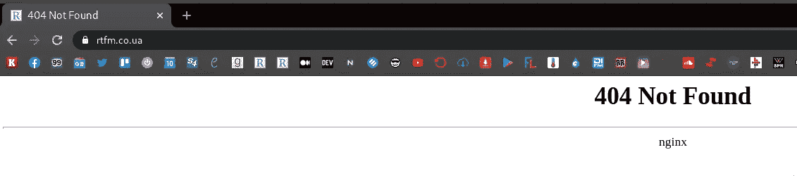

好— SSL 正在工作，NGINX 正在运行。

## PHP-FPM

与 NGINX 配置类似，我将从旧服务器上复制 PHP-FPM 配置。

下面是使用的 FPM 池，每个池都在自己的系统用户下运行。

另见 [PHP-FPM:流程管理器——动态 vs 按需 vs 静态](https://rtfm.co.ua/php-fpm-process-manager-dynamic-vs-ondemand-vs-static/) ( *Rus* )。

## Linux:非登录用户

添加非登录用户:

```
root@rtfm-do-production-d10:~# adduser — system — no-create-home — group rtfm
Adding system user `rtfm’ (UID 109) …
Adding new group `rtfm’ (GID 115) …
Adding new user `rtfm’ (UID 109) with group `rtfm’ …
Not creating home directory `/home/rtfm’.
```

创建一个`/etc/php/7.3/fpm/pool.d/rtfm.co.ua.conf`文件:

```
[rtfm.co.ua]

user = rtfm
group = rtfm

listen = /var/run/rtfm.co.ua-php-fpm.sock

listen.owner = www-data
listen.group = www-data

pm = dynamic
pm.max_children = 5
pm.start_servers = 2
pm.min_spare_servers = 1
pm.max_spare_servers = 3
;pm.process_idle_timeout = 10s;
;pm.max_requests = 500
catch_workers_output = yes
chdir = /
pm.status_path = /status

slowlog = /var/log/nginx/rtfm.co.ua-slow.log
php_flag[display_errors] = off
;php_admin_value[display_errors] = 'stderr'
php_admin_value[display_errors] = off
php_admin_value[error_log] = /var/log/nginx/rtfm.co.ua-php-error.log
php_admin_flag[log_errors] = on
php_admin_value[session.save_path] = /var/lib/php/session/rtfm
php_value[session.save_handler] = files
php_value[session.save_path] = /var/lib/php/session
php_admin_value[upload_max_filesize] = 128M
php_admin_value[post_max_size] = 128M
```

检查 PHP-FPM 配置:

```
root@rtfm-do-production-d10:~# php-fpm7.3 -t
[03-Nov-2020 11:45:24] NOTICE: configuration file /etc/php/7.3/fpm/php-fpm.conf test is successful
```

重新加载配置:

```
root@rtfm-do-production-d10:~# systemctl reload php7.3-fpm.service
```

找到博客的 NIGNX 根目录:

```
...
root /data/www/rtfm/rtfm.co.ua;
...
```

创建目录:

```
root@rtfm-do-production-d10:~# mkdir -p /data/www/rtfm/rtfm.co.ua
```

用`[phpinfo()](https://www.php.net/manual/en/function.phpinfo.php)`函数添加一个测试文件来检查 NGINX + PHP:

```
root@rtfm-do-production-d10:~# echo “<?php phpinfo(); ?>” > /data/www/rtfm/rtfm.co.ua/info.php
```

检查它(再次通过更新`/etc/hosts`):

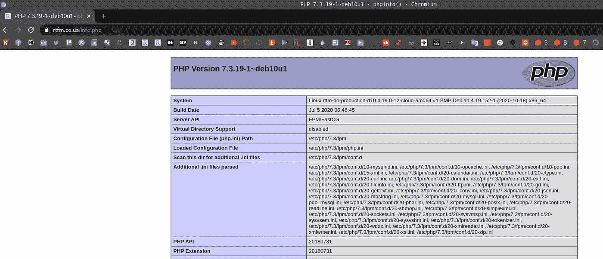

很好——一切正常。

## 关系型数据库

Debian 默认有 MariaDB 而不是 MySQL。配置上差别不大，实际上 MariaDB 运行速度更快。

运行初始配置脚本:

```
root@rtfm-do-production-d10:~# mysql_secure_installation
…
Set root password? [Y/n] y
New password:
Re-enter new password:
Password updated successfully!
Reloading privilege tables..
… Success!
…
Remove anonymous users? [Y/n] y
… Success!
…
Disallow root login remotely? [Y/n] y
… Success!
…
Remove test database and access to it? [Y/n] y
- Dropping test database…
… Success!
- Removing privileges on test database…
… Success!
…
Reload privilege tables now? [Y/n] y
… Success!
Cleaning up…
All done! If you’ve completed all of the above steps, your MariaDB
installation should now be secure.
Thanks for using MariaDB!
```

为 RTFM 创建数据库:

```
MariaDB [(none)]> create database rtfm_db1_production;
Query OK, 1 row affected (0.000 sec)
```

创建一个用户 *rtfm* ，该用户只能使用*密码*从 *localhost* 访问 *rtfm_db1_production* 数据库:

```
MariaDB [(none)]> GRANT ALL PRIVILEGES ON rtfm_db1_production.* TO ‘rtfm’@’localhost’ IDENTIFIED BY ‘password’;
Query OK, 0 rows affected (0.001 sec)
```

检查一下:

```
root@rtfm-do-production-d10:~# mysql -u rtfm -p -e ‘show databases;’
Enter password:
+ — — — — — — — — — — +
| Database |
+ — — — — — — — — — — +
| information_schema |
| rtfm_db1_production|
+ — — — — — — — — — — +
```

现在，迁移的一切都准备好了。

# WordPress 博客迁移

在这里，我不得不暂停写这篇文章来创建数据库的转储和移动博客的文件。

之后，迁移将从新服务器开始。

需要做什么:

1.  板条箱文件存档
2.  数据库转储
3.  将它们移至新主机
4.  更改 DNS 条目以将域指向新的 IP

将文章保存为草稿——WordPress 会将其保存在数据库中，我会将其转储到新的服务器上，然后从这个地方继续写作。

## 存档文件

用博客文件创建一个存档，检查它们:

```
root@rtfm-do-production:/home/setevoy# cd /data/www/rtfm/
root@rtfm-do-production:/data/www/rtfm# ll
total 20
drwxr-xr-x 8 rtfm rtfm 20480 Nov 3 12:11 rtfm.co.ua
```

创建带压缩的 TAR-archive:

```
root@rtfm-do-production:/data/www/rtfm# tar cvpfz rtfm.co.ua.tar.gz rtfm.co.ua/
```

检查文件:

```
root@rtfm-do-production:/data/www/rtfm# ls -lh
total 2.4G
drwxr-xr-x 8 rtfm rtfm 20K Nov 3 12:11 rtfm.co.ua
-rw-r — r — 1 root root 2.4G Nov 3 14:05 rtfm.co.ua.tar.gz
```

## MySQL 数据库转储

创建转储(首先，阅读关于`-d`选项的 [WordPress:错误建立数据库连接](https://rtfm.co.ua/en/?p=25142#WordPress_Error_establishing_a_database_connection)):

```
root@rtfm-do-production:/data/www/rtfm# mysqldump -u rtfm -p -d rtfm_db1_production > rtfm_db1_production.sql
Enter password:
```

检查一下:

```
root@rtfm-do-production:/data/www/rtfm# head rtfm_db1_production.sql
 — MySQL dump 10.16 Distrib 10.1.47-MariaDB, for debian-linux-gnu (x86_64)
 — 
— Host: localhost Database: rtfm_db1_production
 — — — — — — — — — — — — — — — — — — — — — — — — — — — — 
— Server version 10.1.47-MariaDB-0+deb9u1
/*!40101 SET @OLD_CHARACTER_SET_CLIENT=@@CHARACTER_SET_CLIENT */;
/*!40101 SET @OLD_CHARACTER_SET_RESULTS=@@CHARACTER_SET_RESULTS */;
/*!40101 SET @OLD_COLLATION_CONNECTION=@@COLLATION_CONNECTION */;
/*!40101 SET NAMES utf8mb4 */;
```

在旧服务器的防火墙上，打开新服务器的 SSH 连接端口，并复制文件:

```
root@rtfm-do-production-d10:/data# scp -i /root/.ssh/rtfm-do-old setevoy@67.207.75.202:/data/www/rtfm/rtfm.co.ua.tar.gz .
setevoy@67.207.75.202’s password:
rtfm.co.ua.tar.gz 100% 2409MB 101.3MB/s 00:23
root@rtfm-do-production-d10:/data# scp -i /root/.ssh/rtfm-do-old setevoy@67.207.75.202:/data/www/rtfm/rtfm_db1_production.sql .
setevoy@67.207.75.202’s password:
rtfm_db1_production.sql
```

解压缩文件:

```
root@rtfm-do-production-d10:/data# tar xfpzv rtfm.co.ua.tar.gz
```

检查它们:

```
root@rtfm-do-production-d10:/data# ll
total 2466844
drwxr-xr-x 8 rtfm rtfm 4096 Nov 3 10:11 rtfm.co.ua
-rw-r — r — 1 root root 2525973949 Nov 3 12:14 rtfm.co.ua.tar.gz
-rw-r — r — 1 root root 59424 Nov 3 12:14 rtfm_db1_production.sql
drwxr-xr-x 3 root root 4096 Nov 3 11:47 www
```

将`rtfm.co.ua`目录移动到`/data/www/rtfm`目录:

```
root@rtfm-do-production-d10:/data# rm -rf www/rtfm/rtfm.co.ua/
root@rtfm-do-production-d10:/data# mv rtfm.co.ua www/rtfm/
```

检查文件:

```
root@rtfm-do-production-d10:/data# ll www/rtfm/rtfm.co.ua/
total 388
-rw-r — r — 1 rtfm rtfm 64 Nov 6 2018 1a24c4e2948b4047d3d1ed8516b5ca39e452ccfdb2f81a46a8984b921261bd1e.txt
-rw-r — r — 1 rtfm rtfm 24 Nov 6 2018 404.html
-rw-r — r — 1 root root 58 Jul 25 2019 ads.txt
-rw-r — r — 1 rtfm rtfm 28522 Nov 6 2018 bin_dec.html
-rw-r — r — 1 rtfm rtfm 30682 Nov 6 2018 favicon.ico
-rw-r — r — 1 rtfm rtfm 405 Apr 1 2020 index.php
-rw-r — r — 1 rtfm rtfm 3080 Nov 6 2018 keybase.txt
-rw-r — r — 1 rtfm rtfm 19915 Aug 12 07:46 license.txt
-rw-r — r — 1 rtfm rtfm 20 Nov 6 2018 live-4d939769.tx
…
```

将转储上传到新数据库:

```
root@rtfm-do-production-d10:/data# mysql -u rtfm -p rtfm_db1_production < rtfm_db1_production.sql
```

输入密码:

更新本地`/etc/hosts` -和:

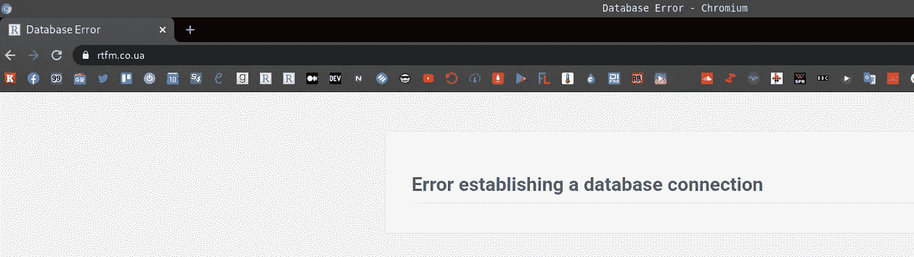

呃… WTF？

## 建立数据库连接时出错

检查数据库中的数据——似乎一切都在它的位置上:

```
MariaDB [rtfm_db1_production]> show tables;
+ — — — — — — — — — — — — — — — — +
| Tables_in_rtfm_db1_production |
+ — — — — — — — — — — — — — — — — +
| b2s_posts |
| b2s_posts_network_details |
| b2s_posts_sched_details |
| b2s_user |
| b2s_user_contact |
| b2s_user_network_settings |
…
```

## PHP:检查 MySQL 连接

让我们用一个简单的脚本来检查 PHP MySQL 是否在工作，我们是否已经安装了所有必要的库:

```
<?php 

$link = @mysqli_connect('localhost', 'rtfm', 'Ta6paidie7Ie'); 

if(!$link) { 
   die("Failed to connect to the server: " . mysqli_connect_error()); 
} else { 
   echo "Connected\n"; 
} 

if(!@mysqli_select_db($link, 'rtfm_db1_production')) { 
   die("Failed to connect to the database: " . mysqli_error($link)); 
} else { 
   echo "DB found\n"; 
} 

?>
```

运行它:

```
root@rtfm-do-production-d10:/data/www/rtfm/rtfm.co.ua# php mysql.php
Connected
DB found
```

一切都好。

## WordPress: `WP_ALLOW_REPAIR`

尽量使用 WordPress 数据库`repair`——在`wp-config.php`前的“‘*就这样，停止编辑！快乐博客*’”行添加以下内容:

```
define('WP_ALLOW_REPAIR', true);
```

并打开[https://rtfm.co.ua/wp-admin/maint/repair.php](https://rtfm.co.ua/wp-admin/maint/repair.php)网址:

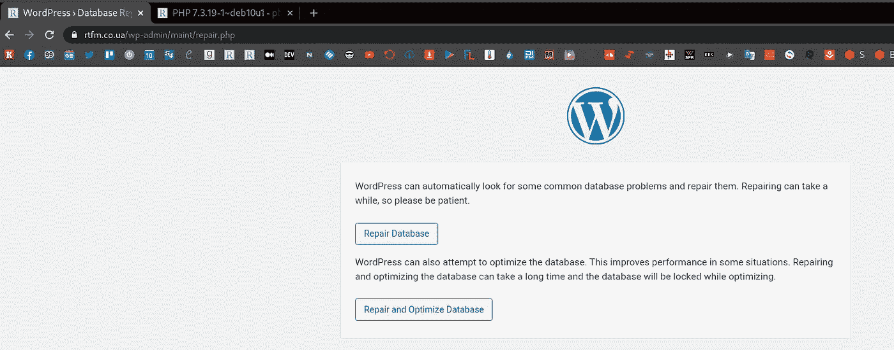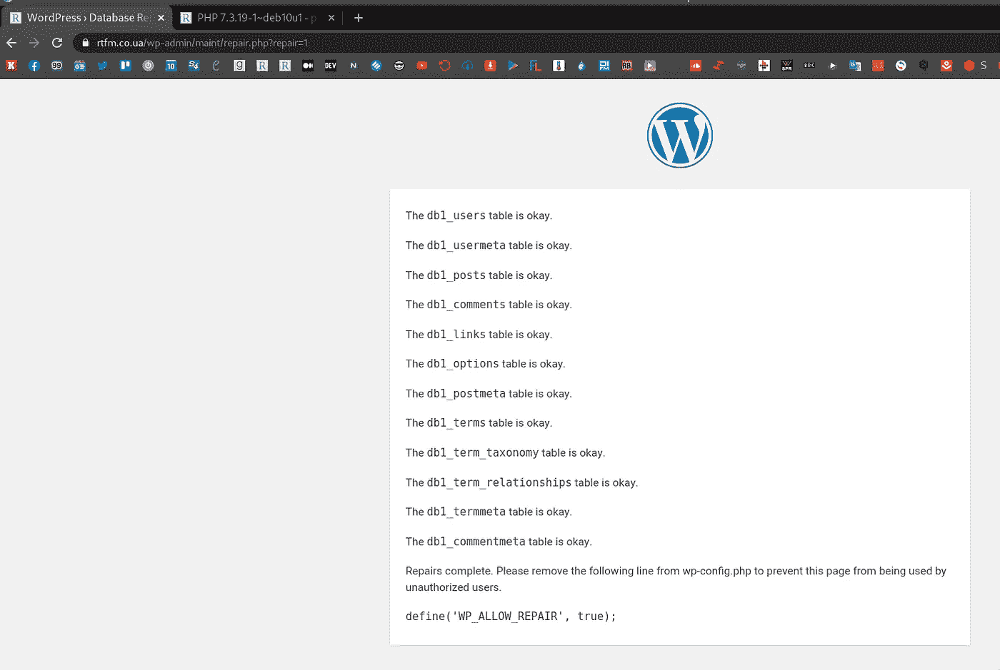

似乎可以，但还是不行:

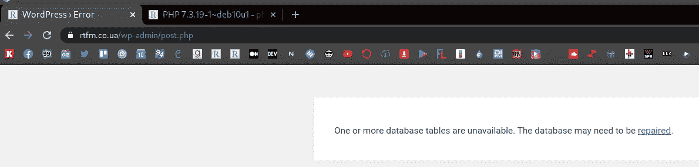

最后一件事是安装一个干净的 WordPress 安装，它工作得很好

所以，这确实是垃圾场本身的问题——但是是什么问题呢？

## “建立数据库连接时出错”原因

于是，我去查了一下`[mysqldump options](https://mariadb.com/kb/en/mysqldump/)`，终于得到了问题:

`-d`、`--no-data`不写任何表格行信息(即不转储表格内容)。如果您只想转储表的 [CREATE TABLE](https://mariadb.com/kb/en/create-table/) 语句(例如，通过加载转储文件创建表的空副本)，这将非常有用。请参见-忽略-表格-数据。

:-D

不知道为什么我在创建转储时添加了`-d`，可能是在 [AWS 数据库迁移服务](https://rtfm.co.ua/aws-database-migration-service-obzor-i-primer-migracii-self-hosted-mariadb-v-aws-aurora-rds/)陷入困境后，我不得不创建一个干净的数据库方案，没有数据。

所以，这次不用`-d`再次创建转储:

```
root@rtfm-do-production:/home/setevoy# mysqldump -u rtfm -p rtfm_db1_production > rtfm_db1_production.sql
Enter password:
```

重复所有的操作，现在一切都正常了——现在从新服务器写这篇文章:

```
13:59:52 [setevoy@setevoy-arch-work ~] $ dig rtfm.co.ua +short
139.59.205.180
```

下一步是什么？

需要配置`certbot`用于未来续订的 webroot 验证，并将其添加到 cron 进行自动更新。

其余服务的收尾工作:

*   放大剂
*   备份脚本
*   logz.io
*   无人值守升级
*   msmtp

# SSL: webroot 验证

因此，我们已经有了一个证书，但它是通过 DNS 记录验证的。

据我所知，这将不会在`renew`工作，所以需要改变它的 webroot。

## 让我们加密:webroot 验证

为*rtfm.co.ua*调用`certbot`，设置`--webroot-path`而不是`dns`——它必须找到一个已经存在的证书，并请求使用它或创建一个新的。

关于第一个问题"*您希望如何向 ACME CA 进行认证？*【答案】*将文件放入 webroot 目录(webroot)* ”，在第二个—“*您有一个现有的证书[…]*”—“*续订&替换证书(限制每 7 天 5 个)*”，为域生成一个新的加密配置文件:

```
root@rtfm-do-production-d10:/data# certbot certonly -d rtfm.co.ua — email user@example.com — agree-tos — webroot-path /data/www/rtfm/rtfm.co.ua/.well-known/
Saving debug log to /var/log/letsencrypt/letsencrypt.log
How would you like to authenticate with the ACME CA?
- — — — — — — — — — — — — — — — — — — — — — — — — — — — — — — — — — — — — — — -
1: Spin up a temporary webserver (standalone)
2: Place files in webroot directory (webroot)
- — — — — — — — — — — — — — — — — — — — — — — — — — — — — — — — — — — — — — — -
Select the appropriate number [1–2] then [enter] (press ‘c’ to cancel): 2
Plugins selected: Authenticator webroot, Installer None
Cert not yet due for renewal
You have an existing certificate that has exactly the same domains or certificate name you requested and isn’t close to expiry.
(ref: /etc/letsencrypt/renewal/rtfm.co.ua.conf)
What would you like to do?
- — — — — — — — — — — — — — — — — — — — — — — — — — — — — — — — — — — — — — — -
1: Keep the existing certificate for now
2: Renew & replace the cert (limit ~5 per 7 days)
- — — — — — — — — — — — — — — — — — — — — — — — — — — — — — — — — — — — — — — -
Select the appropriate number [1–2] then [enter] (press ‘c’ to cancel): 2
Renewing an existing certificate
IMPORTANT NOTES:
- Congratulations! Your certificate and chain have been saved at:
/etc/letsencrypt/live/rtfm.co.ua/fullchain.pem
Your key file has been saved at:
/etc/letsencrypt/live/rtfm.co.ua/privkey.pem
…
```

好了，一切正常，现在检查将在更新过程中使用的配置文件:

```
root@rtfm-do-production-d10:/data# cat /etc/letsencrypt/renewal/rtfm.co.ua.conf
renew_before_expiry = 30 days
version = 0.31.0
archive_dir = /etc/letsencrypt/archive/rtfm.co.ua
cert = /etc/letsencrypt/live/rtfm.co.ua/cert.pem
privkey = /etc/letsencrypt/live/rtfm.co.ua/privkey.pem
chain = /etc/letsencrypt/live/rtfm.co.ua/chain.pem
fullchain = /etc/letsencrypt/live/rtfm.co.ua/fullchain.pem
# Options used in the renewal process
[renewalparams]
account = 868c8164304408984fefbbff845d4f48
authenticator = webroot
server = [https://acme-v02.api.letsencrypt.org/directory](https://acme-v02.api.letsencrypt.org/directory)
webroot_path = /data/www/rtfm/rtfm.co.ua/.well-known,
[[webroot_map]]
```

很好——我们可以在这里添加一个`cronjob`。

## `certbot renew` -自动更新证书

添加一个 crontask，每周运行一次`certbot renew`。

编辑`crontab`:

```
root@rtfm-do-production-d10:/data# crontab -e
```

添加:

```
@weekly certbot renew &> /var/log/letsencrypt/letsencrypt.log
```

## 让我们加密 hook — NGINX 重载

这里的最后一件事是在证书更新后重新加载 NGINX。

它可以直接添加到 crontask 中，如下所示:

```
@weekly certbot renew &> /var/log/letsencrypt/letsencrypt.log && service nginx reload
```

但是在这种情况下，如果任何证书都不会更新，那么 NGINX 将被重新加载。

所以更好的方法是对域使用一个钩子——将它添加到`/etc/letsencrypt/renewal/rtfm.co.ua.conf`中。

在`renewalparams`中添加`renew_hook`，如下图所示:

```
[renewalparams]
account = 868c8164304408984fefbbff845d4f48
authenticator = webroot
server = [https://acme-v02.api.letsencrypt.org/directory](https://acme-v02.api.letsencrypt.org/directory)
webroot_path = /data/www/rtfm/rtfm.co.ua/.well-known,
renew_hook = systemctl reload nginx
```

实际上，我们已经完成了 SSL 设置，с SSL мы закончили.

# Amplify — NGINX、PHP 和服务器监控

基层监控，但有一个漂亮的网络用户界面，可以在几分钟内添加，见[NGINX:Amplify—SaaSмониторинготNGINX](https://rtfm.co.ua/nginx-amplify-saas-monitoring-ot-nginx/)(*俄罗斯*)。

官方的文献记载是[这里> > >](https://amplify.nginx.com/docs/guide-installing-and-managing-nginx-amplify-agent.html) 。

下载安装脚本:

在变量中设置 API-key 并运行脚本:

```
root@rtfm-do-production-d10:/tmp# API_KEY=’967***e31' sh ./install.sh
```

几分钟后，新主机出现在 Amplify 仪表盘上:

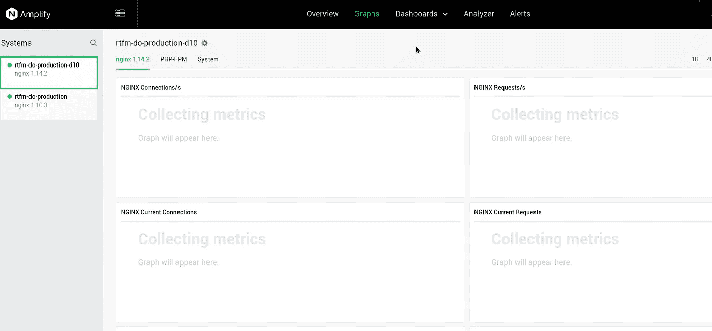

出于兴趣—在 rtfm.co.ua 的*域切换到新主机后，加载到旧主机上:*

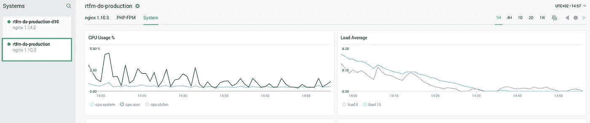

# 网站的备份脚本

我用的是我自己三年前写的 Python 脚本——[https://github.com/setevoy2/simple-backup](https://github.com/setevoy2/simple-backup)。它将归档文件，创建数据库转储，并可以将它们上传到 AWS S3 存储桶。

实际上，对于 WordPress，有很多备份插件，但是我仍然没有时间去检查它们，所以我会用我的老方法。

克隆工具:

```
root@rtfm-do-production-d10:/tmp# cd /opt/
root@rtfm-do-production-d10:/opt# git clone [https://github.com/setevoy2/simple-backup](https://github.com/setevoy2/simple-backup)
```

仍然不确定 Github 中的副本是否还能工作…

我记得，自动气象站 S3 上传系统在某个时候坏了，我没有修好它。

让我们照原样试试:

```
root@rtfm-do-production-d10:/opt# python simple-backup/sitebackup.py -h
usage: sitebackup.py [-h] [-c CONFIG]
optional arguments:
-h, — help show this help message and exit
-c CONFIG, — config CONFIG
```

嗯，也许会有用。

对于备份数据，它使用一个作为专用磁盘和配置文件挂载的`/backups`目录。

首先，添加一个新卷。

现在主机上的磁盘和分区:

```
root@rtfm-do-production-d10:/opt# lsblk
NAME MAJ:MIN RM SIZE RO TYPE MOUNTPOINT
vda 254:0 0 60G 0 disk
├─vda1 254:1 0 60G 0 part /
└─vda2 254:2 0 2M 0 part
vdb 254:16 0 466K 1 disk
```

## 数字海洋体积

转到数字海洋，创建一个卷:

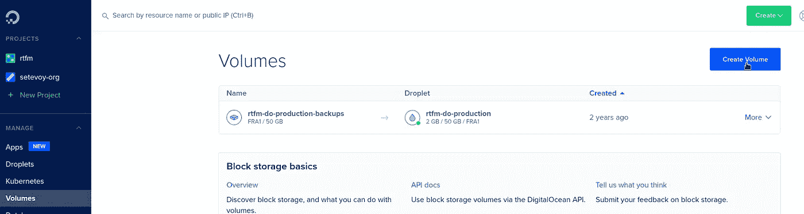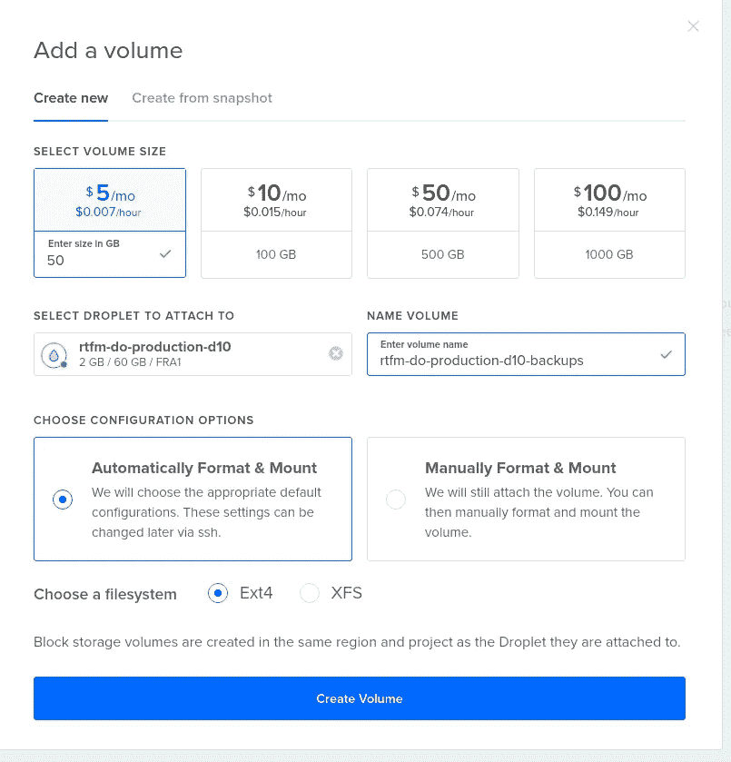

在主机上检查它:

```
root@rtfm-do-production-d10:/opt# lsblk
NAME MAJ:MIN RM SIZE RO TYPE MOUNTPOINT
sda 8:0 0 50G 0 disk /mnt/rtfm_do_production_d10_backups
vda 254:0 0 60G 0 disk
├─vda1 254:1 0 60G 0 part /
└─vda2 254:2 0 2M 0 part
vdb 254:16 0 466K 1 disk
```

## Linux:挂载一个卷

DigitalOcean Volume 默认安装在`/mnt/rtfm_do_production_d10_backups`上，并且没有在`fstab`中创建记录:

```
root@rtfm-do-production-d10:/opt# cat /etc/fstab
/etc/fstab: static file system information.
UUID=4e8b8101–6a06–429a-aaca-0ccd7ff14aa1 / ext4 errors=remount-ro 0 1
```

卸载它:

```
root@rtfm-do-production-d10:/opt# umount /mnt/rtfm_do_production_d10_backups
```

创建`/backups`目录:

```
root@rtfm-do-production-d10:/opt# mkdir /backups
```

获取新磁盘的 UUID:

```
root@rtfm-do-production-d10:/opt# blkid /dev/sda
/dev/sda: UUID=”a6e27193–4079–4d9d-812e-6ba29c702b75" TYPE=”ext4"
```

更新`/etc/fstab`——将该卷挂载添加到`/backups`中，在 opts 中用`nofail`选项设置该磁盘不需要存在，这样系统可以在没有它的情况下启动:

```
# /etc/fstab: static file system information.
UUID=4e8b8101-6a06-429a-aaca-0ccd7ff14aa1   /   ext4    errors=remount-ro   0   1
UUID=a6e27193-4079-4d9d-812e-6ba29c702b75   /backups ext4 nofail 0 0
```

尝试挂载`/etc/fstab`中指定的所有卷:

```
root@rtfm-do-production-d10:/opt# mount -a
```

检查:

```
root@rtfm-do-production-d10:/opt# lsblk
NAME MAJ:MIN RM SIZE RO TYPE MOUNTPOINT
sda 8:0 0 50G 0 disk /backups
vda 254:0 0 60G 0 disk
├─vda1 254:1 0 60G 0 part /
└─vda2 254:2 0 2M 0 part
vdb 254:16 0 466K 1 disk
```

看起来不错，数据在这里:

```
root@rtfm-do-production-d10:/opt# ll /backups/
total 16
drwx — — — 2 root root 16384 Nov 4 12:44 lost+found
```

重新启动服务器以确保一切正常也是好的，但会在完成这篇文章后再做。

可以从旧主机上获取`simple-backup`的配置文件，让我们试着运行它:

```
root@rtfm-do-production-d10:/opt# /opt/simple-backup/sitebackup.py -c /usr/local/etc/production-simple-backup.ini
Got own settings:
backup_root_path = /backups
backup_files_dir = /backups/files
backup_db_dir = /backups/databases
Checking directories:
/backups — found, OK.
/backups/files — found, OK.
/backups/databases — found, OK.
Creating WWW backup for:
site: rtfm
from: /data/www/rtfm/rtfm.co.ua/
to: /backups/files/04–11–2020–12–58_rtfm_rtfm.co.ua.gz
WWW backup done.
Creating DB backup for:
site: rtfm
host: localhost
database: rtfm_db1_production
user: rtfm
to: /backups/databases/04–11–2020–12–58_rtfm_rtfm_db1_production.sql
DB backup done.
Checking for dependencies:
boto3 library already installed — OK.
Uploading /backups/files/04–11–2020–12–58_rtfm_rtfm.co.ua.gz to S3 bucket setevoy-rtfm-simple-backups-production as 04–11–2020–12–58_rtfm_rtfm.co.ua.gz
Uploading /backups/databases/04–11–2020–12–58_rtfm_rtfm_db1_production.sql to S3 bucket setevoy-rtfm-simple-backups-production as 04–11–2020–12–58_rtfm_rtfm_db1_production.sql
Existing data in the setevoy-rtfm-simple-backups-production bucket:
04–11–2020–12–58_rtfm_rtfm.co.ua.gz
04–11–2020–12–58_rtfm_rtfm_db1_production.sql
…
Starting local backups storage cleanup…
Keeping local data: /backups/files/04–11–2020–12–52_rtfm_rtfm.co.ua.gz
Keeping local data: /backups/files/04–11–2020–12–58_rtfm_rtfm.co.ua.gz
Keeping local data: /backups/databases/04–11–2020–12–58_rtfm_rtfm_db1_production.sql
Keeping local data: /backups/databases/04–11–2020–12–52_rtfm_rtfm_db1_production.sql
```

哈！

甚至 AWS S4 上传再次工作！

太好了，我们到此为止。

下一步是什么？

*   logz.io
*   无人值守升级
*   对数旋转
*   msmtp

# Logz.io，Filebeat и логи NGINX

让我们将 NGINX 日志收集添加到 Logz.io 中。

注册一个账户，然后进入文档—[https://app.logz.io/#/dashboard/data-sources/nginx](https://app.logz.io/#/dashboard/data-sources/nginx)。

需要安装 [Filebeat](https://www.elastic.co/guide/en/beats/filebeat/current/filebeat-installation-configuration.html) ，添加它:

```
root@rtfm-do-production-d10:/opt# cd /tmp/
root@rtfm-do-production-d10:/tmp# curl -L -O [https://artifacts.elastic.co/downloads/beats/filebeat/filebeat-7.9.3-amd64.deb](https://artifacts.elastic.co/downloads/beats/filebeat/filebeat-7.9.3-amd64.deb)
root@rtfm-do-production-d10:/tmp# dpkg -i filebeat-7.9.3-amd64.deb
```

获取 Logz.io 的公共证书:

```
root@rtfm-do-production-d10:/tmp# sudo curl [https://raw.githubusercontent.com/logzio/public-certificates/master/AAACertificateServices.crt](https://raw.githubusercontent.com/logzio/public-certificates/master/AAACertificateServices.crt) — create-dirs -o /etc/pki/tls/certs/COMODORSADomainValidationSecureServerCA.crt
```

配置文件节拍。

备份配置:

```
root@rtfm-do-production-d10:/tmp# cp /etc/filebeat/filebeat.yml /etc/filebeat/filebeat.yml-origin
```

根据文档更新它—只需复制粘贴即可:

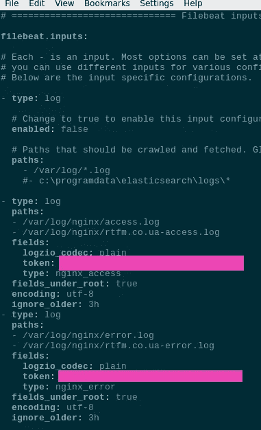

```
...
- type: log
  paths:
  - /var/log/nginx/access.log
  - /var/log/nginx/rtfm.co.ua-access.log
  fields:
    logzio_codec: plain
    token: JzR***ZmW
    type: nginx_access
  fields_under_root: true
  encoding: utf-8
  ignore_older: 3h
- type: log
  paths:
  - /var/log/nginx/error.log
  - /var/log/nginx/rtfm.co.ua-error.log
  fields:
    logzio_codec: plain
    token: JzR***ZmW
    type: nginx_error
  fields_under_root: true
  encoding: utf-8
  ignore_older: 3h

...
```

在`outputs`中注释掉`output.elasticsearch`块，并添加`output.logstash`:

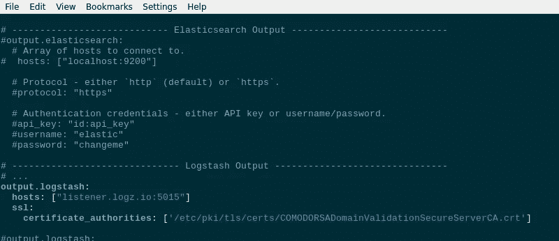

```
...
# ------------------------------ Logstash Output -------------------------------
# ...
output.logstash:
  hosts: ["listener.logz.io:5015"]
  ssl:
    certificate_authorities: ['/etc/pki/tls/certs/COMODORSADomainValidationSecureServerCA.crt'
...
```

检查其语法:

```
root@rtfm-do-production-d10:/tmp# filebeat test config
Config OK
```

检查与 Logz.io 的连接:

```
root@rtfm-do-production-d10:/tmp# filebeat test output
logstash: listener.logz.io:5015…
connection…
parse host… OK
dns lookup… OK
addresses: 23.22.183.192
dial up… OK
TLS…
security: server’s certificate chain verification is enabled
handshake… OK
TLS version: TLSv1.2
dial up… OK
talk to server… OK
```

重新启动服务:

```
root@rtfm-do-production-d10:/tmp# systemctl restart filebeat
```

检查日志:

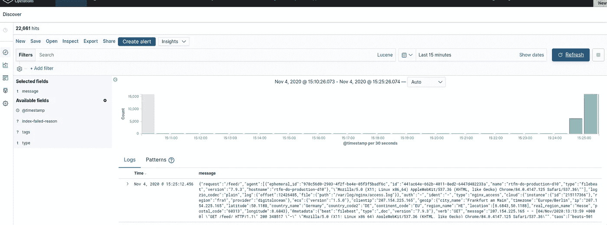

数据在这里。

于是，只剩下了`unattended-upgrades`、`logrotate`和`msmtp`。

# 安装`unattended-upgrades`

已经在[debian:автоматическиеобновленияспомощью无人值守-升级иотправкапочтычерезAWS SES](https://rtfm.co.ua/debian-avtomaticheskie-obnovleniya-s-pomoshhyu-unattended-upgrades-i-otpravka-pochty-cherez-aws-ses/)(*RUS*)中描述过了，让我们在没有 AWS ses 的情况下在这里做吧。

这里的文档是[>>>](https://wiki.debian.org/UnattendedUpgrades)。

`unattended-upgrades`和`apt-listchanges`已经安装，只需要配置一下。

跑`dpkg-reconfigure unattended-upgrades`:

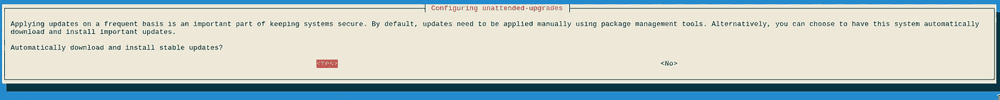

回答*是*。

检查`/etc/apt/apt.conf.d/20auto-upgrades`:

```
APT::Periodic::Update-Package-Lists "1";
APT::Periodic::Unattended-Upgrade "1";
```

现在不需要在`APT::Periodic::Enable`选项中启用更新，这两行就足够了。

接下来，检查`/etc/apt/apt.conf.d/50unattended-upgrades`。

一般来说，您可以在这里保留所有的默认值，但是值得设置:

*   `Unattended-Upgrade::Mail` -获取关于已安装更新的电子邮件
*   `Unattended-Upgrade::Automatic-Reboot` -由你决定，现在，可以把它留给*假*，以后再启用
*   `Unattended-Upgrade::Automatic-Reboot-Time` -如果前面的选项将被启用，值得设置重启时间

运行测试升级:

```
root@rtfm-do-production-d10:/tmp# unattended-upgrade -v -d — dry-run
…
No packages found that can be upgraded unattended and no pending auto-removals
```

好吧。

现在，让我们来看看`logrotate`配置。

# `logrotate`

实际上，那里也是万事俱备。

所有`logrotate`配置文件:

```
root@rtfm-do-production-d10:/tmp# ll /etc/logrotate.d/
total 60
-rw-r — r — 1 root root 120 Apr 19 2019 alternatives
-rw-r — r — 1 root root 122 Sep 23 2019 amplify-agent
-rw-r — r — 1 root root 173 May 12 09:57 apt
-rw-r — r — 1 root root 79 Feb 13 2019 aptitude
-rw-r — r — 1 root root 130 Aug 28 2018 btmp
-rw-r — r — 1 root root 82 May 26 2018 certbot
-rw-r — r — 1 root root 112 Apr 19 2019 dpkg
-rw-r — r — 1 root root 146 May 13 16:01 exim4-base
-rw-r — r — 1 root root 126 May 13 16:01 exim4-paniclog
-rw-r — r — 1 root root 802 Oct 12 17:46 mysql-server
-rw-r — r — 1 root root 329 Aug 24 10:18 nginx
-rw-r — r — 1 root root 155 Jul 5 06:46 php7.3-fpm
-rw-r — r — 1 root root 501 Feb 26 2019 rsyslog
-rw-r — r — 1 root root 235 Jun 8 2019 unattended-upgrades
-rw-r — r — 1 root root 145 Feb 19 2018 wtmp
```

NGINX 日志循环配置:

```
root@rtfm-do-production-d10:/tmp# cat /etc/logrotate.d/nginx
/var/log/nginx/*.log {
daily
missingok
rotate 14
compress
delaycompress
notifempty
create 0640 www-data adm
sharedscripts
prerotate
if [ -d /etc/logrotate.d/httpd-prerotate ]; then \
run-parts /etc/logrotate.d/httpd-prerotate; \
fi \
endscript
postrotate
invoke-rc.d nginx rotate >/dev/null 2>&1
endscript
}
```

也许，以后会添加`[size](https://linux.die.net/man/8/logrotate)`参数。

检查其工作:

```
root@rtfm-do-production-d10:/tmp# logrotate -f -v /etc/logrotate.conf
…
considering log /var/log/kern.log
Now: 2020–11–04 14:25
Last rotated at 2020–11–04 00:00
log needs rotating
…
```

一些日志已经可以旋转。

# `mailx`和`msmtp` -从服务器发送电子邮件

根用户将收到关于服务器状态的电子邮件，最好是在外部电子邮箱中接收。

首先，检查`/etc/aliases`以了解哪个电子邮件用于 root 用户:

```
root@rtfm-do-production-d10:/tmp# cat /etc/aliases
/etc/aliases
mailer-daemon: postmaster
postmaster: root
nobody: root
hostmaster: root
usenet: root
news: root
webmaster: root
www: root
ftp: root
abuse: root
noc: root
security: root
root: root@example.com
```

如果在此进行任何更新，请运行:

```
root@rtfm-do-production-d10:/tmp# newaliases
```

## 550 001.RDNS/PTR 错误。拒绝

因此，给 root 用户的电子邮件将被发送到*root@example.com*，但是如果现在尝试发送电子邮件，它将不会被发送:

```
root@rtfm-do-production-d10:/tmp# echo Test | mailx -s Test root@example.com
```

这是因为它通过 MTA 进出口银行发送，查看其日志:

```
root@rtfm-do-production-d10:/tmp# tail /var/log/exim4/mainlog
…
2020–11–04 14:38:16 1kaJvU-00032w-7q <= root@rtfm-do-production-d10 U=root P=local S=405
…
2020–11–04 14:39:08 1kaJvI-00032T-Dx ** root@example.com <root@rtfm-do-production-d10> R=dnslookup T=remote_smtp H=mx1.mail7.freehost.com.ua [194.0.200.210] X=TLS1.2:ECDHE_RSA_AES_256_GCM_SHA384:256 CV=no DN=”CN=*.freehost.com.ua”: SMTP error from remote mail server after RCPT TO:<root@example.com>: 550 001.RDNS/PTR error. Rejected
```

***“550 001.RDNS/PTR 错误。拒绝***”—这是因为我们还没有为服务器的 FloatinIP 配置 PTR 记录，在 DigitalOcean 上我们不能轻易更新它。

为了缓解这个问题，请安装`[msmtp](https://wiki.archlinux.org/index.php/msmtp)`，因此我们将通过外部 SMTP 服务器而不是本地服务器发送电子邮件:

```
root@rtfm-do-production-d10:/tmp# apt -y install msmtp msmtp-mta
```

`msmtp-mta`将从`/usr/sbin/sendmail`创建一个符号链接，当`mailx`试图通过`sendmail`发送电子邮件时，它将实际使用`msmtp`:

```
root@rtfm-do-production-d10:/tmp# ls -l /usr/sbin/sendmail
lrwxrwxrwx 1 root root 12 Feb 15 2019 /usr/sbin/sendmail -> ../bin/msmtp
```

配置`/etc/msmtprc`:

```
defaults
port 25
tls on
tls_trust_file /etc/ssl/certs/ca-certificates.crt

account freehost
host freemail.freehost.com.ua
from user@example.com
auth on
user user@example.com
password password

# Set a default account
account default : freehost
```

检查一下:

```
root@rtfm-do-production-d10:/tmp# echo “test username.” | msmtp -a default myuser@google.com
```

## mailx:无法发送消息:进程以非零状态退出

通过`msmtp`用`mailx`发送电子邮件——安装`bsd-mailx`而不是`mailutils`:

```
root@rtfm-do-production-d10:/tmp# apt -y purge mailutils
root@rtfm-do-production-d10:/tmp# apt -y install bsd-mailx
```

否则，您会得到“ ***mailx:无法发送消息:进程以非零状态*** ”和“ ***msmtp:未找到收件人*** ”错误。

尝试用`mailx`发送:

```
root@rtfm-do-production-d10:/tmp# echo Test | mailx -s Test myuser@google.com
```

现在，来自`unattended-upgrades`的邮件必须发送到`Unattended-Upgrade::Mail`中指定的邮箱。

嗯，就这些。

*最初发布于* [*RTFM: Linux、DevOps 和系统管理*](https://rtfm.co.ua/en/linux-lemp-set-up-nginx-php-mysql-ssl-monitoring-logs-and-a-wordpress-blog-migration/) *。*