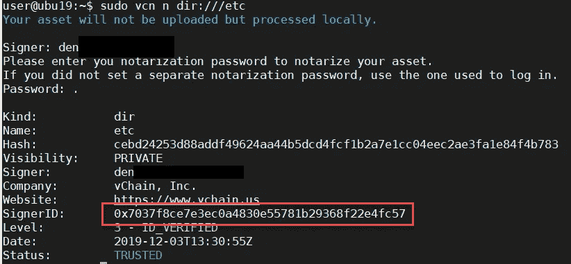
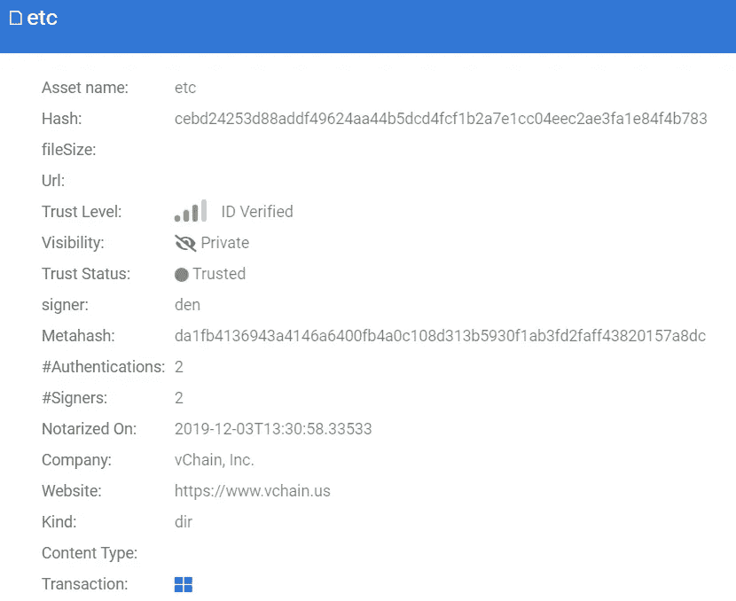
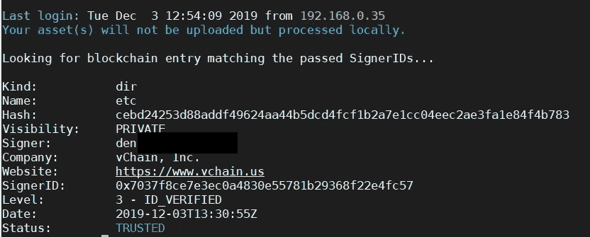
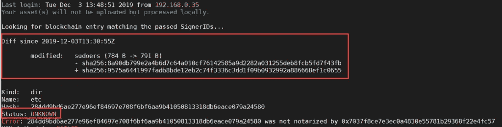

# Linux:保护配置文件

> 原文：<https://itnext.io/linux-protecting-configuration-files-7b0e53b49a4?source=collection_archive---------6----------------------->

无论您是在本地运行 linux 环境，还是在使用任何发行版(如 Ubuntu、Centos、RHEL 或其他软件)的云实例中运行 Linux 环境，您都想知道某些东西是否被碰过。

code 公证人以最简单的方式让您做到这一点，验证副本甚至安全地存储在您的环境之外。

下面的博文介绍了通常存储配置文件的/etc 目录的公证，以及登录时的自动身份验证。

我们涵盖:

*   安装 vcn
*   公证文件或文件夹
*   更改 bash 配置文件，以便在登录时进行身份验证
*   一些例子

# 安装 vcn

有很多不同的方法来安装 vcn 命令行工具。当然你也可以自己建造。GitHub 存储库可以在以下位置找到:

[https://github.com/vchain-us/vcn](https://github.com/vchain-us/vcn)

最新版本:

https://github.com/vchain-us/vcn/releases/latest

如果您想要快速安装(Linux、MacOS)，您也可以使用我们的安装脚本:

```
bash <(curl http://getvcn.codenotary.io -L)
```

你可以查看我们的[手册](https://docs.codenotary.io/)或者简单地输入 **vcn 帮助**

# 公证文件或文件夹

随着 vcn 的安装和运行，我们可以在每次登录时公证我们想要验证的文件夹或文件。这些可能是:

*   配置文件(Apache、NGINX、防火墙服务、Sudoers 文件等等)
*   包含配置文件的文件夹
*   不应被忽视的文件或文件夹

确保您有一个免费的[code 公证人](https://dashboard.codenotary.io/auth/signup)账户，这样您就可以公证并且只检查您自己的数字对象。

# /etc 文件夹的公证

提示:根据安装的不同，您可能需要使用 **sudo** ！

```
# first login with your CodeNotary account credentials 
vcn login # Notarize /etc - dir:// acts on the whole folder or directory 
# type your password when requested 
vcn n dir:///etc
```



已经完成了，你可以在你的[仪表板](https://dashboard.codenotary.io/)中轻松地再次检查，或者简单地输入 **vcn a dir:///etc** 如果一切正常的话。



如果你只是想检查一个或一些文件，你可以使用 **vcn n /path/file** 而不用 **dir://** 。

# 更改 bash 配置文件，以便在登录时进行身份验证

我们希望以一种自动的方式来完成这项工作，而不是每次登录时都要验证配置文件夹等。这个例子很简单，但是可以很容易地进行改进，以使环境更加安全。

更改您的本地个人资料: **nano ~/。配置文件**并添加以下几行:

```
# calculate the SHA256 checksum of vcn (check the path vcn is installed) 
# /usr/bin/vcn or /usr/local/bin and change accordingly CHECKSUM=$(sha256sum /usr/local/bin/vcn | cut -d " " -f 1) # check if the vendor vchain.us notarized vcn 
# of course you can notarize yourself and check against your identity as well curl -s https://api.codenotary.io/authenticate/$CHECKSUM?org=vchain.us | grep -q :0 # error if the curl command failed and vcn could not be authenticated 
test $? -eq 0 || echo "VCN Authenticate: FAILED" # use vcn to authenticate /etc and check against the blockchain 
# make sure to change 0x000000000 to your signer key (vcn info) 
vcn a dir:///etc -s 0x000000000 # error if vcn could not authenticate /etc 
test $? -eq 0 || echo "VCN Auth /etc: FAILED"
```

保存文件，下一次登录已经在检查/etc 文件夹。

# 一些例子

自从公证发生以来，没有任何变化:



更改/etc/sudoers 文件后



# 摘要

如你所见，使用 code 公证人来保护你的目录或文件夹是如此简单明了。这适用于 Linux、MacOS，当然也适用于 Windows(我们将在另一个时间讨论微软 Windows)。

*原载于 2019 年 12 月 3 日*[*https://www . code 公证人. io*](https://www.codenotary.io/linux-protecting-configuration-files/) *。*