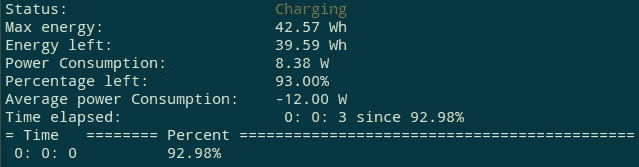
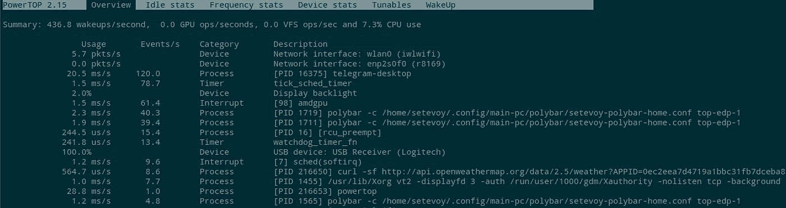
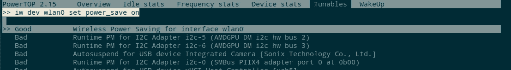
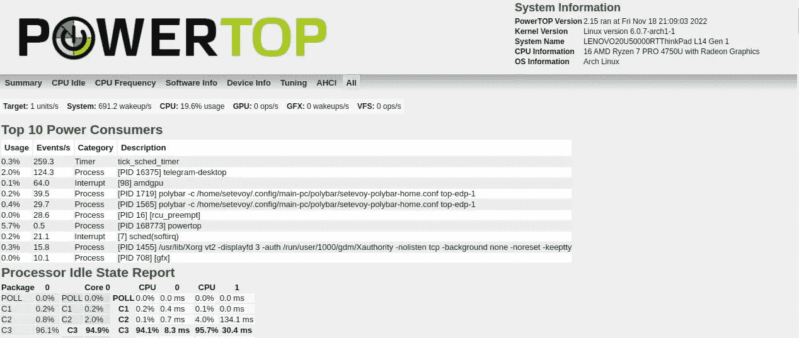
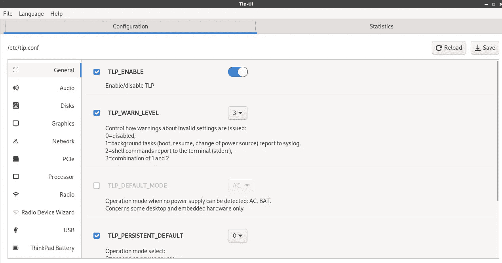

# Linux:节省笔记本电脑的电池能量

> 原文：<https://itnext.io/linux-saving-laptops-battery-energy-33eddfea0de6?source=collection_archive---------2----------------------->


这一次，我开始感兴趣了——有没有可能以某种方式节省笔记本电脑电池的电量？不是说它放电快，工作 5–6 小时就够了，但也不会太多，尤其是现在乌克兰停电的情况下。

找到了几个实用程序，今天我将写下它们。

# uppower

第一个——`upower`:

```
$ sudo pacman -S upower
```

首先，你可以用选项`--monitor-detail`打电话——会实时显示关于电池状态的信息:

```
$ sudo upower --monitor-detail
Monitoring activity from the power daemon. Press Ctrl+C to cancel.
[20:42:20.071] device changed: /org/freedesktop/UPower/devices/battery_BAT0
native-path: BAT0
vendor: SMP
model: LNV-5B10W13895
serial: 2056
power supply: yes
updated: Fri Nov 18 20:42:20 2022 (0 seconds ago)
has history: yes
has statistics: yes
battery
present: yes
rechargeable: yes
state: charging
warning-level: none
energy: 36.7 Wh
energy-empty: 0 Wh
energy-full: 0 Wh
energy-full-design: 0 Wh
energy-rate: 15.538 W
voltage: 12.391 V
charge-cycles: N/A
time to full: 22.7 minutes
percentage: 86%
technology: lithium-polymer
icon-name: ‘battery-full-charging-symbolic’
History (charge):
1668796940 86.000 charging
1668796850 85.000 charging
History (rate):
1668796940 15.538 charging
1668796910 15.784 charging
1668796880 16.006 charging
1668796850 16.253 charging
```

在这里，我们可以看到笔记本电脑电池的型号——LNV-5b 10 W 13895，以及它的状态——正在使用的瓦特小时数(36.7 Wh)，现在的功耗是多少(15.538 W)，功率是多少(12.391 V)

你可以用安培小时来计算:

```
>>> 37.31/12.3
3.03
```

也就是现在电池里有 3033 mAh 的电量。

此外，我们还看到了电池装置本身——`/org/freedesktop/UPower/devices/battery_BAT0`。

无需监控，只需一次即可获得相关信息——设备`sudo upower -i /org/freedesktop/UPower/devices/battery_BAT0`的一个选项`-i`。

# 高级配置与电源接口(Advanced Configuration and Power Interface)

另一个类似的实用程序——`acpi`，也可以显示温度(而且不仅仅是，关于 ACPI 见[):](https://tldp.org/HOWTO/html_single/ACPI-HOWTO/#aboutacpi)

```
$ sudo pacman -S acpi
```

获取有关电池的信息:

```
$ acpi -i
Battery 0: Charging, 91%, 00:21:40 until charged
Battery 0: design capacity 3649 mAh, last full capacity 3431 mAh = 94%
```

“设计容量 3649 mAh”——几乎与上面计算的一样，只是他们采用了目前的充电量，现在约为设计容量的 94%。

# Batstat

第三个有用的东西——`batstat`。很简单，但是很有用。

下载存储库，用`make`构建它:

```
$ git clone https://github.com/Juve45/batstat.git
$ cd batstat
$ make
$ chmod +x batstat
$ sudo mv batstat /usr/local/bin/
```

运行它:



# Powertop

Powertop 不仅能够显示关于电池的信息，而且首先能够显示关于消耗能量的过程的信息，其次，它可以执行设置以节省电荷。

```
$ sudo pacman -S powertop
```

在`root`用户下运行

```
$ sudo powertop
```



*可调参数*选项卡显示可优化能耗的设置信息。

选择所需的项目，按 Enter 键—选项会切换:



此外，还可以生成一个 HTML 报告:

```
$ sudo powertop --html=powerreport.html
```

其结果是:



您可以添加一个 systemd 服务，它将在系统启动时执行自动调整。

创建一个新文件`/etc/systemd/system/powertop.service`:

```
[Unit]
Description=Powertop tunings

[Service]
Type=oneshot
RemainAfterExit=yes
ExecStart=/usr/bin/powertop --auto-tune

[Install]
WantedBy=multi-user.target
```

激活它:

```
$ sudo systemctl start powertop.service
$ sudo systemctl enable powertop.service
```

# TLP

它只是一个怪物。不如多读点资料[这里> > >](https://linuxconfig.org/how-to-optimize-laptop-battery-life-with-tlp-on-linux) 和[这里> > >](https://wiki.archlinux.org/title/TLP) ，现在说说主要特点。

安装:

```
$ sudo pacman -S tlp
$ sudo pacman -S tlp-rdw
```

有一个图形界面:

```
$ yay -S tlpui
$ sudo tlpui
```



在引擎盖下，它已经有了所有的设置，所以最好禁用`powertop.service`。

启动服务:

```
$ sudo systemctl enable tlp.service
```

并屏蔽(`[mask](https://wiki.archlinux.org/title/Systemd#Using_units)`)可能干扰的服务`tlp`:

```
$ sudo systemctl mask systemd-rfkill.service
$ sudo systemctl mask systemd-rfkill.socket
```

配置文件— `/etc/tlp.conf`，您可以将自己的配置放在`/etc/tlp.d/`目录下。

显示当前设置:

```
$ sudo tlp-stat
 — — TLP 1.5.0 — — — — — — — — — — — — — — — — — — — — — — 
+++ Configured Settings:
defaults.conf L0004: TLP_ENABLE=”1"
defaults.conf L0005: TLP_WARN_LEVEL=”3"
defaults.conf L0006: TLP_PERSISTENT_DEFAULT=”0"
defaults.conf L0007: DISK_IDLE_SECS_ON_AC=”0"
…
```

带来一堆硬件和优化选项，都是可定制的。

# 一般建议

我们不要忘记最基本的事情。

首先，这当然是屏幕的亮度——用 Fn+/-亮度按钮降低它，或者通过一个文件，我在`/sys/class/backlight/amdgpu_bl0/brightness`中有它:

```
$ sudo bash -c 'echo -n 25 > /sys/class/backlight/amdgpu_bl0/brightness'
```

此外，您可以关闭不必要的 USB 设备，如鼠标/键盘/外部驱动器和蓝牙和/或 WiFi(如果通过电缆连接)。

*最初发布于* [*RTFM: Linux、DevOps、系统管理*](https://rtfm.co.ua/en/linux-saving-laptops-battery-energy/) *。*