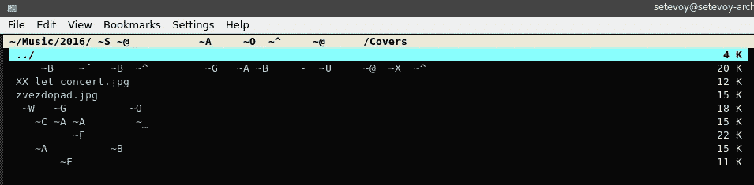
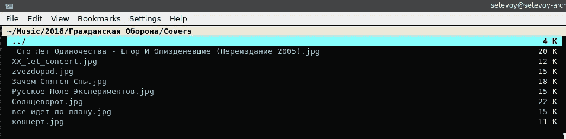

# Linux: setlocale: LC_ALL:不能改变语言环境(en_US.utf8)和西里尔符号

> 原文：<https://itnext.io/linux-setlocale-lc-all-cannot-change-locale-en-us-utf8-and-cyrillic-symbols-2d846fe3c166?source=collection_archive---------0----------------------->


Locales 是一组环境变量，用于确定如何显示数据和时间(例如，一周的第一天)、符号编码(例如，如何显示西里尔符号)、执行`ls`命令时的默认文件顺序等等。

这些变量是:

*   `LANG`:在没有其他与语言环境相关的环境变量的情况下，确定默认语言环境
*   `LANGUAGE`:后备消息翻译语言列表
*   `LC_CTYPE`:字符分类和大小写转换
*   `LC_NUMERIC`:数字格式
*   `LC_TIME`:日期和时间格式
*   `LC_COLLATE`:整理(排序)顺序
*   `LC_MONETARY`:货币格式
*   `LC_MESSAGES`:互动文字和回应的格式
*   `LC_PAPER`:区域默认纸张尺寸
*   `LC_NAME`:名称格式
*   `LC_ADDRESS`:用于街道或邮政地址格式化的约定
*   `LC_TELEPHONE`:用于表示电话号码的惯例
*   `LC_MEASUREMENT`:区域内使用的默认测量系统
*   `LC_IDENTIFICATION`:关于地区信息的元数据
*   `LC_RESPONSE`:决定如何以本地语言显示响应(例如是和否)(不是由 Debian GNU/Linux 使用，而是由 Ubuntu 使用)
*   `LC_ALL`:覆盖所有其他语言环境变量(语言除外)

# 区域设置和西里尔符号

例如，在我的 Arch Linux 上运行 KDE Konsole 中的`[vifm](https://vifm.info/manual.shtml)`工具时，西里尔符号无法正确显示:



并且从`[vifm](https://vifm.info/manual.shtml)`端子退出后产生错误信息:

```
$ vifm
/bin/bash: warning: setlocale: LC_ALL: cannot change locale (en_US.utf8)
```

# 生成区域设置

检查`/usr/lib/locale/`已经生成的语言环境必须存储在哪里——现在这里什么也没有:

```
$ ll /usr/lib/locale/
total 0
```

或者您可以通过调用`locale -a`显示系统中现在可用的语言环境来进行检查:

```
$ locale -a
C
POSIX
```

现在，要添加一个新的区域设置，编辑`locales.gen` -查找`en_US.UTF-8`:

```
$ cat /etc/locale.gen | grep en_US.UTF-8
en_US.UTF-8 UTF-8
en_US.UTF-8 UTF-8
```

取消对`en_US.UTF-8 UTF-8`字符串的注释，并运行语言环境生成器:

```
$ sudo locale-gen
/bin/sh: warning: setlocale: LC_ALL: cannot change locale (en_US.utf8)
Generating locales…
en_US.UTF-8… done
Generation complete.
```

再次检查目录:

```
$ file /usr/lib/locale/locale-archive
/usr/lib/locale/locale-archive: locale archive 11 strings
```

和`locale -a`:

```
$ locale -a
C
en_US.utf8
POSIX
```

或者使用`localedef`实用程序:

```
$ localedef — list-archive
en_US.utf8
```

又跑了一次`vifm`:



# 区域设置参数

您可以通过调用`locale -k`来检查特定地区的各种参数:

```
$ locale -k LC_TIME
abday=”Sun;Mon;Tue;Wed;Thu;Fri;Sat”
day=”Sunday;Monday;Tuesday;Wednesday;Thursday;Friday;Saturday”
…
first_weekday=1
first_workday=2
```

在`locale-gen`期间使用的`/usr/share/i18n/locales/`目录中的相应文件中描述了语言环境。例如，对于 *en_US* ，其`LC_TIME`区域设置描述为:

```
LC_TIME
abday   "Sun";"Mon";"Tue";"Wed";"Thu";"Fri";"Sat"
day     "Sunday";/
        "Monday";/
        "Tuesday";/
        "Wednesday";/
        "Thursday";/
        "Friday";/
        "Saturday"

week 7;19971130;1
abmon   "Jan";"Feb";/
        "Mar";"Apr";/
        "May";"Jun";/
        "Jul";"Aug";/
        "Sep";"Oct";/
        "Nov";"Dec"
mon     "January";/
        "February";/
        "March";/
        "April";/
        "May";/
        "June";/
        "July";/
        "August";/
        "September";/
        "October";/
        "November";/
        "December"
% Appropriate date and time representation (%c)
d_t_fmt "%a %d %b %Y %r %Z"
%
% Appropriate date representation (%x)
d_fmt   "%m//%d//%Y"
%
% Appropriate time representation (%X)
t_fmt   "%r"
%
% Appropriate AM/PM time representation (%r)
t_fmt_ampm "%I:%M:%S %p"
%
% Appropriate date and time representation for date(1).  This is
% different from d_t_fmt for historical reasons and has been different
% since 2000 when date_fmt was added as a GNU extension.  At the end
% of 2018 it was adjusted to use 12H time (bug 24046) instead of 24H.
date_fmt "%a %b %e %r %Z %Y"
%
% Strings for AM/PM
%
am_pm   "AM";"PM"
END LC_TIME
```

对于 *ru_RU* 其`LC_TIME`设置了`first_weekday`选项，参见 [man 5 locale](https://man7.org/linux/man-pages/man5/locale.5.html) ，它指定了一周的第一天——星期一(列表中的第二天):

```
...
week 7;19971130;1
first_weekday 2
END LC_TIME
...
```

要将星期一设置为一周的第一天，请将`LC_TIME`设置为 *ru_RU。UTF-8* 在`/etc/locale.conf`档。首先在`/etc/locale.gen`中取消注释，然后执行`locale-gen`:

```
LANG=en_US.UTF-8
LC_TIME=ru_RU.UTF-8
```

或使用`localectl`工具:

```
$ localectl set-locale LC_TIME=ru_RU.UTF-8
```

# 有用的链接

*   拱门维基上的[区域设置](https://wiki.archlinux.org/index.php/Locale)
*   [了解 Debian GNU/Linux 上的语言环境](https://linuxhint.com/locales_debian/)

*最初发布于* [*RTFM: Linux、DevOps 和系统管理*](https://rtfm.co.ua/en/linux-setlocale-lc_all-cannot-change-locale-en_us-utf8-and-cyrillic-symbols/) *。*