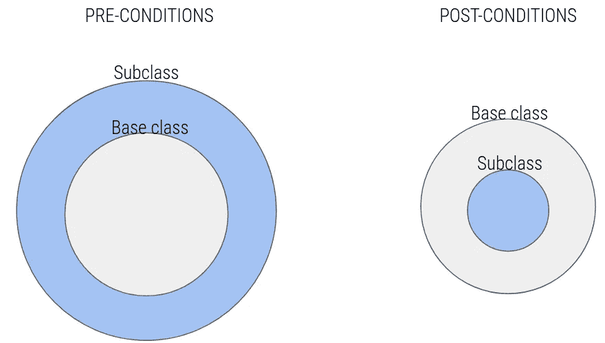

# 里斯科夫替代原理简而言之

> 原文：<https://itnext.io/liskov-substitution-principle-in-a-nutshell-8679015ada50?source=collection_archive---------2----------------------->


在坚实的原理中，利斯科夫替代原理可能是最难熟悉的。它的定义很“学术”，第一次读的时候不是很直白。

但是，正如我们将在这篇文章中看到的，它的实际概念一点也不复杂。

# 定义

> 如果对于每一个 S 类型的对象 o1，都有一个 T 类型的对象 o2，使得对于所有用 T 定义的程序 P，当 o1 代替 o2 时，P 的行为不变，那么 S 就是 T 的一个子类型
> 
> —芭芭拉·利斯科夫，“数据抽象和层次”(1988 年 5 月)

你需要读两遍才能明白，对吗？我会试着用简单的英语重写它。

假设您有两个类(S 和 T)，那么您有它们的两个实例(分别是 o1 和 o2)。如果你有一个程序(P)使用了类 T，当你用 O1(S 的实例)代替 O2(T 的实例)时，它的行为没有改变，这意味着 S 是 T 的子类。

# 意义

根据这个原则的定义，Robert Martin 试图告诉你，在你使用继承的情况下，确保你的子类和它的父类 100%兼容。

```
class Main {
   func foo(int a) : int {
       return 1
   }
}class Sub extends Main {
   func foo(int a) : string {
       return "Hello"
   }
}
```

这是一个愚蠢的例子，在子类中我用不同的返回类型覆盖了一个函数。

考虑使用`Main`实例的第三个类，它需要来自`foo()`的整数。如果你用一个`Sub`替换那个实例，它可能会失败，对吗？

所以这个例子违反了 LSP。

# 前置条件和后置条件

不幸的是，LSP 不仅仅是关于返回类型。如果子类使用父类的不同数据集，也可能违反 LSP。

假设您有一个使用`Main`的方法`foo`的类`Random`。

```
class Random {
   func bar(Main x) {
      // x is an instance of Main
      do.Some.Stuff.With.x.foo();
    }
}
```

现在，假设`Main.foo()`只返回正整数，而`Random.bar()`也需要正整数。假设`Sub.foo()`既可以返回正值，也可以返回负值。

如果您将`Sub`的一个实例传递给`Random.bar()`，您就违反了 LSP，因为`Random.bar()`期望一组正整数，而您实际上也传递了负值。

简而言之，我们说主类的输出集应该小于子类的输出集。对于一个类的输入来说，情况正好相反。



**前置条件:**子类接受的输入范围应等于或大于基类。

**后置条件:**输出应该是基类输出的子集。

# 结论

我希望这篇文章能帮助你更好地理解这个设计原则。

请记住，这一点和其他坚实的原则只是一个工具:不要为了遵循这些原则而强迫您的代码过度架构。请记住这些原则的存在，并在设计应用程序时尝试应用它们。