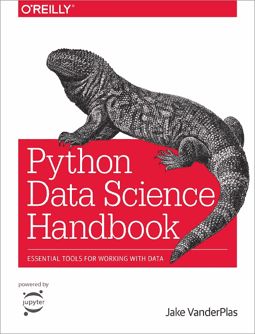
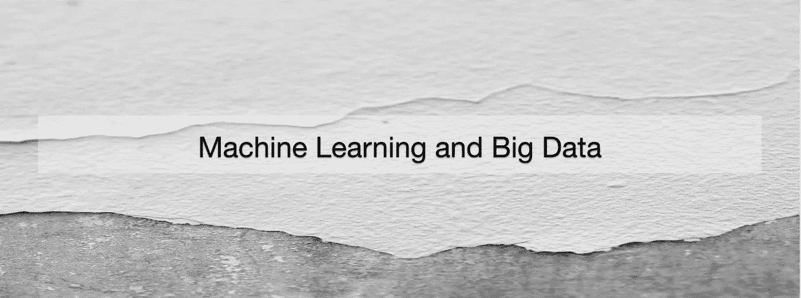
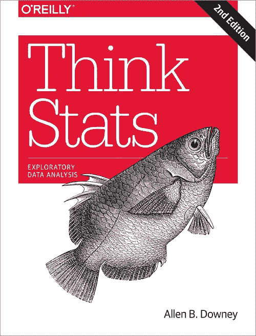

# 必读的免费数据科学书籍列表

> 原文：<https://itnext.io/list-of-must-read-free-data-science-books-e914dc61bba6?source=collection_archive---------2----------------------->

[*点击这里在 LinkedIn* 上分享这篇文章](https://www.linkedin.com/cws/share?url=https%3A%2F%2Fitnext.io%2Flist-of-must-read-free-data-science-books-e914dc61bba6)

数据科学是一个跨学科的领域，包含了统计学、机器学习、贝叶斯等领域的方法和技术。它们都旨在从数据中产生特定的见解。早些时候，我们列出了一些你应该考虑阅读的最好的机器学习书籍的[列表。在本文中，我们列出了一些优秀的数据科学书籍，涵盖了数据科学领域的各种主题。](https://blog.paralleldots.com/technology/machine-learning/list-of-free-must-read-books-for-machine-learning/)

# [数据科学基础](https://www.cs.cornell.edu/jeh/book2016June9.pdf)

**作者:**布鲁姆、霍普克罗夫特和坎南

这本书是数据科学的现代理论课程讲座的伟大融合。

# [UFLDL 教程](http://deeplearning.stanford.edu/wiki/index.php/UFLDL_Tutorial)

**供稿:**吴恩达、吉泉恩亚姆、传友富、麦一凡、孙嘉玲

本教程旨在让你熟悉无监督特征学习和深度学习的主要思想。

# [Python 数据科学手册](https://github.com/jakevdp/PythonDataScienceHandbook)

作者:杰克·范德普拉斯

这本书介绍了使用 Python 处理数据所必需的核心库:特别是 IPython、NumPy、Pandas、Matplotlib、Scikit-Learn 和相关的包。

# [动手机器学习和大数据](https://www.gitbook.com/book/kalkaseer/hands-on-ml-and-bigdata/details)

**作者:**卡里姆·阿尔卡西

这本书是学习机器学习和大数据概念的绝佳来源。

# [思考统计](http://greenteapress.com/thinkstats/)

**作者:**艾伦·唐尼

Think Stats 强调可以用来探索真实数据集和回答有趣问题的简单技术。这是最值得推荐的数据科学书籍之一。

# [想贝叶斯](http://greenteapress.com/wp/think-bayes/)

**作者:**艾伦·唐尼

《思考贝叶斯》是使用计算方法对贝叶斯统计的介绍。这本书用 Python 代码代替数学，用离散逼近代替连续数学。

# [EE263:线性动力系统简介](http://ee263.stanford.edu/)

**作者:**礼萨·纳西里·马哈拉蒂

桑杰教授的这份汇编强调了应用线性代数和线性动力系统在电路、信号处理、通信和控制系统中的应用。博伊德教授往年课程笔记的链接可以在[这里](https://web.stanford.edu/class/archive/ee/ee263/ee263.1082/notes/ee263coursereader.pdf)找到。

# [凸优化— Boyd 和 Vandenberghe](http://stanford.edu/~boyd/cvxbook/)

**作者:**史蒂芬·博伊德和列文·范登堡

这本书提供了一个全面的主题介绍，并详细说明了如何解决这类问题的数字效率很高。

# [元启发式的要点](https://cs.gmu.edu/~sean/book/metaheuristics/)

**作者:**肖恩·卢克

这是一套关于元启发式算法的开放式课堂讲稿，面向本科生、从业者、程序员和其他非专家。

# [CIML](https://ciml.info/)

**作者:**哈尔·多梅三世

CIML 是一套介绍性材料，涵盖了现代机器学习的大多数主要方面(监督学习，非监督学习，大幅度方法，概率建模，学习理论等)。).

这些是我们推荐的一些最好的数据科学书籍。有别的想法吗？请在下面评论您的一些令人敬畏的数据科学书籍列表。

对使用人工智能感兴趣？你现在可以免费注册[平行账户](https://user.apis.paralleldots.com/signing-up?utm_source=blog&utm_medium=banner&utm_campaign=paralleldots_blog)[和](https://www.paralleldots.com/)账户，使用触手可及的人工智能。