# ListUic——在 Flutter 中轻松构建列表屏幕

> 原文：<https://itnext.io/listuic-easily-build-of-list-screen-in-flutter-ecbf690a35bd?source=collection_archive---------3----------------------->

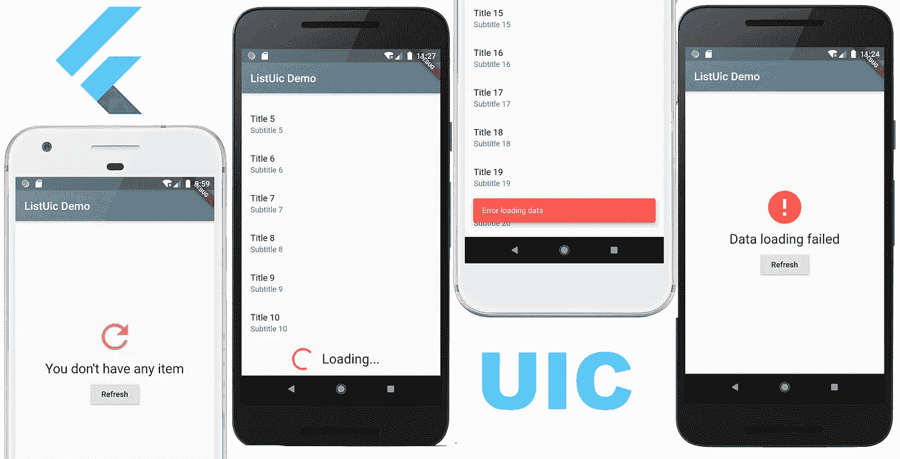

几乎每个应用程序都有一个显示项目列表的屏幕。乍一看，这是一个简单的任务，Flutter framework 为此提供了 **ListView** 小部件。但是通常需要围绕它实现许多相关的东西。列表项加载时的进度指示器，空数据和错误的单独视图，拉动刷新和无限滚动。所有样板代码都可以用 **ListUic** 小部件简化。

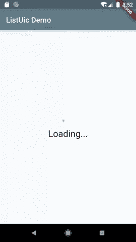

从盒子里听出来

# 开始

**ListUic** 是`uic` (UI 组件)包的一部分。

要在您的应用程序中使用它，请在您的`pubspec.yaml`文件中添加以下依赖项:

```
dependencies:
  **uic: ^0.1.0**
```

并在文件中添加以下导入，这将使用`ListUic`小部件:

```
**import 'package:uic/list_uic.dart';**
```

**ListUic** 的用法简单如下:

**第一步:创建**

列表控制器管理列表的状态。此外，我们将更详细地研究它。现在，让我们用基本的设置来创建它:

```
class _MyHomePageState extends State<MyHomePage> {
  **ListUicController<int> _controller**;

  @override
  void initState() {
    super.initState();
 **_controller = ListUicController<int>(
onGetItems: (int page) => _getItems(page),
);**  }
}
```

假设我们的列表屏幕将有 *MyHomePage* stateful 小部件。所以我们将在伴生的 *_MyHomePageState* 类中定义一个`_controller`变量。

**ListUicController** 类是一个泛型，我们必须在 *_controller* 变量的声明中指定一个类型。这就是我们的列表将显示的对象类型。在这个例子中，列表数据是整数，所以我们使用`int`作为类型。

接下来，在 *initState()* 方法中，我们创建控制器对象。它的构造函数有唯一强制的`onGetItems`参数。这是一个回调函数，控制器在需要为我们的列表加载数据时调用它。该函数有一个`page`参数，必须返回一个`Future<List<T>>`类型的值。

如果不使用分页，可以忽略`page`参数，并实现该函数，这样它将立即返回全部数据。否则，该函数应返回指定页面的部分项目。

我们将在**步骤 3** 中做一个`_getItems(page)`的伪实现。在您真正的应用程序中，我猜实现将使用您的存储库来检索数据。

**第二步:将** `**ListUic**` **widget 添加到 widget 树**

```
@override
  Widget build(BuildContext context) {
    return Scaffold(
      appBar: AppBar(
        title: Text(widget.title),
      ),
      body: **ListUic<int>(
        controller: _controller,
        itemBuilder: (item) {
          return ListTile(
            title: Text('Title ${item}'),
            subtitle: Text('Subtitle ${item}'),
          );
        },
),**
    );
  }
```

**ListUic** 类也是一个泛型，我们必须提供与控制器相同的`int`类型，这是我们在**步骤 1** 中创建的。

**ListUic** 小部件构造函数需要两个参数:

`controller` — **ListUicController** 对象。

`itemBuilder` —这是一个构建列表项小部件函数。它类似于 *ListView* 小部件中的 item builder，我敢肯定，这是你所熟悉的。但是与 *ListView* 的项目生成器不同，这个函数有一个`item`参数，它是一个列表项目对象。

在本例中，项目构建器创建了一个简单的 *ListTile* 小部件。

ListUic 有各种各样的选项来定制它的外观。本文稍后将讨论它们。

**第三步:实现** `**_getItems(page)**` **功能**

下面是返回假数据的实现:

```
Future<List<int>> _getItems(int page) async {
  print("_getItems(): page=$page");
  await Future.delayed(Duration(seconds: 3));
  List<int> result = List();
  for (int i = 1; i <= 10; i++) {
    result.add((page - 1) * 10 + i);
  }
  return result;
}
```

它根据指定的页面返回数字列表。对于第 1 页，它将返回 1、2、3、4、5、6、7、8、9、10，对于第 2 页，它将返回 11、12、13、14、15、16、17、18、19、20 等等。

当然，在真正的应用程序中，您将从网络或本地存储中加载项目，并且可能会使用存储库。

这就是开始使用 ListUic 所需的全部内容。有了这个基本设置，它将在数据加载时显示进度视图，执行数据加载，显示错误消息。用户将能够使用拉动刷新手势来重新加载数据，或者滚动到列表的末尾来加载下一页数据。

你可以在 **UIC** 包库中找到示例 app 的完整代码:[https://github . com/ech 89899/UIC-flutter/blob/master/example/lib/main . dart](https://github.com/ech89899/uic-flutter/blob/master/example/lib/main.dart)

# 自定义列表

在本节中，我们将了解如何定制**列表和**的外观和行为。

**空视图**

初始数据加载时，**列表**显示特定的进度视图:

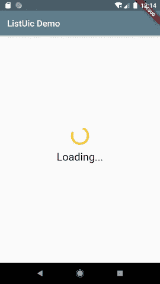

初始加载时的默认进度视图

您可以通过将以下参数添加到 **ListUic** 构造函数来更改该默认视图中的文本:

```
 **emptyProgressText:** "Please wait...",
```

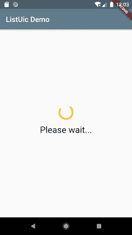

带有自定义文本的默认进度视图

或者在`emptyProgressView`参数中指定您的自定义小部件来使用它，而不是默认的内置小部件:

```
 **emptyProgressView:** Center(
          child: Text("Wait...",
            style: Theme.of(context).textTheme.headline1,
          ),
        ),
```

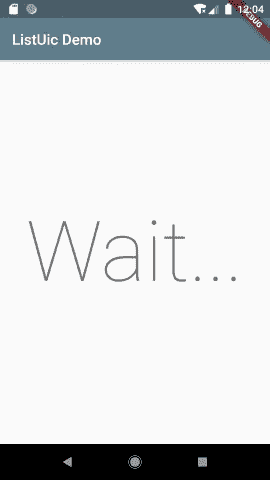

初始加载时的自定义进度视图

当您的列表中还没有任何项目时，它会显示空的数据视图。

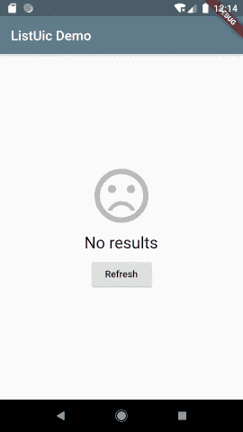

默认空视图

您可以通过向 **ListUic** 构造函数添加以下参数来更改该视图上的图标和/或文本:

```
 **emptyDataIcon:** Icon(Icons.refresh, size: 72.0, color: Colors.amberAccent),
        **emptyDataText:** "You don't have any item",
```

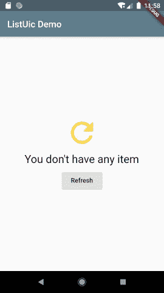

带有自定义图标和文本的默认空视图

如果您想使用您的自定义视图而不是默认的内置视图，您可以在`emptyDataView`参数中指定您的小部件:

```
 **emptyDataView:** Center(
          child: Text("Empty",
            style: Theme.of(context).textTheme.headline1,
          ),
        ),
```

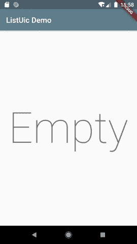

自定义空视图

如果在初始数据加载期间发生错误， **ListUic** 显示错误视图:

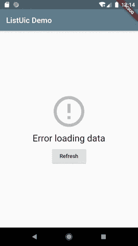

初始加载时的默认错误视图

您可以在此默认视图中更改图标和/或文本:

```
 **emptyErrorIcon:** Icon(Icons.error, size: 72.0, color: Colors.redAccent),
        **emptyErrorText:** "Data loading failed",
```

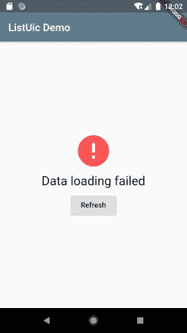

带有自定义图标和文本的默认错误视图

或者提供您的自定义视图:

```
 **emptyErrorView:** Center(
          child: Text("Failed",
            style: Theme.of(context).textTheme.headline1,
          ),
        ),
```

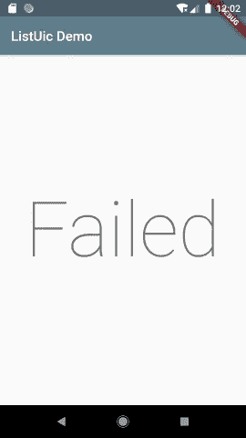

初始加载时的自定义错误视图

**逻辑行为**

如前所述，**列表控制器**负责管理**列表控制器**状态及其数据。它有几个参数，可以用来调整 **ListUic** 的行为。

默认情况下，**列表框**自动开始加载初始数据。要禁用此功能，将`initialLoading`参数设置为*假:*

```
_controller = ListUicController<int>(
      onGetItems: (int page) => _getItems(page),
      **initialLoading: false,**
    );
```

您可以明确地提供初始数据:

```
_controller = ListUicController<int>(
      **items: [1, 2, 3, 4, 5, 6, 7, 8, 9, 10],**
      onGetItems: (int page) => _getItems(page),
    );
```

如果您已经在`items`参数中提供了初始数据，那么**列表**将不会进行初始加载，即使`initialLoading`参数设置为*真*。

**ListUic** 支持分页(或无限滚动)，默认开启。要禁用它，将`allowPagination`设置为*假*:

```
_controller = ListUicController<int>(
      onGetItems: (int page) => _getItems(page),
      **allowPagination: false,**
    );
```

**更多用户界面定制**

回到 UI，让我们再看看几个 **ListUic** 参数。

当 **ListUic** 加载下一页项目时，它会在列表的末尾显示一个进度指示器。
您可以在 **ListUic** 构造函数的`nextPageProgressView`参数中指定您的自定义视图，以便在加载过程中显示:

```
 **nextPageProgressView:** ProgressUic(
          text: 'Loading...',
          textLocation: ProgressUicTextLocation.right,
        ),
```

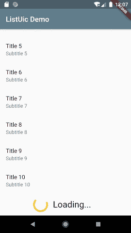

自定义下一页进度视图

当加载数据过程中发生错误时，**列表显示**显示一条小吃店错误信息。

您可以更改小吃店的背景颜色和消息文本:

```
 **errorText:** "Something went wrong",
        **errorColor:** Colors.orangeAccent,
```

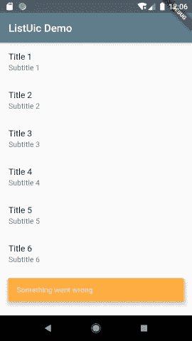

具有自定义颜色和文本的错误小吃店

# 结论

**ListUic** widget(列表 UI 组件)是 **UIC** (UI 组件)包的一部分，让你更容易在你的 Flutter app 中实现列表屏幕。它负责与 *ListView* 相关的许多事情，比如管理数据加载和状态，并且有丰富的选项来定制它的外观以适应你的应用程序的设计。

> 注: **UIC** 包和 **ListUic** 还在开发中。因此，我将感谢任何反馈。

**UIC** 套餐:[https://pub.dev/packages/uic](https://pub.dev/packages/uic)

**ListUic** 示例 app:[https://github.com/ech89899/uic-flutter/tree/master/example](https://github.com/ech89899/uic-flutter/tree/master/example)

推特:[https://twitter.com/echedev](https://twitter.com/echedev)